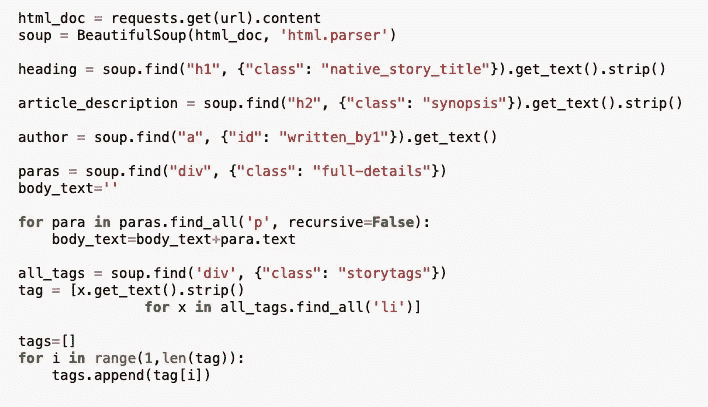

# 如何用 BeautifulSoup 和 TextRank 提取总结

> 原文：<https://medium.com/analytics-vidhya/how-to-extract-and-summarize-with-beautifulsoup-and-textrank-c4ecec360776?source=collection_archive---------12----------------------->

在这篇文章中，我们将使用 python 和 Beautiful soup 从 web 中抓取数据，然后使用抓取的数据来总结文章，以获得文章的概览。如今，时间在我们的生活中至关重要。阅读新闻或一些文章我们需要花一些时间，所以现在我们要通过摘要来总结新闻或文章。

在摘要中，有两种类型，它们是抽象的和摘录的摘要。

**抽象概括:**在这种方法中，根据单词之间的关系来选择单词。甚至这些词也没有出现在文章中。它以一种新的方式给出信息。流程图就像我们输入一个文档，然后它理解数据，并用新单词和原始上下文给出信息。

**摘录摘要:**这种方法对文章进行摘要，并给出相同的基本单词子集。使用不同的算法和技术对句子进行加权，并基于优先句子对它们进行排序，并给出摘要信息。我们输入文档，它检查句子相似度，然后对句子进行加权，并给出排名较高的句子作为摘要数据。

这里我们用新闻文章来总结数据

# **美汤**

现在我们提取新闻文章链接，通过链接和解析 HTML 我们将从文章中提取信息。我们使用请求 python 库来对链接和美汤库进行提取解析 Html 信息。

新闻文章

导入所需的库

在 html_doc 变量中，我们使用请求库并获取 URL 内容。Soup 是我们的 HTML 页面的树根，它允许我们在树中搜索元素。包含文章的 div 将使我们搜索文章的子树。

通过检查元素选项。我们可以在特定的浏览器中获取 HTML 代码，我们可以搜索文章的特定部分，并获取类名、标签名。稍后我们使用代码并提取文本。

我们可以在上面的图片中看到，我们获取了 div 标签和 full-details 类，然后从标签 p 中提取了全部数据。我们取了 h1 标签，这是文章的标题。author 表单标签，以及 story 标签类中的关键字。

我们可以在代码中看到 all_tags 变量。我们将所有无序的列表元素提取出来。提取数据后。我们使用文章中所需的数据。

# 文本排名算法

让我们开始汇总数据流程。做提取总结有很多流程。让我们用无监督学习的方法简单地做一下。在这里，我们找到了句子的相似度和等级。特别是不需要训练模型。直接开始使用我们从文章中提取的数据。我们在代码中使用余弦相似性，它用于计算内积空间的两个非零向量之间的相似性，内积空间测量它们之间的余弦角。如果句子相似，它们之间的夹角为 0 度。

我们要做的是，首先输入文章的数据，然后拆分成句子。稍后移除停用词，建立相似度矩阵，然后基于矩阵生成排名。然后选择前 n 个句子分析摘要。

最后，将抓取代码和摘要代码组合成函数，这样我们就可以以 URL 的形式输入并选择前 n 个句子。这样，它进入各自的功能，执行并给出输出，作为该特定链接的摘要。

