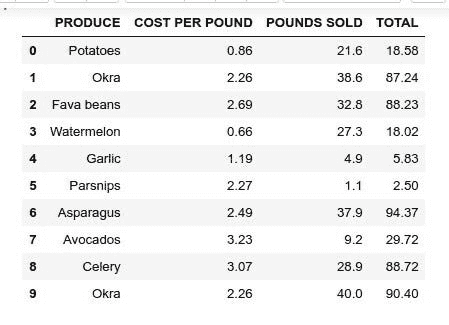

# 如何使用 Python 从 excel 表格中提取信息

> 原文：<https://medium.com/analytics-vidhya/how-to-extract-information-from-your-excel-sheet-using-python-5f4f518aec49?source=collection_archive---------0----------------------->


图片由来自[皮克斯拜](https://pixabay.com/?utm_source=link-attribution&utm_medium=referral&utm_campaign=image&utm_content=1280558)的[安德里安·瓦雷亚努](https://pixabay.com/users/freephotocc-2275370/?utm_source=link-attribution&utm_medium=referral&utm_campaign=image&utm_content=1280558)拍摄

编程的一个迷人之处在于，只需几行代码，你就可以让你的计算机执行一项任务，而这项任务如果由你自己来做，就会变得很平凡、很烦人。这些平凡的任务之一是从一个大的 excel 表格中提取信息。Python 编程语言非常健壮，它的一个亮点是帮助我们自动化繁琐和重复的 Excel 任务。

在这篇博文中，我们将一步一步地从 excel 表格中提取一些有价值的信息。我们将使用的 excel 表包含一家超市一个月的所有水果销售额。每一行都包含顾客购买水果的单独记录。excel 表中有三列。A 列给出了购买水果的每磅成本，B 列给出了售出的磅数，C 列给出了购买的总成本。excel 表有 23758 行和 4 列。你可以在这里下载 excel 表格。

我们的目标是找出并记录当月每种水果的总销量和总购买量。你可以想象必须通过 23758 行来提取每个水果的信息的沮丧，我们很幸运，因为 Python 可以帮助我们很快完成这项任务。下面的步骤将深入而实用地解释如何使用 Python 来完成这项任务。

在我们开始这项任务之前，我想假设您已经掌握了用 Python 编写代码的基本知识，并且您的计算机上已经安装了 Python。

安装 openpyxl 模块
我们将使用的 python 模块是 OpenPyXL 模块。OpenPyXL 模块是一个库，它允许您使用 Python 来读写 excel 文件或带有。xlsx/xlsm/xltx/xltm 分机。如果您的 IDE 上没有安装它，您可以使用

```
pip install openpyxl
```

要测试您是否成功安装了它，请使用

```
Import openpyxl
```

到目前为止，没有返回任何错误。您已经安装了 OpenPyXL 模块，并准备好处理一些 excel 文档。

**读入并使用 OpenPyXL** 打开 excel 文档下一步是将 Excel 表读入我们的 Python 环境。确保您将使用的 Excel 在您当前的工作目录中(CWD)。您可以使用以下方式访问您的 CWD:

```
import os 
os.getcwd()os.chdir() #this changes our CWD, if the excel sheet is not in CWD
```

如果 excel 表不在你的 CWD 里怎么办？您可以复制该文件并将其粘贴到您的 CWD 中，以便从那里访问它。一旦我们确定在 CWD 中有了 Excel 文档，我们现在就可以读入它了。
在读取 excel 文档后，我们现在可以访问它以获得关于 Excel 表的各种信息。

```
import pandas as pd 
file = ‘produceSales.xlsx’
data = pd.ExcelFile(file)
print(data.sheet_names) #this returns the all the sheets in the excel file
[‘Sheet1’]
```

接下来，我们将我们将要处理的工作表解析到一个数据框中，这将使我们能够知道我们的 excel 工作表是否被正确读入。

```
df = data.parse(‘Sheet1’)
df.infodf.head(10)
```



此图像显示了我们的工作表的前十行。

**读入电子表格数据** 下一步是从电子表格[Sheet1]读入数据。

```
ps = openpyxl.load_workbook(‘produceSales.xlsx’)sheet = ps[‘Sheet1’]sheet.max_row 
#returns the total number of rows in the sheet
23758
```

接下来，我们使用 For 循环迭代工作表中的所有行。

```
for row in range(2, sheet.max_row + 1):# each row in the spreadsheet represents information for a particular purchase.produce = sheet[‘B’ + str(row)].valuecost_per_pound = sheet[‘C’ + str(row)].valuepounds_sold = sheet[‘D’ + str(row)].valuetotal_sales = sheet[‘E’ + str(row)].value# the first column is B followed by C and so on.# Each value in a cell is represented by a column letter and a row number. So #the first element in the sheet is B1, next column C1 and so on. This enables #to iterate over the entire cells.
```

创建一个包含每种水果所有信息的空字典。然后，我们使用 set.default()方法将第一组元素填充到字典中。set.default()第一个参数检查字典中是否存在该键，如果不存在，则用第二个参数替换它。这样，我们就可以开始用 set.default 函数的第二个参数填充我们的字典。

```
TotalInfo.setdefault(produce,{‘Total_cost_per_pound’: 0,
 ‘Total_pounds_sold’: 0, 
 ‘Total_sales’: 0,
 ‘Total_Purchase_Instances’: 0})# so with this set default method, we have set all metrics we want to collect to zero. When we are iterating, we start from Zero and add new iterated to the dictionary. The key of the dictionary is the fruit which is mapped to their various metrics.
```

最后，我们填充字典。对于在新行中看到的每个新产品，我们将在新行中增加其相应的值。

```
# Each row represents a fruit, so increment by the new corresponding values. 

 TotalInfo[produce][‘Total_cost_per_pound’] += float(cost_per_pound)TotalInfo[produce][‘Total_pounds_sold’] += int(pounds_sold)

 TotalInfo[produce][‘Total_sales’] += int(total_sales)# Each row represents a fruit, so increment by one. 

 TotalInfo[produce][‘Total_Purchase_Instances’] += 1
```

运行该代码块后，我们将使用该月每种水果的所有不同指标填充 TotalInfo 字典。填充的字典如下所示:

```
‘Apples’: {‘Total_Purchase_Instances’: 627,
 ‘Total_cost_per_pound’: 1178.7600000000068,
 ‘Total_pounds_sold’: 12119,
 ‘Total_sales’: 22999},
```

**填充 TotalInfo 字典后，将结果写入文件** 。我们可以将这个填充的字典写入我们选择的任何文件，不管是. csv 文件。txt，。我们将使用 pprint.pformat 模块漂亮地打印我们的字典的值，并且我们使用 python 的写模式将字典的值写到文件中。下面的代码片段给出了一个例子:

```
resultFile = open(‘Total_info.txt’, ‘w’)
resultFile.write(pprint.pformat(TotalInfo))
resultFile.close()
print(‘Done.’)
```

Total_info.txt 文件将在您的 CWD 中找到。
您可以随时通过更改。txt 扩展成你想要的任何文件格式。
下面的代码片段显示了如何转换为. csv 文件格式。

```
 Open (‘Total_info.csv’, ‘w’)
```

**结论** 在这篇博文中，我们展示了如何使用 Python 从 excel 表格中提取信息。知道如何从 excel 表格中获取信息总是一个受欢迎的补充，因为它为您节省了大量执行重复任务的时间。请随意修改文章中的代码以满足您的需要；你可以在这里访问包含这篇博文[中使用的端到端代码的笔记本。](http://github.com/Oluwabukunmige/Working-with-Excel-Sheets)

快乐的蟒蛇。