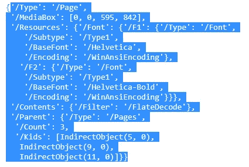
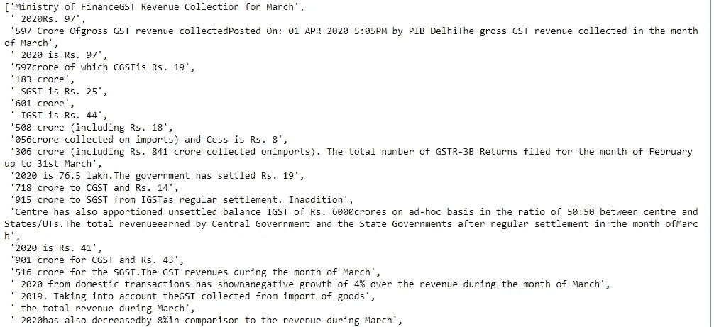
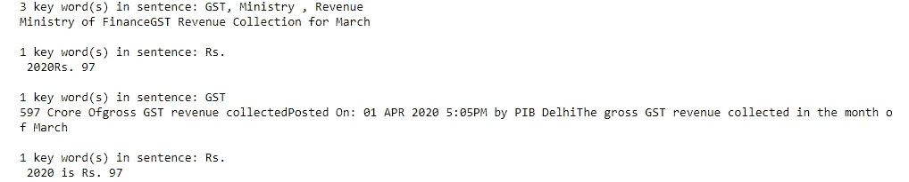

# 如何在 Python 中从 PDF 文件中提取文本并从提取的文本中搜索关键字

> 原文：<https://medium.com/analytics-vidhya/how-to-extract-texts-from-pdf-file-and-search-keywords-from-extracted-text-in-python-c5f3d4841f20?source=collection_archive---------0----------------------->

从提取的 pdf 文本中搜索关键字


[万花筒](https://unsplash.com/@kaleidico?utm_source=medium&utm_medium=referral)在 [Unsplash](https://unsplash.com?utm_source=medium&utm_medium=referral) 上拍摄的照片

# 介绍

PDF 或可移植文档文件格式是当今最常见的文件格式之一。它广泛应用于各行各业，如政府办公室、医疗保健，甚至个人工作。因此，存在大量 PDF 格式的非结构化数据。我们面临的主要挑战是从这些非结构化数据中提取所需的数据。

有很多方法可以从 pdf 中提取所需的信息，在本教程中，我将解释我们如何首先从 pdf 中提取文本，然后我们如何收集所需的信息，以便节省我们的时间。我们可以通过设置关键词来做到这一点，然后我们可以专注于那些有我们关键词的句子。

**我们开始吧:**

python 中有很多库可以用来从 PDF 中提取文本，在本教程中，我将使用 [PYPDF2](https://pypi.org/project/PyPDF2/) 。

对于安装，运行以下命令:

```
pip install PyPDF2
```

一旦你安装了 PYPDF2 库，我们就可以开始了。我们正在尝试使用这个 [**pdf 文档**](http://gstcouncil.gov.in/sites/default/files/gst-revenue-collection-march2020.pdf) 。

```
# importing required modules  
import PyPDF2#Now give the pdf namepdfFileObj = open('gst-revenue-collection-march2020.pdf', 'rb')pdfReader = PyPDF2.PdfFileReader(pdfFileObj)print(pdfReader.numPages) # will give total number of pages in pdf 
```

我将提取第 1 页中的所有文本。

```
pageObj = pdfReader.getPage(0)
```



```
text=(pageObj.extractText())
text=text.split(",")
text
```



输出

现在我们可以创建一个包含所有我们想要的关键字的列表。

```
search_keywords=['GST','Ministry ','%','Revenue ','Year','Growth']
```

一旦我们创建了列表，我们将运行下面的代码。

```
for sentence in sentences:
    lst = []
    for word in search_keywords:
        if word in sentence:
            lst.append(word)
    print('{0} key word(s) in sentence: {1}'.format(len(lst), ', '.join(lst)))
    print(sentence + "\n")
```



输出

在输出中，您可以看到哪个句子包含关键字，哪个不包含。我们可以把重点放在那些有关键词的，能解决我们目的的行上。

# 结论

借助 PYPDF2 库从 pdf 中提取表格数据非常简单。此外，我们知道有大量的 pdf 格式的非结构化数据，在提取文本后，我们可以进行大量的分析，并根据您的业务需求找到内部信息。我们只需要确定关键词，然后就可以深入研究了。

我希望这篇文章能帮助你并节省大量的时间。如果你有任何建议，请告诉我。

快乐编码。

***Prabhat Pathak****(*[*Linkedin 简介*](https://www.linkedin.com/in/prabhat-pathak-029b6466/) *)是助理分析师。*


照片由 [Nghia Le](https://unsplash.com/@lephunghia?utm_source=medium&utm_medium=referral) 在 [Unsplash](https://unsplash.com?utm_source=medium&utm_medium=referral) 上拍摄