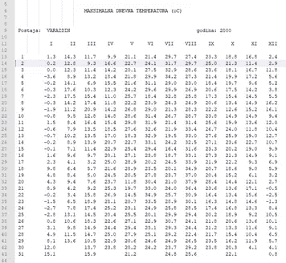
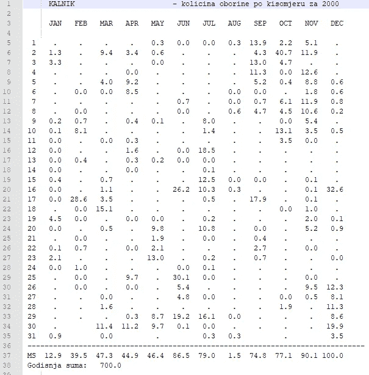
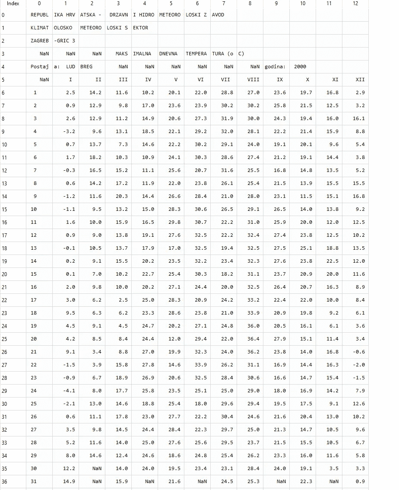
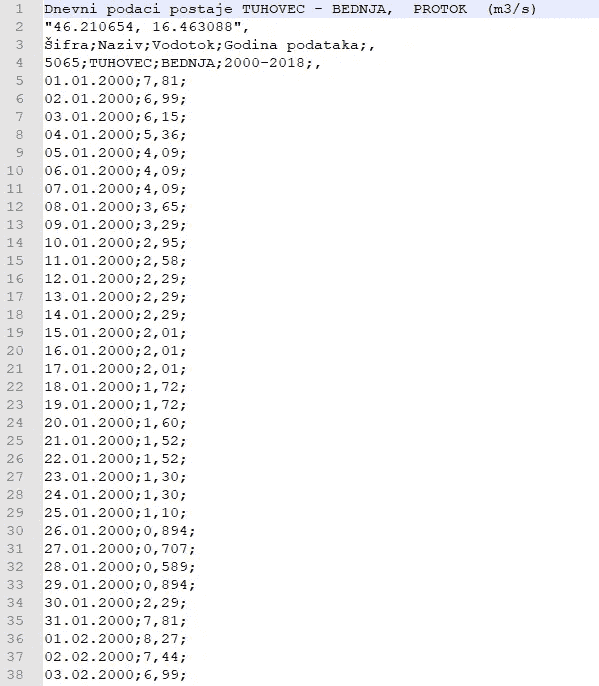

# 如何用 Python 和 Pandas 解析存储为文本的数字数据

> 原文：<https://medium.com/analytics-vidhya/how-to-extract-time-series-data-from-tabular-strings-e5b2d83fc711?source=collection_archive---------12----------------------->

马库斯·斯皮斯克在 [Unsplash](https://unsplash.com?utm_source=medium&utm_medium=referral) 上的照片

## **简介**

自从开始我在萨格勒布大学的教学和研究助理的工作以及我作为科学家的职业生涯以来，我面临了几十次处理以文本形式存储的格式非常复杂的数值的问题。事实上，当接收到的数据格式良好时，即 excel 电子表格或一些逗号分隔的时间序列文件，任务可以有效而快速地完成。但是有时，我们会遇到某种不寻常的文本和/或表格数据，文件中有不同类型和/或数量的分隔符，这些数据无法在一行 Python 代码中读取，也无法复制/粘贴到 excel 中。

正是这些情况促使我在关于媒体的第二篇文章中写下了这个话题。我的第一篇文章中的方法和分析是以格式良好的。csv 文件，但事实上，本文中的代码和思想首先是用来格式化数据的。csv 文件。

本文的目的不是提供一个神奇的解决方案来解决所有格式不完美的数据的问题，它更像是一个如何处理这样或类似任务的建议。本文将为一种特殊的空格分隔的文本文件提供解决方案，这种文件是表格格式的，可能是为了视觉检查或打印，但不适合时间序列分析。下图提供了此类数据的样本，特别是 2000 年 Varaž din 气象站的日最高气温。

## 将数据读入熊猫数据框

本文涉及两种类型的文件(测量站)。气象站，测量多个变量，最常见的是最高或最低日气温、降雨量、风速、太阳曝晒等。而第二类台站只测量降水量。因此，创建了两个函数，第一个函数用于气象站，而第二个函数用于只有降水的站(原始数据格式不同，比较图 1。和图 2。)

图一。气象站的数据样本

当观察气象站的原始数据时，我们发现有 92 个字符的行，但是分隔符，在这种情况下是几个空格，不是统一的，它们取决于数字和负号的数量。因此，在导入熊猫数据框架时需要做一些修改。寻找正确食谱的过程是一个反复试验的过程。考虑到气象站(点位置)的每个文件包含几个测量变量，即最高和最低气温、降雨量、风速等。，我决定将任务分成两个子任务。首先，一个函数从文件中读入一个 Pandas 数据帧，然后，根据观察到的变量和周期，提取数据作为一个单独的数据帧(时间序列)。由于经常有多个观测站，我决定完成任务的最好方法是定义一个函数，并在所有文件(站数据)的列表理解中使用它。

首先，我们使用 **str.extract** 和一个正则表达式(每行是一个包含 92 个字符的长字符串)将 1 列数据帧分割成 7 个字符的块，得到 13 列。拆分后，每个“7 个空格”被替换为“4 个空格+ NaN”，每个“ [space.space](http://space.space/) ”被替换为“0.0”。此步骤确保正确处理每个月的天数和没有测量的天数(即闰年的二月有 29 天)。当我们将字符串拆分为列时，要注意正确解析数值(每日测量值),月份名称等文本日期对我们来说并不重要，因此我们忽略了这部分数据帧中可能存在的一些错误。

图二。仅降水站的数据样本

只有降水站的原始格式是不同的，这里我们有 81 个字符的行。有趣的是，如果我们去掉最后 5 个空格，我们可以将字符串分成 13 列，这样正好得到 12 列(每个月一列)，第一列显示的是一个月中的第几天。需要提到的是，这个过程是不确定的，每种数据都是不同的，这种方法可能不适合所有人。

定义第二个函数是为了从只有降水的站点读取数据。原始数据格式如图 2 所示。这个函数再次将文件名作为输入，将文件读入一个只有一列的 Pandas dataframe，其中首先每个“7 个空格”被替换为“3 个空格+ NaN +单个空格”，每个“space.space”被替换为“0.0”，每个“Ponis”或“-”被替换为“NaN”。同样，然后，数据帧被反向分割成 13 列。这个特定函数的结果如图 3 所示。

图 3。格式化的 Pandas 数据帧示例 Ludbreg 气象站 2000 年的最高日气温

## 气象站数据的选择和提取

该过程的下一步包括选择所需的变量，即最高或最低日温度、风速或降雨量。因此，对于气象文件中发现的每个变量，都定义了一个单独的数据提取功能。这里将提供最高日温度和降水量的例子。

首先，我们在 meteo_data 文件夹中创建所有文件的列表。然后，我们使用上面提到的函数来“格式化”气象文件中的数据，以创建一个字典(d_frames ),其中站点名称是关键字，而带有数据的数据帧是值。在创建了一个空的数据帧之后，所有的数据都将存储在这个空的数据帧中，我们遍历上面提到的字典。作为第一步，每个月的数据被索引，这将有助于我们选择每个月(列)的每日数据。每年第一天的索引定义为 st_idx (start_index)。然后，根据一年中的月份，我们定义每个月的天数，以收集所有数据(特别注意闰年的二月有 29 天)。提取的数据被转换成浮点数，被压缩(删除 NaN 值，即 2 月 30 日和 31 日),然后存储在 pandas 系列中，根据电台重命名列名。当解析一年时，我们将 st_idx 增加 47，这将脚本带到下一年，以此类推。在创建了所有年份的序列后，我们选择在该文件中观察到的第一年，并将其转换为日期时间。然后创建一个日期时间值范围，并选择它作为该系列的索引。多个序列首先被存储到一个字典中，然后连接到一个 pandas 数据帧，该数据帧由函数返回。

当数据被读取到 dataframe 中时，注意每天的测量都是正确的，我们忽略了这样一个事实，即包含罗马数字的月份数字的字符串有时在实际数字之前有空格。这是我们考虑的一个交易，因为它不影响脚本的有效性。

这是我如何解析/提取另一个气象变量的例子，在这种情况下是相对湿度。整个过程和想法与最高气温相同，只有指示文件中相对湿度数据开始的“关键字”不同。让我们来看看。

同样，该函数的输入是包含数据的文件夹的路径。所有文件(每个文件代表一个单独的站点)被读入字典，以 key 作为站点名称，并对来自单个站点的数据帧(带有测量数据)进行赋值。

我们遍历字典，搜索克罗地亚语中表示湿度的部分，用相对湿度数据设置行的索引。然后我们遍历列(代表月份)，注意天数。提取的数据存储到一个系列中，并除以 100 以避免百分比值(给定的相对湿度以百分比表示)。由于土壤和水评估工具(SWAT)水文模型需要提取的数据，因此数据必须是十进制数，而不是百分比值。日期作为索引附加到序列中，包含所有相对湿度数据站(文件夹中的所有文件)数据的数据帧由函数返回。

## 从只有降水的站点选择和提取数据

如前所述，一些站点只包含降水数据。在这里，我们简要地看一下这个函数，但是总体来说，它仍然与上面提到的函数非常相似。

为了更好地了解情况，我将仅来自雨量站的数据放在一个单独的文件夹中，这里称为“precip_data”。该功能的其余部分非常相似，同样，通过查找正确的克罗地亚语单词来选择每年数据的起始索引，并且必须注意每个月的天数。其余的都是一样的。该函数返回一个数据帧，其中每一列包含一个雨量站的每日数据(取决于文件夹中的文件数量)。

## 提取河流流量数据

让事情变得更有趣的是，还有第三种类型的文件，如果你读过我的 [**以前关于用 Python 可视化水文**](/analytics-vidhya/intro-to-python-through-hydrology-7ea816665597) 的文章，其中一个在分析分水岭时很重要的变量不见了。你猜对了，是水文站实测的流量数据。这种数据格式良好，是一个. csv 文件。这使得事情变得更容易(也更快)。

图 4。2000-2018 年期间流量数据示例 Tuhovec 站

我只是想指出，在克罗地亚语/区域设置中，列表分隔符是分号(；)，而不是通常的逗号(，)。如果我们查看图 4，我们会看到这个数据已经格式化好了。因此，这个脚本的重点不是额外格式化数据，它只是从多个站点(不同的文件)提取数据到一个单一的 pandas dataframe，这样就更容易可视化数据。

这里的任务处理方式有些不同。这个函数将文件名作为输入，然后读取文件并创建一个熊猫数据帧。找到数据的起始索引。然后使用索引再次打开文件，忽略包含站点元数据的第一行，现在我们只读取测量的每日流量。具有日期时间索引的序列由函数创建并返回。

为了执行这个函数，我们首先在 streamflow 文件夹中创建一个文件列表。在 set comprehension 中使用该函数，以便用数据填充字典，其中关键字是电台名称，值是由该函数提取的序列。在最后一步中，我们将字典中的值连接到 pandas 数据帧。

## 从径流站提取坐标

您可能已经在图 4 中注意到了。streamflow 台站元数据还包含台站的地理位置(经度和纬度)。在许多任务中，这一事实非常有用。因此，我提供了一个额外的脚本，说明我是如何从中提取坐标的。csv 文件。在您的示例中，坐标可能以不同的格式或位置出现，但也许这个脚本的想法可以帮助您并节省一些时间。

同样，如上在提取 streamflow 的情况下，可以在集合理解中使用脚本，以便创建以站名作为关键字、以坐标作为值的字典。如果需要，这个字典可以连接到一个数据帧。

## 结论

在这篇文章中，我的目标是让读者了解我是如何用表格形式的文本来处理数字数据的。这个脚本可以为我在未来的工作中节省大量时间，我将通过项目分析克罗地亚的其他几个流域。此外，这是一个特殊的情况，一个人可以有不同类型的文件，当然，这种解决方案不会工作，但这个想法，肯定可以帮助别人。如果您一次性处理这些文件，Excel 可能会更快，但是如果您每天或每周都要处理这些文件以进行定期分析，这样的脚本可以节省您大量的时间，尽管最初的工作量可能会更大。此外，当您将这个脚本的输出与我的另一篇文章中的代码结合起来时，您将获得快速而漂亮的气象和水文数据的可视化。