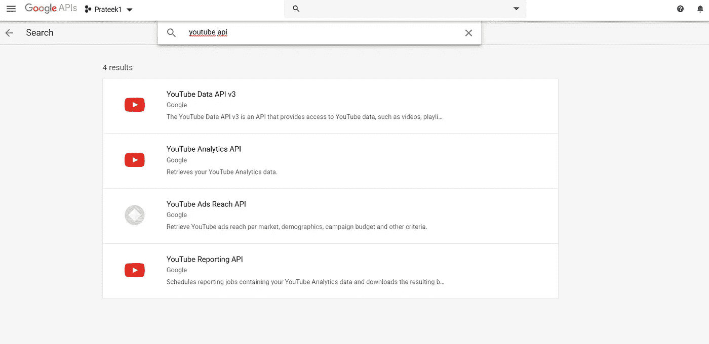

# 如何使用 YouTube 数据 API 提取 YouTube 视频标题？

> 原文：<https://medium.com/analytics-vidhya/how-to-extract-youtube-video-titles-using-the-youtube-data-api-45d3f4998486?source=collection_archive---------5----------------------->


Kon Karampelas 在 [Unsplash](https://unsplash.com?utm_source=medium&utm_medium=referral) 上拍摄的照片

最近，我在为我的论文项目搜索 YouTube 数据集。虽然互联网上有各种 YouTube 数据集，但我需要明确的 YouTube 频道数据，这些数据应该具体包括视频的标题、描述和特定视频的缩略图。这让我利用了 YouTube 数据 API，它不仅帮助我提取了我想要的数据，还帮助我获得了最新的数据。

尽管事实上可以从各种网站访问一些教程，但它们对提取数据没有明显的帮助，因为它们已经过时，并且不能处理诸如 API 没有输出的情况。随附的教程将帮助您下载 YouTube 统计数据以及此类问题的处理方法。请注意，即使你复制并粘贴了下面的代码，它也能完美地工作，没有任何错误(这是我送给你的圣诞礼物)😜).所以让我们从超级有趣的代码开始吧。

首先，我们需要通过四个简单的步骤生成 YouTube API 密钥:-

1.  进入[谷歌开发者控制台](https://console.developers.google.com/)
2.  创建新项目


这里您需要指定您的项目名称

3.启用 YouTube API v3



搜索 YouTube 数据 API v3


启用 YouTube 数据 API 后

4.点击凭证，最后点击创建凭证来获得你的个人 YouTube API 密钥，如下所示。


现在，在你准备好你的独特的 API 键之后，让我们开始编码吧。

最初，我们需要导入运行整个代码所需的所有库。之后，您需要输入通过 YouTube 开发者控制台生成的个人 API 密钥。将目录设置到需要保存文件的位置。设置目录时，请记住使用单反斜线“/”或双正斜线“\\”。

```
*#importing libraries* **import** csv
**import** os
**from** googleapiclient.discovery **import** build
**import** pandas **as** pd*# API Key generated from the Youtube API console* ***api_key = "Your API Key"***# Establishing connection with the YouTube API key
***youtube  = build('youtube','v3',developerKey=api_key)****# Setting up the directory location e.g.* C:/Users/prateek/Desktop 
or C:\\Users\\prateek\\Desktop ***os.chdir('Location of your desired directory')***
```

完成上述基本步骤后，我们将编写代码，帮助我们提取所需的数据。

让我们浏览一下代码(代码上的注释也是一个有用的指南)。

**第 1 部分:-** 第 1 行到第 20 行

(a)在本节中，我们声明了一个名为“youtube_playlist_data”的函数，它将频道 Id 作为其输入。

(b)下一步是从频道数据本身检索上传播放列表 ID。我们需要“上传”播放列表中的所有数据。

(while 循环通过更新令牌数据帮助我们检索整个通道数据。

**第二部分:-** 第 22 行到第 56 行

(a)这里我们将通道 ID 传递给我们在上面的步骤中创建的函数。

(b)根据我们需要检索的数据初始化变量。在这种情况下，我们提取特定视频的标题、描述和缩略图链接(每个视频有多种缩略图大小)。

(c)一些视频有私人缩略图，由于这些缩略图，API 返回一个空值，我们的代码已经对此进行了处理。

**第三部分:-** 第 58 行到第 62 行

(a)最后，我们保存数据并将其转换成 pandas Dataframe。

(b)最后，数据帧以 CSV(逗号分隔值)格式存储，以便于访问数据。

**重要提示:YouTube API 有一个每日阈值限制，超过这个限制，你就不能在特定的一天下载额外的数据。每天结束时重新设置限额。**

代码的第 2 部分可以被额外编辑，以根据您的要求获得数据，如喜欢或不喜欢的数量、评论数等。你也可以在下面的[链接](https://developers.google.com/youtube/v3/getting-started)中找到关于 YouTube API 的更多信息。

希望本教程能帮助解决你的问题，这将不再是你的问题😃。如果您有任何问题或遇到任何问题，请随时在下面评论。

干杯！