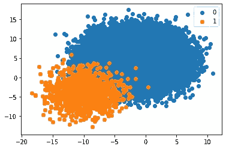
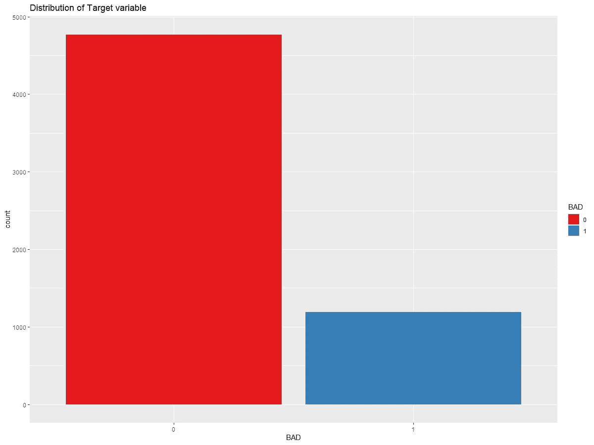
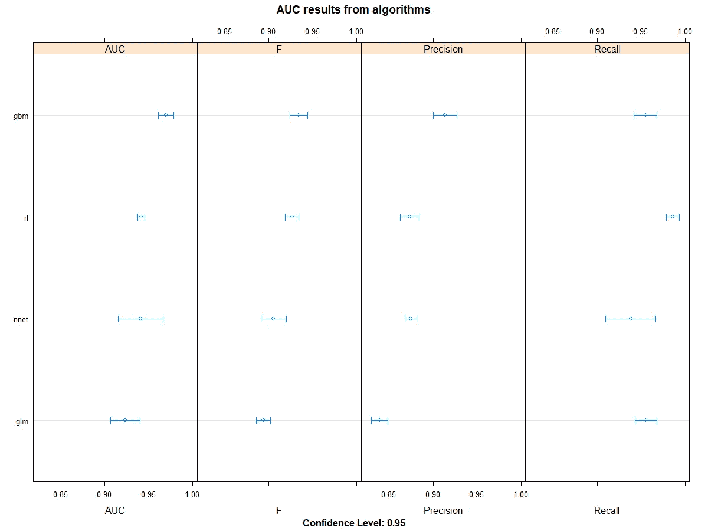
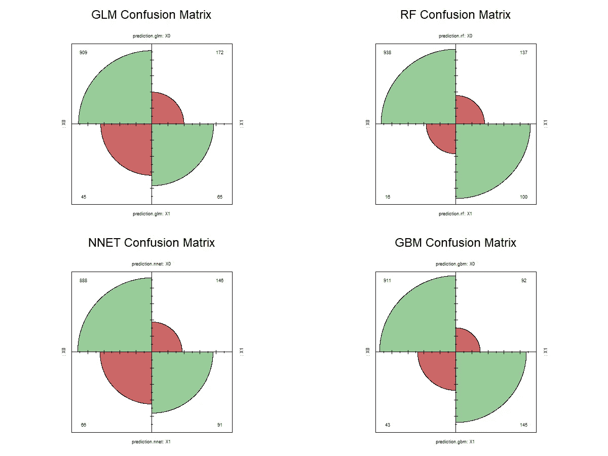
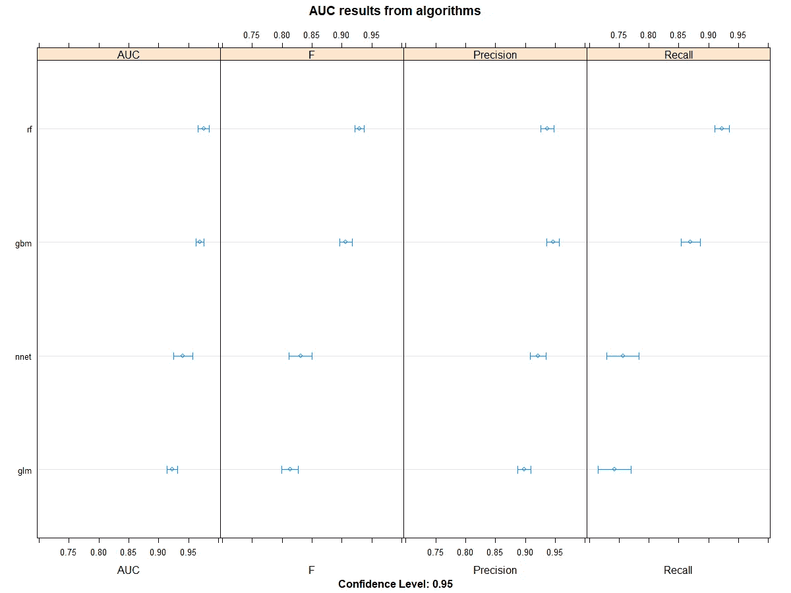
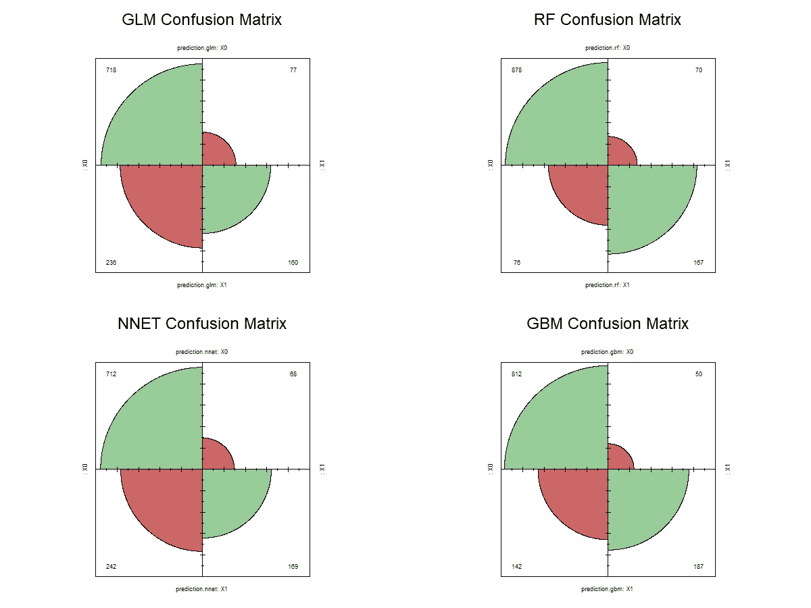
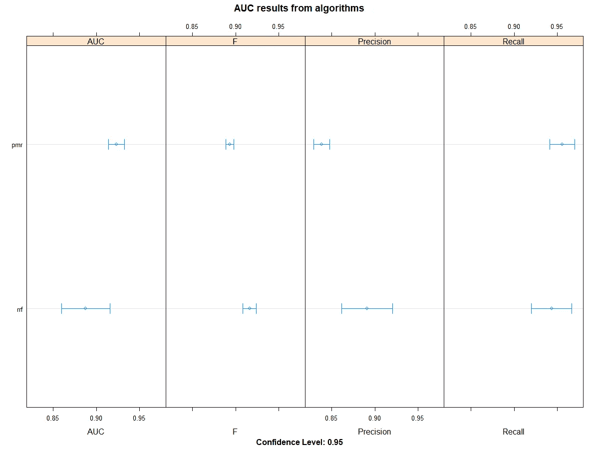
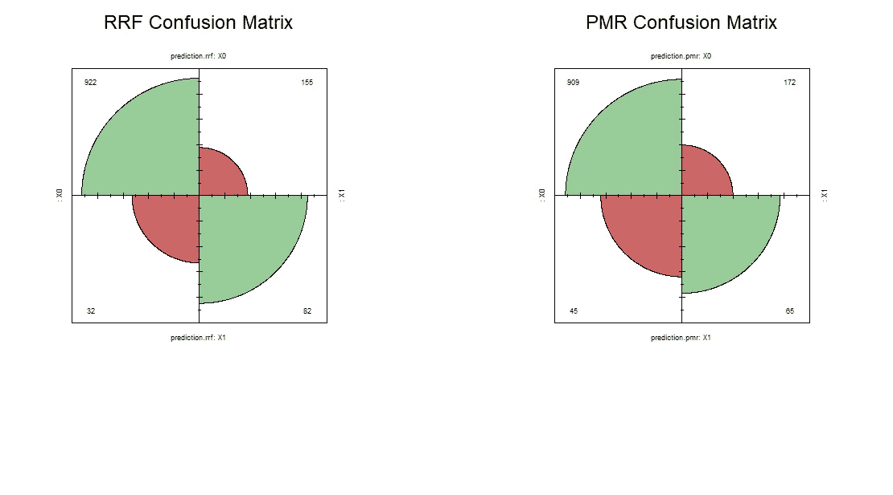
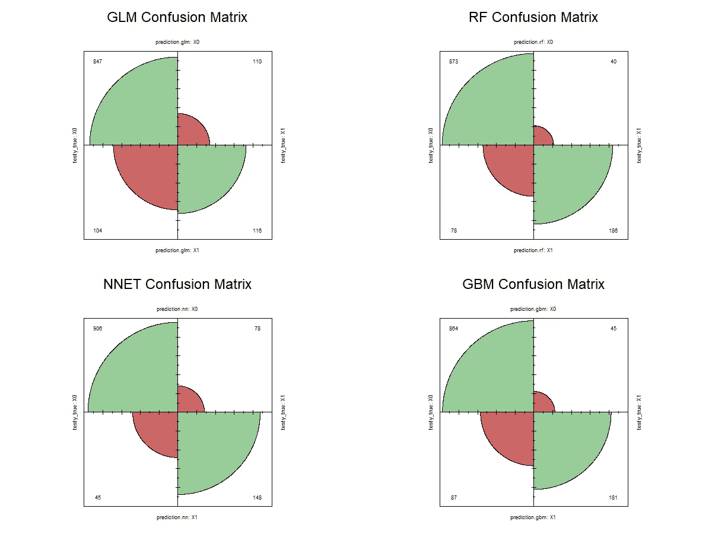

# 在分类预测模型中如何面对大于少数类的多数类:从卡雷到 H2O

> 原文：<https://medium.com/analytics-vidhya/how-to-face-a-majority-class-greater-than-a-minority-class-in-a-classification-predictive-modeling-2537c38d4afe?source=collection_archive---------7----------------------->

***什么是分类预测建模***

在一个数据集中，有数量变量，它表现为数字值，如一个人的年龄或收入，还有质量变量，它表现为几个类别中的一个值，如一个人的性别或所购汽车的品牌。

通常我们指的是因变量为数量变量时的回归任务和有分类响应时的分类任务。分类预测建模的目标是建立映射函数 C(X ),该函数将特征空间 X 作为输入，并预测其离散输出 Y 的值，该函数估计给定观察的类别。分类任务评估给定观察值属于每个输出类的概率也很常见。

***典型问题与分类任务***

属于每个类别的示例的数量可以称为类别分布。在分类问题中，每个类的数据集的观测值数量可能不均衡，因此类的分布是不相等的，并且是偏斜的。

在本文中，我将使用具有相同含义的不平衡分类任务/不平衡分类任务的术语，即在提到二元分类时，多数类大于少数类，其中多数类有许多实例，而少数类缺少观测值。

这项任务的典型例子有:流失预测、欺诈检测、异常检测、垃圾邮件检测等。但是，不平衡数据集的原因是什么？原因可以分为数据采样和领域属性。

数据收集过程中的错误可能会导致类间观察值分布不均，从而引入偏差和误差，否则在一个类中生成观察值的过程在时间、成本和计算方面可能会比另一个类更昂贵，因此很难从域中收集更多样本来改善类分布。

典型地，在分类任务中使用的大多数机器学习模型是在假设每一类的样本数量相等的情况下工作的，并且结果将是差的预测性能，尤其是对于典型地最有趣和最重要的预测的少数类。

***面对不平衡数据集有哪些策略？***

首先对 ***进行正确的性能度量*** *。*代表正确预测数除以预测总数的准确性对于不平衡数据集来说并不是正确的选择，因为仅能够预测多数类的简单模型可达到高水平的准确性。

使用混淆矩阵是一个很好的实践，混淆矩阵是将预测分解成一个表格，显示正确的预测(在对角线上)和错误预测的类型。目标是最大化精度(分类器准确性的度量)和召回(分类器完整性的度量)的性能。对于非平衡数据集，更适合使用结合了精度和召回率的 F1 得分度量，它是两者之间的调和平均值，它表示分类器的精度(精度)和鲁棒性(召回率)。它还使用了 ROC 曲线，这是假阳性率与真阳性率的关系图，而不是 ROC 曲线下的面积(AUC ),它是 ROC 曲线的积分，它提供了比较分类器的得分。

尝试 ***采样*** ***方法*** 对数据集进行采样。为此，有两种主要方法。

-过抽样:随机抽样(替换)少数群体，以达到与多数群体相同的规模

-下采样:随机划分多数类的子集，以达到与少数类相同的规模。

还有生成合成样品的混合方法。最流行的是 SMOTE(合成少数过采样技术)，这是一种从少数类创建合成样本而不是从其创建副本的过采样方法。

尝试使用 ***分层 k 重交叉验证*** 作为模型评估。在 k 折叠交叉验证程序中，训练数据集被共享到 *k* 折叠中。前 *k-1* 褶皱用于训练模型，第 *k* 褶皱用作测试集。总共有 *k* 个模型通过这些运行的平均值进行拟合和评估。

不幸的是，k 倍交叉验证不适用于评估不平衡的分类器，因为数据集被分成具有均匀概率分布的 *k 倍。*

解决方案是随机分割数据集，在每个子集中保持相同的类别分布，并使用目标变量来控制采样过程。

尝试 ***代价敏感算法*** 。您可以使用相同的算法，但是更新为对成本敏感，对一个类的误分类错误的惩罚比另一个类多。惩罚分类引入了在训练过程中在少数类上犯分类错误的模型的额外成本。这些惩罚会使模型偏向于更多地关注少数群体。

***一个实际应用:一个贷款预测模型***

为此，我使用了 Kaggle 的一个数据集:房屋净值数据集(HMEQ)T9。跟随带有[代码](https://github.com/claudio1975/Medium-blog/tree/master/How%20to%20face%20a%20majority%20class%20greater%20than%20a%20minority%20class%20in%20a%20classification%20task/R%20approach)的项目。

它包含 5.960 最近房屋净值贷款的贷款性能信息。目标变量(BAD)是一个二元变量，表示申请人最终是否违约，并为每个申请人报告 12 个输入变量。任务是预测拖欠贷款的客户。

在变量描述的下面

-坏:1 =客户拖欠贷款 0 =贷款已偿还

-贷款:贷款请求的金额

-MORTDUE:现有抵押贷款的到期金额

-VALUE:当前属性的值

-原因:DebtCon =债务合并；家庭装修

工作:六个职业类别

——YOJ:目前工作多年

DEROG:重大贬损报告的数量

-deliq:拖欠信用额度的数量

-CLAGE:最早交易行的月龄

-NINQ:最近的信贷额度数量

-CLNO:信用额度数量

-债务与收入的比率

在应用机器学习模型之前，我已经用可视化和统计分析进行了探索性的数据分析。

我可以立即看到目标变量上不平衡的类。

经过一些活动，如特征选择、对分类特征的特征工程和对数值特征的异常值封顶，在[第一步](https://rpubs.com/claudio75/570633)中，我已经用 Caret 应用了四个基线模型。以逻辑回归作为分类任务的基准，一个神经网络和两个集成模型:随机森林和梯度推进机。

使用 Caret 对训练集—基线模型进行评估

测试集上的混淆矩阵—带有插入符号的基线模型

在[第二步](https://rpubs.com/claudio75/570653)中，我在所有模型中应用了 Caret:使用分层 k 倍交叉验证的过采样、下采样和 SMOTE 方法。

从应用的三种方法来看，过采样方法在测试集的混淆矩阵上表现出最佳性能。

对训练集的评估——用 Caret 进行过采样

测试集上的混淆矩阵—使用插入符号进行过采样

在第三步中，我尝试了一些成本敏感的学习算法，如 Glmnet、成本敏感的 C5.0、正则化随机森林和惩罚多项式回归，但只有最后两种适合。

用 Caret 评估列车组—成本敏感模型

测试集上的混淆矩阵—带有插入符号的成本敏感模型

在[的最后一步](https://rpubs.com/claudio75/570664)中，我已经将 H2O 开源框架应用到了前面的四个模型中。

H2O 显示了出色的结果，也很容易在基线格式中使用，它足以启用平衡类选项的平等类分布。还有其他参数可以用来调优，但是我没有用过。最后，值得一提的是，H2O 也比 Caret 更适合使用大数据。看看[的 Github 库](https://github.com/claudio1975/Medium-blog/tree/master/How%20to%20face%20a%20majority%20class%20greater%20than%20a%20minority%20class%20in%20a%20classification%20task/R%20approach)。

测试集上的混淆矩阵——H2O 抽样

***参考文献:***

[Github 库](https://github.com/claudio1975/Medium-blog/tree/master/How%20to%20face%20a%20majority%20class%20greater%20than%20a%20minority%20class%20in%20a%20classification%20task/R%20approach)

Robert Tibshirani，Trevor Hastie，Daniela Witten，Gareth James，“统计学习导论:R 中的应用”，2013 年

Max Kuhn，Kjell Johnson，“应用预测建模”，2013 年

[https://www . analyticsvidhya . com/blog/2016/03/practical-guide-deal-unbalanced-class ification-problems/](https://www.analyticsvidhya.com/blog/2016/03/practical-guide-deal-imbalanced-classification-problems/)

[https://machine learning mastery . com/what-is-unbalanced-class ification/](https://machinelearningmastery.com/what-is-imbalanced-classification/)

[https://machine learning mastery . com/tactics-to-combat-unbalanced-classes-in-your-machine-learning-dataset/](https://machinelearningmastery.com/tactics-to-combat-imbalanced-classes-in-your-machine-learning-dataset/)