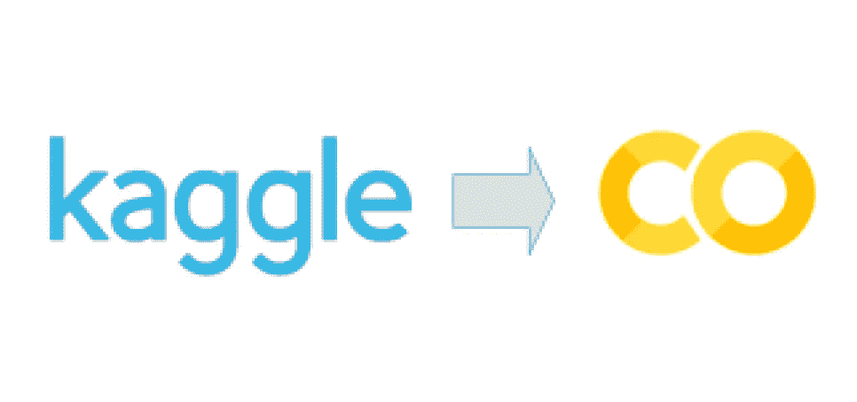
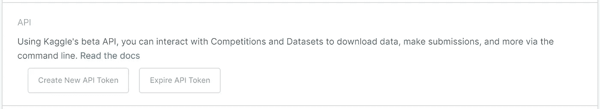
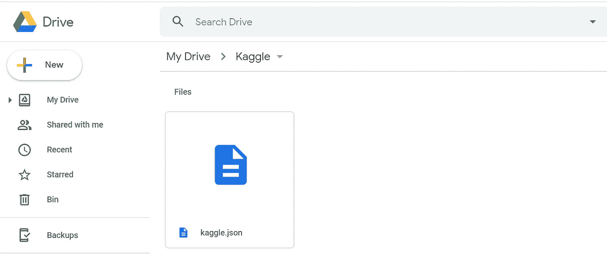
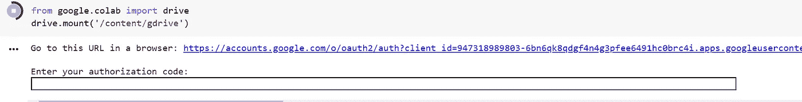
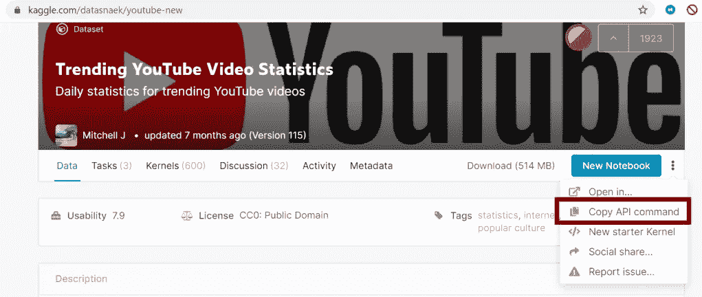
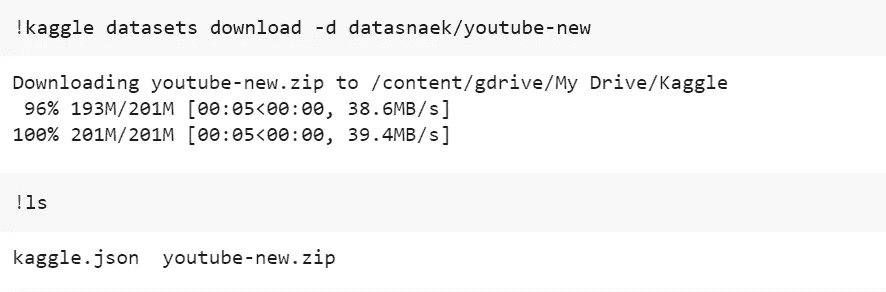
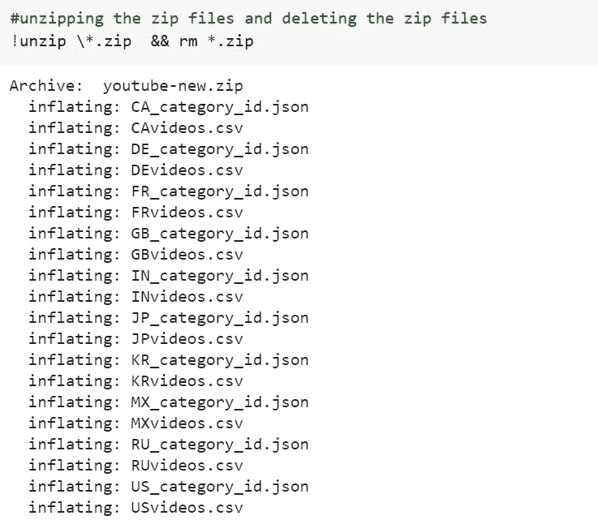

# 如何将 Kaggle 数据集导入 Google Colab

> 原文：<https://medium.com/analytics-vidhya/how-to-fetch-kaggle-datasets-into-google-colab-ea682569851a?source=collection_archive---------0----------------------->



Kaggle 到 Google Colab

我想每个对数据科学领域感兴趣的人都听说过两个流行词 **Kaggle** 和 **Colab。**毫无疑问，Google Colab 是构建和发布您的作品的最简单方式，无需在创建您的 ML 模型时安装库和其他依赖项的繁琐过程。它还为用户提供免费的 GPU 和 TPU 服务(谷歌很棒👏).

回到正题，我正在寻找一种将 Kaggle 数据集用于 google colab 的方法。在挣扎了近 1 个小时后，我找到了最简单的方法，可以不费吹灰之力将 Kaggle 数据集下载到 colab 中。在这里，我提供了一个一步一步的指南来获取数据，没有任何麻烦。

> 你必须有一个谷歌以及 Kaggle 帐户，以继续以下步骤。

# **第一步:获取 Kaggle API 令牌**

*   转到您的帐户并点击**创建新的 API 令牌。**
*   将下载一个名为 **kaggle.json** 的文件，其中包含您的用户名和令牌密钥



# 步骤 2:将 kaggle.json 上传到 Google Drive

*   创建一个名为 **Kaggle** 的文件夹，我们将在其中存储我们的 Kaggle 数据集
*   将 kaggle.json 文件上传到 kaggle 文件夹



参考此图像以获得最终结果

# 步骤 3:创建一个新的 Colab 笔记本

# 步骤 4:将驱动器安装到 colab 笔记本上

*   使用下面的代码来安装你的谷歌驱动器

```
from google.colab import drive
drive.mount('/content/gdrive')
```

*   使用提示的 URL 获取您的授权码，并在空白框中提供它，如图所示



# 步骤 4:运行下面的代码来提供 kaggle.json 的配置路径

```
import os
os.environ['KAGGLE_CONFIG_DIR'] = "/content/gdrive/My Drive/Kaggle"# **/content/gdrive/My Drive/Kaggle** is the path where kaggle.json is present in the Google Drive
```

# 第五步:改变你现在的工作目录

```
#changing the working directory
%cd /content/gdrive/My Drive/Kaggle#Check the present working directory using **pwd** command
```

# 步骤 6:下载 kaggle 数据集

*   转到 kaggle 并复制 **API 命令**来下载数据集



*   您的 **API 命令**将类似于"*ka ggle datasets download-d datasnaek/YouTube-new*"
*   使用**运行下面的代码！**:

```
!kaggle datasets download -d datasnaek/youtube-new
```

*   您可以使用 **ls** 命令检查目录中的内容，如下所示:



# 第 7 步:解压缩您的数据，并删除压缩文件

*   使用**解压**和 **rm** 命令

```
#unzipping the zip files and deleting the zip files
!unzip \*.zip  && rm *.zip
```



这就是所有的乡亲…现在你可以使用提取。csv 文件轻松直接从您的谷歌驱动器。

快乐学习😃….

附:要了解更多 google colab 技巧，请查看这篇来自 **neptune.ai** 的精彩文章，关于[*如何在 Google Colab 中处理文件:你需要知道的一切*](https://neptune.ai/blog/google-colab-dealing-with-files)