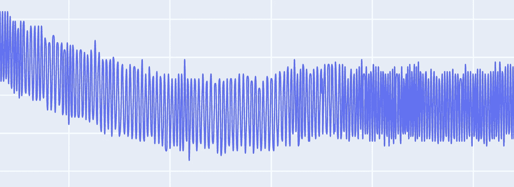

# 如何使用低通滤波器过滤噪声— Python

> 原文：<https://medium.com/analytics-vidhya/how-to-filter-noise-with-a-low-pass-filter-python-885223e5e9b7?source=collection_archive---------0----------------------->

最近，我在处理 12.5 Khz 的甚高频信号，即每秒 12500 个样本或每 80 微秒一个样本。更有趣的是，我必须将各种数据点导出到这个数据集中。

这是我的数据在一个周期内的样子


当我放大数据时，你可以看到噪音



现在考虑一下，如果必须确定曲线上升的起点。

有这么多的噪声，获得假阳性数据点的概率非常高。也想象一下数据波动这么大的情况下算法的性能。

我将从一些信号处理基础知识开始，在我们开始编写代码之前，理解这些基础知识至关重要。

# 基础知识:带通滤波器

四种常见的过滤器。

1.  低通滤波器，通过频率低于特定截止频率的信号，衰减频率高于截止频率的信号。
2.  高通滤波器，通过频率高于特定截止频率的信号，衰减频率低于截止频率的信号。
3.  可以通过级联高通滤波器和低通滤波器来形成带通滤波器。
4.  带阻滤波器是低通滤波器和高通滤波器的并联组合。


现在让我们看一个样本数据，这将是理想的工作


正如您所看到的，大量噪声导致的失真使实际数据发生了变形，实际数据是正弦波数据。

*   采样周期— 5 秒(t)
*   采样频率— 30 个样本/秒，即 30 赫兹(fs)
*   样本总数— (fs x t) = 150
*   信号频率= 6 个信号/ 5 秒= 1.2 赫兹

这意味着我们需要一个最多允许 1.2 Hz 频率的信号通过的滤波器，然而在现实生活中，信号频率可能会波动，因此，如果我们选择一个比理想计算频率略高的数字，效果会更好。

您也可以尝试使用 FFT(快速傅立叶变换)来研究信号与噪声成分的频率和幅度，更多细节和代码可在[这里](/@nehajirafe/using-fft-to-analyse-and-cleanse-time-series-data-d0c793bb82e3)找到

# 巴特沃斯滤波器

巴特沃兹滤波器的频率响应在通带内最平坦(即没有[波纹](https://en.wikipedia.org/wiki/Ripple_(filters)))，在阻带内滚降为零，因此是最受欢迎的低通滤波器之一。


# 奈奎斯特频率

术语奈奎斯特经常用来描述 [***奈奎斯特***](http://astronomy.swin.edu.au/cosmos/N/Nyquist+Rate) *采样率*或*奈奎斯特* [***频率***](http://astronomy.swin.edu.au/cosmos/F/Frequency) 。

[**奈奎斯特速率**](http://astronomy.swin.edu.au/cosmos/N/Nyquist+Rate) 或频率是有限带宽信号需要被采样以保留所有信息的最小速率。如果以固定的时间间隔 *dt* 对一个时间序列进行采样，那么奈奎斯特速率就是 1/(2 *dt* )。

# 让我们直接进入代码

步骤 1:定义过滤器要求

*   采样周期— 5 秒(t)
*   采样频率— 30 个样本/秒，即 30 赫兹(fs)
*   样本总数— (fs x t) = 150
*   信号频率= 6 个信号/ 5 秒= 1.2 赫兹
*   奈奎斯特频率= 0.5 * fs
*   阶数=信号的多项式阶

```
import numpy as np
from scipy.signal import butter,filtfilt# Filter requirements.
T = 5.0         # Sample Period
fs = 30.0       # sample rate, Hz
cutoff = 2      # desired cutoff frequency of the filter, Hz ,      slightly higher than actual 1.2 Hznyq = 0.5 * fs  # Nyquist Frequencyorder = 2       # sin wave can be approx represented as quadratic
n = int(T * fs) # total number of samples
```

步骤 2:创建一些带有噪声的样本数据

```
# sin wave
sig = np.sin(1.2*2*np.pi*t)# Lets add some noise
noise = 1.5*np.cos(9*2*np.pi*t) + 0.5*np.sin(12.0*2*np.pi*t)data = sig + noise
```

步骤 3:使用 scipy 实现过滤器

```
def butter_lowpass_filter(data, cutoff, fs, order):
    normal_cutoff = cutoff / nyq
    # Get the filter coefficients 
    b, a = butter(order, normal_cutoff, btype='low', analog=False)
    y = filtfilt(b, a, data)
    return y
```

步骤 4:过滤并绘制数据

```
# Filter the data, and plot both the original and filtered signals.
y = butter_lowpass_filter(data, cutoff, fs, order)fig = go.Figure()fig.add_trace(go.Scatter(
            y = data,
            line =  dict(shape =  'spline' ),
            name = 'signal with noise'
            ))
fig.add_trace(go.Scatter(
            y = y,
            line =  dict(shape =  'spline' ),
            name = 'filtered signal'
            ))fig.show()
```


令人惊讶的是，滤波后的信号与数据的对齐如此平滑，感觉就像“黄油”。


今天就到这里吧！快乐过滤

查看我的其他文章

[](/@nehajirafe/how-to-make-jupyter-notebooks-extensible-and-reusable-ae11bd3175c) [## 如何让 Jupyter 笔记本具有可扩展性和可重用性

### 所有使用 Jupyter 笔记本进行数据分析或机器学习工作的人都知道“复制”的痛苦——

medium.com](/@nehajirafe/how-to-make-jupyter-notebooks-extensible-and-reusable-ae11bd3175c) [](/@nehajirafe/data-modeling-designing-facebook-style-comments-with-sql-4cf9e81eb164) [## 数据建模—用 SQL 设计脸书风格的“注释”

### 让我们同意，我们都使用过一些或其他社交网站的“评论”部分。

medium.com](/@nehajirafe/data-modeling-designing-facebook-style-comments-with-sql-4cf9e81eb164) [](/@nehajirafe/using-fft-to-analyse-and-cleanse-time-series-data-d0c793bb82e3) [## 用 FFT 分析和清理时间序列数据

### 通常在处理 IOT 数据时，最大的挑战是遇到意想不到的噪音，这种噪音可能非常…

medium.com](/@nehajirafe/using-fft-to-analyse-and-cleanse-time-series-data-d0c793bb82e3)