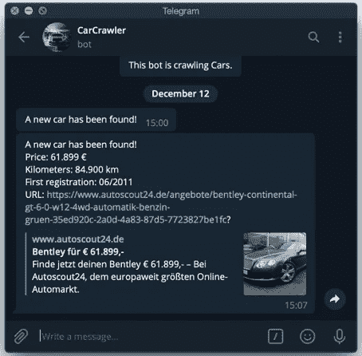

# 如何找到低于市场价值的汽车——使用 Python、BeautifulSoup 和您自己的 Telegram Bot。

> 原文：<https://medium.com/analytics-vidhya/how-to-find-a-car-under-market-value-with-python-beautifulsoup-and-your-own-telegram-bot-c9d91e23c0d1?source=collection_archive---------7----------------------->


由 [Unsplash](https://unsplash.com?utm_source=medium&utm_medium=referral) 上的 [Cam Bowers](https://unsplash.com/@cbowers?utm_source=medium&utm_medium=referral) 拍摄

买车是一项需要深思熟虑的投资。但是，当你与可能比你更有经验和时间的其他买家和汽车经销商竞争时，你如何找到一个好的报价？真正好的报价通常会在网上停留很短时间，因为卖家会接到太多电话——所以成为第一个打电话的人很重要。我将向您展示如何使用 Python、BeautifulSoup 和您自己的电报机器人来解决这个问题。在本项目结束时，我们将有一个正在运行的计划:

**1。抓取德国最大二手车门户网站之一的结果**

**2。自动通知你一个好提议**

该项目旨在通过一个实际例子来教授使用 Python 和 BeautifulSoup 抓取 web 数据的基础知识，并向您展示如何使用数据科学来解决个人的日常问题。

如果你想建立这个项目，请确保你正在工作的网站允许刮！您可以通过将“/robots.txt”附加到页面的域来确定这是否允许。以下项目仅用于演示目的。

# 我们开始吧！

为了这个项目，我将从德国二手车网站刮。该网站有一个大型数据库和许多用户。为了指定我的搜索，我将首先选择我想要跟踪的汽车型号，以缩小搜索范围。为此，我选择了 2010 年首次注册、最大里程数为 10 万公里的宾利欧陆 GT。

## **网络抓取是如何工作的，我们从哪里开始？**

抓取是指从特定网站获取所有信息。我们可以从一个页面中抓取整个 HTML 代码，用我们的代码过滤它以获得干净的数据，并且更容易更快地得出结论。

首先，我们必须找出我们的目标 URL，在本例中，它已经包含了一个预定义的搜索。为此，我们手动执行一次搜索。这意味着我们必须在网站上填写搜索掩码，执行搜索，将排序设置为“价格升序”，然后从浏览器复制 URL。过滤功能提供了大量的设置，但现在我们必须明智地选择哪些是有用的快速决定:这是一个好的还是一个坏的汽车报价？我们不想错过一个好机会。我决定在这次搜索中只使用三个过滤器设置:公司名称和汽车型号、首次注册(年份)和里程。通过搜索，我们可以了解最新发布的汽车概况。


现在最激动人心的部分来了:我们现在如何完全自动地找到最好的报价？要做到这一点，我们首先要定义什么是好的报价。经过对这种汽车的市场价格的简短研究，我发现德国最便宜的报价约为 60.000-70.000 欧元，可以认为是相对便宜的。我决定坚持 65000 欧元的限额。因此，我们希望我们的程序通知我们，当一辆汽车正好在这个网址上以低于 65.000 欧元的价格做广告。首先，我们将在代码中实现通过手动搜索获得的 URL，以便在运行代码时自动进行过滤。

我们的主要任务之一是找出每辆车的价格信息在这个网站的 HTML 代码中的确切位置。为此，我们将使用**美声**。首先，我们需要插入项目所需的库并定义一个头文件。标题可以让我们看起来像是从浏览器访问这个页面。过多使用网页会导致你暂时被屏蔽。基于这个原因，你应该放轻松。

```
import requests
from bs4 import BeautifulSoup
from requests import get
import pandas as pd
import itertools
import schedule
import time
import random
from time import sleep
from datetime import datetime
import matplotlib.pyplot as plt
import seaborn as sns
sns.set()

headers = ({'User-Agent':
                'Mozilla/5.0 (Windows NT 6.1) AppleWebKit/537.36 (KHTML, like Gecko) Chrome/41.0.2228.0 Safari/537.36'})
```

## 处理 HTML 代码

在我们开始代码的主要部分之前，我们应该首先找出关于价格的信息在 HTML 代码中的确切位置。这是检测工作开始的地方，我使用的工具在 Chrome 浏览器中(右键单击-->“查看源代码”)。为了使搜索更容易，我右键单击汽车价格所在的字段，然后单击“Inspect”。


右键单击价格—检查(变为黄色)

现在一个包含 HTML 代码的窗口打开了，其中我选择的元素已经被标记了。正如我们所看到的，文本信息 61.899-就位于这里，带有一个 span-tag:


在 HTML-jungle 中查找目标信息

我们可以看到，我们仍然需要清理价格，以继续将其作为一个数字。代码中的所有字符(“€”、“等等”)都必须被清除。我们将很快处理这一部分，但是首先，我们将处理正确提取价格信息。

现在我们知道价格位于有 span-tag 的某个地方。因为我们想得到每辆车的价格，我们仍然需要找出在哪个标签下可以找到每辆车的主容器。通过爬上 HTML 树，我们可以找到汽车的容器。对于这一步，将网页和 HTML 代码放在一起并将鼠标光标移到代码上是很有用的。然后，浏览器将根据鼠标指针所在的代码行，在浏览器中以蓝色显示相应的字段。这使得找到主容器的位置变得容易。在这种情况下，它是标记的 div 容器:


为一辆车寻找主集装箱

如果我们点击 div 容器，我们会看到我们在网站上看到的所有信息都存储在这里。所有的副标题也用 div 和 span 标记。我们现在的下一个任务是在我们的代码中调用正确的主容器，并正确地指出价格信息位于哪个标签下的确切位置。

## 代码的主要部分

现在从代码的主要部分开始，我们为代码定义目标 URL 并运行 BeautifulSoup。

```
cars_url = 'https://www.HERE-GOES-YOUR-TARGET-URL!!'r = get(cars_url, headers=headers)page_html = BeautifulSoup(r.text, 'html.parser')
```

下一个任务是找到价格的准确位置。对于这项研究，我们将只取页面上的第一辆车，让程序搜索所有带有“span”标签的条目，并显示结果:


寻找合适的位置

运行该代码将为我们提供以下信息:


运行代码的结果

如我们所见，我们要找的信息在第三个 span 标签的容器中。需要注意的是，Python 从 0 开始计数。所以第一个结果可以通过[0]调用，第二个通过[1]调用，依此类推。这意味着我们可以用[2]来调用价格。现在我们知道了信息的确切位置，我们可以开始清理数据了。

## 打扫卫生！

清洁可以用不同的方法来完成。为了让这个项目对初学者尽可能友好，我写了两个选项。在第一个选项中，我们查看哪些字符必须被删除才能得到我们要寻找的数字。在这种情况下:欧元符号、连字符、点、逗号和空格字符。我们可以按如下方式手动删除它们(在单独的行中写出单个字符):

```
price=firstcar.find_all('span')[2].text
print("price before replacing characters:" + price)
price = price.replace('.', '')
price = price.replace('€', '')
price = price.replace(',', '')
price = price.replace(' ', '')
price = price.replace('-', '')
print("price after replacing characters:" + price)
```

或者，我们可以使用更复杂但优雅的解决方案:将“join()”、“isdigit()”和“filter()”函数放在一行代码中:

```
price = ''.join(filter(lambda i: i.isdigit(), price))
```

这两种选择会给我们相同的结果:

```
price before replacing characters:
€ 61.899,-price after replacing characters: 
61899
```

虽然我们现在在“price”中只有数字，但是这个对象仍然是一个字符串。用(print(type(price))我们可以随时检查这一点。我们仍然需要将这个对象转换成一个整数，以便能够执行数学等式:price < price limit.

```
price = int(price)
print(type(price))
```

For the completion of the code we are still missing the following items:

**1。连接和设置电报机器人**

**2。如果刮出的价格低于我们设定的极限值，则发出“如果-查询”**

**3。设置程序在一定时间间隔后重复**

## **设置您的电报机器人**

要创建一个机器人，我们需要安装 Telegram(如果你的手机或电脑上没有的话)并使用机器人父亲:[https://t.me/botfather](https://t.me/botfather)

通过/start，/newbot，我们可以创建一个机器人并指定一个名称。作为响应，我们将收到一个指向我们的 bot 的链接和一个需要在代码中实现的 bot 令牌。此外，我们需要我们的私人聊天 ID。要做到这一点，通过上面生成的链接使用机器人，启动它并发送消息。然后在我们的浏览器中打开以下链接:

[https://api.telegram.org/bot<你的令牌>/获取更新](https://api.telegram.org/bot%3cyourtoken%3e/getUpdates)

用你刚收到的机器人令牌替换<your token="">，并复制“id”后的数字:这是你的聊天 ID。要在 Python 中实现 Telegram 聊天机器人，您可以使用以下代码:</your>

```
def telegram_bot_sendtext(bot_message):
    bot_token = 'Put your Token here!!'
    bot_chatID = 'Put your Chat-ID here!!'
    send_text = 'https://api.telegram.org/bot' + bot_token + '/sendMessage?chat_id=' + bot_chatID + '&parse_mode=Markdown&text=' + bot_message
    response = requests.get(send_text)
    return response.json()message = telegram_bot_sendtext('A new car has been found!')
```

不要忘记插入您的令牌和聊天 ID。此外，您可以在最后一行自定义您的消息。

只需在发送消息之前运行这个 if 查询，就可以过滤掉超出我们限制的价格。

```
limit = 65000
if price<limit:
```

为了处理第一个搜索页面上的所有汽车，而不仅仅是第一个，我们必须在代码的开头添加一个循环:

```
if car_containers != []:

    for container in car_containers:
```

因为我们希望自动重复整个搜索过程，所以我们必须将我们的主代码定义为一个函数

```
def crawlcar():
```

并设置日程功能:

```
schedule.every(X).seconds.do(crawcar)
```

这样，代码将在 X 秒后再次运行。

**有一件事我们还没有解决:当同一辆车在下一次运行中“再次被发现”时，我们如何处理警报？**

因为我们的程序一次又一次地找到同一辆车，所以每次运行它都会给你发送一个警报。为了避免这个问题，我们可以设置一个具有某些特征的列表。因为我们已经在处理价格，所以我们可以马上使用这个属性。我们只需要两行代码来完成以下任务:将每辆报废汽车的当前价格存储在一个列表中。开启电报功能前先问:这个价格已经在单子上了吗？如果有，就不要发出去。这样我们就避免了同一车辆触发警报的错误。

这样，我们就完成了，可以运行我们的程序了！测试结果表明爬虫正在工作:我们在电报上收到如下消息:


第一条消息！

现在至少我们知道了一辆符合我们标准的车刚刚被贴出来。但是，要看到车或者其他任何信息，都要手动进入页面搜索(基本没问题)。然而，我们可以定制我们的代码，并通过简单地将链接添加到汽车中来缩短这一步。为此，类似于价格搜索，我们在 HTML 代码中搜索包含汽车描述链接的容器，保存它(就像我们处理价格一样)，并将其直接链接到我们的 bot 通知中。就这样，我们可以提取任何我们感兴趣的信息，比如首次注册和里程。提取这些数据甚至更容易，因为我们不必编辑它或把它放入数学方程中，而是可以直接把它作为一个字符串。结果看起来像这样:



现在看起来好多了

现在，我们需要做的就是攒够 61.899 欧元！感谢阅读！让我知道你是否对类似的项目感兴趣。