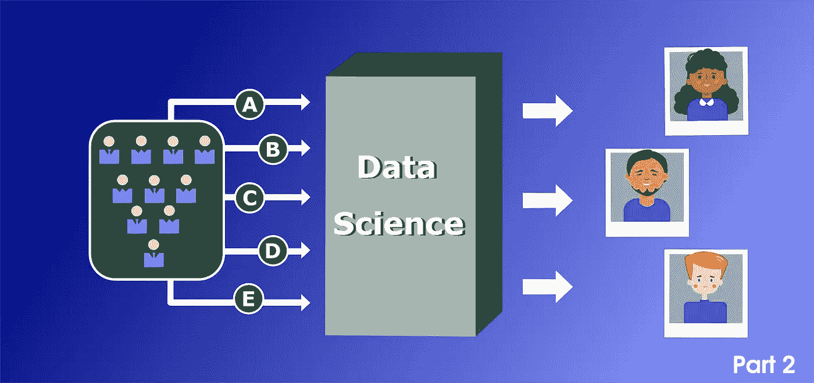
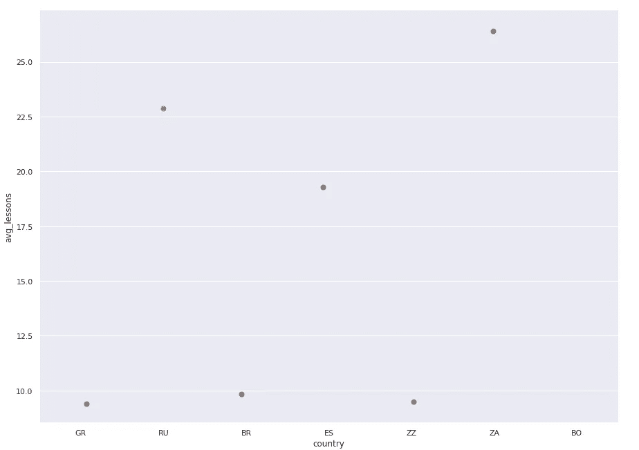
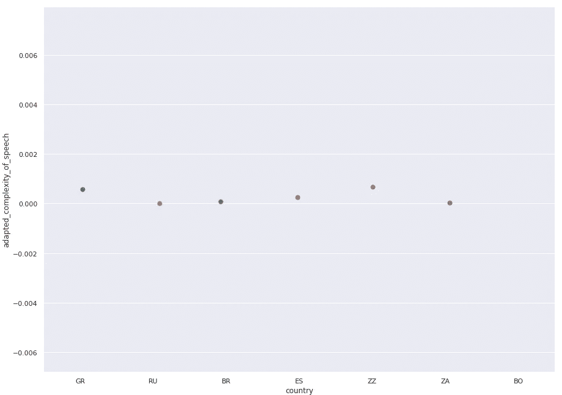
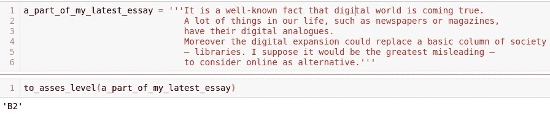
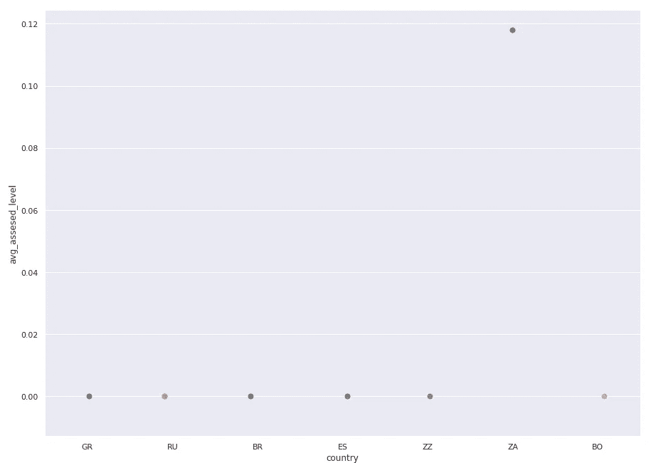
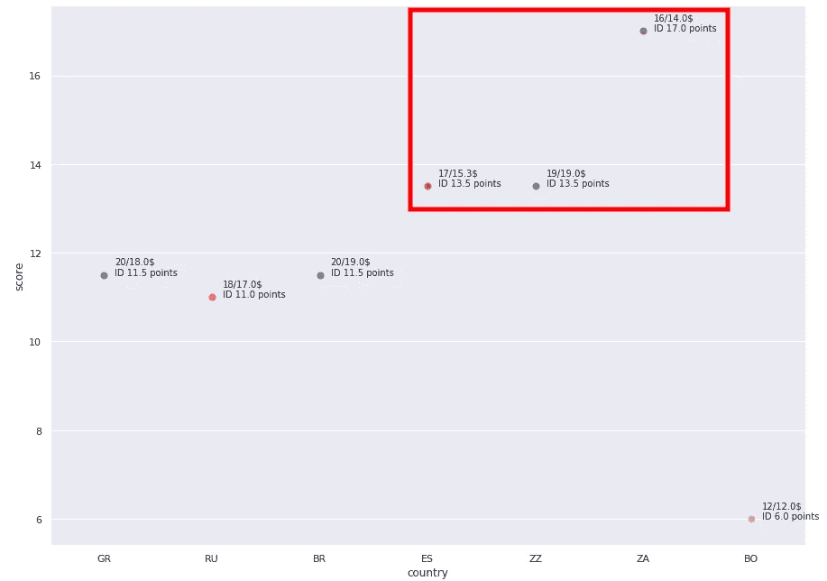

# 如何找到英语老师？第二部分。

> 原文：<https://medium.com/analytics-vidhya/how-to-find-an-english-teacher-part-2-425f85a18e45?source=collection_archive---------20----------------------->

这是关于使用数据科学寻找英语老师的故事的续篇。如果你还没有读过它，那么有机会了解更多。

简而言之——我们有关于语言教师的信息，并试图用熊猫和我们的期望来应用一些基本的想法。不幸的是，我们被困在第三步，因为没有足够的信息来解决我们最后的需求——我们最终不需要 3 个候选人。

## 放弃

这是一种基于我自己经验的方法，可能不适合你的观点、想法或原则。

# 第四步。使用评论。

嗯，这比预期的要难一点，看起来当前的数据集没有更多有用的信息。

## 额外的意见来源

尽管有一些关于教师的信息，但我们不能盲目相信。在上一步中，我们根据文本描述对体验做出了判断/结论。当我们考虑一些(或多或少)可以验证的东西时，这是有意义的。但是当我们想从 7 位老师中选择“前 3 名”时，我们只坚持已经提供的描述——错误必然会发生。原因——**每个厨师都称赞自己做的汤。人们说自己坏话的可能性微乎其微。因此，我们需要添加一些信息，如评论。我们去拿吧。**

## 课时量

第一个重要的时刻——学生和特定的老师上了多少节课？他们可以写惊人的评论，但不会再预订课程了。我认为这是一个与教师经历密切相关的时刻。让我们来看看。

根据平均课时数，一个来自南非的人比其他人拥有更多的忠实学生

## *我们需要更深入* …

一方面，人们喜欢写评论，语言学习者也喜欢。另一方面，这些评论通常很简单，看起来像“一个好老师”、“谢谢你”、“最好的一课”等等。

老实说，大多数评论都大同小异，对我们没有吸引力。我们可以尝试对它进行分类(情感分析)，但它仍然更多地是关于情感而不是事实。让我们从另一个角度来看这个问题。

我们试着去理解结构，而不是阅读激动(或失望)的评论。在我们使用正则表达式处理文本之前。我们要不要用更强大的东西来达到我们的目标？也许…一些 NLP 不会伤害任何人。

我认为一篇好的评论应该包含各种各样的词汇。像“现在/过去完成时”、“条件句”、“过去分词”、“将来时”等都是很好的标志，表明学生有能力雄辩地表达自己的观点。

“适应的言语复杂性”代表特定教师的学生如何表达他们的思想

换句话说，我们试图以一种不寻常的方式来处理它，忽略了“人们到底写了些什么？”，或者“他们对一堂课有什么感受”。与其这样，不如让我们试着去理解"**他们的演讲是如何表达的"并找到一位拥有最尖端评论的老师。**

**然后，按照这个原则重新安排教师。**

****

**看起来我们有两个“领导者”。**

**现在的情况与以前不同。来自未知国家(ZZ)和希腊(GR)的老师的学生比其他人倾向于写更复杂的评论。这是改变主意的信号吗？我不这么认为…**

# **第五步。是时候大显身手了。**

**众所周知，学生想向教过冠军的人学习。我宁愿向那些教过与我水平相当或更高的人的老师学习。在我看来，我们可以通过学生的评论来评估他们的水平。**

***对了，关于语言熟练程度的等级:* 根据*****欧洲通用框架*** 中的**参考**中的*语言*(***【CEFR】***)那里有一些学习者的熟练程度等级。初级(A1、A2)、中级(B1、B2)、高级(C1、C2)。FCE——考试是关于 B2 的，我宁愿考虑那些教过 B2 或更高水平的人的老师。****

****有一个惊人的信息数据集——*EF-Cambridge 开放语言数据库(EFCAMDAT)* 。重点是，它包含一个巨大的(超过一百万)组合集“一个表达式-一个熟练程度”
，我们将使用一个 LSTM 网络，它已经在这个数据集上进行了训练(*这是完全不同的故事……*)。其背后的主要思想是“对英语学习者水平的自动分类”。****

****让我给你看一个例子，它是如何与我上一篇文章中的一篇文章一起工作的****

********

****百米..我的课文被评定为 B2****

****好吧，让我们试着在现实生活中做同样的事情。我们倾向于把我们的分数转移给那些和特定老师有更多课的学生。通常，预订/参加许多课程的人比只上一节课的人更喜欢写详细的评论。****

****然后看这种方法结果****

********

****呜…南非的老师和其他人之间有很大的差距****

# ****第六步。可视化+分析****

****整合的时间到了！根据 ML 模型的“意见”,我们有明显更好的老师，但是……我们可以结合不同的分数，根据前面步骤的系数为老师设置一个等级，然后根据这个积分值对他们进行排序。这种想法与“排名投票制”非常相似。****

****现在我们可以找到前三名老师来完成我们的任务****

********

****红色方块用于突出显示比其他教师更符合初始要求的教师****

****嗯……根据我们的计算，来自未知国家、南非和西班牙的老师是最受欢迎的。****

****现在我们准备回到我们的期望列表，删除最新的需求。****

*   ****̶̶a̶̶p̶r̶i̶c̶e̶̶n̶o̶̶m̶o̶r̶e̶̶t̶h̶a̶n̶̶2̶0̶$̶̶p̶e̶r̶̶h̶o̶u̶r̶****
*   ****̶̶̶te̶a̶c̶h̶e̶r̶s̶̶a̶b̶l̶e̶̶t̶o̶̶h̶e̶l̶p̶̶m̶e̶̶i̶n̶̶a̶̶p̶r̶e̶p̶a̶r̶a̶t̶i̶o̶n̶̶f̶o̶r̶̶c̶a̶m̶b̶r̶i̶d̶g̶e̶̶e̶x̶a̶m̶s̶(̶f̶c̶e̶)̶̶****
*   ****̶̶t̶h̶e̶y̶̶h̶a̶v̶e̶̶a̶̶r̶e̶a̶l̶̶e̶x̶p̶e̶r̶i̶e̶n̶c̶e̶.̶****
*   ****̶a̶g̶r̶e̶e̶̶t̶o̶̶g̶i̶v̶e̶̶m̶e̶̶a̶̶h̶o̶m̶e̶w̶o̶r̶k̶̶a̶n̶d̶̶c̶h̶e̶c̶k̶̶i̶t̶****
*   ****̶n̶o̶̶m̶o̶r̶e̶̶t̶h̶a̶n̶̶3̶̶c̶a̶n̶d̶i̶d̶a̶t̶e̶s̶****

****我们到达终点了吗？肯定！****

# ****结论****

****特别是对我来说，这是一个小小的悲伤，来自俄罗斯的老师在这场即兴比赛中获得第六名。同时，也仅仅是这种特定的较量，而在任何较量中都会有领导者和局外人。****

****我想说的主要内容是——我希望这些想法和方法能帮助你找到一个使用数据科学和 ML 的好的在线老师。****

****同时，这项研究(或者“一项调查”)，不仅仅是关于寻找一名语言教师。它更多的是关于隐藏在用户界面背后的数据如何帮助我们做出选择，不仅基于可见的指标，还基于它下面的东西。****

******P.S.** 感谢阅读。[那里](https://github.com/VeeSot/how_to_find_a_teacher/blob/master/how_to_find_a_teacher_final.ipynb)是 iPython-notebook 的最终版本****