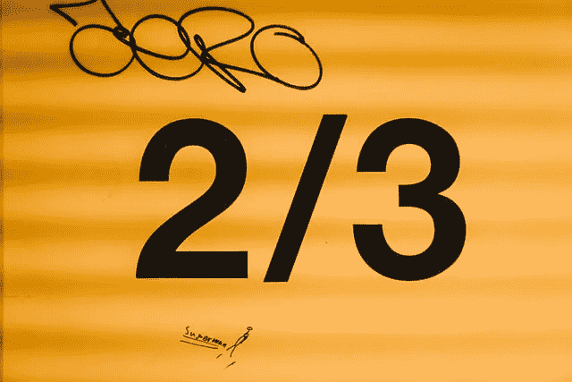

# 如何在 Python 中找到连续的序列号？

> 原文：<https://medium.com/analytics-vidhya/how-to-find-consecutive-sequence-number-in-python-604b78574e16?source=collection_archive---------3----------------------->

简单的代码在 Python 中找出连续的序列号。



🇨🇭·克劳迪奥·施瓦茨| @purzlbaum 在 [Unsplash](https://unsplash.com/s/photos/consequtive-numbers?utm_source=unsplash&utm_medium=referral&utm_content=creditCopyText) 上拍摄的照片

**简单用例**:查找给定的数字是否有序

将数字转换成字符串并检查该数字是否是 1 到 0 的一部分。

```
def issequence(num):
    if (str(num) in '1234567890'):
        return True
    else:
        return False
```