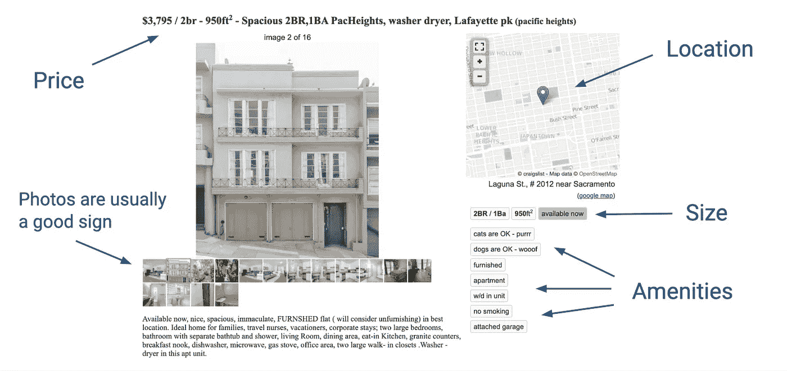
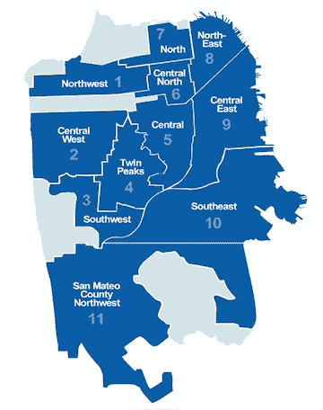
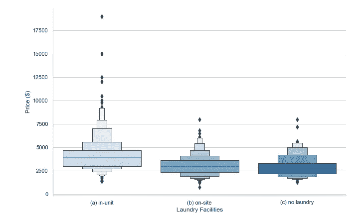
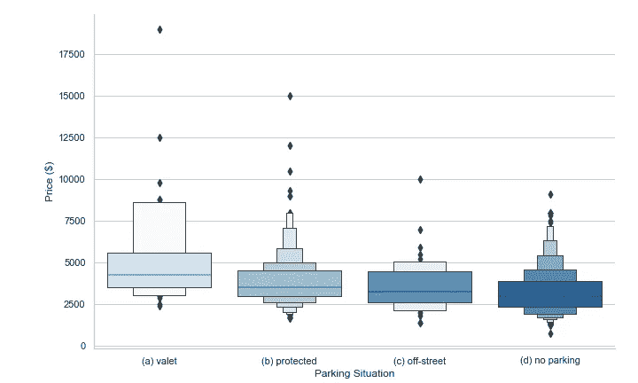
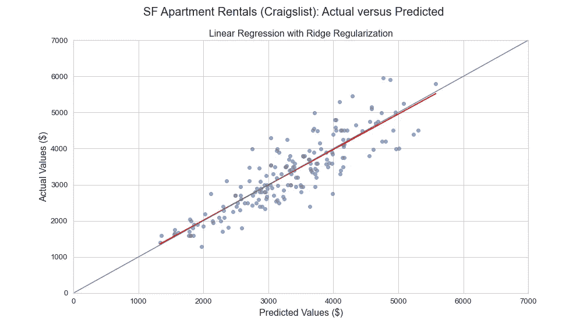
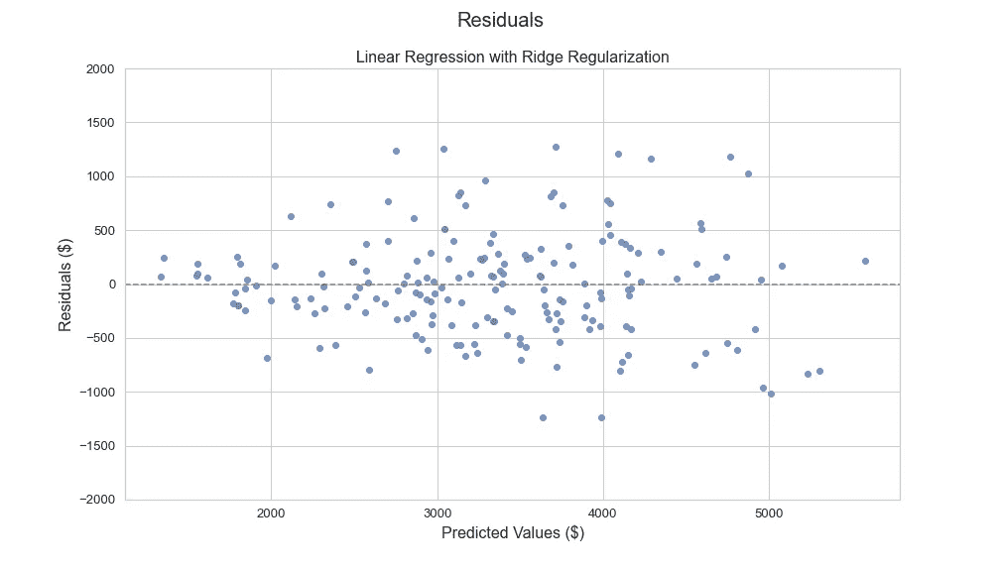
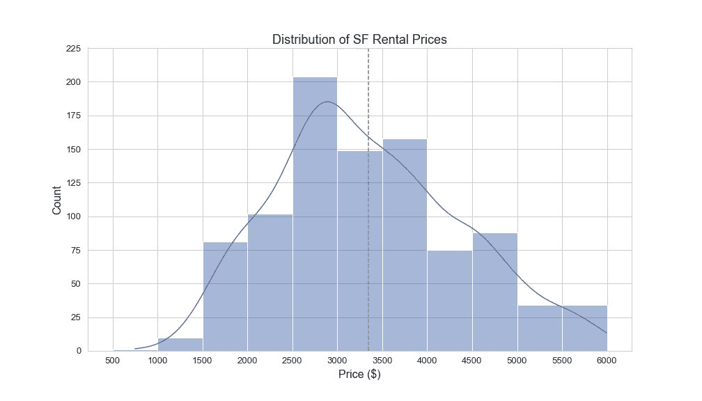

# 如何找到好的公寓交易

> 原文：<https://medium.com/analytics-vidhya/how-to-find-good-apartment-deals-craigslist-f21967420059?source=collection_archive---------19----------------------->

## 预测建模

## 用线性回归预测租金价格

一年前，我和我的搭档在寻找一套新公寓。我们并不想找什么高档的房子，只要一间可以养狗的卧室，带一个花园的户外空间，而且不贵。

如果你住在湾区，或者可能是美国的任何一个中心城市，你就会知道这个故事的走向:在多次看房中，你排队等候潜在的租房者，都在争夺房东的注意和青睐。

我从来没有像现在这样讨厌非常好的陌生人。

找房子的竞争性质意味着我们作为求职者需要准备好立即行动，以确保租赁。速度是以仔细评估和保证我们得到的是公平交易为代价的。考虑到这一点，我想创建一个预测模型，帮助像我这样的租房者更好、更快地评估他们的选择。

为了这个[项目](https://github.com/scrapfishies/CL-housing-rent-predictions)，我在 Craigslist 上搜集了 3000 多套旧金山的公寓/房屋列表，并使用线性回归法，根据大多数帖子上提供的一套标准功能来预测租金价格。我将分享我的 web 抓取、数据清理和准备过程的概要，然后介绍我构建和评估模型的方法。

这个项目的所有代码和细节都可以在我的 [GitHub 库](https://github.com/scrapfishies/CL-housing-rent-predictions)中找到。

# Craigslist 帖子剖析

对于那些刚刚在 Craigslist 上找房子的人来说，让我们快速浏览一下一个非常典型的帖子:



旧金山公寓的典型 Craigslist 帖子

Craigslist 的列表可能会有很大的不同，因为只要求发帖人提供标题、租金金额，并填写一个开放的文本框。但是，还有其他标准字段可以使用:位置(对于大多数主要城市，有社区选项)、平方英尺、卧室和浴室的数量，然后是一些关于提供的便利设施的基本信息，如洗衣设施、是否允许宠物以及停车。

这些字段在措辞和网页位置上的一致性意味着它们可以很容易地被抓取并用作模型中的特征。

# 网页抓取 Craigslist

当我第一次开始这个项目并在 Craigslist 上搜索信息时，我看到了[这个很棒的搜索结果列表页面的教程](https://towardsdatascience.com/web-scraping-craigslist-a-complete-tutorial-c41cea4f4981)。这篇文章是一个有益的开始，但我知道我需要进入每个人的帖子，以获得额外的功能，如浴室和设施的数量。

刮削过程:

*   抓取[列表结果第一页](https://sfbay.craigslist.org/search/sfc/apa?bundleDuplicates=1&availabilityMode=0&sale_date=all+dates)的发布日期、标题、url、租金、平方英尺、卧室数量和邻居(位置)并将其添加到熊猫数据框中。每页通常有大约 120 个列表。
*   从列表结果页面中抓取这 120 个 URL 中每一个，提取浴室和便利设施的数量，并将这些特征附加到数据帧中。
*   移动到下一个结果列表页面，并重复，直到所有的结果页面和个人职位已经刮。

下面是一个帮助器函数，用来编译一个结果页面的清单:

[我的 Craigslist 抓取的完整代码可以在 GitHub 上找到](https://github.com/scrapfishies/CL-housing-rent-predictions/blob/master/scrape_cl.py)

# 数据清理和准备

清单在数据框架中安全可靠，下一步是清理和准备用于建模的数据:

*   删除重复的(在这次刮擦中，有 600 多一点)
*   格式化卧室和浴室(例如，将浴室条目如“splitBa”转换为 1)
*   解析便利设施列表，为洗衣、宠物和停车创建不同的类别
*   将位置数量减少到可行的类别数量
*   最后，删除缺失或错误数据的行(例如，非常不正确的平方英尺数字、不在旧金山的公寓列表等。)，以及异常值(例如，一个月租金超过 25，000 美元的公寓列表！你是谁？你为什么要在 Craigslist 上看？)

下面是一个搜索便利设施列表以解析宠物限制的示例:

```
def pets_allowed(amen_list):
    if ('dogs are OK - wooof' and 'cats are OK - purrr') in amen_list:
        return '(a) both'
    elif 'dogs are OK - wooof' in amen_list:
        return '(b) dogs'
    elif 'cats are OK - purrr' in amen_list:
        return '(c) cats'
    else**:**
        return '(d) no pets'sf['pets'] = sf['amens_list'].apply(lambda amen_list pets_allowed(amen_list))
```

正如我前面提到的，Craigslist 允许发帖者从标准社区列表中指定他们的位置。对于旧金山来说，大约有 35 个独特的街区可供选择。张贴者也可以选择使用开放的文本框来提供他们自己的位置细节。因此，数据框架中的位置有超过 100 个唯一值，其中许多是重复的(例如，“soma”、“SOMA”、“SoMa”和“South of Market”)，并且许多不在旧金山(有时甚至不在湾区)。



SFAR 地区地图

旧金山房地产经纪人协会提供了一张地图，将该市划分为 10 个区，[数据 SF 创建了一个互动版本](https://data.sfgov.org/Geographic-Locations-and-Boundaries/Realtor-Neighborhoods/5gzd-g9ns)，允许用户根据较小的社区名称轻松找到一个区。

有了这张地图作为指导，我能够减少这 10 个地区的唯一位置值的数量，这将显著减少稍后在模型中使用的虚拟变量的数量。

经过彻底的清理，数据集被削减到不到 1000 行和 8 个特征，可用于帮助预测租金价格。

# 模型构建、结果和评估

## 探索性数据分析

在建模之前，探索数据并理解可能的特征和目标变量之间的关系是很重要的。

下面，我们可以看到这些列表中提供的洗衣设施与价格正相关，更理想或首选的选项与更高的租金相关。



[Catplot](https://seaborn.pydata.org/generated/seaborn.catplot.html) 描绘了洗衣设施的价格范围

同样，停车位也可能需要额外的费用。海湾地区的任何人都知道，如果你的车被闯入，这不是*的问题——这是*时的*。*



根据停车情况描绘价格的猫图

令人惊讶的是，建筑类型——无论是单户住宅还是多户住宅(如复式住宅、公寓楼)——与价格的相关性并不强。因此，这个特性并没有在模型中体现出来。

## 特征选择和工程

模型中使用的最终特征可分为:

*   连续(平方英尺)
*   离散(卧室、浴室的数量)
*   顺序(停车、洗衣)和
*   分类(宠物限制，邻近地区)

为了提高模型的预测能力，我使用了 s [klearn 的多项式特征](https://scikit-learn.org/stable/modules/generated/sklearn.preprocessing.PolynomialFeatures.html)，这将在不同的特征之间产生相互作用。然后，我应用[脊和套索正则化](https://towardsdatascience.com/ridge-and-lasso-regression-a-complete-guide-with-python-scikit-learn-e20e34bcbf0b)来降低复杂性，防止过度拟合，并梳理出哪些功能对租赁价格影响最大。

在使用 K-folds 进行严格的[交叉验证过程后，两者在 R-squared 上的得分相似，但是在均方根误差(RMSE)和平均绝对误差(MAE)指标上，岭模型在训练和验证数据集之间的得分最一致，因此我继续使用岭进行最终模型。](https://machinelearningmastery.com/k-fold-cross-validation/)

## 最终模型和结果

用完整的训练集拟合模型后，模型的测试得分相当高:

```
R-squared: 0.77
Root Mean Squared Error (RMSE): $477
Mean Absolute Error (MAE): $366
```

与实际值相比，绘制的预测价格如下所示:



拟合的预测线几乎与身份线完全一致，开始脱离大约 4500 美元/月的范围。残差图提供了更好的视图:



由于样本中的大多数列表都在每月 2，500 美元到 4，000 美元的范围内，因此该模型在该窗口中表现最佳似乎是合理的。完整样本的价格分布如下所示:



Craigslist 完整样本的租赁价格分布

# 对未来工作的最后想法和建议

最终，我认为这个模型很好地预测了高达 4000 美元/月的租金。大约 400 美元的摆动容差(通过 RMSE 和梅)应考虑与租赁价格的关系，并将受搜索者预算的影响。

例如，400 美元的增量对一个人来说可能很重要，但在两人或多人之间分摊时可能完全可以接受。

不过，可能还有其他因素影响租金价格:

*   租金控制和历史(尤其是在湾区)
*   Craigslist 帖子中提供但非标准的其他便利设施(如健身设施、公共空间、自行车存放处等)
*   其他环境或经济因素

关于最后一点，[由于 COVID 移民，我们目前看到旧金山租金出现了前所未有的下降](https://www.sfchronicle.com/bayarea/article/Bay-Area-rents-keep-plummeting-especially-in-15613722.php)。那些搬出城市的人可能是在疫情期间有办法搬到远处工作的人。因此，10 月初收集的清单样本可能不是 Craigslist 正常产品的最佳代表。

## 对未来工作的建议

我很想把这个项目进行得更深入，提高模型的预测能力。以下是对未来工作的一些想法:

*   一旦 COVID 的影响消退，再次取样
*   扩大抓取方法的范围，以找到/创建附加功能(在文本中搜索关键字，如“健身房”或“后院”，或找到有关保证金和租赁要求的信息)
*   实施图像处理工具，通过张贴的照片评估一个单位的质量
*   诈骗邮件识别

如果你有更多的想法让[这个模型](https://github.com/scrapfishies/CL-housing-rent-predictions)更精确，或者如果你有兴趣让它适应你自己的城市或城镇，我也很乐意听到你的意见——让我们来谈谈吧！