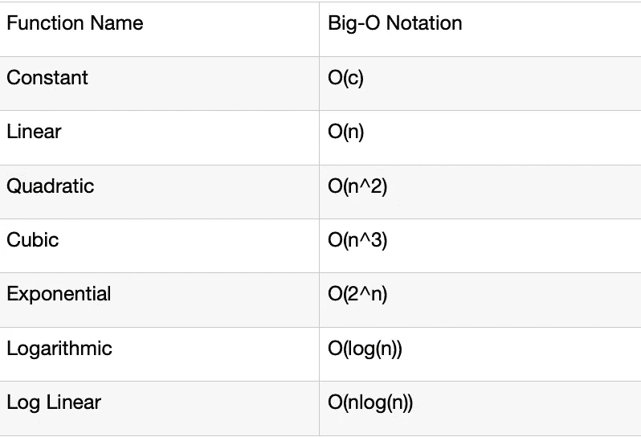

# 如何计算 Python 代码的时间复杂度

> 原文：<https://medium.com/analytics-vidhya/how-to-find-the-time-complexity-of-a-python-code-95b0237e0f2d?source=collection_archive---------1----------------------->

什么是时间复杂性，为什么它很重要？

简单来说，时间复杂度就是执行一段代码所花费的总时间。这段代码可以是一个算法，也可以仅仅是一个优化且高效的逻辑。时间复杂度是确定代码性能的度量，从而表示代码的效率。在编写代码时考虑性能总是一个好习惯。

> 注意:代码的时间复杂度越低，意味着它的执行速度越快。

作为一名程序员，我总是关心我的代码的性能，最近我遇到了一个名为“ **big-O** 的 python 模块，它让工作变得如此简单。你可以在 https://pypi.org/project/big-O/的[T5](https://pypi.org/project/big-O/)找到这个包的完整文档

非常感谢造物主👍

**什么是 Big-O？**

基本上，Big-O 符号表示输入和代码之间的关系，一些常见的 Big-O 函数如下:



让我们来看几个函数，以便有一个基本的了解。

恒定的复杂性意味着无论给定的输入是什么，执行代码所花费的时间保持恒定。类似地，线性复杂度意味着复杂度理想地随着输入的数量而增加。一个可能的例子是在给定的数字列表中找到最大的数字。有了这样的理解，我们将继续讨论如何使用' **big-O'** python 模块找出代码的复杂性

1.  **安装:**

```
pip install big-O
```

2.充足的 Python 代码:

我创建了一个简单的 python 函数，它将一个字符串作为输入，并返回字符串中第一个不重复的字符。

*   我使用 big-o 内置的 **datagen** 来生成一组长度为 100 的随机字符串(它也支持其他通用数据类型)
*   参数 **n_measures** 定义了需要传递给函数的输入数量
*   您还可以添加一个参数 **n_times** 来指定函数被调用的次数，以计算执行时间

```
import big_o #Generating random test strings of length 100
sample_strings = lambda n: big_o.datagen.strings(100)#my logic to find the first non-repetitive character in the string
def non_repetitive(sample_string):
    string_list = list(sample_string)
    non_repetitive_char = next((ele for ele in string_list if string_list.count(ele)==1),None)
    return non_repetitive_char#Calculating the Time complexity
best, others = big_o.big_o(non_repetitive, sample_strings,n_measures=20)
print(best)
```

上述脚本的输出是:

```
Constant: time = 2E-05 (sec)
```

这将返回我的示例代码的最佳时间复杂度以及总的执行时间。您还可以通过迭代代码中的第二个参数' **others** '来查看其他时间复杂性。

```
for class_, residuals in others.items():
print(class_)#output
Constant: time = 2.2E-05 (sec)
Linear: time = 2.9E-05 + -1.3E-10*n (sec)
Quadratic: time = 2.4E-05 + -6.2E-16*n^2 (sec)
Cubic: time = 2.3E-05 + -3.6E-21*n^3 (sec)
Polynomial: time = -8.9 * x^-0.19 (sec)
Logarithmic: time = 9.1E-05 + -6.7E-06*log(n) (sec)
Linearithmic: time = 2.8E-05 + -1E-11*n*log(n) (sec)
Exponential: time = -11 * -3.7E-06^n (sec)
```

我个人很喜欢这个模块，觉得很值得分享。希望对你也有帮助！！

**参考文献:**

1.  [*https://pypi.org/project/big-O/*](https://pypi.org/project/big-O/)
2.  [*https://stack abuse . com/Big-o-notation-and-algorithm-analysis-with-python-examples/#:~:text = Big % 2DO % 20 notation % 20 is % 20a % 20 metrics % 20 used % 20 to % 20 find % 20 algorithm，by % 20 open % 20 and % 20 closing % 20 括号*](https://stackabuse.com/big-o-notation-and-algorithm-analysis-with-python-examples/#:~:text=Big%2DO%20notation%20is%20a%20metrics%20used%20to%20find%20algorithm,by%20opening%20and%20closing%20parenthesis) *。*