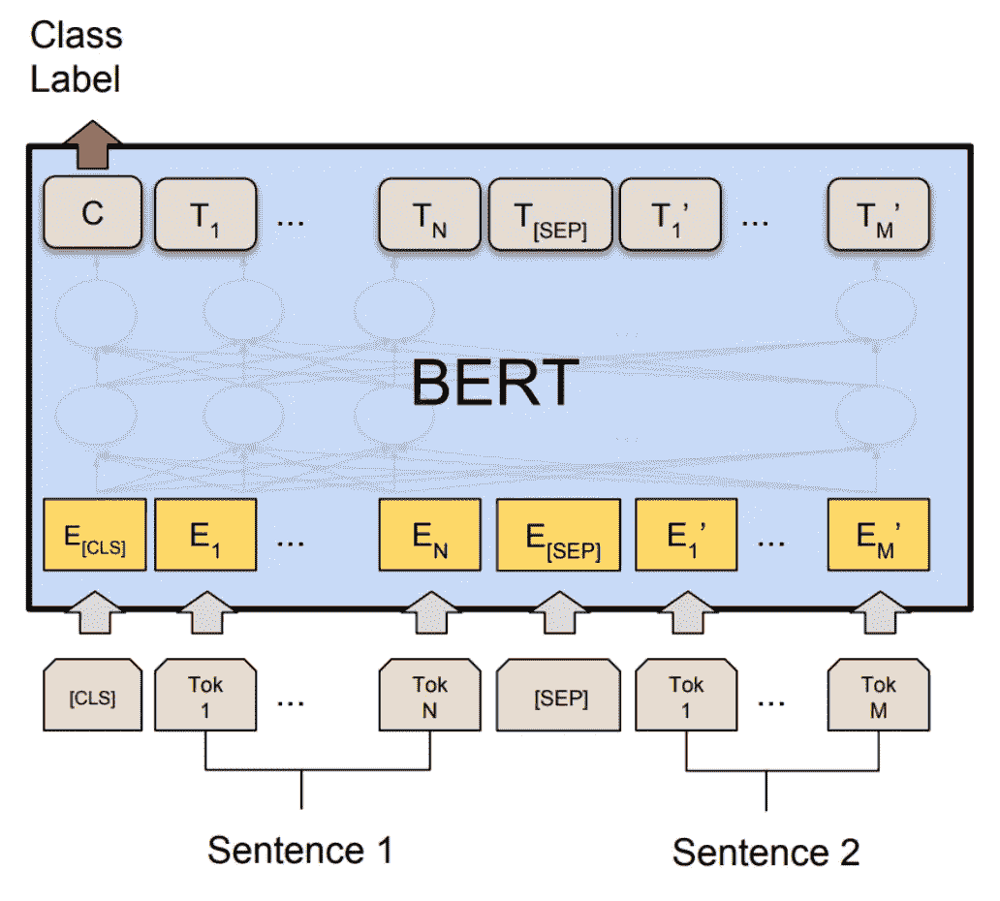
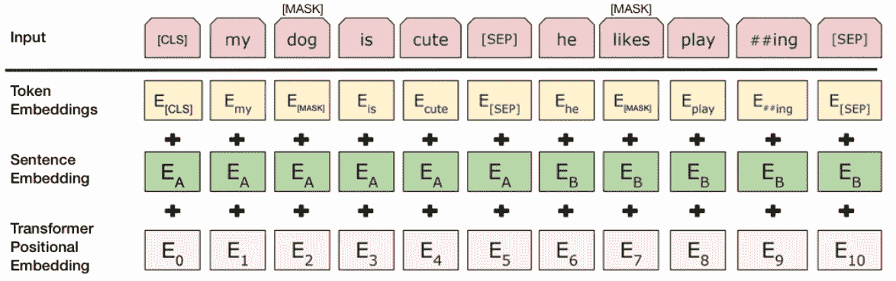

# 如何在文本分类任务上微调 BERT？

> 原文：<https://medium.com/analytics-vidhya/how-to-fine-tune-bert-on-text-classification-task-723f82786f61?source=collection_archive---------5----------------------->



来源:-[https://pytorch.org/tutorials/_images/bert.png](https://pytorch.org/tutorials/_images/bert.png)

BERT(来自变形金刚的双向编码器表示)是 Google 在 2016 年的论文*[***中发布的基于变形金刚的架构【注意就是你需要的全部***](https://papers.nips.cc/paper/7181-attention-is-all-you-need.pdf)*。BERT 模型于 2019 年在论文中发表——“[***BERT:用于语言理解的深度双向变压器的预训练***](https://arxiv.org/pdf/1810.04805.pdf) ***”。*** 发布时，在 [***胶水基准***](https://gluebenchmark.com/) 上展示了最先进的成果。**

# **介绍**

**首先，我将简单介绍一下 Bert 体系结构，然后将继续介绍如何使用 is 执行文本分类任务的代码。**

**BERT 架构是在论文 [***BERT:用于语言理解的深度双向变换器的预训练***](https://arxiv.org/pdf/1810.04805.pdf) 中描述的多层双向变换器编码器。**

**本文提出了两种不同的体系结构。 **BERT_base** 和 **BERT_large。****BERT base**架构有 **L=12，H=768，A=12** ，总共 110M 左右的参数。此处 **L** 指变压器块数， **H** 指隐藏尺寸， **A** 指自关注头数。对于**伯特大**， **L=24，H=1024，A=16。****

****

**来源:-[https://www . kdnugges . com/2018/12/Bert-sota-NLP-model-explained . html](https://www.kdnuggets.com/2018/12/bert-sota-nlp-model-explained.html)**

**上图给出了 BERT 的输入格式。我不会在这方面讲太多细节。你可以参考上面的链接获得更详细的解释。**

# **源代码**

**我将遵循的代码可以从下面的 **HuggingFace 的** GitHub repo 中克隆出来**

> **[https://github.com/huggingface/transformers/](https://github.com/huggingface/transformers/)**

# **要使用的脚本**

**我们将主要修改和使用两个脚本来完成我们的文本分类任务。一个是***【glue.py】***另一个是 ***run_glue.py.*** 文件 glue . py 路径是“*transformers/data/processors/”*文件 run_glue.py 可以在位置“*examples/text-class ification/”找到。***

# **数据格式**

**数据的格式是这样的。第一列应该是 id 列。第二列应该是包含标签的列。第三列应该包含需要分类的文本。**

```
**data = pd.DataFrame()
data['id'] = [i for i in range(num_text)]
data['label'] = labels
data['text'] = text**
```

**这里 *num_text* 是要使用的数据点数， *text* 是要分类的实际查询， *labels* 是与其对应的文本相关联的标签。你应该把你的数据保存为没有标题的 tsv 格式。**

```
**#if data is your training file 
data.to_csv('train.tsv', sep='\t', index=False, header=None) #if data is your validation file
data.to_csv('dev.tsv', sep='\t', index=False, header=None) #if data is your test file
data.to_csv('test.tsv', sep='\t', index=False, header=None)**
```

**在您的测试文件中，如果您愿意，您可以忽略标签列。我用它是因为它可以用来在预测后检查模型的性能。此外，可以根据个人的方便保留文件的名称。但是相应地，需要通过改变文件名来改变 *glue.py* 文件。**

# **脚本中要做的更改**

## **glue.py**

> **路径—变压器/数据/处理器/胶水. py**

**出于分类目的，可以选择这些任务中的一个——可乐、SST-2、MRPC、STS-B、QQP、MNLI、QNLI、RTE、WNLI。**

**我将继续 SST-2 任务；其他任务也可以进行相同的更改。将要使用的类是-**

**以下是需要进行的更改-**

1.  **将函数 ***get_labels()*** 的返回列表从['0 '，' 1']更改为数据中的标签列表。**
2.  **在***_ create _ examples()***函数中，修改-**

```
**text_a = line[text_index]⬇ ⬇ ⬇(to)text_a = line[-1]**
```

**3.在定义为 ***glue_task_num_labels 的字典中，*** 将 key***【SST-2】***的值更改为数据中存在的 num_labels。**

## **运行 _glue.py**

> **path-examples/text-classification/run _ glue . py**

**更改该文件是可选的。如果您想将概率与预测一起保存，只需在该文件中进行更改。**

**可以通过保存预测数组来保存预测，该数组显示在文本文件中的上述代码中。**

# **如何运行脚本**

**要运行该脚本，可以运行以下命令-**

```
**python ./examples/text-classification/run_glue.py \
    --model_name_or_path bert-base-uncased \
    --task_name $TASK_NAME \
    --do_train \
    --do_eval \
    --data_dir $GLUE_DIR/$TASK_NAME \
    --max_seq_length 128 \
    --per_device_eval_batch_size=8   \
    --per_device_train_batch_size=8   \
    --learning_rate 2e-5 \
    --num_train_epochs 3.0 \
    --output_dir /tmp/$TASK_NAME/**
```

**我会一个一个解释所有的参数-**

1.  **-模型名称或路径-此参数指定要使用的 BERT 模型类型。**
2.  **—任务名称—指定我们要使用的粘合任务。可以使用可乐、SST-2、MRPC、STS-B、QQP、MNLI、QNLI、RTE、WNLI 中的一种。**
3.  **do _ train 指定是否要微调模型。如果要使用预训练模型，只需移除此参数。**
4.  **— do_eval —如果要执行验证**
5.  **— do_predict —如果要对测试数据生成预测。**
6.  **—数据目录—需要保存训练、验证和测试数据的目录路径。**
7.  **output _ dir 要保存预测和其他生成文件的目录路径。**

**我认为所有其他参数从它们的名字就很明显。另一个可以使用的设置是-**

*   **— save_total_limit =指定要保存多少个检查点目录。**

**所有这些都足以在文本分类任务上微调 BERT。**

**这次都是我这边的。我希望这篇博文能帮助你完成指定的任务。**