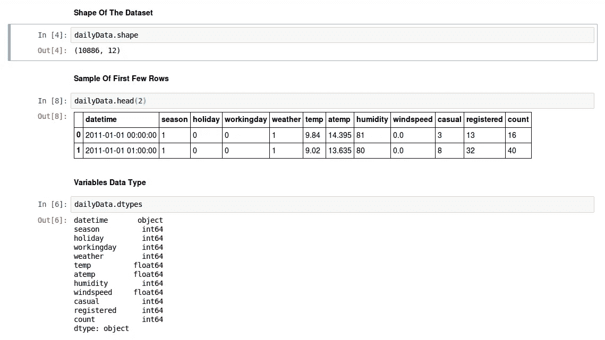
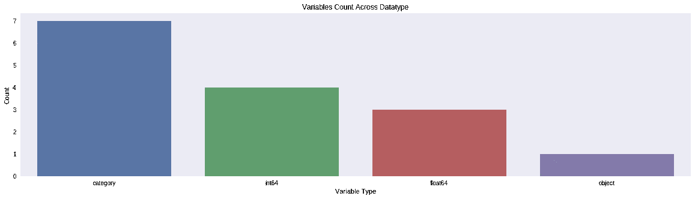
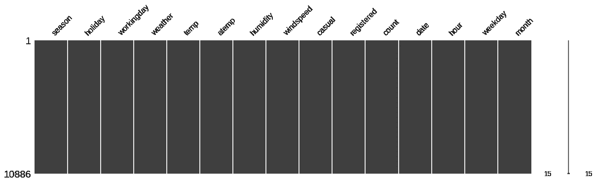
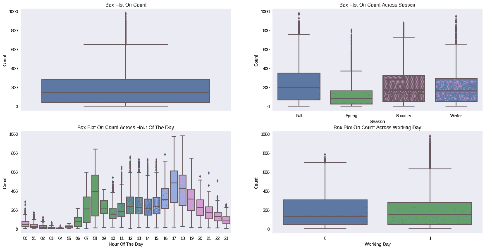
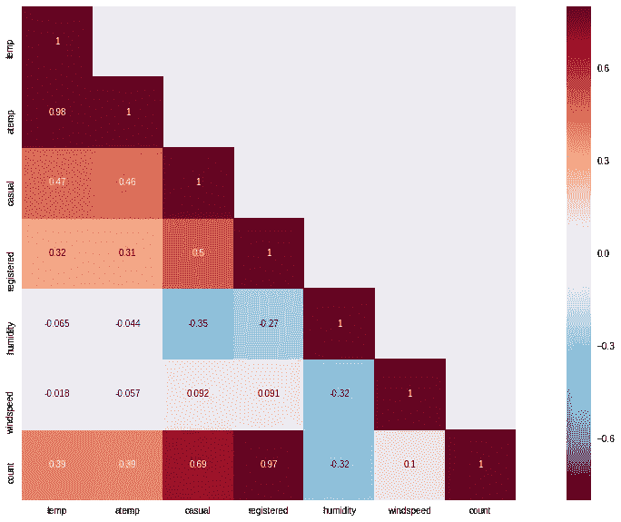
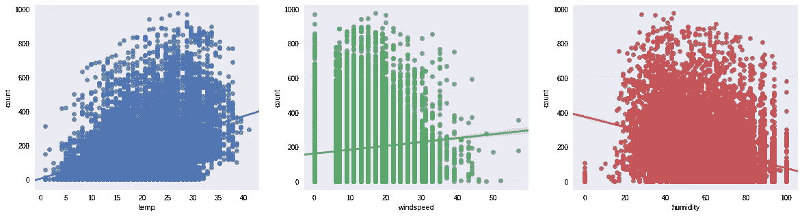
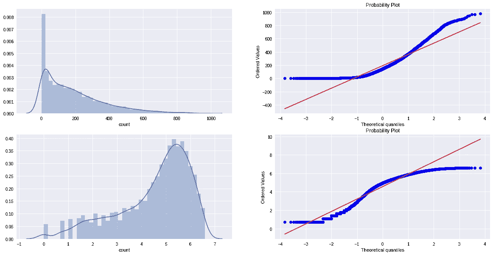
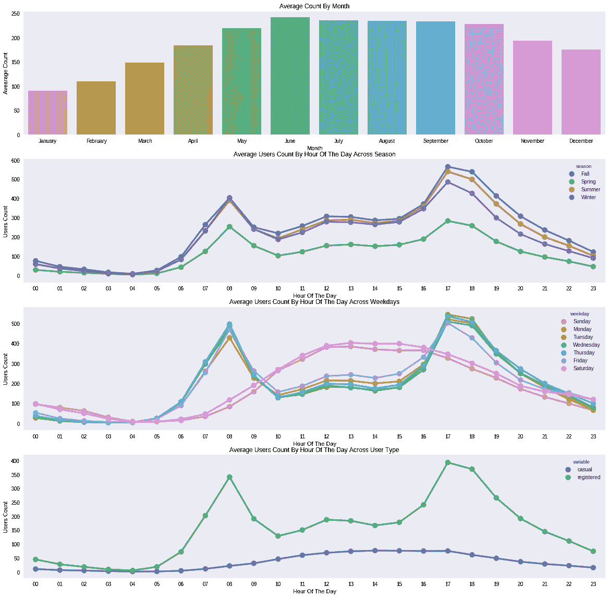

# 如何在 Kaggle 的自行车共享需求竞赛中名列前 10%？(第一部分)

> 原文：<https://medium.com/analytics-vidhya/how-to-finish-top-10-percentile-in-bike-sharing-demand-competition-in-kaggle-part-1-c816ea9c51e1?source=collection_archive---------0----------------------->

E 非常有抱负的数据科学专业人士一直想参加 *Kaggle* 竞赛。像他们中的大多数人一样，我通过著名的 [*泰坦尼克号-机器从灾难中学习*](https://www.kaggle.com/c/titanic) 比赛开始了我卑微的 *Kaggle* 旅程。Kaggle 有一些从简单到复杂的数据集，用户可以探索这些数据集，并获得数据科学方面的实际专业知识。

[*自行车共享需求*](https://www.kaggle.com/c/bike-sharing-demand) 就是这样一个对数据科学世界的初学者特别有帮助的比赛。这是一个相当简单的数据集，适合应用一些具体的统计技术，如*回归*，也适合一些高级的`ensemble`模型，如`Random Forest`和`Gradient Boosting`算法。

`bike-sharing` 需求分析分为两部分。博客的第一部分帮助你从数据集开始，发现因变量和解释变量之间一些有趣的模式。博客的第二部分介绍了模型构建，我们从基本的技术开始，如`Regression` ，通过`Regularization` ，最终构建复杂的`ensemble` 模型。在分析结束时，我们将在公共排行榜上达到前 10 个百分点。

就这个博客而言，所有的`exploratory` 分析和`model` 构建都是使用 python 完成的。Python 有一些优秀的数据科学库，如`pandas`、`numpy`、`seaborn` 和`sklearn` ，我们将在这篇博客中使用它们。

> 完整的 Ipython 笔记本参考[***Github***](https://github.com/viveksrinivasanss/blogs/tree/master/bike_sharing_demand)链接。

## 比赛详情

系统是一种租赁自行车的方式，通过遍布城市的信息亭网络，获得会员资格、租赁和归还自行车的过程是自动化的。使用这些系统，人们可以从一个地方租一辆自行车，并根据需要将其归还到不同的地方。目前，全世界有超过 500 个自行车共享项目。

这些系统生成的数据对研究人员很有吸引力，因为旅行的持续时间、出发地点、到达地点和经过的时间都被明确记录下来。`Bike-sharing`因此，系统的功能相当于一个传感器网络，可用于研究城市中的移动性。在这场比赛中，参赛者被要求将历史使用模式与天气数据相结合，以预测华盛顿特区首都自行车共享计划的自行车租赁需求

有关数据集和比赛的更多信息，请访问以下链接 [*自行车共享需求*](https://www.kaggle.com/c/bike-sharing-demand)

## 数据汇总

首先，让我们对数据做三件简单的事情。

*   数据集大小。
*   通过打印几行数据来浏览数据。
*   什么类型的变量对我们的数据有贡献。

**数据汇总**

## 特征工程

从上面的结果可以看出，`season`、`holiday`、`workingday` 和`weather` 列应该是*分类数据类型*。但是这些列的当前数据类型是 *int* 。让我们以下列方式转换数据集，以便我们可以开始使用 EDA。

*   从`datetime` 列创建新列`date`、`hour`、`weekday`、`month` 。
*   将`season`、`holiday`、`workingday` 和`weather` 的数据类型强制转换为*分类数据类型*。
*   删除`datetime` 列，因为我们已经从中提取了有用的特性。

让我们从一个非常简单的变量数据类型计数的可视化开始。

## 缺失值分析

一旦我们掌握了数据和属性，我们通常做的下一步就是找出我们的数据中是否有任何缺失的值。幸运的是，我们在数据中没有任何缺失值。我通常更喜欢可视化数据中缺失值的一种方式是通过 python 中的`missingno`库。

这是一个非常方便的库，可以快速可视化属性中缺失的值。正如我前面提到的，这次我们很幸运，因为数据中没有丢失值。但是我们在`windspeed` 列中有很多 0，我们将在稍后构建机器学习模型时处理这些 0。

## 异常值分析

乍一看，`count` 变量包含许多异常数据点，使分布向右倾斜(因为在`Outer Quartile Limit`之外有更多的数据点)。此外，下面的推论也可以从下面给出的简单箱线图中得出。

*   春季的数量相对较少。`boxplot`中的中间值
    的下降为其提供了证据。
*   带变量`Hour Of The Day` 的盒子剧情挺有意思的。在`7AM — 8AM`和`5PM — 6PM`处，中值相对较高。可以归功于当时正规的学校和办公用户。
*   大部分的`outlier`分主要是`Working Day`比`Non Working Day`贡献的。这在图 4 中非常明显。

## 相关分析

要了解*因变量*如何受到*数字特征*的影响，一个常见的方法是找到它们之间的*相关矩阵*。我们在 count 和[ `temp`、`atemp`、`humidity`、`windspeed` ]之间构造一个`correlation plot`。

*   `temp` 和`humidity` 特征分别与`count` 正相关和负相关。虽然它们之间的相关性不是很突出，但是计数变量仍然对`temp`和`humidity`有一点依赖。
*   `windspeed` 不会是一个真正有用的数字特征，这一点可以从带有`count`的`correlation` 值中看出。
*   由于`atemp` 和`temp`具有很强的相关性，因此不考虑`atemp` 变量。在建模过程中，必须删除任何一个变量，因为它们会在数据中显示`multicollinearity` 。
*   `casual` 和`registered` 属性也没有考虑在内，因为它们本质上是`leakage variables`，需要在建模过程中删除。

python 中的`seaborn` 库中的`regression`图是描述两个特征之间关系的一种有用方式。这里我们考虑`count` vs `temp`、`humidity` 和`windspeed`。虽然我们有三个与因变量相关的数字特征，但它不会对我们的预测有太大帮助，从下面显示的回归图中可以清楚地看到这一点。因此，下一步让我们看看分类变量如何帮助我们建立模型。

## 独立变量分布的可视化

从下图中可以看出`count` 变量向右倾斜。最好有`normal` 分布，因为大多数机器学习技术要求因变量为`normal`。一个可能的解决方案是在移除异常数据点后，对`count` 变量采用`log transformation`。转换后，数据看起来好多了，但仍不理想地遵循`normal` 分布。

## 可视化计数与(月、季节、小时、工作日、用户类型)

从上面的图表我们可以推断:

*   很明显，人们倾向于在夏季租自行车，因为在那个 T21 季节骑自行车非常方便。因此，六月、七月和八月对自行车的需求相对较高。
*   平日更多的人倾向于在*`7AM-8AM``5PM-6PM`附近租自行车。正如我们之前提到的，这可以归因于普通的学校和办公室通勤者。*
*   *在更多人倾向于在`10AM and 4PM`之间租赁自行车的周六和周日，没有观察到上述模式。*
*   *`7AM-8AM`和`5PM-6PM`左右的峰值用户数纯粹是注册用户贡献的。*

*所以我们现在已经将数据可视化到了更高的程度。让我们继续构建一些模型，看看我们如何能够进入排行榜的前 10%。*

*[*如何在 Kaggle 的自行车共享需求大赛中完成前 10 个百分点？*(第二部)](/@viveksrinivasan/how-to-finish-top-10-percentile-in-bike-sharing-demand-competition-in-kaggle-part-2-29e854aaab7d)*