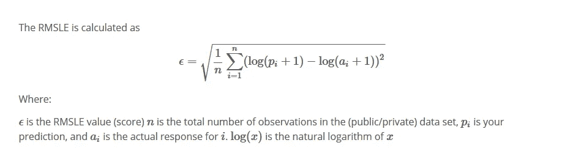

# 如何在 Kaggle 的自行车共享需求竞赛中名列前 10%？(第二部分)

> 原文：<https://medium.com/analytics-vidhya/how-to-finish-top-10-percentile-in-bike-sharing-demand-competition-in-kaggle-part-2-29e854aaab7d?source=collection_archive---------1----------------------->


这篇博文是我们之前的 [*部分*](/@viveksrinivasan/how-to-finish-top-10-percentile-in-bike-sharing-demand-competition-in-kaggle-part-1-c816ea9c51e1) 的续篇，在这里我们将数据可视化到了一个更高的程度，并掌握了它。在这篇文章中，我们将看到我们如何利用机器学习算法，如`Linear Regression`、`Random Forest`和`Gradient Boost` ，进入 Kaggle 排行榜的前 10%。模型构建部分分为以下主题

*   `windspeed`中的缺失值分析。
*   RMSLE 计分员。
*   线性回归。
*   正规化。
*   集合模型。
*   进一步的改进。

> 只有关键的代码片段被显示为这个博客的一部分，完整的分析请参考 Ipython 笔记本中的 [*Github*](https://github.com/viveksrinivasanss/blogs/tree/master/bike_sharing_demand) 链接。

## 风速中的缺失值分析

正如我在上一部分提到的，幸运的是我们的数据集中没有缺失值。但是`windspeed` 属性有很多`0`条目有点可疑。下面是描述数据中的`windspeed` 值的`frequency`的简单可视化。


一个[*的讨论*](https://www.kaggle.com/c/bike-sharing-demand/discussion/10431) 在中 kaggle 给出了很多关于这个特定话题的信息。在高层次上，我们可以对`windspeed` 中的`0`条目做出两到三个简单的推断，如下所示:

*   这几个点其实都可以`0`。
*   它太低而无法测量，例如从 0 到 5 变化。
*   全零或部分全零只不过是`NAs`。

对于本文，我们将把`0`条目视为缺失值，并使用一个简单的`Random Forest Classifier` 模型来填充它们。下面是相同的代码块。

```
from sklearn.ensemble import RandomForestClassifierwCol= ["season","weather","humidity","month","temp","year","atemp"]
dataWind0 = data[data["windspeed"]==0]
dataWindNot0 = data[data["windspeed"]!=0]
dataWindNot0["windspeed"] = dataWindNot0["windspeed"].astype("str")rfModel_wind = RandomForestClassifier()
rfModel_wind.fit(dataWindNot0[wCol], dataWindNot0["windspeed"])
wind0Values = rfModel_wind.predict(X= dataWind0[wCol])dataWind0["windspeed"] = wind0Values
data = dataWindNot0.append(dataWind0)
data["windspeed"] = data["windspeed"].astype("float")
data.reset_index(inplace=True)
data.drop('index',inplace=True,axis=1)
```

让我们看看缺失值被估算后`windspeed` 值的分布情况。


## RMSLE 计分器

评估`regression`模型的一种常见方法是通过计算`MSE or RMSE`。在这场特殊的比赛中，评估我们模型的标准是`Root Mean Square Logarithmic Error (RMSLE)`。`RMSLE` 在您想要惩罚一个低于预测的估计值大于一个高于预测的估计值时特别有用。

我们预测销售和库存需求的大多数`Kaggle` 竞赛特别使用 *RMSLE* 作为他们的评估指标。例如像[*Grupo-bimbo-inventory-demand*](https://www.kaggle.com/c/grupo-bimbo-inventory-demand)和[*sberbank-Russian-housing-market*](https://www.kaggle.com/c/sberbank-russian-housing-market)*这样的竞争使用`RMSLE` 作为度量。*

**

*遗憾的是，`sklearn` 指标没有直接实现计算`RMSLE`。因此，让我们构建一个自定义函数来执行`RMSLE`计算。*

```
*def rmsle(y, y_):
    log1 = np.nan_to_num(np.array([np.log(v + 1) for v in y]))
    log2 = np.nan_to_num(np.array([np.log(v + 1) for v in y_]))
    calc = (log1 - log2) ** 2
    return np.sqrt(np.mean(calc))*
```

*我们已经通过填充缺失值准备了数据，并构建了我们的自定义`RMSLE` 计分器。所以我们现在可以开始我们的模型制作实验了。*

## *线性回归*

*作为第一步，让我们从一个简单的统计技术开始，如`linear regression`。从一个简单的模型开始总是比一开始就尝试复杂的算法要好。因为有时特性对`covariates`具有平滑的、近乎线性的依赖性。那么`linear regression` 将比`random forest`算法更好地模拟相关性，该算法将基本上用难看的不规则阶跃函数来近似线性曲线。一个[*stack exchange*](https://stats.stackexchange.com/questions/174806/linear-regression-performing-better-than-random-forest-in-caret)讨论给出了关于它的大量信息。*

*下面是适合我们的`bike-sharing`数据集上的`linear regression`的简单代码片段。代码是不言自明的，本文的重点是介绍概念而不是编码。如果你在理解它的任何部分时发现任何挑战，请随时在评论中留言。*

```
*from sklearn.linear_model import LinearRegression# Initialize logistic regression model
lModel = LinearRegression()# Train the model
lModel.fit(X = X_train,y = np.log1p(y_train))# Make predictions
preds = lModel.predict(X= X_validate)
print ("RMSLE Value: ",rmsle(Y_validate,np.exp(preds)))*
```

*在提交我们的测试结果之前，我们将可视化训练和测试结果的分布。`Kaggle` 对每天的提交数量有限制。(在我们的例子中，是每天 5 次提交)。因此，可视化分布提供了一个很好的线索，表明我们根据训练集预测的测试有多接近。从图中可以看出，训练集和测试集的分布变化很大。*

**

*测试集上的`RMSLE` 值在 1.05 左右，与`*Kaggle*` 排行榜上的最好成绩(0.33)肯定不相上下。我们可以通过多种方式大幅提高这一分数。*

*   *特征工程*
*   *正规化(L1 和 L2)*
*   *集合模型*

*我们已经从`datetime` 属性中创建了一些特性，如`weekday`、`month`、`hour` 。有很多方法可以实现`feature engineering`步骤。作为这个博客的一部分，我没有考虑到这一点，我将把它留给用户去想象。*

## *正规化*

*`Regularization` 在以下任何一种情况下都极其有用。我们不会面临下面提到的所有情况，但是`overfitting` 和`multicollinearity` 可能会给我们带来一些问题。*

*   *过度拟合。*
*   *大量的变量。*
*   *观察数与变量数之比低。*
*   *多重共线性。*

*`Overfitting` 指通过学习训练数据中的细节和噪声，在训练集上表现良好，但在新数据上概括不佳的模型。以我们的例子为例，训练数据上的`RMSLE` 值在`0.98`附近，与测试集结果没有大的差异。到目前为止，我们的模型中没有任何*过度拟合*的问题，但是当我们拟合模型时，有时这将是一场噩梦。*

*拥有大量的变量可能会再次导致过度拟合。这是因为当我们有更多的变量时，模型变得更加复杂，有时会降低其预测和推广能力。`L1 regularization` *【套索回归】*在这些情况下，通过将系数减少到零，从而产生更简单的模型，就很方便了。*

*`L2 regularization` `*(*Ridge Regression*)*`对于第三种情况非常有帮助，在这种情况下，我们拥有的属性数量多于观察数量。但是我们现在做得很好，因为我们只有 12 个属性，而数据集有 10886 条记录。当预测变量之间存在高`collinearity` 时，`Ridge Regression`也非常有用。这可能发生在我们的数据集中，因为我们有高度相关的变量，如气温和月-季。*

*因此，目前看来，上述问题对我们没有太大威胁。尽管如此，没有什么能阻止我们建立简单的正则化模型，看看我们能在多大程度上提高我们的分数。*

```
*from sklearn.linear_model import Lasso
from sklearn.model_selection import GridSearchCV
from sklearn import metrics
lasso_m_ = Lasso()
alpha  = [0.001,0.005,0.01,0.3,0.1,0.3,0.5,0.7,1]
lasso_params_ = { 'max_iter':[500],'alpha':alpha}
rmsle_scorer = metrics.make_scorer(rmsle, greater_is_better=False)
grid_lasso_m = GridSearchCV( lasso_m_,
                          lasso_params_,
                          scoring = rmsle_scorer,
                          cv=5)
grid_lasso_m.fit(X = X_train,y = np.log1p(y_train))
preds = grid_lasso_m.predict(X= X_validate)
print (grid_lasso_m.best_params_)
print ("RMSLE Value: ",rmsle(Y_validate,np.exp(preds)))*
```

*通过网格搜索获得`regularization` 参数`(alpha-0.005)`的最佳值。下图显示了不同 alpha 参数的`RMSLE` 值。`RMSLE` 测试集上的值约为 1.04，与我们之前的相比没有提高。所以正规化并没有给我们的分数带来任何提升。但是，让我们不要失去希望，因为当一切都不顺利时，集合模型总是会为我们带来一些意想不到的东西。*

**

*套索正则化参数网格搜索*

## *集合模型*

*`Ensemble models`只不过是一种将不同的个体`weak learners`(模型)组合在一起以提高模型的稳定性和预测能力的艺术。`Ensemble Models` 提高了模型的性能*

*   *平均偏差。*
*   *减少差异。*
*   *避免*过拟合*。*

*如果你仍然想知道什么是集合模型，那么这个 [*系列文章*](https://www.analyticsvidhya.com/blog/tag/ensemble-model/) 可以让你开始了解它。关于集合模型的介绍已经足够了，下面是我们如何用默认参数在数据集上拟合朴素`Random Forest` 模型的一个片段。*

```
*from sklearn.ensemble import RandomForestRegressor
rfModel = RandomForestRegressor(n_estimators=100)
rfModel.fit(X = X_train,y = np.log1p(y_train))
preds = rfModel.predict(X= X_validate)
print ("RMSLE Value: ",rmsle(Y_validate,np.exp(preds)))*
```

**RMSLE* 测试集上的值大约是 0.439，现在我们有了真正值得欢呼的东西。与我们之前的分数相比，有了显著的提高。`Random forest`还赋予了特征作为模型拟合副产品的重要性。这对于理解特征如何在模型构建中起作用，以及在`feature selection`我们有很多特征要处理，特别有用。从下图可以很明显的看出，`hour` 属性在模型预测中起着重要的作用，其次是`temp`、`weekday`、`year`等。*

**

*一般认为基于`Gradient Boosting`*`XGBoost` 的 *boosting* 算法比基于`bagging`的算法性能更好。所以是时候测试助推算法如何帮助我们提高考试分数了。**

```
**from sklearn.ensemble import GradientBoostingRegressor
gbm = GradientBoostingRegressor(n_estimators=4000,alpha=0.01)
gbm.fit(X = X_train,y = np.log1p(y_train))
preds = gbm.predict(X= X_validate)
print ("RMSLE Value: ",rmsle(Y_validate,np.exp(preds)))**
```

**因为我们相信它确实提高了我们的分数，并且`Gradient Boosting`的`RMSLE` 值在`0.418`附近。虽然这看起来比我们的`Random Forest`结果略有改善，但它将把你在`Kaggle` 排行榜中的位置从前 15%提高到前 10 %,这是一个显著的进步。**

**通过比较训练和测试结果，我们将再次可视化我们预测的测试结果有多接近。当我们将下面的图表与我们为线性回归创建的图表进行比较时。我们可以理解`gradient boost` 是如何捕捉到测试集的分布的。**

****

**现在，我们将通过向 kaggle 提交最佳拟合模型结果来完成循环。`Kaggle` 要求输出文件以特定的格式提交，其中第一个字段对应`datetime` ，第二个字段应该是我们预测的`count`。**

```
**submission = pd.DataFrame({
        "datetime": datetimecol,
        "count": [max(0, x) for x in np.exp(predsTest)]
    })
submission.to_csv('bike_predictions_gbm_results.csv', index=False)**
```

## **进一步的改进**

**在`kaggle` 排行榜中，最好的分数在`0.33`左右，这意味着模型构建活动还有很大的改进空间。下面是一些我们可以提高分数的方法。**

*   **通过网格搜索调整参数。**
*   **分别预测临时用户数和注册用户数。**
*   **时间序列建模。**

**改善集合模型结果的一种常见方法是通过调整参数。`Sklearn` 提供了一个叫做`GridSearchCV` 的方法，帮助我们进行彻底的网格搜索。根据系统的配置，以下代码可能会运行几个小时。**

```
**from sklearn.ensemble import GradientBoostingRegressor
from sklearn.model_selection import GridSearchCVgbm = GradientBoostingRegressor()
param_grid = { 
    'n_estimators': [1000,2000,3000,4000],
    'max_features': ["auto","sqrt","log2",0.6,0.8],
    'min_samples_leaf':[30,40,50,60,70],
    'min_samples_split':[150,200,250,300],
    'max_depth' : [10,15,20,25],
    'subsample': [0.4,0.6,0.8],
    'learning_rate':[0.1,0.01,0.001]
}
CV_gbm=GridSearchCV(estimator=gbm,param_grid=param_grid,cv=5)
CV_gbm.fit(X = X_train,y = np.log1p(y_train))
print (CV_gbm.best_params_)preds = CV_gbm.predict(X= X_validate)
print ("RMSLE Value: ",rmsle(Y_validate,np.exp(preds)))**
```

**Sklearn 提供了一个叫做`RandomizedSearchCV`的`GridSearchCV` 的替代品。它需要一个名为`n_iter` 的额外参数，这个参数可以灵活地选择要试验多少种参数组合。`n_iter` 的数量越大，解决方案的质量越好(质量和运行时间之间的权衡)。**

**当我们在博客的第一部分进行`count` 和`hour` 之间的`bivariate` 分析时。很明显，`casual` 和`registered` 用户的使用模式在`hour`中有很大不同。从我们的特征重要性结果(`Random Forest`)可知`hour` 是建模中最重要的特征。这两个结果说明，我们可以建立两个单独的模型，将`casual` 和`registered` 用户视为因变量，而不是将`count` 建模为因变量。一篇 [*文章*](https://www.analyticsvidhya.com/blog/2015/06/solution-kaggle-competition-bike-sharing-demand/) 出自《分析篇》维迪亚解释了我们如何在这些方面处理问题。**

**处理这个问题的另一个完全正交的方法是对数据进行`time series`分析。从下面的图表可以看出，一天中的每个小时都有一个循环趋势，一年中的每个月都有季节性趋势。**

****

**通过`time series`模型解决问题可能会也可能不会提高我们的分数。但是在这些行上做一些努力肯定是有用的，因为对模型有贡献的大多数顶级属性都是从`datetime` 属性派生的。但是运行时间序列模型的唯一缺点是我们没有足够的数据，因为训练集只包含来自`2011–2012`的两年数据。**

## **结束注释**

**因此，这篇文章只是一个开始 *kaggle* 竞赛的简单介绍，同时也给我们如何处理一个新数据集提供了一个开端。要了解更多关于`kaggle` 竞赛的信息，了解解决问题的不同方法，请查看`kaggle` *中的 [*内核*](https://www.kaggle.com/kernels) 部分。***

> *如果你有兴趣通过 R 学习 R 编程和机器学习，敬请查阅 R *中的 [*数据科学系列。*](/analytics-vidhya/many-ways-of-reading-data-into-r-1-fb88d4eb80a9)**