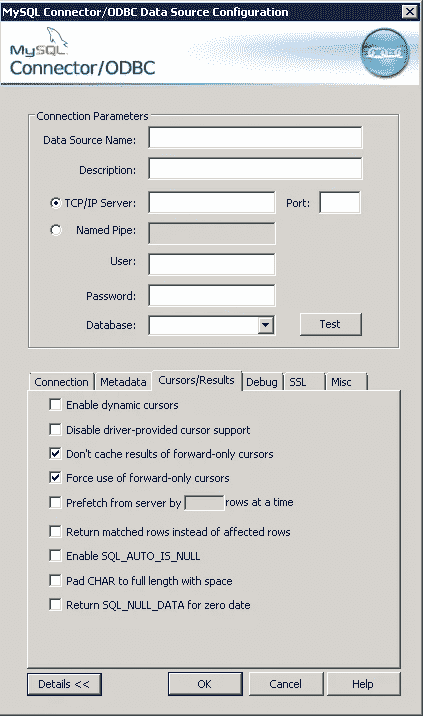

# 如何修复 AWS Aurora，MySQL ODBC 连接器内存不足

> 原文：<https://medium.com/analytics-vidhya/how-to-fix-aws-aurora-mysql-odbc-connector-ran-out-of-memory-236409057227?source=collection_archive---------7----------------------->

[ODBC 源[2]]错误:出现开放式数据库连接(ODBC)错误。状态:“HY000”。原生错误代码:2008。[MySQL][ODBC 5.3(w)驱动程序][mysqld-5.6.10-log]MySQL 客户端内存不足

当试图通过 ODBC MySQL 连接器从 MySQL、MariaDB 或 AWS Aurora 检索数据时，您可能会遇到上述错误。

