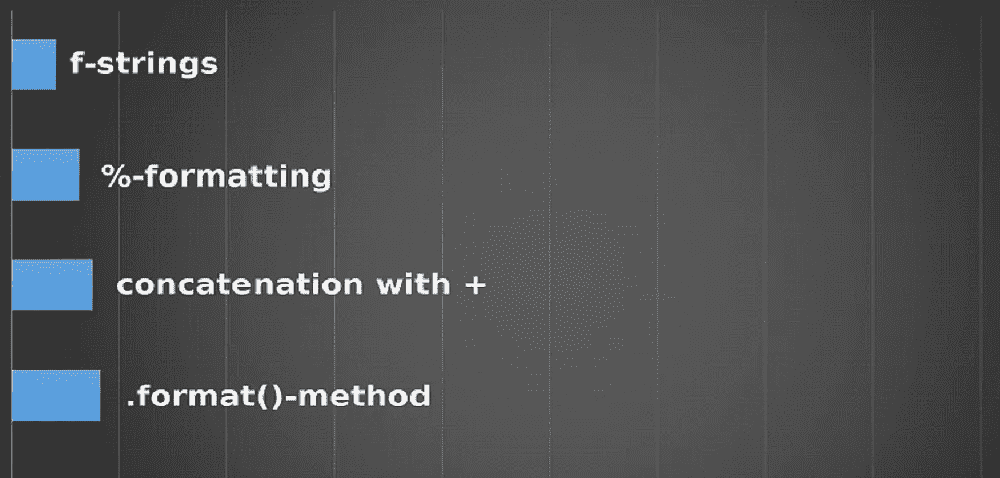

# Python 中如何使用 print()格式化字符串？

> 原文：<https://medium.com/analytics-vidhya/how-to-format-strings-using-print-in-python-c84773d270fb?source=collection_archive---------26----------------------->



在编程中实现一个概念时，知道如何显示输出是非常重要的。当你知道如何访问程序中的数据时，大多数问题都可以解决，这就是为什么 print()函数在调试中也有很大的作用。Python 3 中的 *print()* 函数是 Python 2 中 *print* 语句的升级版。

对于初学者和高级程序员来说，字符串格式是 Python 中一个非常有用的概念。

当研究字符串格式时，首先想到的概念是字符串连接。但是字符串连接并不是 Python 中使用的唯一方式。如你所知，Python 总是有更简单的解决方案。

*什么是字符串串联？*

字符串连接是将字符串首尾相连。字符串连接的简单性取决于被连接的字符串。字符串不仅仅指字符串，还包括列表、字典等数据类型集合中的数据。

考虑一个简单的字符串连接:

```
my_string1 = "Hello"
my_string2 = "World"
result = my_string1 + my_string2
print(result)
```

输出将是:

```
HelloWorld
```

但是对于 Python 中变量和其他数据结构，字符串连接变得更加复杂。

考虑下面的陈述:

```
employee = {'name': 'David', 'age': '45', 'salary': '5000.00'}
print("Employee name is "+ employee['name'] + " of age "+ str(employee['age']) + " and salary is ") + employee['salary'])
```

*输出:*

```
Employee name is David of age 45 and salary is 5000.00
```

上述输出格式基于字符串连接。但是 Python 还提供了另外 3 种字符串格式化技术，它们在不同的情况下更有用，可以使格式化变得更容易。在这个博客中，我试图把我发现更有用的语法和技术包括进来。

***使用 print()格式化字符串:***

如何用 Python 打印变量？

答案很简单。只需在 print 语句中包含变量名，用逗号分隔。

考虑一个例子:

```
# Variables of different datatypes
name = "David"
age = 45
salary = 5000.00
print(name,age,salary)
```

输出:

```
David 45 5000.0
```

但是，在显示输出或创建日志报告时，我们可能需要以各种格式格式化这个输出。

使用 print()函数格式化字符串有 3 种方法。

1.  使用“%”
2.  使用。格式
3.  使用 f 弦

每种形式都有自己的用途。

***使用“%”或 C 样式的字符串格式化:***

在这种风格中，我们使用“%”操作符来格式化字符串。对于上面的例子，我们可以将字符串格式化如下，其中

*   字符串的%s
*   %d 表示整数
*   %f 表示浮点

```
# %s is for Strings, %d for integer , %f for float
print("My name is %s and I am %d years old"%(name, age))
# %0.2f is to display 2 decimal points
print("My salary is %0.2f"%(salary))
# Another example of float
print("The value of pi is %f \n Short pi is %0.2f"%(math.pi, math.pi))
```

*输出:*

```
My name is David and I am 45 years old
My salary is 5000.00
The value of pi is 3.141593 
Short pi is 3.14
```

***利用。*格式:**

在这种使用方法中。格式，{}用作变量的占位符。{}将按照指定的顺序被变量值替换。对于上面的例子，print 语句使用的格式如下:

```
# Using .format
print("My name is {} and I am {} years old. My income is {} per \
month".format(name, age, salary))
```

注意:这里用' \ '表示 print 语句扩展到下一行。

*输出*:

```
My name is David and I am 45 years old. My income is 5000.0 per month
```

使用占位符的另一个优点是，我们可以显式地对占位符进行编号，比如{0}、{1}等。考虑上面的例子，这里我明确给出了姓名{0}和年龄{1}。我们可以在语句中的任意位置使用{0}，{1}，但我们只需要在 format 函数中指定一次。如果句子没有任何意义，请忽略。

```
# Explicitly number {}
print("My name is {0} and I am {1} years old. People call me {0}.".format(name, age))
```

输出:

```
My name is David and I am 45 years old. People call me David.
```

另一个使用字典的例子:

```
# Dictionary, using format
employee = {'name': 'David', 'age': '45', 'salary': '5000.00'}
print("Employee name is {name} of age {age} and salary is {salary}".format(**employee))
```

在这里，键名被替换，所以它们的使用顺序并不重要

```
# Order of keys can be different
print("{name} get {salary} salary and he is {age} years old".format(**employee))
```

*输出:*

```
Employee name is David of age 45 and salary is 5000.00
David get 5000.00 salary and he is 45 years old
```

***用 f '弦:***

这是最值得推荐的格式化方法之一。它使用起来非常简单，而且有更多功能，比如在{}内执行计算。这种 f 字符串格式也可以赋给变量

```
# Using f string
message = f'Hey I am {name} and I am {age} years old '
print(message)
# Or within print()
print(f'Hey I am {name} and I am {age} years old ')
```

两者输出相同

```
Hey, I am David and I am 45 years old 
Hey, I am David and I am 45 years old
```

现在，字典例子的 f 字符串解是，

```
employee = {'name': 'David', 'age': '45', 'salary': '5000.00'}
print(f"Employee name is {employee['name']} of age {employee['age']} and salary is {employee['salary']}")
```

f'string 支持算术计算。例如

```
# Calculation within f'string
radius = 10
print(f"Area of the circle is {math.pi * radius**2}")
```

*输出:*

```
Area of the circle is 314.1592653589793
```

如果我们需要小数点格式，f'string 也支持

```
# Formatting the float
radius = 10
print(f"Area of the circle is {math.pi * radius**2:.2f}")
```

输出:

```
Area of the circle is 314.16
```

希望这能全面介绍 Python 中的字符串格式化技术。

如果你觉得这个博客有帮助，请留下掌声。谢谢你。

*原载于 2020 年 8 月 31 日 https://www.numpyninja.com**的* [*。*](https://www.numpyninja.com/post/how-to-format-strings-using-print-in-python)