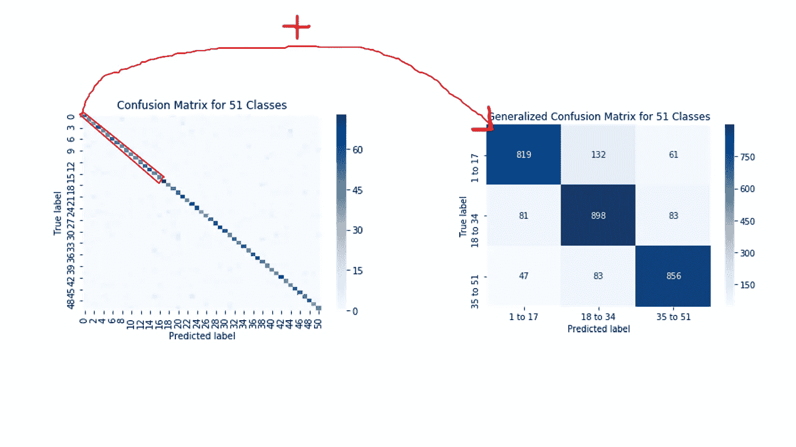

# 如何推广多类混淆矩阵

> 原文：<https://medium.com/analytics-vidhya/how-to-generalize-a-multi-class-confusion-matrix-912e29284553?source=collection_archive---------7----------------------->

## python 中任意多类混淆矩阵泛化的应用


## 1.介绍

有时候，在机器学习项目中，我们需要*处理*和**多个类** ( *标签*)，我们需要**为这些*多个类绘制混淆矩阵***。

不幸的是，随着**类数量的增加**，混淆矩阵变得**难以察觉**，如下例所示:


原始混淆矩阵

## 2.想法

如果我们通过**分组**来推广混淆矩阵，我们将有一个更容易 **感知**的混淆矩阵**，如下图所示:**


广义混淆矩阵

## 3.重要事实

混淆矩阵概化算法应该**对来自*原始混淆矩阵*的** ( *值*)的**唯一真单元进行求和，并且应该将结果写入*****相关* **真单元**中的*广义混淆矩阵* **:********

****************

**该算法还需要**将******假值*分配到*广义混淆矩阵* 中的**邻居行**中，以保持实际精度。*****

**********

*****注意:****广义混淆矩阵** *自然* **有错误**，因为将错误值分配给相邻行，但是这个操作**保留了实际的准确性。*********

*****注意:我们可以使用**质因数分解**来找出*我们可以将类分成多少组*。*****

*   *****例如:如果我们有一个 **51x51 混淆矩阵**，我们可以将类分成 **3** 或 **17** 组和****广义混淆矩阵**将是 **3x3** *(组大小为 17)* 或 **17x17** *(组大小为 3)********

## ******4.代码******

```
******# original confusion matrix
[[5 1 0 0 0 0]
 [0 5 0 0 0 0]
 [0 1 5 1 0 0]
 [0 0 0 5 0 0]
 [0 0 0 0 5 0]
 [0 0 1 0 0 5]]# generalized confusion matrix with 3 groups
[[10\.  1\.  0.]
 [ 1\. 10\.  1.]
 [ 0\.  1\. 10.]]******
```

## ******5.参考******

******[https://www . research gate . net/publication/310799885 _ Generalized _ Confusion _ Matrix _ for _ Multiple _ Classes](https://www.researchgate.net/publication/310799885_Generalized_Confusion_Matrix_for_Multiple_Classes)******