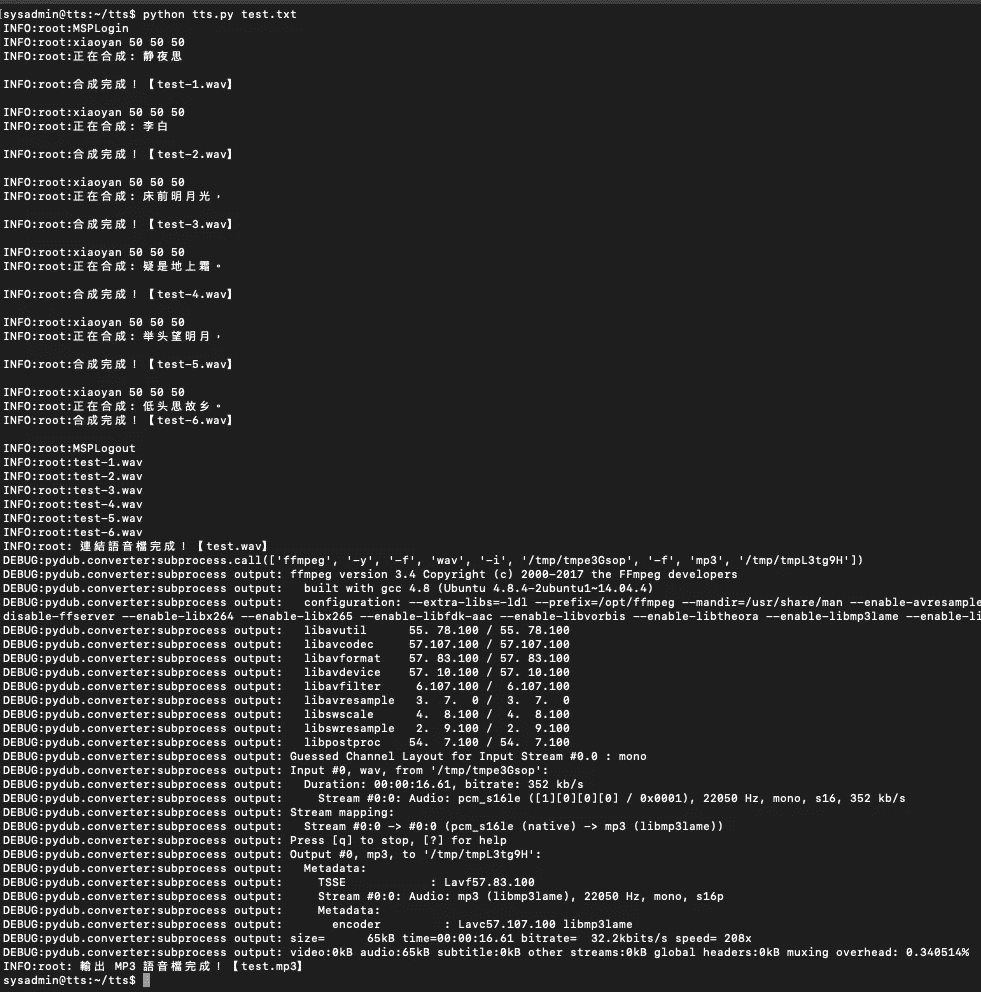

# 如何通过科大讯飞 API 生成中文文本到语音转换

> 原文：<https://medium.com/analytics-vidhya/how-to-generate-a-chinese-text-to-speech-via-iflytek-api-db469b31f4a2?source=collection_archive---------22----------------------->

## 将语音添加到您的网站和应用程序中，使您的内容面向更多受众。


埃里克·普劳泽特在 [Unsplash](https://unsplash.com?utm_source=medium&utm_medium=referral) 上拍摄的照片

**简介**

去年，我进行了一个项目，要求将中国古代诗歌从文本转换为音频。所以我在网上做了一些调查，发现能提供中文文字转语音服务的公司并不多。最后，我发现在 github 上使用科大讯飞源代码可以提供语音识别功能，并对其进行了改进，以满足项目的要求。

github 上的原始源代码链接:

[](https://github.com/ssky87/iflytek_sdk_python) [## ssky 87/科大讯飞 _sdk_python

### Python 使用科大讯飞语音识别、语音合成. Contribute to ssky87/iflytek_sdk_python development by creating an account on GitHub.

github.com](https://github.com/ssky87/iflytek_sdk_python) 

什么是文本到语音转换？

文语转换的缩写是(TTS)，即“从文本到语音”，是人机对话的一部分，让机器说话。文本到语音(TTS)是一种自然语言建模过程，需要将文本单元转换为语音单元以进行音频呈现。这是语音和文字的对立面。在这种技术中，一种技术吸收口语单词并试图将它们准确地记录为文本。

现在我们知道了什么是文语转换，我来解释一下项目的前期准备和需求。

**准备**:

这个项目我会用 ubuntu 16.04，因为我发现 ubuntu 18.04 以上的版本不行。第二是需要使用 Python 2.7 版本。安装后，我们首先下载原始的 github 包。

```
sysadmin@tts:~$ git clone [https://github.com/ssky87/iflytek_sdk_python.git](https://github.com/ssky87/iflytek_sdk_python.git)
Cloning into 'iflytek_sdk_python'...
remote: Enumerating objects: 16, done.
remote: Total 16 (delta 0), reused 0 (delta 0), pack-reused 16
Unpacking objects: 100% (16/16), done.
Checking connectivity... done.
```

然后，我们需要测试软件包是否运行正确。

```
sysadmin@tts:~$ cd iflytek_sdk_python/
sysadmin@tts:~/iflytek_sdk_python$ python tts.py
INFO:root:正在合成 [科大讯飞还是不错的]...
DEBUG:root:.
DEBUG:root:.
DEBUG:root:.
DEBUG:root:.
DEBUG:root:.
INFO:root:合成完成！
sysadmin@tts:~/iflytek_sdk_python$ ls
README.md  **msc**  stt.py  tts.py  **x64**  **x86**  xx.wav
```

我们会看到一个 xx.wav，试着下载听一下，这是我们刚刚生成的语音文件。但是对这个项目有一些要求，例如:

1.  需要从文本文件中输入
2.  每段都需要加上停顿时间
3.  由于输出的 wav 文件太大，需要转换成 mp3

在确认需求之后，我们需要安装 ffmpeg 包来将 wav 转换成 mp3。

```
sysadmin@tts:~$ sudo add-apt-repository ppa:mc3man/trusty-media
sysadmin@tts:~$ sudo apt-get update
sysadmin@tts:~$ sudo apt-get install ffmpeg
```

**修改源代码**

导入所需的库

```
#!/usr/bin/env python
# -*- coding: utf-8 -*-
import os
import sys
reload(sys)
sys.setdefaultencoding('utf-8')

import time
from ctypes import *
from io import BytesIO
import wave
import platform
import logging
from pydub import AudioSegment
import shutil
```

将源代码封装在类中

```
class convertTTS(object):
    logging.basicConfig(level=logging.DEBUG)
    BASEPATH=os.path.split(os.path.realpath(__file__))[0]
    plat = platform.architecture() if plat[0] == '32bit':
        cur = cdll.LoadLibrary(BASEPATH + '/x86/libmsc.so')
    else:
        cur = cdll.LoadLibrary(BASEPATH + '/x64/libmsc.so') def login(self,str_txt='appid = 539feff8, work_dir = .'):
        MSPLogin = self.cur.MSPLogin
        ret = 0
        ret = MSPLogin(None,None,str_txt) 

        if ret != 0:
            logging.error("MSPLogin failed, error code: " + str(ret))
        else:
            logging.info("MSPLogin")

        return ret def logout(self):
        MSPLogout = self.cur.MSPLogout
        MSPLogout()
        logging.info("MSPLogout") def saveWave(self, raw_data, _tmpFile = 'test.wav'):
        f = wave.open(_tmpFile,'w')
        f.setparams((1, 2, 16000, 262720, 'NONE', 'not compressed'))
        f.writeframesraw(raw_data)
        f.close() return _tmpFile def text_to_speech(self,src_text,voicename,speed,volumn,pitch,mp3,file_name=None): logging.info (str(voicename) + " " + str(speed) + " " + str(volumn) + " " + str(pitch))
        encoding = 'utf8'
        sample_rate = 16000
        rdn = 2

        QTTSSessionBegin = self.cur.QTTSSessionBegin
        QTTSTextPut = self.cur.QTTSTextPut
        QTTSAudioGet = self.cur.QTTSAudioGet
        QTTSAudioGet.restype = c_void_p
        QTTSSessionEnd = self.cur.QTTSSessionEnd

        ret_c = c_int(0)session_begin_params="voice_name=" + str(voicename) + ",text_encoding=" + str(encoding) + ",sample_rate=" + str(sample_rate) +",speed=" + str(speed) + ",volume=" + str(volumn) + ",pitch=" + str(pitch) + ",rdn=" + str(rdn)

        sessionID = QTTSSessionBegin(session_begin_params, byref(ret_c))

	if ret_c.value != 0 :
            logging.error("QTTSSessionBegin failed, error code: " + ret_c.value)
            return ret = QTTSTextPut(sessionID, src_text, len(src_text),None) if ret != 0:
            logging.error("QTTSTextPut failed, error code: " + str(ret))
            QTTSSessionEnd(sessionID, "TextPutError")
            return logging.info("Synthesizing : " + (src_text)) audio_len = c_uint(0)
	synth_status = c_int(0)
        f = BytesIO() while True:
            p = QTTSAudioGet(sessionID, byref(audio_len), byref(synth_status), byref(ret_c)) if ret_c.value != 0:
	    logging.error("QTTSAudioGet failed, error code: " + str(ret_c))
	    QTTSSessionEnd(sessionID, "AudioGetError")
	    break if p != None:
	    buf = (c_char * audio_len.value).from_address(p)
	    f.write(buf) if synth_status.value == 2 :
	    self.saveWave(f.getvalue(),file_name)
	    break time.sleep(1) logging.info('Convert Completed！【' + file_name  + '】\n') ret = QTTSSessionEnd(sessionID, "Normal") if ret != 0:
            logging.error("QTTSTextPut failed, error code: " + str(ret))
```

因为我们是按段落转换，所以会生成多个文件，所以我们需要将这些文件合并在一起。

```
def joinwav(fn, num_of_file):
    infiles =[]
    outfile = fn + ".wav"

    for num in range(1,num_of_file):
	filename = fn + "-" + str(num) + ".wav"
	logging.info(filename)
	infiles.append (AudioSegment.from_wav(filename))
	infiles.append (AudioSegment.from_wav("silentFix.wav"))

    combined = infiles[0]

    for wavcombined in infiles[1:]:
	combined = combined.append(wavcombined)

    combined.export(outfile, format="wav")
    logging.info(' Merge Complete！【' + outfile  + '】')
```

此外，我们还需要将输出的 wav 文件转换成 mp3 文件

```
def wav2mp3(filename):
    fn = os.path.splitext(filename)[0]

    AudioSegment.from_wav(filename).export(fn + ".mp3", format="mp3"
    logging.info(' MP3 Output Complete！【' + fn + ".mp3"  + '】')
```

清除文本文件中的特殊符号

```
def clear(text):
    text = text.replace('《', '')
    text = text.replace('》','')

    return text
```

程序逻辑:你可以在函数中更改语音名称、速度、音量、音调、mp3、joinfile。

voicename:通过该参数设置不同的说话人，实现不同的语言、方言、性别等。默认发言者是小燕

速度:通过该参数设置合成返回的音频的语速，取值范围:[0，100]，默认:50

volumn:通过该参数设置合成返回的音频的音量，取值范围:[0，100]，默认:50

音高:通过该参数设置合成后的回传音频的音调，取值范围:[0，100]，默认为:50

mp3:通过此参数设置是否输出 mp3 文件

joinfile:通过该参数设置是否将多个 wav 文件链接成一个文件

```
def main(filename, voicename, speed, volumn, pitch, mp3, joinfile):
    lineno = 0

    fh = open(filename)
    fn = os.path.splitext(filename)[0]

    tts = convertTTS()
    tts.login()

    while True:	
        content = fh.readline()

	if (content <> ''):
	    if not content.strip(): continue
		content = clear(content)

		lineno = lineno + 1

		targetfilename = fn + "-" + str(lineno) + ".wav"
						    tts.text_to_speech(content,voicename,speed,volumn,pitch,mp3,targetfilename)

	if not content:
	    break fh.close()

    tts.logout()

    if (1 == joinfile):
	joinwav(fn, lineno+1)

	if (1 == mp3):
            wav2mp3(fn + ".wav")if __name__ == "__main__":
    nfn = sys.argv[1] main(nfn, 'xiaoyan', 50, 50, 50, 1, 1)
```

现在你可以在控制台运行程序了！！！



感谢阅读！如果你喜欢这篇文章，请通过鼓掌来感谢你的支持(👏🏼)按钮，或者通过共享这篇文章让其他人可以找到它。

您也可以在我的 [github](https://github.com/kindersham/100DaysDS/tree/master/iFLYTEK_TTS) 资源库中下载源代码。感谢您的阅读时间。