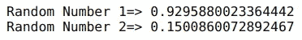

# Python 中如何生成随机数？

> 原文：<https://medium.com/analytics-vidhya/how-to-generate-random-numbers-in-python-ab0befa32180?source=collection_archive---------41----------------------->

> 这个世界是由机遇主宰的。我们生活中的每一天都充满了随机性。
> 
> *——保罗·奥斯特*

在数据科学的世界里，随机数无处不在。我经常需要快速地绘制一些随机数来进行一个思维实验，或者向观众演示一个概念，但不需要下载大数据集。

从创建虚拟数据到为了训练和测试目的而打乱数据，或者初始化神经网络的权重，我们在 Python 中一直在生成随机数。读完这篇文章后，一旦你掌握了窍门，你就会爱上这个概念。


在我看来，生成随机数是任何从事数据科学的人都必须知道的话题。在这里，我将指导您完成 Python 中的整个随机数生成过程，并使用不同的技术进行演示。

*Python 新手？这两门免费课程将帮助您入门:*

*   [*用于数据科学的 Python*](https://courses.analyticsvidhya.com/courses/introduction-to-data-science?utm_source=blog&utm_medium=how-to-generate-random-numbers-in-python)
*   [*用 Python 进行数据分析的熊猫*](https://courses.analyticsvidhya.com/courses/pandas-for-data-analysis-in-python?utm_source=blog&utm_medium=how-to-generate-random-numbers-in-python)

# 目录

*   随机库
*   播种随机数
*   生成一个范围内的随机数
*   从列表中随机选取
*   打乱列表
*   根据分布生成随机数

# 使用随机库在 Python 中生成随机数

好消息是，Python 中有多种生成随机数的方法。最简单的方法是使用[随机](https://docs.python.org/3/library/random.html)模块。它是 Python 中的内置模块，不需要安装。该模块使用一个名为[梅森扭结器](https://en.wikipedia.org/wiki/Mersenne_Twister)的[伪随机数发生器(PRNG)](https://en.wikipedia.org/wiki/Pseudorandom_number_generator) 来产生随机数。

伪随机数发生器是确定性随机数发生器。它不会产生真正的随机数。它接受一个数字作为输入，并为其生成一个随机数。

***注:*** *出于安全考虑，请勿使用随机模块生成随机数。对于安全和加密用途，您可以使用使用* [*真随机数发生器(TRNG)*](https://en.wikipedia.org/wiki/Hardware_random_number_generator) *的模块。*

# 播种随机数

正如我们在上一节中所讨论的，random 模块接受一个数字作为输入，并为它生成一个随机数。这个初始值称为种子，这个过程称为播种。

我们通过伪随机数生成器生成的数字是确定的。这意味着它们可以使用相同的种子进行复制。

我们用一个例子来理解一下:

```
import randomprint('Random Number 1=>',random.random())
print('Random Number 2=>',random.random())
```

这里，我使用 random()函数生成一个范围在[0.0，1.0]内的随机数。注意这里我没有提到种子的价值。默认情况下，以毫秒为单位的当前系统时间被用作种子。让我们来看看输出。



这两个数字是不同的，因为从第一条语句到第二条语句的执行时间发生了变化。让我们看看，如果我们为生成器植入相同的值，会发生什么:

```
random.seed(42)
print('Random Number 1=>',random.random())random.seed(42)
print('Random Number 2=>',random.random())
```


我们在这里得到相同的数字。这就是为什么伪随机数发生器是确定性的，而不是用于安全目的，因为任何有种子的人都可以生成相同的随机数。

# 生成一个范围内的随机数

到目前为止，我们知道如何在[0.0，1.0]范围内创建随机数。但是如果我们必须创建一个不同于这个范围的数字呢？

一种方法是将数字与由 **random()** 函数返回的数字相乘并相加。例如，random.random() * 3 + 2 将返回[2.0，5.0]范围内的数字。然而，这更多的是一种变通方法，而不是直接的解决方案。

放心吧！随机模块在这里支持你。为此，它提供了 **uniform()** 和 **randint()** 函数。让我们逐一了解。

# 统一()

random 模块的 uniform()函数以一个范围的起始值和结束值作为参数，并返回一个范围[starting，ending]内的浮点随机数:

```
print('Random Number in range(2,8)=>', random.uniform(2,8))
```


# randint()

该函数类似于 uniform()函数。唯一的区别是 uniform()函数返回浮点随机数，randint()函数返回整数。它还返回[开始，结束]范围内的数字:

```
print('Random Number in a range(2,8)=>', random.randint(2,8))
```


# 从列表中随机选取

**choice()**&**choices()**是 random 模块提供的两个函数，我们可以使用它们从列表中随机选择值。这两个函数都将一个列表作为参数，并从中随机选择一个值。你能猜出 **choice()** 和 **choices()** 的区别吗？

**choice()** 仅从列表中选取单个值，而 **choices()** 从列表**中选取多个值，并用替换**。这些函数的一个奇妙之处在于，它们也可以处理包含字符串的列表。让我们看看他们的行动:

```
a=[5, 9, 20, 10, 2, 8]
print('Randomly picked number=>',random.choice(a))
print('Randomly picked number=>',random.choices(a,k=3))
```


如您所见， **choice()** 从 *a* 返回一个值， **choices()** 从 *a* 返回三个值。这里， *k* 是 **choices()** 返回的列表长度。

在由 **choices()** 返回的响应中，您还可以注意到，每个值只出现一次。您可以通过将一个数组作为**权重**传递给 **choices()** 函数来增加每个值被选中的概率。所以，让我们把 10 的概率增加到其他人的三倍，看看结果:

```
for _ in range(5):
   print('Randomly picked number=>',random.choices(a,weights=[1,1,1,3,1,1],k=3))
```


在这里，我们可以看到列表中的每个抽牌都出现了 10 次。random 模块中还有一个 **sample()** 函数，其工作方式与 **choices()** 函数类似，但从列表**中随机抽取样本，而不替换**。

# 打乱列表

假设我们不想从列表中选择值，但是你想重新排序它们。我们可以使用 random 模块中的 **shuffle()** 函数来实现。这个 **shuffle()** 函数将列表作为一个参数，并将列表就地打乱:

```
print('Original list=>',a)
random.shuffle(a)
print('Shuffled list=>',a)
```


*注意:shuffle()函数不返回列表。*

# 根据分布生成随机数

random 模块更令人惊奇的一个特性是，它允许我们根据不同的概率分布生成随机数。像**高斯()**、**指数()**等各种函数都有。帮助我们做到这一点。

如果你不熟悉概率分布，那么我强烈推荐你阅读这篇文章:[每个数据科学专业人士都应该知道的 6 种常见概率分布](https://www.analyticsvidhya.com/blog/2017/09/6-probability-distributions-data-science/?utm_source=blog&utm_medium=how-to-generate-random-numbers-in-python)。

# 高斯()

先说最常见的概率分布，也就是正态分布。**高斯()**是用于根据正态分布生成随机数的随机模块的函数。它将平均值和标准偏差作为参数，并返回一个随机数:

```
for _ in range(5):
   print(random.gauss(0,1)
```


这里，我绘制了由**高斯()**函数生成的 1000 个随机数，平均值等于 0，标准差为 1。你可以在上面看到，所有的点都分布在平均值周围，并且它们没有广泛分布，因为标准差是 1。

# 指数变量()

指数分布是你会遇到的另一种非常常见的概率分布。 **expovariate()** 函数用于根据指数分布得到一个随机数。它将 lambda 的值作为参数，如果 lambda 为正，则返回值从 0 到正无穷大，如果 lambda 为负，则返回值从负无穷大到 0:

```
print('Random number from exponential distribution=>',random.expovariate(10))
```


# 结束注释

我经常使用随机数来创建虚拟数据集和随机抽样。我很想知道你是如何在你的项目中使用随机数的，所以请在下面写下你的想法，并与社区分享。

如果你觉得这篇文章信息丰富，那么请与你的朋友分享，并在下面评论你的疑问和反馈。我在下面列出了一些与 Python 和数据科学相关的惊人文章，供大家参考:

*   [什么是 Lambda 函数？Python 中 Lambda 函数的快速指南](https://www.analyticsvidhya.com/blog/2020/03/what-are-lambda-functions-in-python/?utm_source=blog&utm_medium=how-to-generate-random-numbers-in-python)
*   [了解如何在 Pandas 中使用 Transform 函数(带 Python 代码)](https://www.analyticsvidhya.com/blog/2020/03/understanding-transform-function-python/?utm_source=blog&utm_medium=how-to-generate-random-numbers-in-python)
*   [如何使用 loc 和 iloc 在 Pandas 中选择数据(带 Python 代码！)](https://www.analyticsvidhya.com/blog/2020/02/loc-iloc-pandas/?utm_source=blog&utm_medium=how-to-generate-random-numbers-in-python)