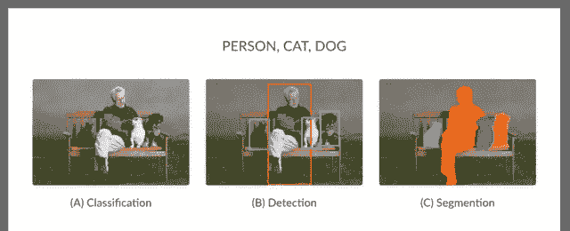

# 如何利用深度学习获得背景模糊？

> 原文：<https://medium.com/analytics-vidhya/how-to-get-background-blur-using-deep-learning-91c2dfada33e?source=collection_archive---------19----------------------->


背景模糊效果也称为“散景”，是一种众所周知的效果，我们很多人主要在特写镜头中使用，它给我们的图像增加了深度感，因为我们只专注于图像的特定部分。为了获得这种效果，我们通常使用一些照片编辑应用程序，如 Photoshop、Gimp、Picsart、Snapseed 等。随着时间的推移，我们利用深度学习在计算机视觉和图像处理方面取得了重大进展。所以就产生了一个问题，我们可以利用深度学习来获得这种散景效应吗？答案是肯定的，我们可以，在下面的博客中，我将带您浏览完整的实现以及代码和一些理论方面，以便更好地理解。

## 内容

1.  是如何实现的？
2.  我们将使用的深度学习模型
3.  ReLu6
4.  履行
5.  信用
6.  结论

## 1.是如何实现的？

基本上，整个目标是基于一种称为**图像分割**的卷积神经网络的高级实现。
我们都熟悉细胞神经网络，它用于根据输入标签的数量对图像进行分类。但是假设我们必须在给定的图像中识别特定的对象，为此我们必须使用对象检测的概念，然后是图像分割。


来源-谷歌

这是图像分类和检测的经典示例，其中，如果在单个图像中存在多种类型的对象，则我们进行对象检测，一旦我们找到图像中多个对象的坐标，给定的图像就进入感兴趣区域池，然后对这些对象进行分类，并在每个识别的对象周围绘制边界框。

一旦所有这些都完成了，我们就进入图像分割的下一步，因为边界框只显示了对象在图像中的位置，而没有给出任何关于对象形状的信息。
简单来说，图像分割就是将图像像素分割成小的部分或片段，并根据相似的信息或属性对它们进行分组，并为它们分配一个标签。这有助于捕捉像素级别的非常小的细节。分割为图像中每一个被识别的物体创建了一个像素级的遮罩，请看下图。主要目的是以这样一种方式训练神经网络，使得它可以作为图像的逐像素掩码给出。要了解更多细节，请点击[此处](https://towardsdatascience.com/going-deep-into-object-detection-bed442d92b34)。



来源- MissingLink.ai

## 2.我们将使用的深度学习模型:

一旦我们清楚了图像分割，现在让我们看看我们将使用的模型，这是在 coco 数据集上训练的 mobilenetv2。
mobilenetv2 是一款轻量级型号，可用于手机等低功耗设备，这是 2017 年推出的第二版 mobilenetv1 型号。
现在让我们简单了解一下模型架构。


来源-走向数据科学

v2 也基于 v1，因此它继承了相同的深度方向可分离卷积，其包括深度方向卷积和点方向卷积，这降低了卷积运算的成本。

深度方向卷积简单地意味着，假设一个图像包含 3 个通道，那么每个核将分别在每个通道上迭代。

例如，您有一个(10 x 10 x 3)的图像和 3 个(3 x 3 x 1)的过滤器，那么结果输出将是一个这样的过滤器的(8 x 8 x 1)，之后所有其他过滤器的输出堆叠在一起，形成由(8 x 8 x 3)组成的特征图。
在逐点卷积中，我们采用(8 x 8 x 3)的先前特征图，并应用大小为(1 x 1 x 3)的过滤器。如果应用 15 个这样的过滤器，那么最终结果将被堆叠起来以形成(8×8×15)的特征图。

mobilenetv2 在 v1 上有一些改进，如反向残差、线性瓶颈和残差连接的实现。


来源-机器思考。网

v2 总共有 3 个卷积层，其中第一个是扩展层，第二个是深度层，第三个是投影层。

扩展层:该层获取输入数据，并将低维数据扩展到高维，以便保留重要信息，并将其输出到深度层，扩展因子是一个**超参数**，可根据试验次数进行调整。

深度方向层:该层接收来自扩展层的输入，并执行深度方向和点方向卷积，将特征图提供给投影层。

投影层:这一层负责缩小数据的维度，以便只有有限数量的数据在网络中进一步传递，此时输入维度与输出维度匹配，也称为“瓶颈层”。


来源-机器思考。网

剩余连接是网络的新增部分，它基于 ResNet，有助于控制梯度在网络中的流动。当输入数据的维度与输出数据的维度相同时使用。

## 3.ReLu6:


来源-谷歌

这个网络中的每一层都带有 ReLu6，而不是带有批处理规范化的 ReLu。ReLu6 将值的范围限制在 0 到 6 之间，这是一个线性激活函数。通过限制小数点左边的 3 位信息，也有助于保持小数点右边的精度。

最后一层(即投影层)的输出没有激活函数，因为它的输出是低维数据，根据研究人员的说法，向最后一层添加任何非线性函数都可能导致有用信息的丢失。

## 4.履行

现在，我们对图像分割和我们将使用的 mobilenetv2 有了一个简单的概念，让我们开始实现部分。

先决条件:-代码使用 tensorflow 版本 1.x，所以你需要有版本 1.x 才能工作，如果你使用 2.x，那么它会在执行时出错，所以我建议简单地使用 Google Collab 来执行它。

我将快速浏览代码的所有重要方面，完整的实现和逐行解释将在 [GitHub](https://github.com/patrickn699/Background_Blur.git) 上的笔记本中给出。

为了演示，我们将使用下面的图像大小(596 x 900)


**第一步**:下载预先训练好的模型。

由于模型是预先训练好的，只需要下载它并把我们的图像传给它，
，它就会返回分割后的图像。

```
MODEL_NAME = 'mobilenetv2_coco_voctrainaug'  # [@param](http://twitter.com/param) ['mobilenetv2_coco_voctrainaug', 'mobilenetv2_coco_voctrainval', 'xception_coco_voctrainaug', 'xception_coco_voctrainval']_DOWNLOAD_URL_PREFIX = '[http://download.tensorflow.org/models/'](http://download.tensorflow.org/models/')
_MODEL_URLS = {
    'mobilenetv2_coco_voctrainaug':
        'deeplabv3_mnv2_pascal_train_aug_2018_01_29.tar.gz',
    'mobilenetv2_coco_voctrainval':
        'deeplabv3_mnv2_pascal_trainval_2018_01_29.tar.gz',
    'xception_coco_voctrainaug':
        'deeplabv3_pascal_train_aug_2018_01_04.tar.gz',
    'xception_coco_voctrainval':
        'deeplabv3_pascal_trainval_2018_01_04.tar.gz',
}
_TARBALL_NAME = 'deeplab_model.tar.gz'model_dir = tempfile.mkdtemp()
tf.gfile.MakeDirs(model_dir)download_path = os.path.join(model_dir, _TARBALL_NAME)
print('downloading model, this might take a while...')
urllib.request.urlretrieve(_DOWNLOAD_URL_PREFIX + _MODEL_URLS[MODEL_NAME],
                   download_path)
print('download completed! loading DeepLab model...')MODEL = DeepLabModel(download_path)
print('model loaded successfully!')
```


输出

**步骤 2** :将输入的分割图像可视化的功能。

```
def run_visualization():
  """Inferences DeepLab model and visualizes result."""
  try:
    original_im = Image.open(IMAGE_NAME)
  except IOError:
    print('Cannot retrieve image. Please check url: ' + url)
    returnprint('running deeplab on image')
  resized_im, seg_map = MODEL.run(original_im)
  vis_segmentation(resized_im, seg_map)
  return resized_im, seg_map
```

**2.1** :用上图调用上述函数。

```
IMAGE_NAME = 'download2.jpg'
resized_im, seg_map = run_visualization()
```


分段后输出。

**2.2** :现在我们将读取输入图像并转换成 numpy 数组。

```
print(type(resized_im))
numpy_image = np.array(resized_im)
```

**第三步**:背景与前景分离。

在这一步中，我们将创建一个图像的副本，然后通过在背景中用 0 替换值并在创建蒙版的地方保留 255 来从分割的图像中分离背景和前景。这里 7 表示汽车类别。

```
person_not_person_mapping = deepcopy(numpy_image)
person_not_person_mapping[seg_map != 7] = 0
person_not_person_mapping[seg_map == 7] = 255
```

**3.1** :可视化分离的屏蔽图像

```
plt.imshow(person_not_person_mapping)
```


输出

正如我们可以清楚地看到，背景被替换为黑色，蒙版汽车变成了白色，如前一步所述，我们也没有因为替换值而丢失任何重要信息。

**3.2:** 将蒙版图像的大小调整为原始图像的大小。

在分割过程之后，图像的尺寸减小，在我们的例子中，它减小到(300 x 500)的尺寸，因此我们将调整图像的尺寸到它的原始尺寸，即(900 x 596)。

```
orig_imginal = Image.open(IMAGE_NAME)
orig_imginal = np.array(orig_imginal)mapping_resized = cv2.resize(person_not_person_mapping, 
                             (orig_imginal.shape[1],
                              orig_imginal.shape[0]),
                              Image.ANTIALIAS)
mapping_resized.shape
```


输出

**3.3** :二值化。

由于调整了图像的大小，生成的值范围为 0，1，2…255，为了再次将值限制在 0–255 之间，我们必须使用 Otsu 的二值化技术对图像进行二值化。
简而言之，Otsu 二值化是一种寻找灰度图像阈值
的自适应方法。它遍历 0-255 范围内所有可能的阈值，并为给定图像找到最佳可能阈值。
内部基于一些统计概念，如方差，找出基于选定阈值的类。
一旦选择了最佳阈值，则大于阈值的像素值将被视为白色像素，小于阈值的像素值将被视为黑色像素。查看此[文章](/@hbyacademic/otsu-thresholding-4337710dc519)了解详情。

```
gray = cv2.cvtColor(mapping_resized, cv2.COLOR_BGR2GRAY)
blurred = cv2.GaussianBlur(gray,(15,15),0)
ret3,thresholded_img = cv2.threshold(blurred,0,255,cv2.THRESH_BINARY+cv2.THRESH_OTSU)
plt.imshow(thresholded_img)
```


输出

产量将保持不变，与前一次相比不会有太大差别。这是二维的灰度图像。

**第四步**:给阈值图像添加颜色。

现在我们已经完成了二值化，是时候将灰度图像转换成 RGB 图像了。

```
mapping = cv2.cvtColor(thresholded_img, cv2.COLOR_GRAY2RGB)
np.unique(mapping)
```


输出

在输出中，将颜色应用到图像后，它包含两个唯一的像素值，即 0.255。使用此贴图，我们将在接下来的步骤中应用背景模糊。

**4.1** :对原始图像应用模糊。

接下来，让我们应用模糊效果到我们的原始输入图像。

```
blurred_original_image = cv2.GaussianBlur(orig_imginal,
                                          (251,251),0)
plt.imshow(blurred_original_image)
```


输出

**4.2** :获取背景模糊。

这是我们用一行简单的代码片段对输入图像的背景进行模糊处理的步骤。

```
layered_image = np.where(mapping != (0,0,0), 
                         orig_imginal, 
                         blurred_original_image)
plt.imshow(layered_image)
```

在上面的片段中，我们所做的只是简单地填充像素强度值为 0 的模糊图像，即填充所有黑色像素，并填充像素强度值为 255 的原始图像，这是基于分割图的白色像素。
这产生了如下好看的散景效果。


输出

**4.3** :最终保存图像。

现在唯一要做的就是保存散景图像，我们完成了！

```
im_rgb = cv2.cvtColor(layered_image, cv2.COLOR_BGR2RGB)
cv2.imwrite("Potrait_Image.jpg", im_rgb)
```

## 5.学分:

这篇文章是参考 Bhavesh Bhatt 在 YouTube 上的视频写的，所以向他致敬，上面给出的所有代码片段只是重要的，完整的代码和逐行注释可以在我的 [GitHub](https://github.com/patrickn699/Background_Blur.git) 页面上找到。

## 6.结论:

总而言之，这只是深度学习可以做的事情之一，使用它可以实现很多这样的事情。随着我们的进步，模型越来越好，从分类到生成深度假货，我们所有人都期待着它！。