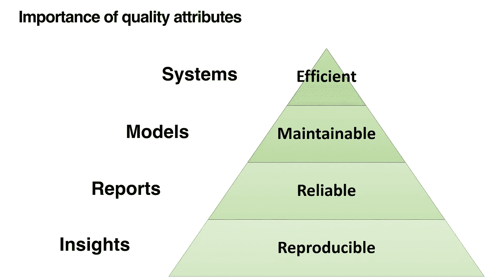

# 如何让数据科学真正在生产中发挥作用

> 原文：<https://medium.com/analytics-vidhya/how-to-get-data-science-to-truly-work-in-production-bed80e6bcfee?source=collection_archive---------40----------------------->

这是关于构建和设计机器学习系统的最佳实践系列的第一篇文章。在这里阅读下一篇系列文章:[https://medium . com/@ max . y . leander/create-reproducible-machine-learning-experiments-using-sacred-f 8176 ea 3d 42d](/@max.y.leander/create-reproducible-machine-learning-experiments-using-sacred-f8176ea3d42d)

最近，在试图解决工程化整个机器学习系统时出现的问题的工具方面出现了繁荣。如果我们相信吴恩达在他伟大的时事通讯《批次》的一个版本中引用的一项研究，这是可以理解的。根据[的研究](https://info.algorithmia.com/hubfs/2019/Whitepapers/The-State-of-Enterprise-ML-2020/Algorithmia_2020_State_of_Enterprise_ML.pdf)， **55%的公司尚未成功将机器学习模型部署到生产中**。那么怎么做才能提高成功率呢？

每个数据科学项目都要经历许多阶段，从分析数据到收集见解，通过构建 ML 模型和管道，再将它们部署为完整软件系统的一部分。我倾向于将数据科学中对最佳实践的需求视为马斯洛需求层次*，其中项目的每个阶段都需要更加关注额外的质量属性。*

**

*根据这个层次结构，很明显**再现性** 是任何数据科学项目最基本的质量，应该从一开始就存在。*

*将机器学习投入生产的一个主要问题是理解模型何时以及为什么以意想不到的方式表现。调试 ML 系统可能很困难。软件工程师在他们的工作中使用最佳实践。尝试和测试的方法，以防止、查明和处理出现的错误。但这些方法并不适用于不是手工制作的软件，而是通过训练过程自动生成的，涉及大量数据和机器学习算法。*

*为了理解为什么一个模型的行为是出乎意料的，最重要的是要知道它是如何形成的。数据科学项目通常涉及数十种不同的数据源和实验，涉及多种类型的模型、转换和超参数。用于训练最终被选择用于生产的模型的*人类选择*通常可以指导理解模型随后在现场环境中做出的选择。换句话说，为了理解一个模型的行为，我们需要追踪导致它存在的实验。*

*你可以说**跟踪实验对于数据科学家就像 Git 提交对于传统软件工程师**一样。正如软件开发人员需要调查**提交历史**来理解软件错误一样，ML 从业者需要调查**实验历史**来理解生产模型，特别是当它以有趣的方式运行时。如果说**可靠性**是软件工程师最基本的素质，那么**再现性**是数据科学家最基本的素质。*

*为了保证再现性，我们主要需要做以下三件事:*

*   *控制随机性*
*   *跟踪数据源和配置*
*   *使用隔离且可重复的环境*

*在下一篇文章中，我将展示如何使用[神圣的](https://github.com/IDSIA/sacred)，这是一个用于跟踪实验的开源框架，可以用来完成这里的前两点。*

*敬请期待！*