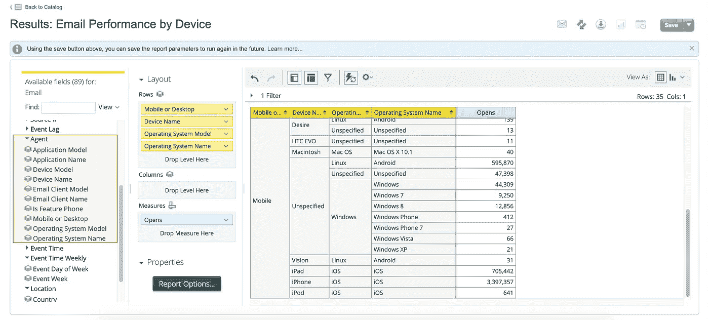
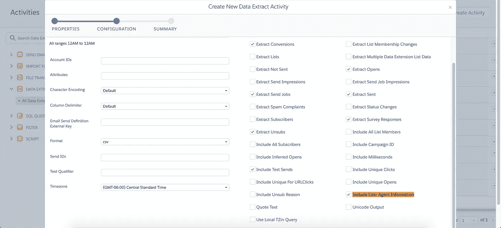
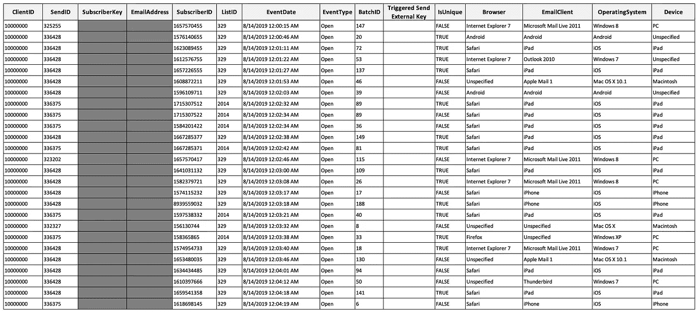
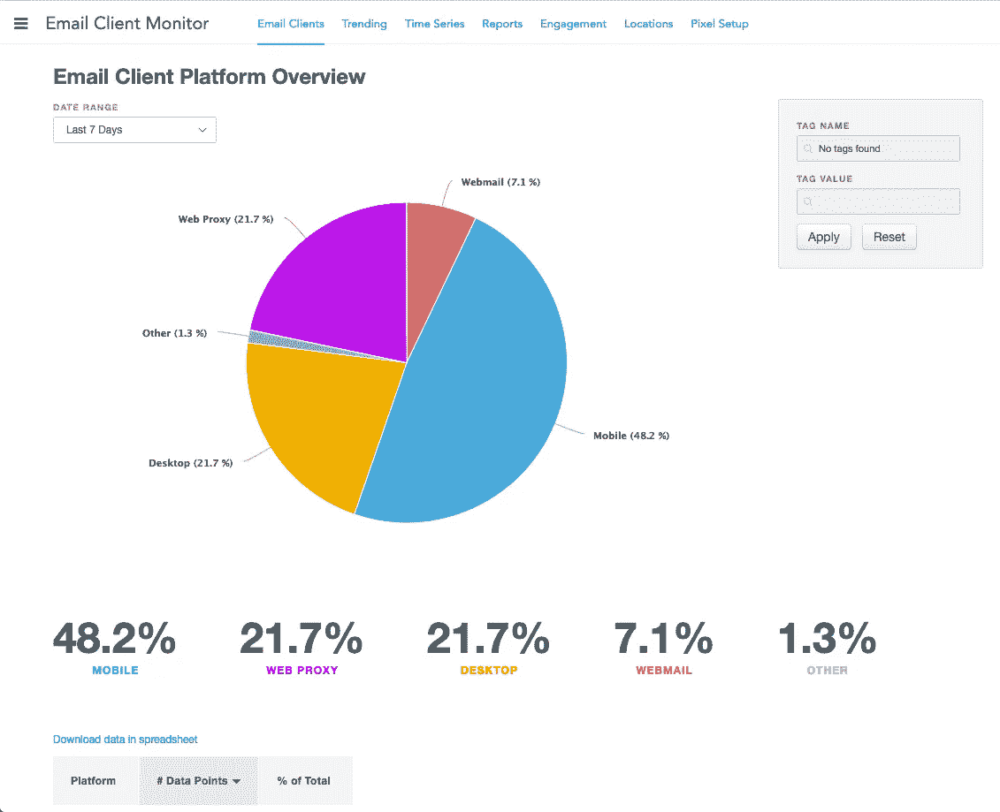
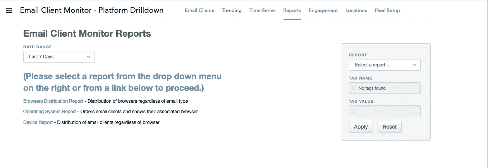
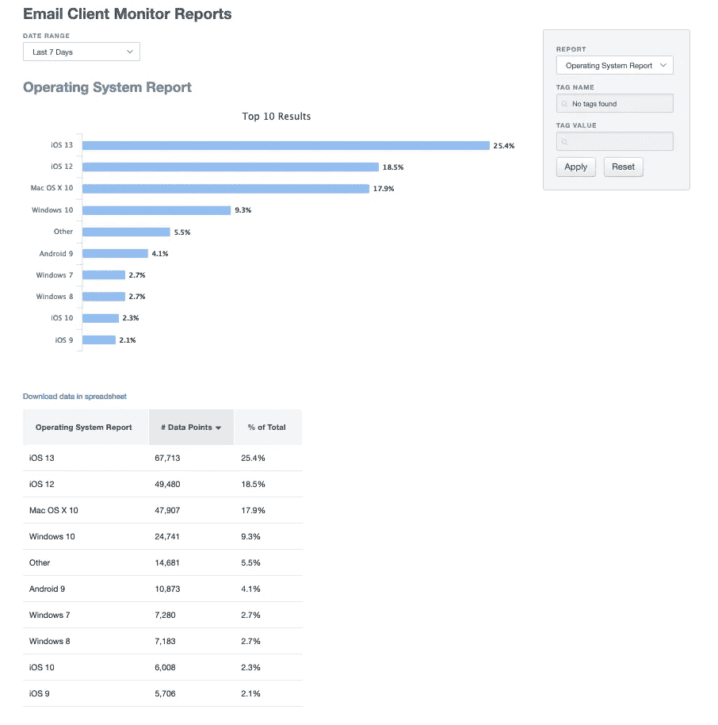
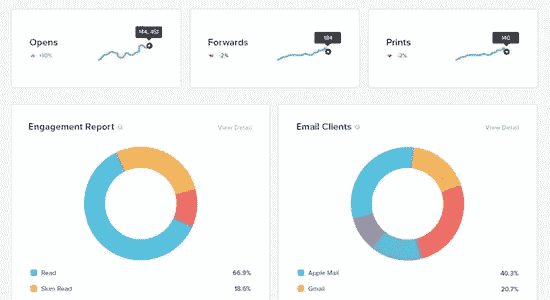

# 如何为 Salesforce Marketing Cloud 获取设备报告并跟踪电子邮件客户端

> 原文：<https://medium.com/analytics-vidhya/how-to-get-device-reporting-and-track-email-client-within-salesforce-marketing-cloud-686b176ef43f?source=collection_archive---------8----------------------->

在 [Unsplash](https://unsplash.com?utm_source=medium&utm_medium=referral) 上由 [Carlos Muza](https://unsplash.com/@kmuza?utm_source=medium&utm_medium=referral) 拍摄的照片

知道你的用户在哪些设备和客户端上打开你制作精美的电子邮件是很有用的。这些信息可以帮助您做出设计决策，围绕哪些电子邮件客户端您真正想要优化用户体验。

例如，如果你的大多数用户都是在桌面版本的微软 Outlook 上打开，你可能需要考虑采用一个更传统的电子邮件设计来保持电子邮件看起来很笨。相反，如果你的大多数订阅者在苹果邮件中打开，你可以为 WebKit 渲染引擎编码，它对更现代的 HTML 和 CSS 有很好的支持。

你的目标应该是创建在所有设备和客户端上看起来都很棒的电子邮件，但是如果你资源紧张，知道真正关注哪些客户端可能是一个快速的捷径。

有四种快速获取设备统计信息的方法:

# **1)在分析构建器中发现报告**

有一个*“按设备分类的电子邮件性能*报告可用，但您需要在您的帐户上启用“发现”功能(包含在企业版和企业版中)。然而，这提供了有限的分析，你只能按日期过滤(不是发送)。

在“代理”伞下，您有许多维度(下面以黄色突出显示)，您可以将它们拖到行和列部分。刷新报告，尝试您需要的数据显示类型。如果你要深入细节，表格是最好的，而饼图看起来很适合移动/桌面的划分。

> **2021 年 8 月 6 日更新:**
> Discover Reports 将于 2022 年 4 月 1 日停售。建议利用任何其他推荐选项来代替它。
> [https://help.salesforce.com/articleView?id = SF . MC _ rn _ January _ 2021 _ discover _ reports _ retires . htm&type = 5](https://help.salesforce.com/articleView?id=sf.mc_rn_january_2021_discover_reports_retires.htm&type=5)

# **2)在 Automation Studio 中跟踪摘录**

跟踪摘录提供粒度跟踪数据，以便从 Email Studio 导入外部系统。此功能需要为您的帐户提供，因此请请求 SF 支持配置提取类型:“跟踪提取”

您还需要联系 SF 支持人员，让他们启用“包括用户代理信息”复选框。这将允许我们覆盖用户代理数据，如操作系统、电子邮件客户端、浏览器或与打开或点击相关的设备。

参见[提取输出参考](https://help.salesforce.com/articleView?id=mc_as_extract_types_reference.htm&type=5)

跟踪摘录的样本数据

# **3)返回路径整合**

Return Path 是一个第三方电子邮件投递和分析服务，旨在跟踪您的电子邮件程序的性能。这是你的 SFMC 合同之外的额外服务。有关对此产品的兴趣，请联系您的 Salesforce 营销云关系经理。如果你有兴趣了解更多，你可以查阅[文档](https://help.salesforce.com/articleView?id=mc_es_return_path_platform.htm&type=5)。

设备指标位于返回路径仪表板内的“[电子邮件客户端监视器](https://returnpath.com/solutions/email-deliverability-optimization/email-client-monitor/)部分。查看此摘要[视频](https://www.youtube.com/watch?v=XZh9raD983M)了解内幕。

*示例操作系统报告*

# **4) Litmus 电子邮件分析**

另一个第三方服务 Litmus 也提供电子邮件客户端和参与度报告。类似于返回路径和大多数 ESPS，这需要你添加一个跟踪代码到您的电子邮件。请注意，如果收件人不打开电子邮件或启用图像，代码无法跟踪行为数据。

[https://litmus.com/email-analytics](https://litmus.com/email-analytics)

好了，你知道了。4 种获取设备和客户端打开或点击信息的方法。希望这对你有用。