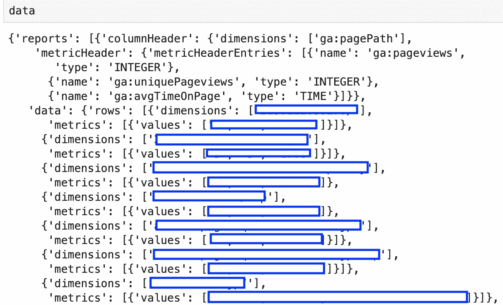
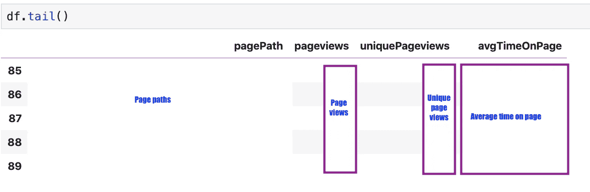
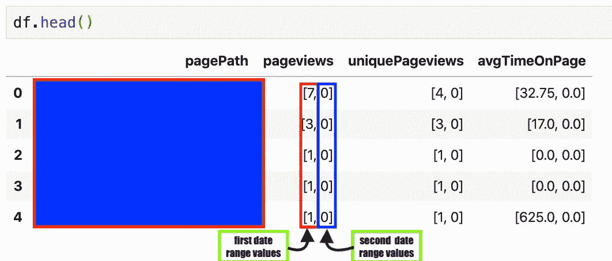
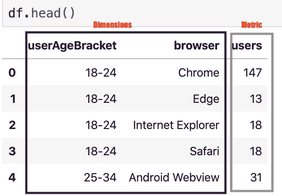
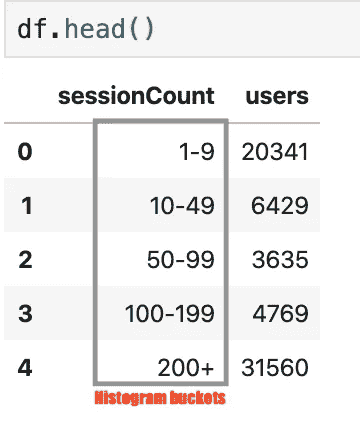

# 如何获取 Google Analytics 报告数据为 Pandas DataFrame？

> 原文：<https://medium.com/analytics-vidhya/how-to-get-google-analytics-report-data-as-pandas-dataframe-e3930831fba?source=collection_archive---------0----------------------->


由 [Carlos Muza](https://unsplash.com/@kmuza?utm_source=unsplash&utm_medium=referral&utm_content=creditCopyText) 在 [Unsplash](https://unsplash.com/s/photos/web-analytics?utm_source=unsplash&utm_medium=referral&utm_content=creditCopyText) 上拍摄的照片

## 通过谷歌分析报告 API V4 使用 python 获取谷歌分析报告数据

谷歌分析跟踪和报告网站流量，这有助于了解客户以及网站的表现。

Google Analytics 报告数据可以使用 python 通过 Google Analytics 报告 API V4 获取，只需几行代码。我将分 4 步解释整个过程。

## **1。在 Google 开发者控制台中设置项目，并获取客户端令牌和密码**

为了访问 Google APIs，用户需要一个在 [**Google 云平台**](https://console.cloud.google.com/) 上的项目和一个**服务账户。**按照以下步骤在 Google 开发者控制台中设置项目和服务帐户。

> **一、**在这里创建一个项目[https://console.cloud.google.com/](https://console.cloud.google.com/)
> 
> **二。**创建服务帐户并保存凭证(。json 文件)。点击 了解更多服务账号 [**。**](http://gle.com/iam/docs/creating-managing-service-accounts)
> 
> **三。**在这里启用谷歌分析报告 API[https://console.developers.google.com/apis/dashboard](https://console.developers.google.com/apis/dashboard)？

如果你在这一步遇到任何问题，请在他们的 [**YouTube 频道**](https://www.youtube.com/watch?v=tSnzoW4RlaQ) 上观看谷歌云平台的视频指南。

> 注意:这是一次性设置。

## **2。认证**

一旦你有了客户的秘密(凭证文件)，你就可以使用 OAuth 2.0 通过认证访问谷歌分析报告 API。我们将使用`oauth2client`和`httplib2` python 库进行认证。

谷歌分析认证代码

```
ga_auth = authenticate_ga_api() 
```

注意:第一次运行`authenticate_ga_api()`时，会重定向到默认浏览器中的认证链接。选择/输入向 Google project 注册的 gmail id，然后点击`allow`按钮。这将为 Google Analytics Reporting API 创建并保存身份验证凭据文件“ **analyticsreporting.dat** ”。请参见下面的身份验证凭证文件示例。

**认证凭证样本**

> 注意:认证访问令牌 1 小时后到期，我们必须重新运行`authenticat_ga_api`函数来刷新`access_token`。

## **3。请求提交**

在这一步中，我们定义请求，并在 Google API 客户端使用`[reports.batchget](https://developers.google.com/analytics/devguides/reporting/core/v4/rest/v4/reports/batchGet)`
方法来执行它们。

请求必须是一个`dictionary`对象。一个请求通常包括`viewId`、`dateRanges`、`dimensions`和`metrics`。

> **视图 Id :** 视图 Id 可以在谷歌分析的视图选项卡下找到。
> 
> **日期范围:**开始日期和结束日期，格式为`YYYY-MM-DD`。
> 
> **维度:**用于对指标进行分组的变量(二级变量)。示例:用户类型，数据类型:字符串
> 
> **度量:**辅助变量，示例:用户，数据类型:数值

> 请访问[https://ga-dev-tools . app spot . com/dimensions-metrics-explorer/](https://ga-dev-tools.appspot.com/dimensions-metrics-explorer/)了解所有维度和指标组合。

报告请求示例

执行请求以获取数据。

请求执行代码

我将在这一步中提供几个示例的代码，并在第 4 步中提供它们的处理。

**样本 1:尺寸和指标**

让我们得到一个月内不同页面的页面浏览量、独特的页面浏览量和平均停留时间。

具有单一日期范围的单一请求。

> 注意:也可以通过将现有指标合并到一个新的指标表达式中来创建自定义的计算指标。

```
# Create the Metrics object.
metric_expression = {
  'expression': 'ga:users/ga:pageviews',
  'formattingType': 'FLOAT',
  'alias': 'Metric Expression'
}
```

**样本 2:多个日期范围**

我们将获得两个日期范围内的页面浏览量、独特的页面浏览量和页面平均停留时间。

多日期范围示例

**样本 3:多个维度**

在多维请求中，度量值按维度的顺序进行分组。您可以通过将它与具有多个列的 pandas DataFrame `groupby`进行比较来理解这一点，并通过 sum 聚合其他列。

多维样本

**样本 4:直方图桶**

我们将列表`histogramBuckets`添加到维度中，其中列表中的每个值都是存储桶的起始编号。此外，添加`orderBys`来请求定义存储桶的顺序。在下面的代码中，我们将返回一个会话计数桶和与桶相关的用户计数的字典。

直方图桶示例

> **注意:**也可以通过谷歌分析报告 API 获得细分、枢纽和群组。此处 见样本 [**。**](https://developers.google.com/analytics/devguides/reporting/core/v4/samples)

## **4。数据处理**

请求提交返回一个`dictionary`对象。



数据样本

让我们处理步骤 3 中显示的样本数据。

1.  **维度和指标**

单一请求和单一日期范围的数据处理

上面的代码将从 dictionary 对象创建一个熊猫数据帧。



输出熊猫数据帧

**2。多个日期范围**

处理多日期输出的代码



多日期范围数据框架

**3。多维度**

多维数据处理代码



多维范围数据框架

**4。直方图直方图桶**

直方图桶的数据处理代码



直方图桶数据框架

**Jupyter 笔记本**对于本教程，可在**[**Github**](https://github.com/dc-aichara/DS-ML-Public/blob/master/Medium_Files/GA.ipynb)上获得。**

## **总结:**

1.  **在 Google 云平台上创建一个 project & a 服务账户，启用 Google Analytics API，下载凭证。**
2.  **做认证。**
3.  **编写请求并执行它们。**
4.  **处理字典对象以获得熊猫数据帧。**

****备注:****

1.  **使用 python 库可以定义特定的日期范围。阅读与日期和时间相关的文章，了解使用案例。**

**[](/analytics-vidhya/a-complete-date-time-guide-for-data-scientist-in-python-cd0b1cfb5e74) [## Python 中数据科学家的完整日期时间指南

### 使用不同的 python 包在 python 中处理日期和时间数据的完整指南

medium.com](/analytics-vidhya/a-complete-date-time-guide-for-data-scientist-in-python-cd0b1cfb5e74) 

2.我们可以把熊猫的数据存储在谷歌工作表中。怎么会？阅读我的另一篇关于媒介的文章。

[](/game-of-data/play-with-google-spreadsheets-with-python-301dd4ee36eb) [## 用 Python 玩 Google 电子表格

### 如何使用 pygsheets python 包玩转 google 电子表格？

medium.com](/game-of-data/play-with-google-spreadsheets-with-python-301dd4ee36eb) 

感谢您的阅读！如果您有任何疑问，请在下面评论或通过 [**LinkedIn**](https://www.linkedin.com/in/dcaichara/) 或 [**Twitter** 联系我。](https://twitter.com/dc_aichara)

## **参考文献:**

1.  [https://developers . Google . com/analytics/dev guides/reporting/core/v4/quick start/service-py](https://developers.google.com/analytics/devguides/reporting/core/v4/quickstart/service-py)
2.  [https://developers . Google . com/analytics/dev guides/reporting/core/v4/samples](https://developers.google.com/analytics/devguides/reporting/core/v4/samples)
3.  [https://cloud . Google . com/iam/docs/creating-managing-service-accounts](https://cloud.google.com/iam/docs/creating-managing-service-accounts)**