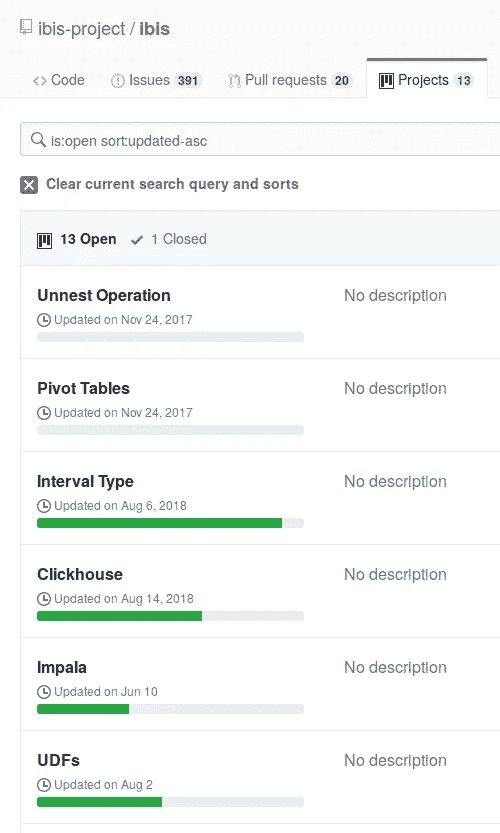

# 如何用 Python 在 Kaggle 上进入 BigQuery 分析？

> 原文：<https://medium.com/analytics-vidhya/how-to-get-into-bigquery-analysis-on-kaggle-with-python-b75ee5e0a79d?source=collection_archive---------15----------------------->

## 可以用 Python 替代 BigQuery SQL 查询吗？

一条懒惰的蟒蛇

这篇文章概述了在 Kaggle 上开始使用 BigQuery 所需的步骤。最初，我认为使用 Python 就足够了。然而，正如我在这里解释的，为了有效地工作，学习一些 BigQuery 似乎是不可避免的。

(本文是用 Python 分析 BigQuery 区块链数据系列文章的一部分。有关该项目的概述，请参见[此链接。](/@nocibambi/blockchain-data-analysis-on-kaggle-with-bigquery-and-python-c7ab2f46ace))

这篇文章的概要:

*   概述了我考虑用来访问区块链数据的 Python 库和方法。
*   简要讨论当前 Python 方法不够用的原因以及 BigQuery 的必要性。
*   学习 BigQuery 的参考资料，重点是在 Kaggle 上使用它。

# 用 Python 访问 BigQuery 的方法

起初，我想避免学习太多的 BigQuery SQL，并希望尽可能地依赖 Python。我最熟悉 Python 的 pandas，它有一些处理 BigQuery 的库和方法。

我调查的是:

*   Python [Ibis 项目](http://ibis-project.org)
*   BigQuery 的[客户端库](https://googleapis.dev/python/bigquery/latest/index.html)。
*   由 Kaggle 的人开发的 bigquery_helper 。
*   Pandas 的 [pandas-read_gbq](https://pandas.pydata.org/pandas-docs/stable/reference/api/pandas.read_gbq.html) 方法及其背后的 [pandas-gbq](https://pandas-gbq.readthedocs.io/en/latest/) 库。

然而，所有这些都在几个方面受到限制:

*   Ibis:不支持 BigQuery 的 UNNEST*操作，虽然它还在路线图中，但是到目前为止，它是最不成熟的问题。
*   BigQuery 的客户端方法:它在开始分析时很方便，但是，同样，它既不支持 UNNEST，也不在它的范围内。不过，当我询问时，他们提供了一些[解决方法代码](https://github.com/googleapis/google-cloud-python/issues/9460#issuecomment-541796213)。
*   bigquery_helper:奇怪的是，尽管几乎所有关于 bigquery 和 SQL 的 Kaggle 教程都在使用它，但它抛出了一个警告，表示它将被弃用。(当我写完这篇文章时，他们实际上重写了一些教程。他们不再使用这个库)。因此，我选择避开它。
*   pandas-read_gpq:这个方法本身接受一个 SQL 查询，并将其转换为 pandas dataframe，因此它的用途非常有限。

(* UNNEST 是用于展平嵌套数组的 BigQuery 操作。我可能会在另一篇文章中写它。)

虽然在这些工具中，Ibis 似乎是未来最有前途的工具，但这不会很快发生。此外，BigQuery 还可以选择对数据运行机器学习算法，这甚至不在 Ibis 的范围内。

使用 Ibis:短期内不会…

# 评估 BigQuery 的需求

在理想的情况下，即使我使用 BigQuery 来提取数据，我仍然会使用 pandas 进行大部分的数据管理和分析。这背后的原因是，首先，我已经习惯了，其次，我可以通过相对快速地尝试不同的查询来更有效地参数化它。

然而，由于数据的巨大规模和查询限制，这是不可行的。因此，值得花些时间仔细考虑我们到底想要提取什么数据，以及我们需要编写什么 SQL 查询。

因此，简而言之，我决定比我最初打算的更坚定地控制 BigQuery。

一只悲伤的熊猫。[杜安·斯美塔纳](https://unsplash.com/@veverkolog?utm_source=medium&utm_medium=referral)在 [Unsplash](https://unsplash.com?utm_source=medium&utm_medium=referral) 上的照片

# 学习 BigQuery 的资源

我在 Kaggle 上找到了一些关于 SQL 实践的参考资料。因为我发现绕过它们有点令人困惑(特别是关于 bigquery-helper 的问题)，所以这里有一个我认为最有用的方法的快速概述:

*   [Kaggle 上的 BigQuery 的一般介绍](https://www.kaggle.com/jessicali9530/tutorial-how-to-use-bigquery-in-kaggle-kernels)。
*   Kaggle 的维护人员刚刚更新了他们的 SQL 教程(以前他们使用的是不推荐的 bigquery-helper 库)。它们非常基础，但仍然有用:[SQL 简介](https://www.kaggle.com/learn/intro-to-sql)和[高级 SQL](https://www.kaggle.com/learn/advanced-sql) 。
*   [关于客户端对象、使用模式和估计查询大小的有用教程](https://www.kaggle.com/sohier/beyond-queries-exploring-the-bigquery-api/)。
*   [ka ggle 上 BigSQL 的实用概述，尤其是关于如何控制资源使用的概述](https://www.kaggle.com/product-feedback/48573)。

Kaggle 还有一系列更实用的 SQL 教程，名为 [SQL 清道夫狩猎](https://www.kaggle.com/rtatman/sql-scavenger-hunt-handbook/)，不过它使用了 bigquery-helper。因此，我不会建议它学习 BigQuery，但我认为它仍然是一个有用的实践资源。

然而，所有这些教程仅仅触及了 SQL 的表面及其 BigQuery 细节。不幸的是，我没有在周围找到太多的 BigQuery 材料，除了上面的那些，它们都假设你在 Google Cloud 上使用 BigQuery。然而，对于在 Kaggle 数据集上的使用，[查询参考指南](https://cloud.google.com/bigquery/docs/query-overview)似乎特别有用。

我还研究了区块链特有的教程，这里不讨论。我可能会在以后的文章中这样做。