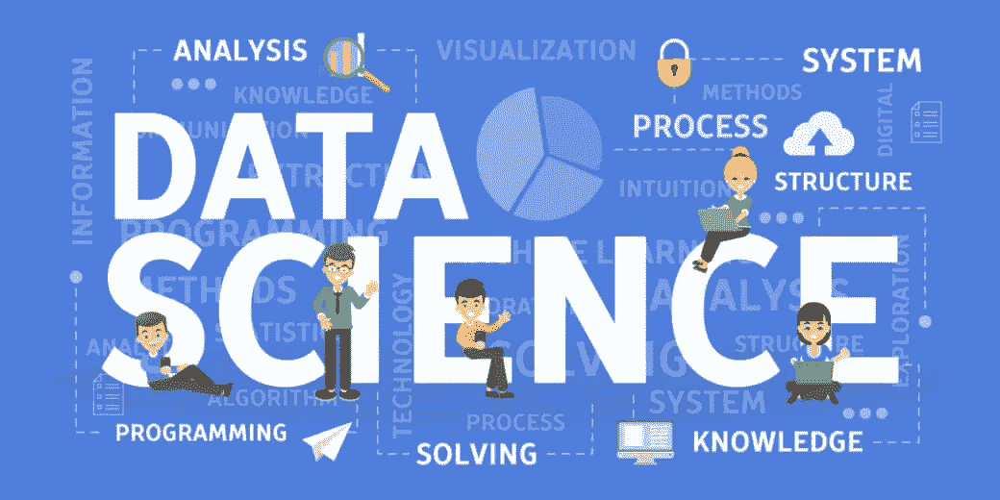

# 数据科学/机器学习/人工智能的完整路线图

> 原文：<https://medium.com/analytics-vidhya/how-to-get-started-with-data-science-ea0643c5ee68?source=collection_archive---------13----------------------->

因此，顾名思义，数据科学就是关于数据，用科学的方法、算法等处理数据。它包括许多概念和理论，如统计，概率，高等微积分，计算机科学，信息科学等。在我们继续之前，有一些人们通常用来与数据科学进行比较的术语，如机器学习…