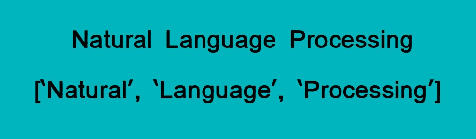
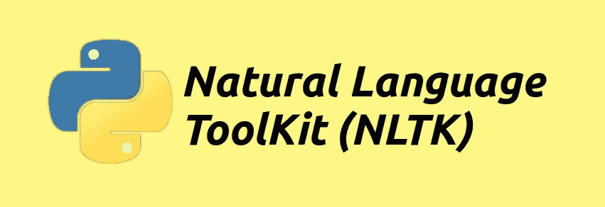

# 如何开始使用 NLP-6 执行令牌化的独特方法

> 原文：<https://medium.com/analytics-vidhya/how-to-get-started-with-nlp-6-unique-methods-to-perform-tokenization-b6a98d23daae?source=collection_archive---------2----------------------->

# 概观

*   想开始学习自然语言处理(NLP)吗？这是完美的第一步
*   了解如何执行标记化，这是为构建 NLP 模型准备数据的一个关键方面
*   我们提出了 6 种不同的方法来对文本数据进行标记化

# 介绍

你是否对互联网上大量的文本数据着迷？您是否正在寻找处理这些文本数据的方法，但不确定从哪里开始？毕竟，机器识别数字，而不是我们语言中的字母。在机器学习中，这可能是一个棘手的问题。

那么我们如何操作和清理这些文本数据来构建模型呢？答案就在[自然语言处理(NLP)](https://courses.analyticsvidhya.com/courses/natural-language-processing-nlp?utm_source=blog&utm_medium=how-get-started-nlp-6-unique-ways-perform-tokenization) 的奇妙世界里。

解决 NLP 问题是一个多阶段的过程。在我们考虑进入建模阶段之前，我们需要首先清理非结构化的文本数据。清理数据包括几个关键步骤:

*   单词标记化
*   预测每个单词的词性
*   文本词汇化
*   识别和删除停用词，等等。


在本文中，我们将讨论第一步——标记化。我们将首先了解什么是记号化，以及为什么在 NLP 中需要记号化。然后，我们将看看在 Python 中执行标记化的六种独特方式。

这篇文章没有先决条件。任何对 NLP 或数据科学感兴趣的人都可以参与进来。如果您正在寻找学习 NLP 的端到端资源，您应该查看我们的综合课程:

*   [使用 Python 的自然语言处理](https://courses.analyticsvidhya.com/courses/natural-language-processing-nlp?utm_source=blog&utm_medium=how-get-started-nlp-6-unique-ways-perform-tokenization)

# 目录

*   什么是 NLP 中的标记化？
*   为什么需要标记化？
*   在 Python 中执行标记化的不同方法
*   使用 Python split()函数进行标记化
*   使用正则表达式的标记化
*   使用 NLTK 的标记化
*   使用空间的标记化
*   使用 Keras 的标记化
*   使用 Gensim 进行标记化

# 什么是 NLP 中的标记化？

在处理文本数据时，标记化是最常见的任务之一。但是术语“标记化”实际上是什么意思呢？

> *标记化本质上是将短语、句子、段落或整个文本文档分割成更小的单元，例如单个单词或术语。这些更小的单元中的每一个都被称为令牌。*

查看下图，了解这一定义:



标记可以是单词、数字或标点符号。在标记化中，通过定位单词边界来创建更小的单元。等等——什么是单词边界？

这是一个单词的结束点和下一个单词的开始点。这些标记被认为是词干化和词汇化的第一步(文本预处理的下一个阶段，我们将在下一篇文章中讨论)。

# 为什么 NLP 中需要标记化？

我想让你想想这里的英语。当你阅读这一部分的时候，选择你能想到的任何一句话，并牢记在心。这将有助于您以更简单的方式理解标记化的重要性。

在处理一种自然语言之前，我们需要确定分词是处理 NLP(文本数据)的最基本步骤。*构成一串字符的单词*。这就是为什么**这很重要，因为通过分析文本中出现的单词，可以很容易地解释文本的意思。**

我们举个例子。考虑下面的字符串:

你认为在我们对这个字符串执行标记化之后会发生什么？我们得到['This '，' is '，' a '，cat']。

这样做有许多用途。我们可以使用这种标记化的形式来:

*   统计课文中的单词数
*   计算单词的频率，也就是某个特定单词出现的次数

诸如此类。我们可以提取更多的信息，我们将在以后的文章中详细讨论。现在，是时候深入到本文的核心了——在 NLP 中执行标记化的不同方法。

# 在 Python 中执行标记化的方法

我们将看到六种可以对文本数据执行标记化的独特方法。我已经为每个方法提供了 Python 代码，因此您可以在自己的机器上跟随。

# 1.使用 Python 的 split()函数进行标记化

让我们从 **split()** 方法开始，因为它是最基本的一种。在用指定的分隔符断开给定的字符串后，它返回一个字符串列表。默认情况下，split()在每个空格处断开一个字符串。我们可以把分隔符改成任何东西。我们去看看。

**分词**

```
Output : ['Founded', 'in', '2002,', 'SpaceX's', 'mission', 'is', 'to', 'enable', 'humans', 'to', 'become', 'a', 'spacefaring', 'civilization', 'and', 'a', 'multi-planet', 'species', 'by', 'building', 'a', 'self-sustaining', 'city', 'on', 'Mars.', 'In', '2008,', 'SpaceX's', 'Falcon', '1', 'became', 'the', 'first', 'privately', 'developed', 'liquid-fuel', 'launch', 'vehicle', 'to', 'orbit', 'the', 'Earth.']
```

**句子标记化**

这类似于单词标记化。这里，我们在分析中研究句子的结构。一个句子通常以句号(。)，所以我们可以用“.”作为分隔符来断开字符串:

```
Output : ['Founded in 2002, SpaceX's mission is to enable humans to become a spacefaring civilization and a multi-planet \nspecies by building a self-sustaining city on Mars', 'In 2008, SpaceX's Falcon 1 became the first privately developed \nliquid-fuel launch vehicle to orbit the Earth.']
```

使用 Python 的 *split()* 方法的一个主要缺点是我们一次只能使用一个分隔符。还有一点需要注意的是——在单词标记化中， *split()* 并没有将标点符号作为单独的标记来考虑。

# 2.使用正则表达式(RegEx)的标记化

首先，让我们了解一下什么是正则表达式。它基本上是一个特殊的字符序列，帮助您使用该序列作为模式来匹配或查找其他字符串或字符串集。

我们可以使用 Python 中的 **re** 库来处理正则表达式。这个库预装了 Python 安装包。

现在，让我们记住正则表达式，执行单词标记化和句子标记化。

**词语标记化**

```
Output : ['Founded', 'in', '2002', 'SpaceX', 's', 'mission', 'is', 'to', 'enable', 'humans', 'to', 'become', 'a', 'spacefaring', 'civilization', 'and', 'a', 'multi', 'planet', 'species', 'by', 'building', 'a', 'self', 'sustaining', 'city', 'on', 'Mars', 'In', '2008', 'SpaceX', 's', 'Falcon', '1', 'became', 'the', 'first', 'privately', 'developed', 'liquid', 'fuel', 'launch', 'vehicle', 'to', 'orbit', 'the', 'Earth']
```

“`\w`”代表“任何单词字符”，通常指字母数字(字母、数字)和下划线(_)。“+”表示任何次数。**所以 *[\w']+* 表示代码应该找到所有的字母数字字符，直到遇到任何其他字符。**


```
Output : ['Founded in 2002, SpaceX's mission is to enable humans to become a spacefaring civilization and a multi-planet \nspecies by building a self-sustaining city on Mars.', 'In 2008, SpaceX's Falcon 1 became the first privately developed \nliquid-fuel launch vehicle to orbit the Earth.']
```

这里，我们比 *split()* 方法有优势，因为我们可以同时传递多个分隔符。在上面的代码中，**我们使用了 *re.compile()* 函数，其中我们传递了[。？！].这意味着只要遇到这些字符，句子就会被拆分。**

有兴趣阅读更多关于 RegEx 的内容吗？以下资源将帮助您开始学习 NLP 中的正则表达式:

*   [Python 正则表达式初学者教程](https://www.analyticsvidhya.com/blog/2015/06/regular-expression-python/)
*   [使用 Python 中的正则表达式库从报告中提取信息](https://www.analyticsvidhya.com/blog/2017/03/extracting-information-from-reports-using-regular-expressons-library-in-python/)

# 3.使用 NLTK 的标记化

现在，这是一个库，你越是处理文本数据，你就会越欣赏它。NLTK 是 Natural Language ToolKit 的缩写，是用 Python 编写的用于符号和统计自然语言处理的库。



您可以使用下面的代码安装 NLTK:

```
pip install --user -U nltk
```

NLTK 包含一个名为 *tokenize()* 的模块，它进一步分为两个子类别:

*   **Word tokenize:** 我们使用 word_tokenize()方法将一个句子分割成记号或单词
*   **句子标记化:**我们使用 sent_tokenize()方法将文档或段落分割成句子

让我们一个一个地看看这两个。

**词语标记化**

```
Output: ['Founded', 'in', '2002', ',', 'SpaceX', ''', 's', 'mission', 'is', 'to', 'enable', 'humans', 'to', 'become', 'a', 'spacefaring', 'civilization', 'and', 'a', 'multi-planet', 'species', 'by', 'building', 'a', 'self-sustaining', 'city', 'on', 'Mars', '.', 'In', '2008', ',', 'SpaceX', ''', 's', 'Falcon', '1', 'became', 'the', 'first', 'privately', 'developed', 'liquid-fuel', 'launch', 'vehicle', 'to', 'orbit', 'the', 'Earth', '.']
```

**句子标记化**

```
Output: ['Founded in 2002, SpaceX's mission is to enable humans to become a spacefaring civilization and a multi-planet \nspecies by building a self-sustaining city on Mars.', 'In 2008, SpaceX's Falcon 1 became the first privately developed \nliquid-fuel launch vehicle to orbit the Earth.']
```

# 4.使用空间库进行标记化

我喜欢空间图书馆。我不记得上一次在做 NLP 项目的时候不用它是什么时候了。它就是这么有用。

spaCy 是高级 [**自然语言处理** (NLP)](https://courses.analyticsvidhya.com/courses/natural-language-processing-nlp?utm_source=blog&utm_medium=how-get-started-nlp-6-unique-ways-perform-tokenization) 的**开源库**。它支持超过 49 种语言，并提供最先进的计算速度。


要在 Linux 中安装 Spacy:

```
pip install -U spacy 
python -m spacy download en
```

要在其他操作系统上安装，请通过[这个链接](https://spacy.io/usage)。

因此，让我们看看如何利用 spaCy 的强大功能来执行标记化。我们将使用支持英语的 spacy.lang.en。

**词语标记化**

```
Output : ['Founded', 'in', '2002', ',', 'SpaceX', ''s', 'mission', 'is', 'to', 'enable', 'humans', 'to', 'become', 'a', 'spacefaring', 'civilization', 'and', 'a', 'multi', '-', 'planet', '\n', 'species', 'by', 'building', 'a', 'self', '-', 'sustaining', 'city', 'on', 'Mars', '.', 'In', '2008', ',', 'SpaceX', ''s', 'Falcon', '1', 'became', 'the', 'first', 'privately', 'developed', '\n', 'liquid', '-', 'fuel', 'launch', 'vehicle', 'to', 'orbit', 'the', 'Earth', '.']
```

**句子标记化**

```
Output : ['Founded in 2002, SpaceX's mission is to enable humans to become a spacefaring civilization and a multi-planet \nspecies by building a self-sustaining city on Mars.', 'In 2008, SpaceX's Falcon 1 became the first privately developed \nliquid-fuel launch vehicle to orbit the Earth.']
```

在执行 NLP 任务时，spaCy 比其他库要快得多(是的，甚至是 NLTK)。我鼓励你听下面的 DataHack 广播播客，了解 spaCy 是如何创建的背后的故事以及你可以在哪里使用它:

*   数据黑客电台#23:伊内斯·蒙塔尼和马修·霍尼巴尔 spaCy 背后的大脑

这里有一个深入的教程让你开始使用 spaCy:

*   [自然语言处理变得简单——使用 SpaCy(在 Python 中)](https://www.analyticsvidhya.com/blog/2017/04/natural-language-processing-made-easy-using-spacy-%E2%80%8Bin-python/?utm_source=blog&utm_medium=how-get-started-nlp-6-unique-ways-perform-tokenization)

# 5.使用 Keras 的标记化

喀拉斯！目前业界最热门的深度学习框架之一。它是一个用于 Python 的开源神经网络库。Keras 超级好用，也可以在 TensorFlow 上面运行。

在 NLP 上下文中，我们可以使用 Keras 来清理我们通常收集的非结构化文本数据。


您可以只使用一行代码在您的机器上安装 Keras:

```
pip install Keras
```

让我们开始吧。为了使用 Keras 执行单词标记化，我们使用来自*Keras . preprocessing . text*类的 *text_to_word_sequence* 方法。

让我们看看 Keras 的行动。

**单词标记化**

```
Output : ['founded', 'in', '2002', 'spacex's', 'mission', 'is', 'to', 'enable', 'humans', 'to', 'become', 'a', 'spacefaring', 'civilization', 'and', 'a', 'multi', 'planet', 'species', 'by', 'building', 'a', 'self', 'sustaining', 'city', 'on', 'mars', 'in', '2008', 'spacex's', 'falcon', '1', 'became', 'the', 'first', 'privately', 'developed', 'liquid', 'fuel', 'launch', 'vehicle', 'to', 'orbit', 'the', 'earth']
```

Keras 在标记字母之前降低了所有字母的大小写。你可以想象，这为我们节省了很多时间！

# 6.使用 Gensim 进行标记化

我们将在这里介绍的最后一种标记化方法是使用 Gensim 库。**它是一个用于无监督主题建模和自然语言处理的开源库**，旨在从给定文档中自动提取语义主题。

以下是安装 Gensim 的方法:

```
pip install gensim
```

我们可以使用 *gensim.utils* 类导入 *tokenize* 方法来执行单词标记化。

**词语标记化**

```
Outpur : ['Founded', 'in', 'SpaceX', 's', 'mission', 'is', 'to', 'enable', 'humans', 'to', 'become', 'a', 'spacefaring', 'civilization', 'and', 'a', 'multi', 'planet', 'species', 'by', 'building', 'a', 'self', 'sustaining', 'city', 'on', 'Mars', 'In', 'SpaceX', 's', 'Falcon', 'became', 'the', 'first', 'privately', 'developed', 'liquid', 'fuel', 'launch', 'vehicle', 'to', 'orbit', 'the', 'Earth']
```

**句子标记化**

为了执行句子标记化，我们使用来自*gensim . summerization . text tcleaner*类的 *split_sentences* 方法:

```
Output : ['Founded in 2002, SpaceX's mission is to enable humans to become a spacefaring civilization and a multi-planet ', 'species by building a self-sustaining city on Mars.', 'In 2008, SpaceX's Falcon 1 became the first privately developed ', 'liquid-fuel launch vehicle to orbit the Earth.']
```

你可能已经注意到 Gensim 对标点符号非常严格。每当遇到标点符号时，它就会拆分。在句子分割中，Gensim 在遇到“\n”时标记文本，而其他库忽略它。

# 结束注释

标记化是整个 NLP 流程中的一个关键步骤。我们不能不首先清理文本就直接进入模型构建部分。

在本文中，我们看到了给定文本的六种不同的标记化方法(单词和句子)。还有其他方法，但这些方法足以让你开始这个话题。

我将在以后的文章中介绍其他文本清理步骤，如删除停用词、词性标注和识别命名实体。在那之前，继续学习！

你也可以在分析 Vidhya 的 Android 应用上阅读这篇文章


相关文章

*原载于 2019 年 7 月 18 日*[*【https://www.analyticsvidhya.com】*](https://www.analyticsvidhya.com/blog/2019/07/how-get-started-nlp-6-unique-ways-perform-tokenization/)*。*