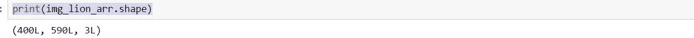

# 如何入门 OpenCV 进行图像处理？

> 原文：<https://medium.com/analytics-vidhya/how-to-get-started-with-opencv-for-image-processing-d09e2be42b89?source=collection_archive---------17----------------------->


# 为什么使用 OpenCV 进行图像处理？

OpenCV(开源计算机视觉库)是一个开源的计算机视觉和机器学习软件库。OpenCV 旨在为计算机视觉应用提供一个公共基础设施，并加速机器感知在商业产品中的应用。作为一个 BSD 许可的产品，OpenCV 使得企业利用和修改代码变得很容易。

该库拥有超过 2500 种优化算法，包括一套全面的经典和最先进的计算机视觉和机器学习算法。这些算法可以用来识别相机和视频中的对象，检测移动对象，合并图像和大量的图像处理。这使得 OpenCv 成为一个非常方便和全面的图像处理和分析工具。该库最初是用 C++编写的。一个非常好的 Python 支持可以使任务变得更容易。

# 入门指南

对于图像操作，我们将需要安装以下库。

*   Numpy
*   Matplotlib
*   PIL
*   OpenCV

在使用 OpenCv 之前，首先让我们看看如何使用 Numpy、PIL 和 Matplotlib 加载和创建图像并可视化它们。

图像是数值范围从 0 到 255 的 numpy 矩阵，表示颜色的像素值。对于图像，我们有格式为*(高*宽*通道数)的尺寸。*对于灰度图像***通道数为 1*** *，*对于彩色图像***通道数为 3(红、绿、蓝)。***

## 使用 Numpy 创建图像

```
import numpy as np
import matplotlib.pyplot as plt
from PIL import Imageimg = np.zeros((512,512,3))
```

让我们使用 matplotlib 可视化图像。

```
plt.imshow(img)
```


用 matplotlib 可视化图像

我们也可以使用枕头库来加载图像。

```
img_lion = Image.open(“Images\lion.jpg”)
plt.imshow(img_lion)
```


狮子

```
print(img_lion_arr.shape)
```



上图的形状是(400，590，3)。它有红色、绿色和蓝色三个通道。

## 可视化单个通道

```
# RED CHANNEL
plt.imshow(img_lion_arr[:,:,0],cmap=’gray’)
```


cmap= '灰色'的红色通道

```
# GREEN CHANNEL
plt.imshow(img_lion_arr[:,:,1],cmap=’gray’)
```


cmap= '灰色'的绿色通道

```
# BLUE CHANNEL
plt.imshow(img_lion_arr[:,:,2],cmap=’gray’)
```


cmpa= '灰色'的蓝色通道

# 使用 OpenCV

加载图像

```
import cv2
cv_img = cv2.imread(“Images\lion.jpg”)
```

默认情况下，OpenCv 按照 BGR(蓝、绿、红)顺序加载图像。

```
plt.imshow(cv_img) # B G R Channel
```


BGR Opencv

为了以 RGB 顺序可视化图像，我们必须使用 opencv 的 **cv2.cvtColor.** 将图像转换为(R，G，B)

```
fixed_cv_img = cv2.cvtColor(cv_img,cv2.COLOR_BGR2RGB)
plt.imshow(fixed_cv_img)
```


RGB

将图像调整到新的像素尺寸。

```
new_img = cv2.resize(fixed_cv_img,(200,200))
plt.imshow(new_img)
```


使用 OpenCv 调整大小

我们甚至可以使用宽度和高度的比例。

```
w_ratio = 0.5
h_ratio = 0.5
new_ratio_img = cv2.resize(fixed_cv_img,(0,0),fixed_cv_img,w_ratio,h_ratio)
```

**反转图像**

```
inv_imge = cv2.flip(new_ratio_img,0)
plt.imshow(inv_imge)
```


倒像

**在磁盘上保存反转图像**

我们将使用 cv2.imwrite 来保存图像

```
cv2.imwrite(“inverted_image.jpg”,cv2.cvtColor(inv_imge, cv2.COLOR_RGB2BGR))
```

**在图像上绘图**

```
import numpy as np
import matplotlib.pyplot as plt
import cv2
draw_img = np.zeros((512,512,3),dtype=np.int16)
cv2.rectangle(draw_img,pt1=(384,10),pt2=(500,150),color=(0,255,0),thickness=8)
```

*cv2.rect* 在图像上绘制一个给定大小和参数的矩形。使用 matplotlib 绘图时，图像看起来会像这样

```
plt.imshow(draw_img)
```


画一个矩形

**绘制其他形状**

```
cv2.circle(img=draw_img,center=(100,100),radius=50,color=(255,0,0),thickness=8)
plt.imshow(draw_img)
```


形状

为了绘制填充形状，我们可以将厚度参数设置为-1，如本例所示。

```
cv2.circle(img=draw_img,center=(400,400),radius=50,color=(255,0,0),thickness=-1)
plt.imshow(draw_img)
```


实心圆

**行和文本**

```
cv2.line(draw_img,pt1=(0,0),pt2=(512,512),color=(102,255,255),thickness=5)
font = cv2.FONT_HERSHEY_SIMPLEX
cv2.putText(draw_img,text=”Mithilesh”,org=(10,500),fontFace=font,fontScale=4,color=(255,255,255),thickness=3,lineType=cv2.LINE_AA)
plt.imshow(draw_img)
```


线条和文本

绘制多边形

```
cv2.polylines(poly_img,[pts],isClosed=True,color=(255,0,0),thickness=5)
plt.imshow(poly_img)
```


多边形

所以伙计们，这就是这篇文章的全部内容。这只是触及了 OpenCV 的皮毛。OpenCV 是一个更高级的图像处理库。本文将帮助您开始使用 OpenCv，并为您提供基础知识。一定要看看我即将在 OpenCV 上发表的高级图像处理博客。

谢谢读者。非常欢迎和感谢您的反馈和支持。