# Python 如何入门？

> 原文：<https://medium.com/analytics-vidhya/how-to-get-started-with-python-2c75c9d46abf?source=collection_archive---------22----------------------->

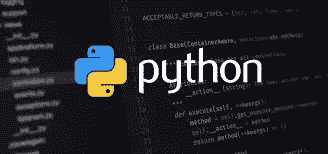

Python 是一种免费、开源、跨平台的计算机语言。

什么是跨平台？也就是说，Python 可以运行在 Windows、macOS、Linux 等多种平台上，并且已经移植到 JAVA 和。NET 虚拟机。

现在的 Linux 和 Mac 大部分都预装了 Python。但是版本可能已经过时了，因此安装最新的版本总是一个好主意。

# 安装 Python

1.下载 python 的[最新版本。](https://www.python.org/downloads/)

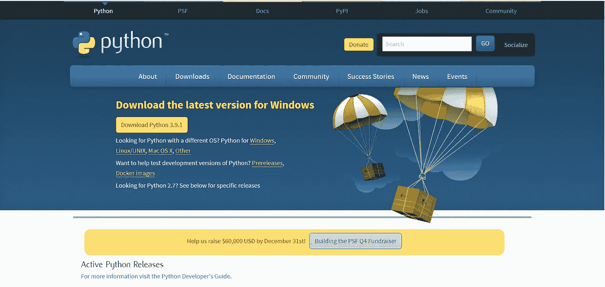

下载 Python | Python.org

2.运行已安装的文件，并按照流程下载 Python。

在这个过程中，你必须勾选**将 Python 添加到环境变量**，它能够将 Python 添加到环境变量，并允许你从计算机的任何部分运行 Python。

您还可以更改 Python 的安装路径。

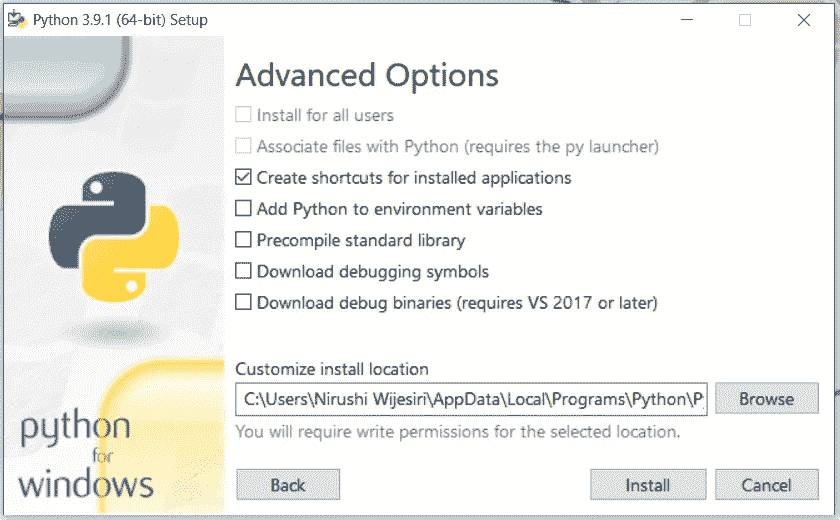

Python 安装过程中的高级选项

最后，只需点击**安装**按钮 Python 就会自动下载到你的电脑上。

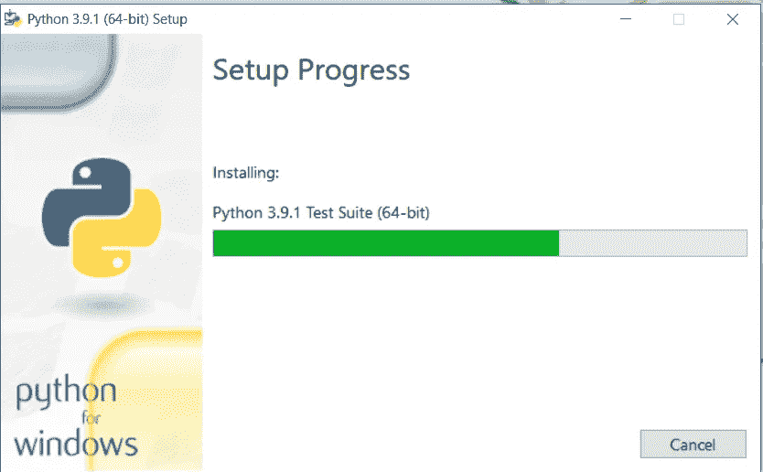

安装 Python

完成安装过程后，您可以在计算机上运行 Python。运行 Python 有两种主要方式。

**1)在即时模式下运行 Python**

打开计算机上的命令提示符，键入 *python* ，然后按回车键。你将能够看到你已经安装到你的计算机上的 Python 版本，并且它将在即时模式下调用解释器。

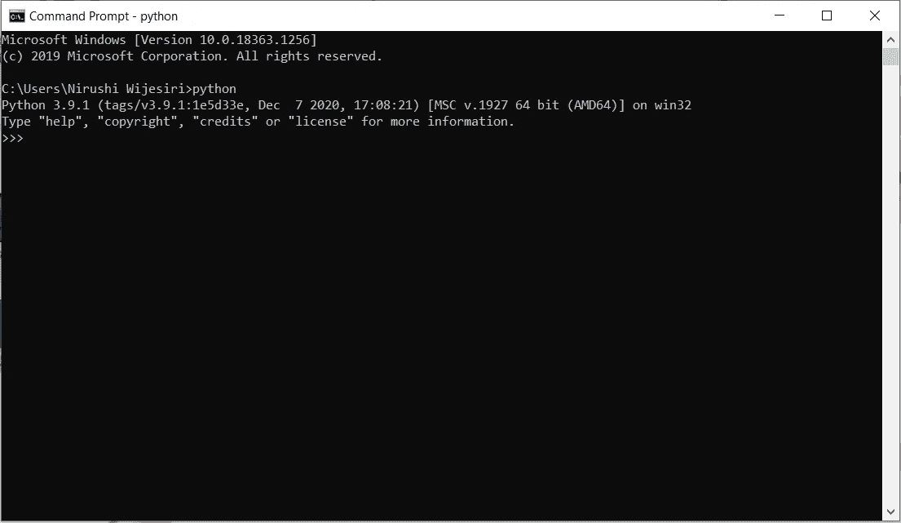

即时模式下的 Python)

在这里，我们可以键入 Python 代码，然后按 enter 键获得输出。大多数情况下，这将被用作计算器。尝试键入 *2+2* 并按回车键。你会看到下一行显示的是 *4* 。

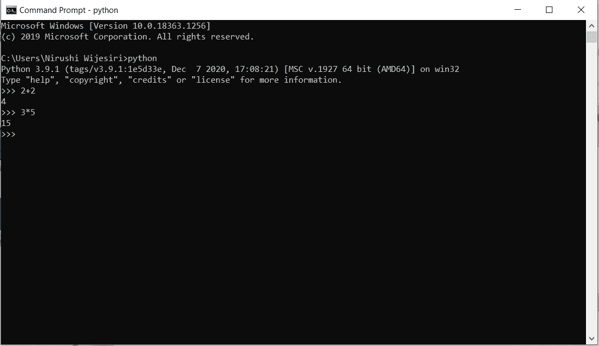

即时模式下的 Python)

通过输入 *quit()* 并按回车键，您可以退出该模式。

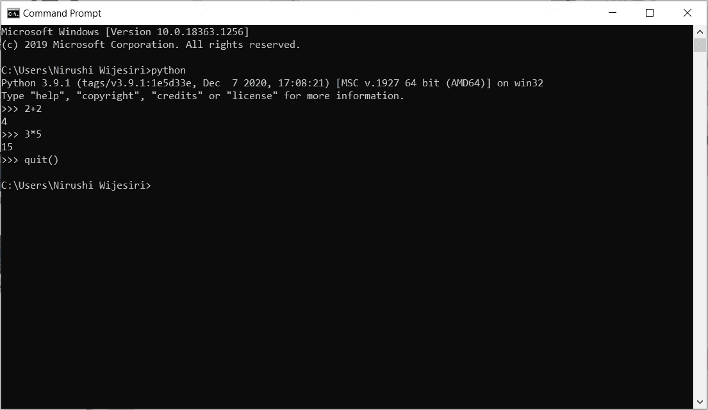

即时模式下的 Python)

**2)在集成开发环境(IDE)中运行 Python**

> IDE 是一个软件，它提供了一些有用的功能，如代码提示、语法高亮和检查、文件浏览器等。程序员进行应用程序开发。

当您安装 Python 时，Python IDE 也会自动安装，名为 **IDLE** 。你可以用它在你的电脑上运行 Python 程序。

相信我，这太简单了！！！

当你空闲时打开 Python，一个吸引人的 Python shell 将会打开，这对初学者来说是非常合适的。

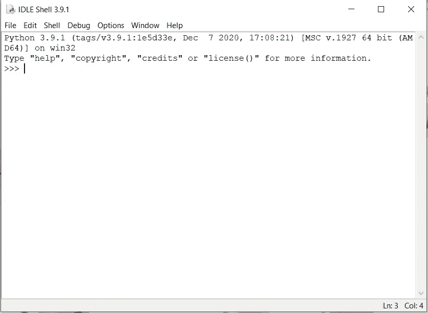

Python IDLE | Python Shell

Python shell 更像是命令提示符。它也可以用作计算器。试试下面的例子，看看有多简单。

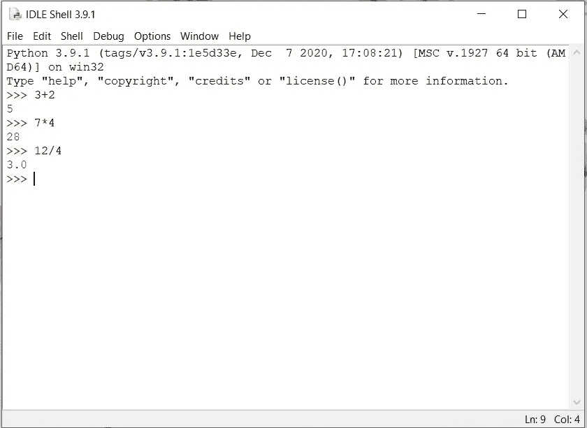

Python shell 作为计算器

是时候编写你的第一个 Python 程序了。

点击 Python 外壳顶部的*“文件”*按钮。它将打开一个空白文件，并在其中键入以下语句。

```
print("Hello World!")
```

之后，以任何名称保存文件，但必须用。py 扩展名结尾。例如，我将把我的文件保存为“ *Hello.py”。*

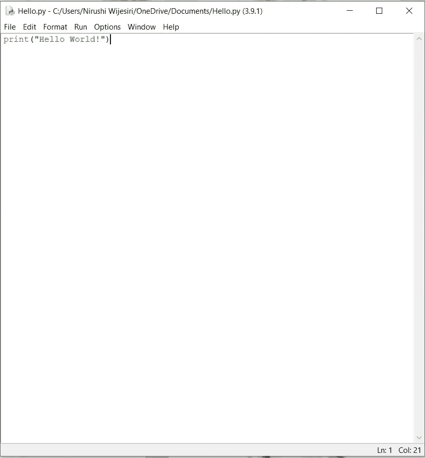

Hello.py 文件

要运行文件，进入**运行>运行模块**或简单地按下 **F5** 。然后，您将看到特定文件的输出。根据我们的 *Hello.py* 文件，它打印 ***Hello World！*** 在闲着。

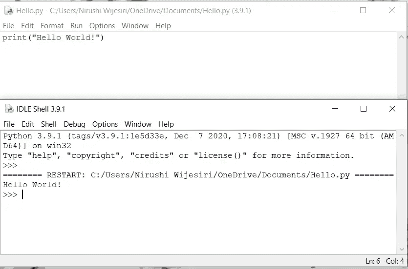

Hello.py 文件的输出

恭喜你！！！你刚刚用 Python 写了你的第一个程序！

正如你所看到的，这真的很简单，规则也很少。只要看程序就能猜到输出。这就是 Python 编程的妙处。