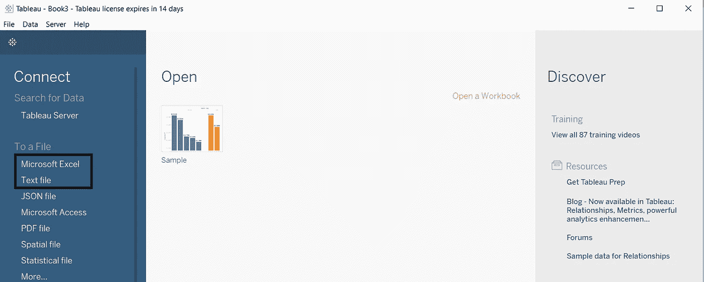
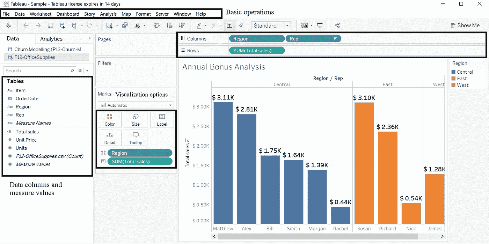
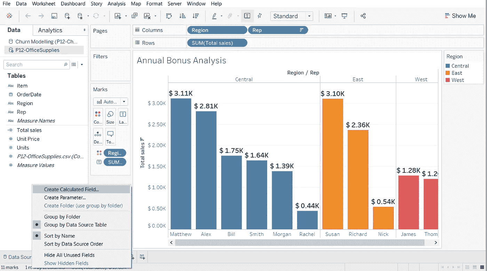
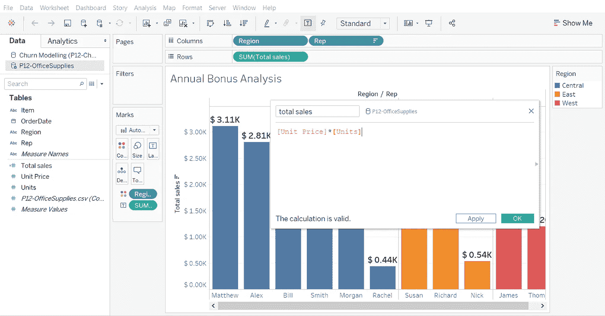

# Tableau 怎么入门？

> 原文：<https://medium.com/analytics-vidhya/how-to-get-started-with-tableau-93d7fb0e0ed5?source=collection_archive---------22----------------------->

[粘土银行](https://unsplash.com/@claybanks?utm_source=medium&utm_medium=referral)在 [Unsplash](https://unsplash.com?utm_source=medium&utm_medium=referral) 拍摄的照片

Tableau 是一个非常棒的交互式数据可视化工具，也是数据科学家和分析师用来可视化和分析有洞察力的数据的最流行的工具之一。它是由一家名为 Tableau Software 的美国公司开发的，创始人是克里斯蒂安·沙博特、帕特·汉拉汉和克里斯·斯托尔特。谈了简史之后，现在是时候深入一点这个场景的基础了。所以让我们开始吧！

在这篇文章中，我们将谈论以下事情:

1.  *将 Tableau 连接到数据文件(。csv 或。xlsx 文件)*
2.  *导航表*
3.  *计算 Tableau 中的字段*
4.  *颜色和格式*

# 将 Tableau 连接到数据文件

如果你是一个新手，担心如何将你的数据文件连接到 Tableau，不要担心！比你能想到的要简单。你需要做的就是:

1.  开放式桌面
2.  在登录页面的左侧，您会看到一个包含文本文件和 excel 文件选项的栏。
3.  继续点击你选择的文件类型。
4.  你完了！

# 导航表格

一旦你成功地将你的文件添加到 Tableau，现在是时候看看这个软件了。我在这里使用了从[下载的数据集。](https://www.superdatascience.com/training)

如果你看到上面的图片，我已经标记了某些部分，并添加了一些标签。不要担心你在那里看到的视觉化。我将在本主题的后半部分解释这一点。因此，您看到的第一个标记是“*数据列和测量值*”——这描绘了导入文件中的列以及与之相关的单位。标签“*可视化选项*”有助于格式化工作表的可视化方面，如颜色、大小、标签、细节和工具提示。“*基本操作*”标签有助于防止有人被困在某处。最后但并非最不重要的一点是，您可以在基本操作部分看到的“行和列”可以帮助您选择要在工作表的可视化部分使用的字段。

现在，来看上面的图表，我已经从数据集中选择了区域和代表性列来表示我的图表中的列。这就是为什么您可以在 x 轴上看到代表的姓名，以及与之相对的区域分隔。就行而言，我选择了显示总销售额，这可以通过使用计算字段很容易地找到，我将在下一点中讨论。

# 计算 Tableau 中的字段

假设我想找出销售额最高的代表的名字。如果你看数据集，它不会直接提供这些信息。因此，为了计算总销售额，我们需要用单位价格乘以单位数量。这就是计算领域发挥作用的地方。您现在需要做的就是，右键单击左侧栏，您将看到一个弹出窗口，如下图所示:

完成后，您将看到计算字段提示，您可以继续执行您选择的操作！

# 颜色和格式

数据可视化不仅仅是关于数据。它可以让你摆弄数据，激发你的艺术天赋。正如您在标记调板中看到的，有一个名为 color 的块。如果你想让你的数据看起来很酷，只要把列拖到色块上，就可以了。

您还可以通过右键单击所选的列并转到格式选项来格式化列及其在数据中的显示方式。格式部分允许您操作数据在可视化中的呈现方式。

因此，在这篇文章中，我们讨论了如何使用 Tableau 的基础知识。希望这有帮助！