# 使用迁移学习轻松执行图像处理。

> 原文：<https://medium.com/analytics-vidhya/how-to-get-started-with-transfer-learning-6aa53fc07f31?source=collection_archive---------23----------------------->

在图像处理中，建立相当精确的模型是非常困难的。但是通过迁移学习，我们可以很容易地采用预先训练好的模型，并根据我们的需要对它们进行调整，从而轻松实现良好的准确性。

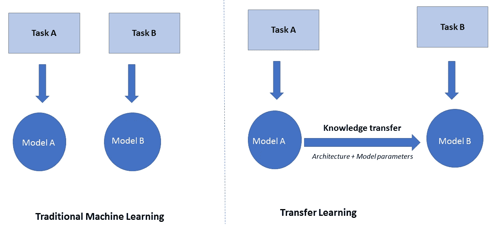

来源:谷歌

上图简单说明了迁移学习。我们把已经训练好的模型和它的权重一起，去掉最后几层，然后根据我们的需要添加层。

让我们从 Kaggle 中探索[猫狗](https://www.kaggle.com/tongpython/cat-and-dog)数据集。你可以和这个 [Kaggle 笔记本](https://www.kaggle.com/narasimha00076/transfer-learning-using-mobilenetv2)一起阅读这篇文章。我强烈建议您通过执行笔记本中的单元格来阅读本文。

让我们开始这个项目吧。

让我们将数据集加载到 train_data 和 test_data 列表中。我们使用 OpenCV 来实现这一点。我们使用 tf.image 调整图像的大小。

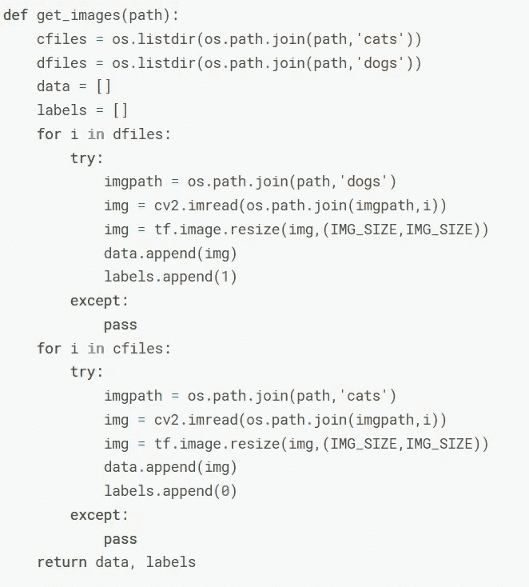

从文件夹加载数据

让我们检查火车的长度和测试数据。

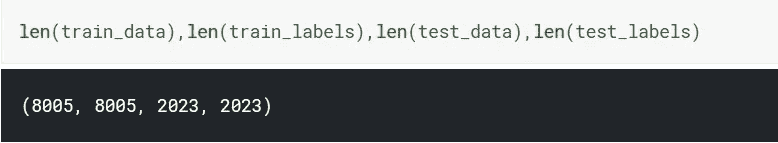

训练数据和测试数据的长度

现在，为了提高效率，将这些训练和测试数据转换为 Tensflow 数据集对象。它接受图像和标签，并将它们组合成数据集对象。这些数据集对象提供了各种功能。例如，我们可以相对于彼此洗牌。

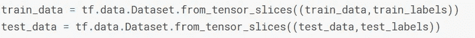

将它们转换成数据集对象

现在让我们格式化图像。我们将图像转换为浮点型，并将其标准化，然后将其大小调整为(160，160)。我们的基本模型(我们使用的预训练模型)接受这种形状。

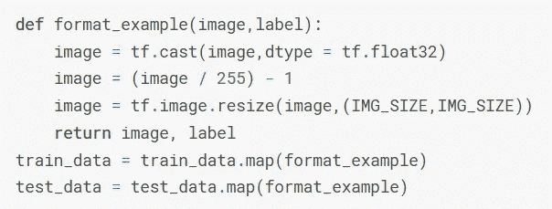

格式化图像

让我们把它们分成几批，然后洗牌。

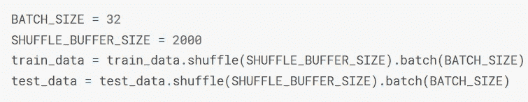

批处理和洗牌

现在，我们都有了训练数据。

让我们将 MobileNetV2 实例化为我们的预训练模型。让我们把 IMG 形状固定为(160，160，3)。我们使用 ImageNet 权重，这是训练它的数据集。我们设置 include_top = False，以便不使用 MobileNet 的最后几层。我们根据自己的需求定义最后几层。

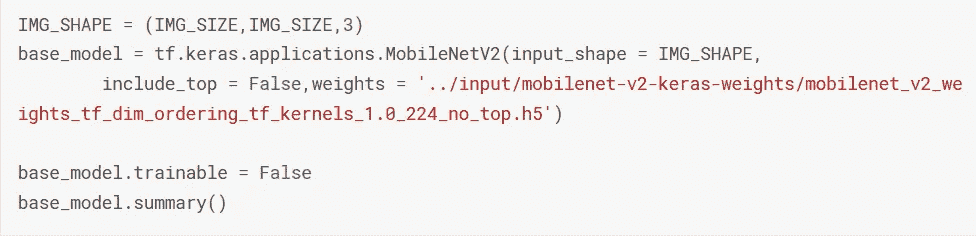

下面是基本模型的最后几层，以及可训练和不可训练的参数。

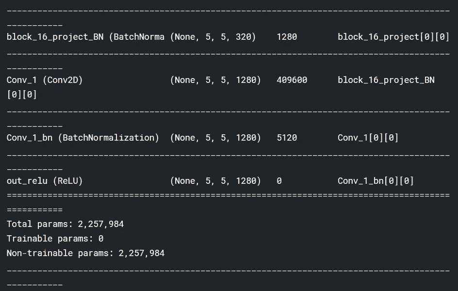

最后几层和参数

让我们检查和评估层的形状。首先，训练数据中图像批次的形状。

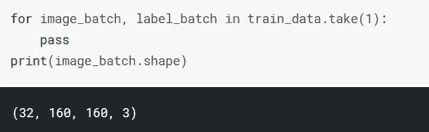

训练数据中批次的形状

检查基础模型的输出形状。

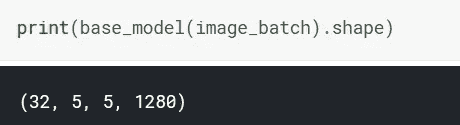

基本模型输出形状

让我们添加全球平均池层。它在 5X5X1280 上执行平均池化，并将其转换为 1X1280。然后我们可以添加我们的密集层来执行分类。让我们检查它的输出形状。

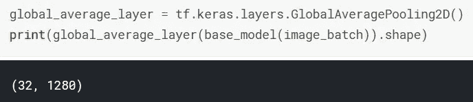

全球平均池的产出

让我们用 Relu 激活增加 32 个神经元的密集层。

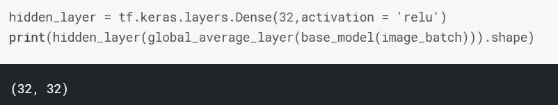

隐藏层的输出

让我们添加一个具有 1 个神经元的密集层，用于分类。

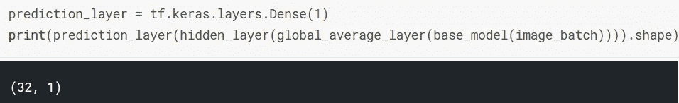

最终层输出形状

所有这些层都工作正常，因此，让我们用它们制作一个顺序模型。

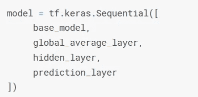

顺序模型

让我们保持学习率为 0.0001，并使用 RMSprop 作为优化器，使用准确性作为编译模型的指标。

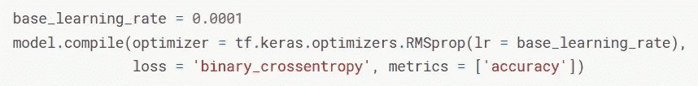

编译模型

总结。

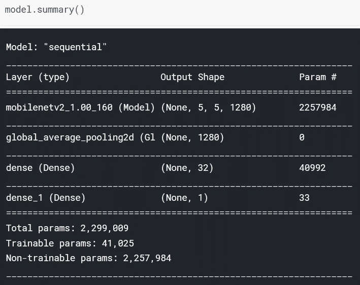

摘要

为了保存最佳模型，让我们使用模型检查点并将其保存为 best_model.h5。

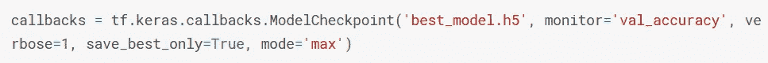

复试

让我们计算每个时期的步数，并检查测试数据的准确性。

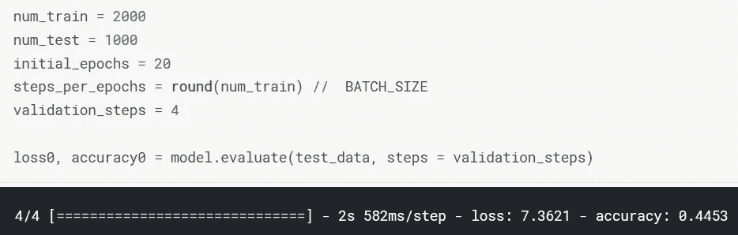

每个时期的步骤

现在我们终于可以训练模型了。

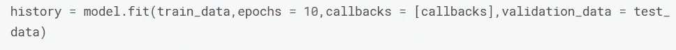

培养

让我们加载保存的最佳权重。

装载重量

让我们根据测试数据评估模型。

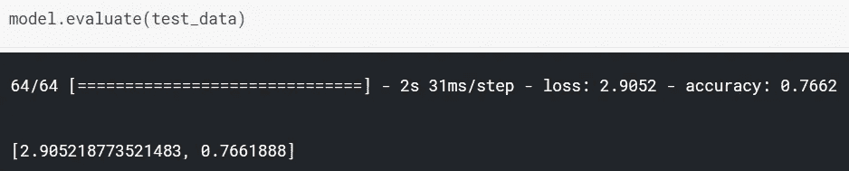

预言；预测；预告

我们有 76%的准确率。

所以，这就是迁移学习的优势。我们没有经历用试错法创建模型，并以各种方式进行优化的痛苦过程。

那么，迁移学习怎么样呢？请在下面的评论中告诉我你的想法。

这是 GitHub 上完整项目的链接。

感谢阅读。