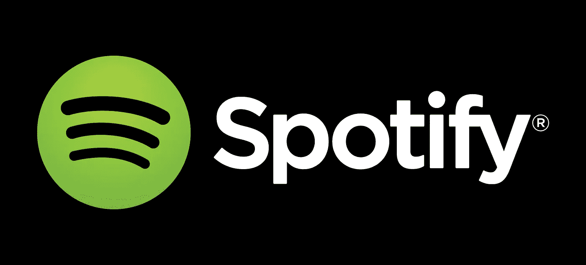
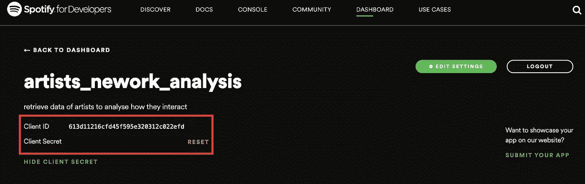
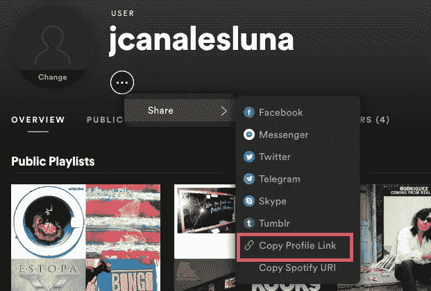
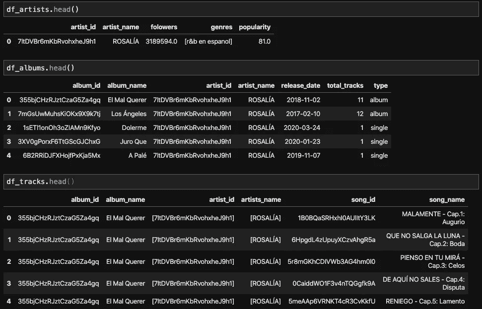

# 如何使用 Python 库 Spotipy 从 Spotify 获取您喜爱的艺术家的音乐数据

> 原文：<https://medium.com/analytics-vidhya/how-to-get-your-favourite-artist-music-data-from-spotify-using-the-python-library-spotipy-d5c25065c91e?source=collection_archive---------5----------------------->



## 图书馆的名字选得再好不过了

你有没有想过门乐队出了多少张专辑？或者想知道披头士乐队*、*的*乐队【塞根特胡椒孤独之心俱乐部】发行的确切日期？或者也许你只是一个数据音乐(或音乐数据)极客，想知道如何从 Spotify API 中检索音乐数据**。***

不管是什么原因，在本文中，我将制作一个如何使用 S **potipy** 的基础教程，这是 Spotify Web API 的轻量级 Python 库。特别是，我将解释你如何创建一个程序来**检索关于一个艺术家，他们的专辑和他们的歌曲的数据，并把这些信息放入熊猫数据框，准备进行数据分析！**

## 1.Spotify API 入门

对于那些不熟悉的人来说，API 是应用程序编程接口的缩写，它是一种软件中介，允许两个应用程序相互交互。

Spotify API 可以被视为用户应用程序和 Spotify 平台之间的‘桥梁’(如下图所示)。特别是，API 提供了几个端点，直接从 Spotify 数据目录返回关于音乐艺术家、专辑和曲目的 [**JSON 元数据**](https://developer.spotify.com/documentation/web-api/reference/object-model/) 。要了解更多关于 API 和不同类型的端点的信息，我强烈推荐看一看 API [**文档**](https://developer.spotify.com/documentation/) **。**


图片来自 Spotify API 文档页面

因此，为了从 Spotify 中提取音乐数据，首先你必须建立一个 Spotify 开发者账户，并创建一个应用程序。这里的 可以做 [**是一个非常简单快捷的过程。**](https://developer.spotify.com/dashboard/login)

## 2.身份验证设置和令牌

一旦你设置了你的账户和应用程序，你就必须获得你的凭证才能连接到 Spotify 平台。特别是，你必须获得你的**客户 ID** 、你的**客户秘密**，以及你的**用户名**来请求允许你检索音乐数据的令牌。



前两个代码可以在你的应用仪表板中找到(见上图)，而你的用户名可以在你的**个人资料链接**的最后几个字符中找到(见下图，获取链接的简单方法)。



幸运的是，Spotipy 提供了一个实用方法`util.prompt_for_user_token`来简化这个过程，允许您将应用凭证作为参数直接传递给方法:

```
util.prompt_for_user_token(username,
                         scope,
                         client_id='your-spotify-client-id',
                         client_secret='your-spotify-client secret',
                         redirect_uri='your-app-redirect-url')
```

另外两个参数是 scope 和 redicrect_uri。Spotify 要求前者确保使用第三方应用的用户只分享他们选择分享的信息。你可以在这里 **了解更多关于 scopes [**。**前者相当于一个有效的 URL，Spotify 认证服务器会在成功登录后重定向到该 URL。](https://developer.spotify.com/documentation/general/guides/scopes/)**

## 3.提取音乐数据

一旦你有了令牌，你就准备好获取音乐数据了！我强烈建议您阅读 Spotipy [**文档指南**](https://spotipy.readthedocs.io/en/2.11.2/) ，这样您就可以熟悉它的简单语法。此外，它还包含了如何使用不同端点请求数据的多个示例。

显然，在做任何事情之前，确保您已经安装了 Spotipy 包。通常，这可以使用 pip 轻松完成:

```
pip install spotipy
```

从 Ian Annase 在他的[**youtube 教程中使用的代码中获得灵感，我编写了一个程序，它使用 Spotify 浏览器功能来搜索艺术家，并直接显示该艺术家的整个唱片目录，包括每张专辑的曲目。同时，音乐数据存储在三个独立的熊猫数据帧中，第一个包含关于搜索的艺术家的信息，第二个包含关于专辑的信息，第三个包含关于曲目的信息。我保留了项目的 Spotify ids，以便在表格需要连接时更容易使用。**](https://www.youtube.com/watch?v=tmt5SdvTqUI)

下面你可以看到代码的主体:

举个例子，这是我搜索 [**罗萨莉娅**](https://en.wikipedia.org/wiki/Rosal%C3%ADa_(singer)) **，**当前拉丁乐坛最杰出的艺术家之一:

```
Artist's name:  rosaliaROSALÍAALBUM: El Mal Querer
1: MALAMENTE - Cap.1: Augurio
2: QUE NO SALGA LA LUNA - Cap.2: Boda
3: PIENSO EN TU MIRÁ - Cap.3: Celos
4: DE AQUÍ NO SALES - Cap.4: Disputa
5: RENIEGO - Cap.5: Lamento
6: PRESO - Cap.6: Clausura
7: BAGDAD - Cap.7: Liturgia
8: DI MI NOMBRE - Cap.8: Éxtasis
9: NANA - Cap.9: Concepción
10: MALDICIÓN - Cap.10: Cordura
11: A NINGÚN HOMBRE - Cap.11: Poder

ALBUM: Los Ángeles
12: Si Tú Supieras Compañero
13: De Plata
14: Nos Quedamos Solitos
15: Catalina
16: Día 14 De Abril
17: Que Se Muere Que Se Muere
18: Por Mi Puerta No Lo Pasen
19: Te Venero
20: Por Castigarme Tan Fuerte
21: La Hija De Juan Simón
22: El Redentor
23: I See A Darkness

ALBUM: Dolerme
24: Dolerme

ALBUM: Juro Que
25: Juro Que

ALBUM: A Palé
26: A Palé...
```

该程序以 while 循环格式构建，因此您可以搜索各种艺术家，而无需重新运行该程序。一旦完成，您只需打破循环并检查数据库的内容。下面你可以找到我的搜索结果:



## 4.结论

本教程旨在帮助您理解 Spotify API 以及如何使用 Python 库 Spotipy 从 Spotify 平台检索音乐数据。如果你对代码的细节感兴趣，可以看看我的 [**Github 库**](https://github.com/jcanalesluna/music_data_spotipy/blob/master/extract_data_spotify.ipynb) 。希望对你有帮助！