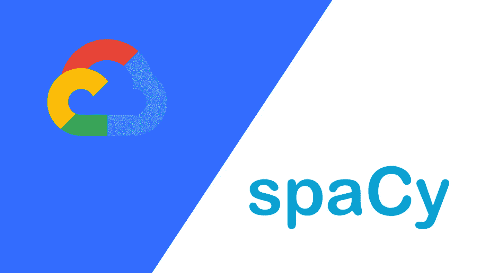

# 如何从 SpaCy 轻松过渡到 Google Cloud NLP？

> 原文：<https://medium.com/analytics-vidhya/how-to-go-from-spacy-to-google-cloud-nlp-easily-aa0b80d1c34f?source=collection_archive---------8----------------------->



## 语境

一年前，我做了一个很酷的项目:“神灯”。神灯是一个智能玩具，它能够只用你的声音实时生成图形。它使用语音识别、自然语言处理和动画的组合，以便将您的睡前故事翻译成投影到墙上的神奇动画。

当时我对 NLP 一无所知，所以我决定对许多框架进行基准测试，看看哪一个最适合这个项目。我比较了这些解决方案的速度和准确性，当时，我发现 SpaCy 是最相关的。它的速度足够快，可以在几秒钟内分析超过 10 个句子。

随着时间的推移，我真的习惯了 SpaCy 的简单，但几个月后，我开始从事一个新项目:一个在线编辑器，它可以建议修改，使文本更容易理解。FALC 是使信息易于阅读和理解的欧洲标准。这个智能编辑器的目标是将复杂的法国行政文本转换成更简单的文本，使智障人士也能阅读。

为了建议文本简化，软件必须理解每个句子的语法结构。在法语中，最复杂的句子类型之一是同位语句。但不幸的是，SpaCy 的法语模型在其 dep(句法依赖关系)列表中不包含“appos”。SpaCy 的另一个问题来自于这样一个事实，即随着文本变大，处理时间也会增加。而 Google Cloud NLP“不”是这种情况(感谢它巨大的处理能力)。

这就是为什么我决定去谷歌云 NLP。

## Google Cloud NLP 的问题

与 SpaCy 相反，Google Cloud NLP 的文档非常糟糕，并且没有提供官方框架来处理数据。基本上你只是得到一个 json 字符串和你处理过的文本。与许多其他 NLP 框架相比，SpaCy 真正令人惊讶的是访问数据的便利性:您可以循环语句、创建跨度、访问 token 的头部，以及许多更酷的事情。

所以我决定在 Google Cloud NLP 的结果上创建自己的包装器，这样我就可以轻松地从一个转换到另一个。

## 安装依赖项

[Github 库](https://github.com/boehm-e/google_nlp_to_spacy)

```
git clone [git@github.com](mailto:git@github.com):boehm-e/google_nlp_to_spacy.git 
```

## 像使用 SpaCy 一样使用 Google NLP

为了方便地存储数据(比如用 mongoDb ),您可以将文档和跨度保存到 JSON 中，并且能够重新导入它们。

多亏了这段代码，我只需修改不到 10 行代码，就可以让一堆为 SpaCy 编写的代码与 Google NLP 一起工作。

## 结论

两个框架(Google NLP 和 SpaCy)都有自己的论点:SpaCy 对于小文本的本地处理非常快，非常用户友好，并且有很好的文档，而 Google NLP 即使对于巨大的文档处理也很快，但是缺少文档。