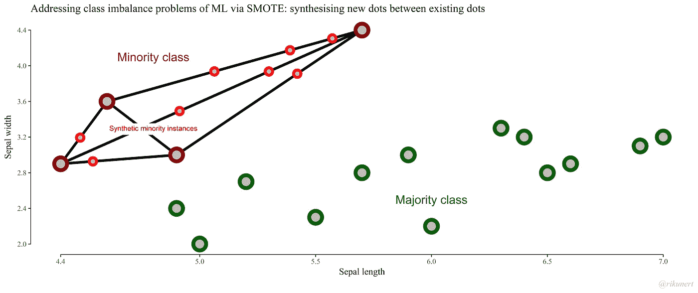

# 机器学习中如何处理不平衡数据？

> 原文：<https://medium.com/analytics-vidhya/how-to-handle-imbalance-data-in-machine-learning-96274e211d1b?source=collection_archive---------20----------------------->

什么是不平衡和平衡的数据集？

这是涉及两个或更多类的监督机器学习问题的主要背景。

例如:

你有一个两级分类问题。因为总共有 n 个数据点或实例，其中 n1 个数据点(实例)是零类实例，n2 个数据点是一类实例。

如果 *n1 ≈ n2* (n1 约等于 n2)则称之为**平衡数据集**。

平衡数据集类。

例如:在 n =1000 个实例或行的数据集中，n1 =一个类的 580 个实例，n2 =另一个类的 420 个实例(n1 是 58 %，n2 是 42 %)。

如果*n1**<<**n2*(*n1*远小于 N2)或者 n1 > > n2 (n1 远大于 n1)那么这个数据集叫做**不平衡数据集**。

图- **不平衡数据集**其中 Class-0 > > Class-1

例如:在 n = 1000 个实例或行的数据集中，n1 =一个类的 900 个实例和另一个类的 100 个实例(n1 = 90 %，n2 = 10%)。

**不平衡数据集的例子:**

在许多医疗应用中，我们有 10000 个病人的数据，其中只有 100 个病人患病。

在网上购物中，数百万人登录网站，但只有少数人购买商品。

检测电子邮件是否为垃圾邮件的电子邮件分类问题在此数据中，很少有电子邮件是垃圾邮件。

在地震数据中。、欺诈检测、医疗诊断。

# 不平衡数据集的问题是什么？

当每个样本的数量相等时，大多数机器学习算法工作良好。如果一个类有很多点，这就是多数类。多数阶级可以得到一些好处。模型结果可能偏向多数阶级。你可能会得到错误的结果。在现实生活问题中，如果模型给出错误的结果，那么在医学诊断、欺诈检测中，误分类的代价是非常高的。

在这种情况下，我们的任务是修改分类算法或使用一些技巧来处理不平衡的数据。

***准确性问题:***

*准确度=(正确分类的总点数/总点数)* 100*

如果我们使用准确性作为我们的绩效衡量标准，那么它会给你错误的结果。

例如，您有一个 2 类(二元)分类问题，有 1000 个点(实例或行)。总共有 900 行被标记为 0 类，100 行被标记为 1 类。
如果我的模型是“*哑的*”，并且它预测所有点都是 0 类。那么，在这种情况下，我的准确率是 *(900 /1000) * 100 = 90 %*

但是准确性仅仅反映了底层的类别分布。

# 解决方案 **:**

1.  **随机欠采样:**欠采样少数类点保持原样，从多数类中随机抽取样本点。**你可以从多数类中删除行或实例。**

欠采样保持少数点不变，从多数类中随机采样 100 个点。

**例如**，你有一个 2 类(二元)分类问题，有 1000 个实例。

其中 100 个实例或行来自类 0 行(实例)

和来自类 1 的 900 个实例。

你可以使用抽样技巧来创建一个新的数据集。

挑选所有 100 个实例(行),因为它来自 0 类，即少数类。

从类 1(即多数类)中随机选取 100 行样本实例(行),然后我们可以在新数据集上训练我们的模型。

**缺点:**模型在较小的数据量上训练。丢弃点不是训练我们模型的好方法。这可能是有用的信息。

注意:当您有大量数据(数万或数十万行或更多)时，请考虑欠采样。

欠采样 Python 代码

**2。过采样:**从数据集中的少数类中放置更多的点。

您可以添加来自少数类点的行(点)的副本，这称为过采样。

从少数民族阶层获得更多的分数。

例如:您有一个 2 类(二进制)分类问题，有 1000 个实例或行。

其中 100 行为 0 级行(点)

900 个一级实例。通过过采样或重复 0 类点，可以从 0 类创建 900 个点。

***如何创建过采样？***

1.  生成合成/人造点
2.  有系统的算法可以用来生成合成样本。这种算法中最流行的叫做 SMOTE，即合成少数过采样技术。SMOTE 使用最近邻算法来生成新的合成数据。

## Python 代码:

Python 中的过采样代码

# **SMOTE 算法:**

第一步:在第一步中，像这样在现有的少数点(实例)之间画一条线。

在少数类点上画线

步骤 2:在这些行的某处添加合成少数实例。

增加少数民族类的分数

SMOTE 代码:

**3。** **类-权重平衡:**在这个方法中，你可以给少数类分配更多的权重，给多数类分配更少的权重。

**例如**，你有一个 2 类(二元)分类问题，有 1000 个点(实例或行)。

其中 100 行标记为 0 级，900 行标记为 1 级。然后将权重 9 分配给 0 类实例。

将权重 1 分配给 Class-2 实例。

在“ *sklearn”中，为逻辑回归提供“class_weight”选项。*

**4。更改绩效指标:**

**准确性**是**不好**在处理不平衡数据时测量。

在数据不平衡的情况下，您可以使用以下指标。

1.  混淆矩阵:将预测分解成一个表格，显示正确的预测(对角线)和错误预测的类型(错误预测被分配到哪个类别)。
2.  精度:在所有模型预测为 1 级的点中，实际为 1 级的点的百分比是多少。
3.  回想一下:在所有属于第 1 类的点中，被预测为第 1 类点的点的百分比是多少。
4.  F 1-score:精确度和召回率的加权平均值。
5.  AUC-ROC:它基本上告诉我们有多少模型能够分成不同的类别标签。

**参考文献:**

 [## SMOTE 逐行解释 noobs -合成少数过采样技术

### 当训练集中的一个类支配着整个系统时，使用开箱即用的机器学习算法是有问题的

rikunert.com](http://rikunert.com/SMOTE_explained)