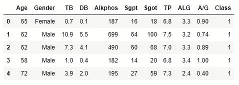
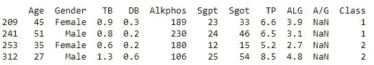

# 机器学习中如何处理不平衡类

> 原文：<https://medium.com/analytics-vidhya/how-to-handle-imbalanced-classes-in-machine-learning-ea4ad2dbde93?source=collection_archive---------11----------------------->

让我们在印度肝病患者数据集上应用不同的方法，并比较它们的性能。

在本帖中，我们将探索 scikit 中可用的不同分类模型——学习将患者记录分为两类

1.  肝病患者
2.  非肝病患者

原始数据集的链接是[https://archive . ics . UCI . edu/ml/datasets/ILPD+(Indian+Liver+Patient+Dataset)](https://archive.ics.uci.edu/ml/datasets/ILPD+(Indian+Liver+Patient+Dataset))

有 416 份患者记录，只有 167 份非患者记录，我们稍后会看到这如何影响我们的模型，然后**最后讨论一种最流行也是最直观的方法来处理这样一个倾斜的数据集**，请继续阅读。

因为已经有很多帖子可以理解什么是分类问题，它与回归有什么不同，所以我在这里只关注手头的问题，而不进入基本机器学习的细节。

该数据集中的 10 个属性指示肝脏的状况，并且我们必须基于这些来预测该人是患者还是健康人。

因此，让我们从导入和探索我们的数据集开始:-

```
data=pd.read_csv(‘data.csv’,names=[‘Age’,’Gender’,’TB’,’DB’,’Alkphos’,’Sgpt’,’Sgot’,’TP’,’ALG’,’A/G’,’Class’])
data.head()
```



正如我们所看到的，数据看起来已经非常干净了，这对我们来说很好，我们可以直接进入有趣的部分，而不必花很多时间清理数据，但在继续之前，我们仍然需要解决一些小问题，让我们完成它们。

```
data.isnull().any()
```

这一行代码将告诉我们在任何列中是否有任何丢失的值，运行后我们现在知道在 **A/G** 列中有丢失的值，让我们对它们做些什么。

```
nan_rows = data[data[‘A/G’].isnull()]
print(nan_rows)
```



因此，只有 4 行缺少值。现在，在这里，我们可以并且理想地应该进行缺失值插补(如果你不知道这意味着什么，你可以在 towardsdatascience.com 上阅读所有相关内容)，但是在这里，由于我们的目的是显示不平衡类对你的模型的影响，我们将简单地删除这些行并继续。

```
data=data.dropna()
```

所有的列都已经是数字格式，除了“性别”是分类的，让我们把它转换成数字，然后开始建立分类模型。

```
X=data.iloc[:,0:10]
y=data.iloc[:,-1]
X.Gender = X.Gender.map( {‘Male’:0 , ‘Female’:1} )from sklearn.model_selection import train_test_split
X_train, X_test, y_train, y_test = train_test_split(X, y, test_size=0.25, random_state=0)from sklearn.linear_model import LogisticRegression
classifier = LogisticRegression()
classifier.fit(X_train, y_train)y_pred = classifier.predict(X_test)
from sklearn.metrics import accuracy_score
print("Accuracy :", accuracy_score(y_pred, y_test))
```

在建立这个简单的逻辑回归模型后，我们得到了大约 71%的测试准确率，还不错吧？

让我们也试试其他的模型。

```
from sklearn.tree import DecisionTreeClassifier
clf = DecisionTreeClassifier(criterion=’gini’)
clf.fit(X_train, y_train)
print(‘Accuracy :’, accuracy_score(clf.predict(X_test), y_test))from sklearn.linear_model import Perceptron
clf2 = Perceptron()
clf2.fit(X_train, y_train)
print('Accuracy :', accuracy_score(clf2.predict(X_test), y_test))from sklearn.ensemble import RandomForestClassifier
clf3 = RandomForestClassifier()
clf3.fit(X_train, y_train)
print('Accuracy :', accuracy_score(clf3.predict(X_test), y_test))
```

**决策树**、**感知器**和**随机森林**分别给我们 60%、43%和 65%的准确率，不算太好，那么现在我们来看看这里可能出了什么问题，如何处理。

```
data[‘Class’].value_counts()
```

这行代码将向我们返回类以及每个类中的记录数。这里，类 1 的记录数为 414，类 2 的记录数为 165，表明类 1 的记录数是类 2 的两倍多，这是我们的模型在如此小而简单的数据集上表现如此差的原因吗？让我们来找出原因。

```
df_majority = data[data.Class==1]
df_minority = data[data.Class==2]
from sklearn.utils import resample
df_minority_upsampled = resample(df_minority, 
                                 replace=True,
                                 n_samples=414,  
                                 random_state=123)
```

现在，神奇的事情发生了，我们对数据集进行了重新采样。在这个特殊的例子中，我们使用**上采样**来匹配少数类中的记录数和多数类中的记录数。我们还可以使用**下采样、**，但是我们没有在这里这样做，因为这个数据集已经很小了，进一步减少记录的数量并不是一个好主意。它只在我们处理一个巨大的数据集时使用，其中少数类中的记录数仍然是数千(或更多)。

现在，让我们看看这是如何影响我们模型的性能的。

```
df_upsampled = pd.concat([df_majority, df_minority_upsampled])]
X=df_upsampled.iloc[:,0:10]
y=df_upsampled.iloc[:,-1]from sklearn.model_selection import train_test_split
X_train, X_test, y_train, y_test = train_test_split(X, y, test_size=0.25, random_state=0)from sklearn.linear_model import LogisticRegression
classifier = LogisticRegression()
classifier.fit(X_train, y_train)
y_pred = classifier.predict(X_test)
from sklearn.metrics import accuracy_score
print("Accuracy :", accuracy_score(y_pred, y_test))from sklearn.tree import DecisionTreeClassifier
clf = DecisionTreeClassifier(criterion='gini')
clf.fit(X_train, y_train)
print('Accuracy :', accuracy_score(clf.predict(X_test), y_test))from sklearn.linear_model import Perceptron
clf2 = Perceptron()
clf2.fit(X_train, y_train)
print('Accuracy :', accuracy_score(clf2.predict(X_test), y_test))from sklearn.ensemble import RandomForestClassifier
clf3 = RandomForestClassifier()
clf3.fit(X_train, y_train)
print('Accuracy :', accuracy_score(clf3.predict(X_test), y_test))
```

运行所有这些模型后，我们得到的精度如下

逻辑回归的 71%

决策树占 86%

感知器 67%

85%用于随机森林

正如我们看到的，除了逻辑回归，每个模型都比以前表现得更好，只是通过平衡目标类。现在想象一下，如果我们进行适当的特征提取并去除对预测过程没有太大贡献的特征，可以做多少事情。我会让你去尝试，因为我只是想展示不平衡的课程对你的模型性能有多大的影响，以及你如何改善它。