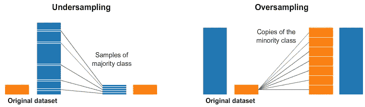
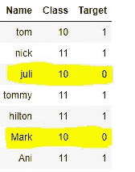
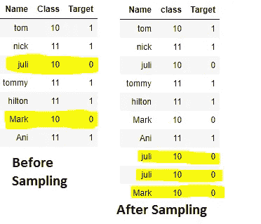
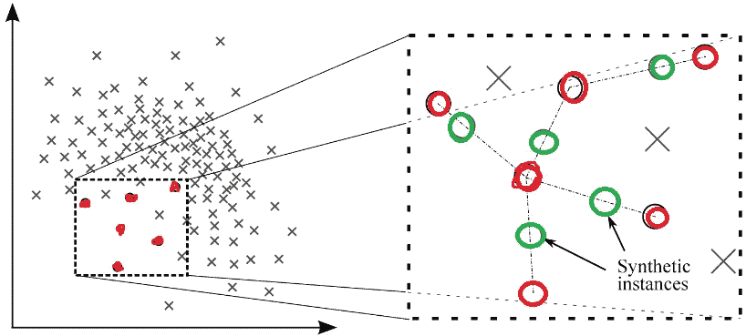
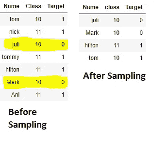

# 如何处理不平衡数据集？

> 原文：<https://medium.com/analytics-vidhya/how-to-handle-imbalanced-dataset-b3dc05b85bf9?source=collection_archive---------8----------------------->


图片来自谷歌

在我们进入正题之前。**平衡数据集**表示 A 类和 B 类的目标列应该处于 ***50:50*** 的比率或者 ***60:40*** 的比率。

当我们将 A 类和 B 类的 ***80:20*** 或 ***90:10*** 视为 ***不平衡数据集*** 。如果我们有这样的数据集，模型会偏向**和**，导致**模型过拟合**。

为了避免这种情况，我们尝试对数据集进行采样。

1.  **什么是采样？**



图片来自谷歌。

抽样意味着增加少数类记录或删除多数类记录，以使数据集成为平衡数据集。

抽样可以应用于二进制或多类分类问题。

**2。采样中有哪些技巧？**

*   过采样
*   欠采样
*   组合过采样和欠采样
*   添加类别权重

> **过采样:**

*   **randomversample**:它**复制**少数类记录
*   **SMOTE** : It **重采样**少数类记录。

> **RandomOverSample :**

*   它随机复制少数民族的记录。
*   跟大家讲:目标有 1 和 0..{1: 5, 0: 2}.应用 RandomOverSampling 后，少数类 0 变为{1: 5，0: 5}
*   为了理解，让我们假设一个数据帧有几个目标为 0，1 的记录。

```
import pandas as pd 
data = [['tom',10,1], ['nick',11, 1], ['juli',10, 0], ['tommy',11, 1], ['hilton',11, 1], ['Mark',10, 0], ['Ani',11, 1]] 
df = pd.DataFrame(data, columns = ['Name','Class','Target']) 
df
```



朱莉和阿尼有 0..现在 1 出现 5 次，0 出现 2 次。

应用 RandomOverSampling 后。

```
from imblearn.over_sampling import RandomOverSamplerX = df.iloc[:, 0:2].values
y = df.iloc[:, -1].valuesos =  RandomOverSampler(sampling_strategy='minority')
X_new, y_new = os.fit_sample(X, y)
print('Original dataset shape {}'.format(Counter(y)))
print('Resampled dataset shape {}'.format(Counter(y_new)))********************** OUTPUT *****************
Original dataset shape Counter({1: 5, 0: 2})
Resampled dataset shape Counter({0: 5, 1: 5})
```

采样后，类 0 现在有 5 条记录。让我们看看数据帧。



*   RandomOverSampler(sampling _ strategy = ' minority ')在 0.1 到 1 之间更改采样策略，0.5 表示 50%的少数类被复制。0.8 意味着 80%的少数类被复制。

> **SMOTE** : **合成少数过采样技术**

*   它综合少数民族的新例子，而不是复制记录。
*   SMOTE 采用 k-最近邻，并在特征空间中找到最近的点。然后，它画一条线来连接所有最近的邻居，并在这条线内创建新点。



红色圆圈是原始点，虚线是取 n 个最近邻点后画出的线，绿色圆圈表示从虚线新创建的新数据点。

```
**from** imblearn.over_sampling **import** SMOTE
sm **=** SMOTE(random_state **=** 42)
X_res, y_res **=** sm.fit_resample(X_data, Y_data)
```

> **随机下样**:

*   它从多数类标签中删除记录以匹配少数类标签。
*   局限性是大部分数据都被删除了。被删除的记录可能具有有用的洞察力，或者不同的模式。通过检测，我们将丢失主要的重要记录。

```
from imblearn.under_sampling import RandomUnderSamplerX = df.iloc[:, 0:2].values
y = df.iloc[:, -1].valuesos = RandomUnderSampler(sampling_strategy='majority')
X_new, y_new = os.fit_sample(X, y)
print('Original dataset shape {}'.format(Counter(y)))
print('Resampled dataset shape {}'.format(Counter(y_new)))************ OUTPUT ***************************
Original dataset shape Counter({1: 5, 0: 2})
Resampled dataset shape Counter({0: 2, 1: 2})
```



> **组合过采样和欠采样:**

*   最好将过采样和欠采样结合在一起。
*   首先对少数类标注应用 50 %的过采样，然后对多数类标注应用 20%或 30%的欠采样。
*   通过这样做，我们可能不会丢失主要的数据点，而是只丢失 20%或 30%的数据点。

```
# Perform Over Sampling
over = RandomOverSampler(sampling_strategy=0.1)
X, y = over.fit_resample(X, y)# Perform Under Samplingunder = RandomUnderSampler(sampling_strategy=0.5)
X, y = under.fit_resample(X, y)
```

> **添加类权重:**

代替添加或删除数据点，我们可以向少数类标签添加更多的权重**。**

我们可以显式地添加权重，或者简单地指定 class_weight="balanced "

```
from sklearn.utils import class_weight
class_weights = class_weight.compute_class_weight('balanced',np.unique(y),y)
print(np.unique(y),class_weights)[0 1] [1.75 0.7 ]
```

指定 0:1.75 和 1:0.7 的权重。

**示例:**随机森林分类器

RandomForestClassifier(n _ estimators = 50，class_weight = {0:0.5，1:1})

(或)

RandomForestClassifier(n _ estimators = 50，class_weight ='balanced ')