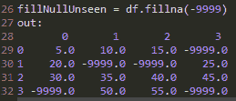

# 如何使用 Python 处理缺失数据

> 原文：<https://medium.com/analytics-vidhya/how-to-handle-missing-data-using-python-ce16d4756163?source=collection_archive---------18----------------------->

老实说，生活并不美好，数据也是如此…直到它变得干净。这就是为什么 80–90%的数据科学家的时间都花在分析、清理和一般的准备培训数据上。为了部署一个可靠的模型，这是一项非常耗时的工作。当您尽职尽责地清理您的数据时，丢失的数据将露出丑陋的面孔，您将需要做出选择。道路上的一个分界点可以成就或摧毁你的模型。让我们分解如何使用 python 处理丢失的数据。

# 有什么样的缺失数据？

你先问这个问题，很有见地。缺失数据有 4 种类型:完全随机缺失(MCAR)、结构性缺失、非随机缺失(不可忽略)和随机缺失(MAR)。

**完全随机丢失**，丢失数据的模式没有任何系统性。缺失的数据完全是随机缺失的。找不到缺失数据和其他变量之间的关系。

**结构性缺失数据**，计划缺失数据。在创建数据库的过程中，如果没有给出这些信息，数据就会丢失。如果是这种情况，它应该在与数据库相关的文档中，或者至少是口头给出的。

**非随机缺失**，可以确定缺失数据与可观测值的关系。想象你正在看一组关于收入的数据。您会注意到报告的最高收入是 70，000 美元，其中缺少值。可以肯定地说，收入超过 70，001 美元的人拒绝说出他们的收入是多少。

**随机缺失**，缺失数据可以根据可观测数据的变量进行预测。让我们假设我们正在做一项调查。根据问题 3 的答案，我们可以预测问题 9 是否得到了回答。如果可以找到相关性，那么它是一个随机丢失值。

# 我有什么选择？

说到这里有两个选择:**插补**或者**截肢**。截肢就是把它从身体里取出来。从数据集中删除这些数据点。使用马尔和 MCAR，根据具体情况，可以安全地删除那些丢失的值，而不会对模型产生负面影响。另一方面，如果删除了结构性缺失数据和不可忽略数据，将会导致模型出现偏差。这就是归罪发挥作用的地方。

插补是取一个计算值，并将其输入缺失值位置。这可以通过使用该特性的平均值/中值、为该列中其他地方看不到的所有缺失值插入相同的值以及特性工程来计算。您还可以使用预测模型，例如 K-最近邻模型。

请记住，在从数据集中删除任何值之前，请确定它对模型的重要性。在 75%的数据消失之前疯狂地删除行或列是不明智的，因为丢失的值到处都是。截肢前要三思。

# 如何计算缺失值？

编码时间！首先，让我们使用熊猫创建一个数据框。我们将使用 numpy 有目的地在集合中随机插入空值。

创建一个 4×4 的数据帧，空值随机分布。

我们创建了一个 4×4 的矩阵。一个 4 行 4 列的矩阵，其中 5 个不同的空值随机放在我们的集合中。现在我们有了一个数据集，可以开始用一些常见的解决方案填充空值。

## 平均值/中值

均值和中位数是两种不同的获取平均值的方法。平均值是你想到的，把所有的值加起来，然后除以使用的值的数量。另一方面，Median 从最低到最高组织值，然后使用中间值。

我相信你听说过 numpy，一个强大的 python 库。我有一篇关于 numpy 基础知识的文章([点击这里](/analytics-vidhya/python-numpy-basics-4a1e851898c0))，你应该看看。Numpy 使得在列或行方向计算这两个值变得非常容易。我们将要进行的调用是 np.mean()和 np.median()。当然，你可以使用数据帧调用本身。

逐列然后逐行寻找 4x4 矩阵的平均值。

mean 的默认方向是列，如果您想使用行通道，其中一个参数称为轴，设置为 1 会将其计算转移到行。

使用 numpy 计算列和行的中间值。

Np.median 有一个缺省值，它沿着数组的展平版本计算中值，在我们的例子中这会导致一个错误。我们需要做的是明确地告诉 np.median 它需要沿着列或行向下。如您所见，如果集合中的任何地方有空值，那么它将返回该轴的空值。所以计算中位数是不可能的。

因为我们花了时间来检查哪个平均值符合我们的需要，所以我们现在可以使用平均值来替换任何空值。我们将在列方向上进行，因为通常(但不总是)特征是在列方向上，并且您通常将为每个特征而不是每个事例填充空值。

用该方向的平均值填充空值。

比较新旧数据集，您可以看到所有 5 个空值都被替换为适当的值。

## 用看不见的价值填充

您还可以使用 df.fillna()放置一个在数据集中其他地方看不到的值。

用数据集中没有的数字填充空值。

因为我们的数据集很小，所以我们不需要分析数据集。如果这个值更大，我们将取每一列的最小值和最大值，并高于或低于该值，以确保插入的内容不会出现在数据集中的任何地方。

检查每列的最小值和最大值。

## 特征工程

特征工程就是它听起来的样子，你利用已经创建的特征，设计一个新的特征。对于空值，很难(不可能)从中取值，但是您可以计算它在每种情况下出现的次数，并将其作为一个特征。

计算每行中有多少个空值，然后用该值创建一个新要素。

使用数据帧本身(我们称之为 df ),它遍历每一行，通过检查是否为空来合计空的数量。然后，我们添加一个我们刚刚进行了特征设计的列。谁说空值不值钱！

从那时起，您可以对空值做您想做的事情。

最后，但肯定不是最不重要的

## 删除空值

Data frames 有一个非常方便的调用来丢弃空值，称为 dropna()。默认情况下，如果没有参数，它将遍历每一行，如果该行有一个空值，它将从数据集中删除。Dropna()有一个名为 axis 的参数，可以设置为 columns，正如它所建议的那样，将删除至少有 1 个 null 值的列。在我们的例子中，这将产生一个由“nullCount”组成的列。

删除包含空值的行或列。

均值/中值、用看不见的值填充、特征工程和从数据集中删除空值是处理缺失数据的 4 种常用方法。每个人都有自己处理他们所信奉的空值的方式。我给你的建议是，当你在做你的项目时，一定要花时间找出什么最适合这个模型。不要把自己局限在一个可以决定模型成败的解决方案中。

另外，现在如果你看到有人在角落里来回摇晃，喃喃自语“空值，空值，空值”，你知道如何帮助他们丢失数据！😉

在我们重新学习之前，

