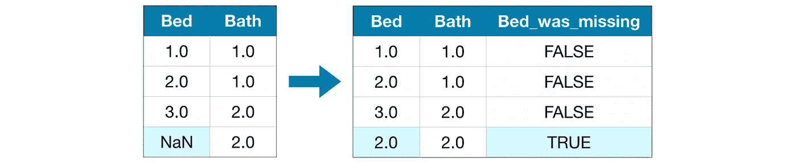

# 如何处理缺失值？

> 原文：<https://medium.com/analytics-vidhya/how-to-handle-missing-values-byaryan-cb76b9dbaae2?source=collection_archive---------8----------------------->

Kickstarter 实践指南。


在[之前的](https://blog.usejournal.com/intro-to-machine-learning-part2-byaryan-4dd7f20f4a19?source=friends_link&sk=aec114377221595b9b0f46612441a49d)文章中，我承诺讨论如何处理缺失的价值观！

在这篇文章中，我们将讨论不同的策略来应对缺失的价值观。您将学习在任何给定或大部分数据集上比较这些方法的有效性。

# 介绍

根据维基百科，“在统计学中，**缺失数据**，或者**缺失值**，发生在没有数据值存储在观察变量中的时候。缺失数据是一种常见现象，会对从数据中得出的结论产生重大影响。”

由于各种原因，许多现实世界的数据集包含缺失值，通常编码为**空格**、 **NaNs** 或其他**占位符**。

数据可以通过多种方式合并缺失值。例如在住房数据中:

*   一个一居室的房子不会包括第二个卧室有多大的答案。
*   房主可能不想分享他们的收入。

Python 库将缺失的数字表示为 **nan** ，这是“**不是数字**”的缩写。然而，包含 **nan** 值的数据集与 **Sklearn** 估计器不一致，后者假设数组中的所有值都是数字，并且都有意义，因此可以对它们应用数学运算。

使用包含缺失值的数据集的一个基本策略是丢弃包含缺失值的整行和/或整列。然而，这是以丢失可能很重要(即使不完整)的有价值的数据为代价的。一个更好的策略是填充缺失值，即从没有缺失的数据部分估计它们。

您可以使用以下命令找出哪些单元格缺少值，以及每列中缺少值的百分比:

```
def missingcheck(data):
 total = data.isnull().sum().sort_values(ascending=False)
 percent_1 = data.isnull().sum()/data.isnull().count()*100
 percent_2 = (np.round(percent_1, 1)).sort_values(ascending=False)
 missing_data = pd.concat([total, percent_2], axis=1, keys=[‘Total’, ‘%’])
 return missing_data
```


所有这些代码都存在于 Github 库[**mlin 10 minutes**](https://github.com/aryanc55/MLIn10Minutes)！

## 此外，分离数字属性和分类属性

因为会影响我们对于缺失值处理会遵循的策略！您可以分别处理缺失的值，然后将它们连接在一起！但是为了使这篇文章简洁易懂，我将只继续讨论数值。

# 函数来评估每种方法的准确性

我们定义了一个函数 *score_dataset()* 来比较处理缺失值的不同方法。该函数报告随机森林模型的[平均绝对误差](https://en.wikipedia.org/wiki/Mean_absolute_error) (MAE)。

```
from sklearn.ensemble import RandomForestRegressor
from sklearn.metrics import mean_absolute_error# Function for comparing different approaches
def score_dataset(X_train, X_valid, y_train, y_valid):
 RFr = RandomForestRegressor(n_estimators=150, random_state=42)
 RFr.fit(X_train, y_train)
 preds = RFr.predict(X_valid)
 return mean_absolute_error(y_valid, preds)
```

# 1)一种简单的方法:删除缺少值的列

最基本的选择是删除缺少值的列。


来源:Kaggle

除非删除的列中的大多数值都丢失了，否则模型将无法访问大量(也许有用！)信息用这种方法。作为一个极端的例子，考虑一个有 20，000 行的数据集，其中一个重要的列只缺少一个条目。这种方法会删除整个列！

```
#get names of columns with missing values
cols_with_missing = [col for col in X_train.columns
 if X_train[col].isnull().any()]
# drop columns in training and validation data
reduced_X_train = X_train.drop(cols_with_missing, axis=1)
reduced_X_valid = X_valid.drop(cols_with_missing, axis=1)
```


# 2)更好的选择:单变量插补

**插补**用某个数字填充缺失值。例如，我们可以沿着每个**列**填入**平均值**。


来源:Kaggle

在大多数情况下，估算值不会完全正确，但它通常会比完全删除列得到更好的模型。

在 [sklearn](https://scikit-learn.org/stable/modules/impute.html) 中给出的一种插补算法是**单变量**，

"*仅使用第 I 个特征维度中的非缺失值来估算该特征维度中的值"*(例如，估算。简单输入器)。

sklearn 包中的**simple imputr**提供了输入缺失值的基本策略。缺失值可以使用提供的**常量值**进行估算，或者使用缺失值所在的每一列的**统计数据**(平均值、中值或最频繁值)。

下面的代码片段演示了如何替换丢失的值:

```
from sklearn.impute import SimpleImputer
# imputation
simple_imputer = SimpleImputer()imputed_X_train= pd.DataFrame(simple_imputer.fit_transform(X_train))imputed_X_valid = pd.DataFrame(simple_imputer.transform(X_valid))# imputation removed column names; put them back
imputed_X_train.columns = X_train.columns
imputed_X_valid.columns = X_valid.columns
```


记住，我告诉过你，我们对于数字和分类属性的策略是不同的。观察你自己，如果列有分类数据，如“高”、“中”、“低”，就不能使用平均值。

当使用*‘most _ frequency’*或*‘constant’*策略时，SimpleImputer 类还支持表示为字符串值或*pandas categories*的分类数据。

# 3)另一种选择:多元插补

正如在 *Sklearn* 文档中所定义的，“多变量估算器，从所有其他特征中估算每个特征。*一种输入缺失值的策略，通过以循环方式将具有缺失值的每个特征建模为其他特征的函数*。

这种更先进的方法在**迭代估算器**类中实现，该类将每个具有缺失值的特征建模为其他特征的函数，并使用该估算值进行估算。它以循环迭代的方式实现:在每一步，一个特征列被指定为输出 ***y*** ，其他特征列被视为输入 ***X*** 。已知 ***y*** 的 *(X，y)* 上拟合一个**回归量**。然后用回归器**预测**yT31**的**缺失**值。对每个特征进行迭代，然后对 *max_iteration* 插补轮次进行重复。返回最后一轮插补的结果。**

以下是代码片段:

```
br_imputer = IterativeImputer(BayesianRidge()) 
imputed_X_train = pd.DataFrame(br_imputer.fit_transform(X_train))imputed_X_valid = pd.DataFrame(br_imputer.transform(X_valid))# imputation removed column names; put them back
imputed_X_train.columns = X_train.columns
imputed_X_valid.columns = X_valid.columns
```


我们可以在迭代估算器中使用的一些估算器:

*   `[**BayesianRidge**](https://scikit-learn.org/stable/modules/generated/sklearn.linear_model.BayesianRidge.html#sklearn.linear_model.BayesianRidge)`:正则化线性回归
*   `[**DecisionTreeRegressor**](https://scikit-learn.org/stable/modules/generated/sklearn.tree.DecisionTreeRegressor.html#sklearn.tree.DecisionTreeRegressor)`:非线性回归
*   `[**ExtraTreesRegressor**](https://scikit-learn.org/stable/modules/generated/sklearn.ensemble.ExtraTreesRegressor.html#sklearn.ensemble.ExtraTreesRegressor)`:类似于 R 中的 missForest
*   `[**KNeighborsRegressor**](https://scikit-learn.org/stable/modules/generated/sklearn.neighbors.KNeighborsRegressor.html#sklearn.neighbors.KNeighborsRegressor)`:与其他 KNN 插补方法相当

在 **R 数据科学生态系统中有很多成熟的插补包:Amelia、mi、mice、missForest** 等。

顺序插补算法可以有很多种变化，都可以在**中绕过`[**IterativeImputer**](https://scikit-learn.org/stable/modules/generated/sklearn.impute.IterativeImputer.html#sklearn.impute.IterativeImputer)`不同的回归元**来实现，用于预测缺失的特征值。

在流行的 missForest 方法的情况下，这个回归量是一个随机森林。


加州房屋数据集上各种插补策略的比较。来源:Scikit-learn

# 4)最近邻插补

*k 最近邻算法*可用于输入缺失数据，方法是找到具有缺失数据的观测值的 *k 最近邻*，然后基于邻中的非缺失值输入它们。

对此有几种可能的策略。可以使用 **1NN** ，其中我们搜索*最相似的邻居*，然后使用它的值来替换丢失的数据。

或者，我们可以使用 **kNN** 和 *k 个邻居*并计算邻居的**平均值**，或**加权平均值**、*，其中到邻居的距离被用作权重*，因此邻居越近，在计算平均值时其权重越大。使用最常用的加权平均技术。

**KNNimputer** 类使用 **k 最近邻**方法提供填充缺失值的插补。它使用支持缺失值的欧几里德距离度量。它被称为 *nan_euclidean_distance* ，用于查找最近的邻居。

***注*** 根据官方文档:“`[***sklearn.neighbors.KNeighborsRegressor***](https://scikit-learn.org/stable/modules/generated/sklearn.neighbors.KNeighborsRegressor.html#sklearn.neighbors.KNeighborsRegressor)` *与 KNN 插补不同，后者是通过使用一种考虑缺失值的距离度量从缺失值的样本中学习，而不是对其进行插补。*

下面是一段代码:

```
knn_imputer = KNNImputer(n_neighbors=2, weights=”uniform”)imputed_X_train = pd.DataFrame(knn_imputer.fit_transform(X_train))imputed_X_valid = pd.DataFrame(knn_imputer.transform(X_valid))# imputation removed column names; put them back
imputed_X_train.columns = X_train.columns
imputed_X_valid.columns = X_valid.columns
```


# 5)无法估算

插补是一种广为接受的方法，通常效果很好。但是，估算值可能会排列在其实际值(未收集在数据集中)的下方或上方。或者缺失的行值可能在其他方面有所不同。在这种情况下，通过考虑最初缺少哪些值，您的模型会表现得更好。



在这种方法中，和以前一样，我们估算缺失值。然后，对于原始数据集中缺少条目的每一列，我们添加一个新列来标记估算条目的位置。

```
imputed_X_train_plus = X_train.copy()
imputed_X_test_plus = X_valid.copy()cols_with_missing = (col for col in X_train.columns 
 if X_train[col].isnull().any())
for col in cols_with_missing:
 imputed_X_train_plus[col + ‘_was_missing’] = imputed_X_train_plus[col].isnull()
 imputed_X_test_plus[col + ‘_was_missing’] = imputed_X_test_plus[col].isnull()
#see what happend to the dataset
imputed_X_train_plus.head()# And now we Imputation
my_imputer = SimpleImputer()
imputed_X_train_plus = my_imputer.fit_transform(imputed_X_train_plus)
imputed_X_test_plus = my_imputer.transform(imputed_X_test_plus)
```


在某些情况下，这将有意义地改善结果。其他情况下，一点帮助都没有。

# 6)不能是缺失值！

等等，什么？

是的，你认为丢失的值可能并不是丢失的值。这可能是由于 NA(不可用)编码混乱或我们对它的解释有误。例如:


**PoolQC** :数据描述说 **NA** 的意思是“**无池**”。这是有道理的，考虑到巨大的失踪价值比率(+99%)，而且大多数房子一般都没有游泳池。

同样的道理也适用于**栅栏**和**杂项**，因为这些房屋可能没有任何栅栏或杂项特征。

# 那有什么条件呢？

*数据科学的人认为这是对研究者的批判“风格”如何处理的问题。即使有人想做野蛮的均值/中值/众数替换或者删除它们，也没有“一般”的对错。没事的。*

人们可以比较 MAE 来选择最好的结果。可以进行多次插补，并且应对每个变异结果进行分析。例如，在均值、中值或众数之外应该选择什么。在迭代估算中，应该使用什么样的估计量，甚至在 KNNimputer 中，k 的值应该是多少？

一个人的估算方法是" ***不伤害*** "让你的算法学会，这就是简单估算策略的全部。但是，每种情况都是不同的，所以你必须尝试不同的方法，如果你有足够的数据，通过测试集和验证集来验证它们。

所有这些都依赖于*数据集和问题的领域*。仅仅是你的*直觉*会引导你选择*最适合的方法*！

如果你喜欢这篇文章，那就按下按钮吧。对更多的帖子感兴趣吗？确保按照这个系列[**mlin 10 分钟**](https://github.com/aryanc55/MLIn10Minutes) 。

欢迎留言提问！你也可以 [**DM**](https://www.instagram.com/bdcoe/) 你的疑惑。

# 确认:

*   [https://en.wikipedia.org/wiki/Missing_data](https://en.wikipedia.org/wiki/Missing_data)
*   [https://lean deep . com/data lab-ka ggle/handling-missing-values . html](https://leandeep.com/datalab-kaggle/handling-missing-values.html)
*   [https://scikit-learn.org/stable/modules/impute.html](https://scikit-learn.org/stable/modules/impute.html)
*   [https://stats . stack exchange . com/questions/327074/k-最近邻-插补-解释](https://stats.stackexchange.com/questions/327074/k-nearest-neighbor-imputation-explanation)

