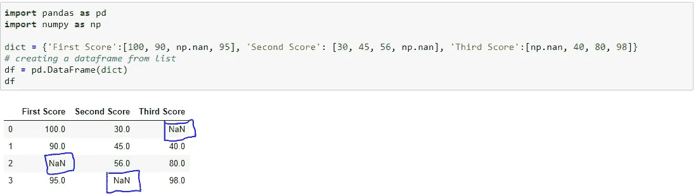
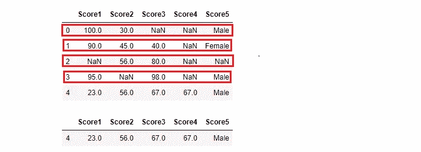
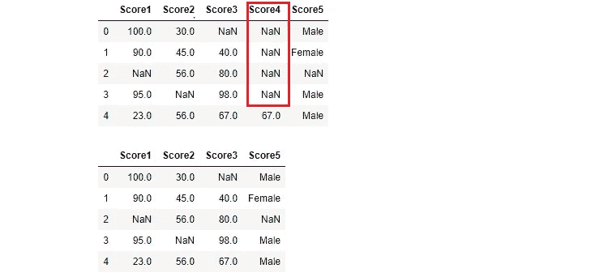

# 如何处理缺失值？

> 原文：<https://medium.com/analytics-vidhya/how-to-handle-missing-values-cbd03fb79ef8?source=collection_archive---------12----------------------->


在我们开始处理缺失值之前..让我们来了解一下为什么我们会有缺失值。
1。没有信息的时候。
2。数据存在，但未被记录。
3。将手动数据传输到数据库时。
4。忘记放置值。
5。主动将少数值设为空。

*   创建一个数据帧，让我们检查熊猫数据帧中丢失的值是什么样子的。



缺少的值被视为“NaN ”,而不是数字。

> 如何检查数据是否有缺失值，并找出有多少缺失值？

```
import numpy as np
import pandas as pd
import matplotlib.pyplot as plt
import seaborn as sns# load titanic dataset from kaggle.
df = pd.read_csv('titanic_train.csv')# check number of missing values in each column.
df.isna().sum()
```


PassengerId 没有缺失值，而 Age、Cabin 和 apolled 有缺失值。

> **现在，我们来看看如何处理。**
> 
> *删除行或列。
> *用均值、中值或众数填充缺失值。
> *将缺失的列作为目标并创建一个模型。将缺失的行作为测试数据集并预测值。


## **1。Drop records** :您可以从 dataframe 中删除整个记录。

```
import pandas as pd 
import numpy as npdict = {'First Score':[100, 90, np.nan, 95], 'Second Score': [30, 45, 56, np.nan], 'Third Score':[np.nan, 40, 80, 98]} 
# creating a dataframe from list 
df = pd.DataFrame(dict)# drop the entire record using dropna()
# axis 0: rows
# axis 1: column
df = df.dropna(axis=0, how='any')
df
```



包含空值的记录将被删除。

**删除列**:删除缺少更多值的列。

```
df.drop(['Score4'],axis=1,inplace=True)
```



列 ***Score4*** 有更多的空值。所以，放下专栏。当列中缺失值超过 80%到 95%时，删除该列。

## 2.**使用 fillna()填充缺少的值**，替换()。

## 对于分类列，取最常见的值并填充缺失的值。

```
df['Score5'].value_counts()OUT:
Male      3
Female    1
Name: Score5, dtype: int64#fill missing value with maximum repeated values.
df.fillna("Male",inplace=True)
```

或者，尝试使用 *sklearn.preprocessing.* 中的估算方法

估算者:

```
from sklearn.preprocessing import Imputer 
imputer = Imputer(missing_values = "NaN",
                  strategy = "mean",
                  axis = 0) 
# strategy = mean or median or mode
# axis = 0 or 1
imputer = imputer.fit(df) 
df = imputer.fit_transform(df)
df array([[100\.        ,  30\.        ,  72.66666667],
       [ 90\.        ,  45\.        ,  40\.        ],
       [ 95\.        ,  56\.        ,  80\.        ],
       [ 95\.        ,  43.66666667,  98\.        ]])
```

估算器用**平均值**或**中值**或**模式**替换 NaN 值。

# 结论:

1.  如果目标列中缺少值，通过 ***dropna*** 删除记录。
2.  如果一列中有 70 %以上的值缺失，则通过 ***删除记录，通过*** 删除记录。
3.  使用 ***fillna*** 填补缺失。
4.  fillna:取*的平均值*为*的整数*列。
5.  fillna:对*分类*栏采取*模式*。