# 如何在 Github 上托管您的 Angular 项目

> 原文：<https://medium.com/analytics-vidhya/how-to-host-your-angular-projects-on-github-and-000webhost-ab1861e5c8dd?source=collection_archive---------2----------------------->

在本文中，我们将一步步地将一个基本的 Hello-World 应用程序部署到 GitHub。我们将使用 [Angular CLI](https://cli.angular.io/) 创建一个项目，然后将其部署到 GitHub。让我们开始吧。

# 先决条件

让我们从先决条件开始。您需要具备:

*   打字稿、HTML 和 CSS 的知识。
*   节点和 NPM 安装在您的系统上。
*   系统上安装的 Angular CLI 8。
*   Github 桌面应用(【https://desktop.github.com/】T4)

# 步骤 1:创建新项目

要使用 Angular CLI 创建项目，请运行命令:

`ng new Hello-World`

# 步骤 2:运行开发服务器

让我们使用下面的命令运行开发服务器。

```
ng serve
```

现在打开你的浏览器，导航到`localhost:4200`查看你的 angular 应用。

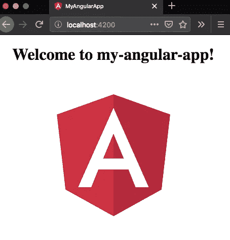

# 步骤 3:在 Github 上添加 gh 页面来托管您的项目

要在 github 上添加您的项目，您需要在项目中添加 gh 页面

# 步骤 3:用您的项目名称创建存储库

首先下载 [Github 桌面](https://desktop.github.com/)。在这里，我展示了我现有的项目演示。

*   打开 Github 桌面，在左上角点击->新建资源库
*   将您的存储库命名为您的项目名称(Hello-World)。

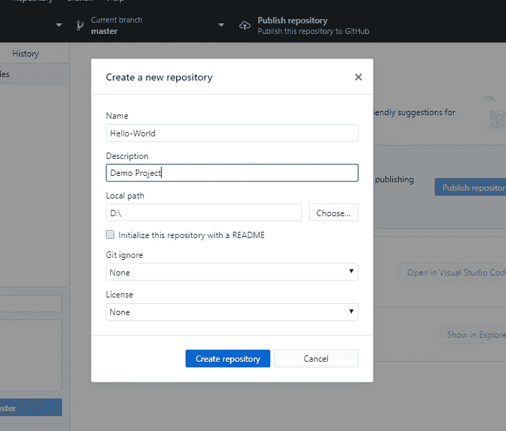

*   完成后，进入->这台电脑->文档->Github->你的库名

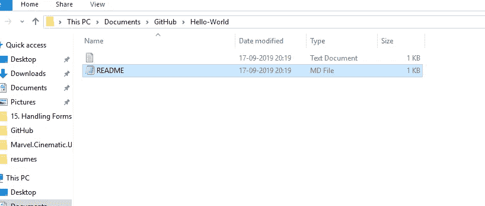

这样做之后，你的文件夹结构也应该看起来像这样

# 第 4 步:点击发布你的仓库

一旦你再次完成以上步骤，进入 Github 桌面应用，点击发布你的库到 Github

# 步骤 5:在 Github 网站上检查你的主机选项

打开右上角的 Github>你的仓库->Hello-World

点击设置导航到底部，在那里你会看到 3 或 4 个选项

*   Github 主机
*   Github 主/文档
*   gh 页面
*   没有人

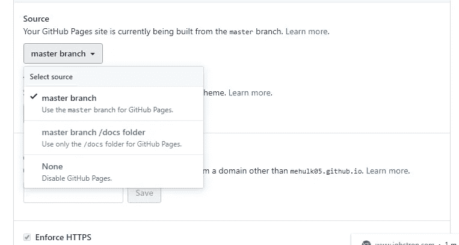

请注意，主分支/文档最初将被禁用，gh-pages 目前不可用

我们将一步一步地看每一个

# 步骤 6:将文件上传到存储库

*   下一步移动到您的项目文件夹复制所有文件并粘贴到您的
*   文档->Github->项目(Hello-World)文件夹
*   这样做之后，转到你的 Github 桌面，你会看到各种变化。您需要在左下角键入您的提交消息，然后单击提交。
*   完成后，你需要点击屏幕上的推送原点
*   完成后，如果你访问网站上的 Github 库，你会看到你的代码被上传到你的库中。

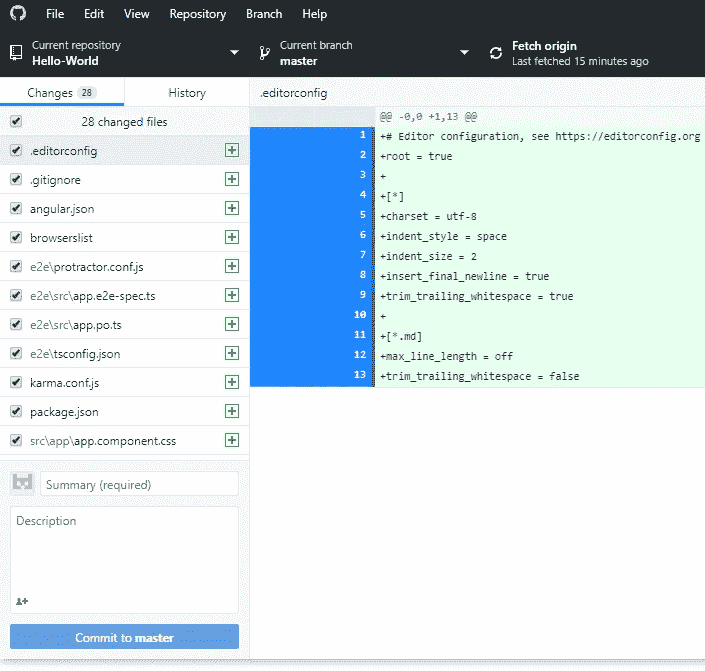

# **步骤 7:构建您的项目并选择合适的方法来托管您的站点**

*   在构建你的项目之前，给你的项目添加 gh 页面，让你的项目在 GitHub 上工作
*   键入以下命令以全局安装 npm 软件包。

```
npm i -g angular-cli-ghpages
```

*   构建项目的命令是

```
ng build
ng build --prod
```

***但是为了构建我们的项目，我们不会使用上面的命令。***

# **第八步:在 Github 设置页面选择你的选择来托管你的 app**

我们将一个接一个地看它们

1.  **主分支**


现在请注意，我们将在主分支上创建一个文件夹，因为我们已经在主分支上上传了项目代码。因此，为了区分我们的部署代码和项目代码，我们将在主分支上创建一个文件夹，并将其命名为**部署**

所以进入文档->github->项目文件夹->创建新文件夹->部署

现在运行部署代码

```
ng build --prod --output-path docs --base-href /Hello-World/deployment/
```

所以上面的代码将在

*   **输出路径 docs:** 指定在 docs 文件夹中生成我的构建文件
*   **base-href** :指定执行代码的基本 URL
*   因此，here /Hello-World/deployment 指定转到 Hello-World 并在 Hello-World 中找到名为 deployment 的文件夹，然后从这里开始执行
*   以上代码将在您的部署文件夹中生成一个文件列表
*   将这些文件从您的**部署**文件夹复制到您的文档- > github- >项目文件夹- >部署文件夹中
*   进入 Github 桌面，点击 **commi** t，然后点击 **push**

做了这么多之后，复制一个 index.html，并将其重命名为 404.html

将它复制到您的

**文档- > github- >项目文件夹**以及

**文档- > github- >项目文件夹- >部署**文件夹

从 CLI 运行该命令后

```
$ ngh
```

正如我们提到的主分支，所以它会在主分支下搜索第一次执行，然后它会返回一个基本的网址是

Hello-World/deployement/ so 之后它会在这个文件夹下搜索。

现在去链接**[**https://username.github.io/projectname/**](https://username.github.io/projectname/)**

**或者你可以在你的选项上方的设置标签下找到网址。**

**2.主分支/文档文件夹**

**所以转到**文档- > github- >项目文件夹- >新文件夹- >文档****

**将其发布到您的存储库后，您的此选项将被启用**

**现在运行部署代码**

```
ng build --prod --output-path docs --base-href /Hello-World/ 
```

**因此，请遵循上述步骤中提到的相同过程，而不是在部署中粘贴代码在文档中粘贴您的代码，并将您的选择从主文件夹更改为主分支/文档文件夹，然后启动您的站点**

**3.**GH-页面分支****

**为此，我们需要创建一个名为 gh-pages 的新分支**

*   **打开 Github 桌面，点击当前分支->新分支，命名为 **gh-pages****
*   **切换到 gh-pages 分支并发布它。**
*   **去你的 github 网站打开你的库，从主页切换到 gh-pages**

**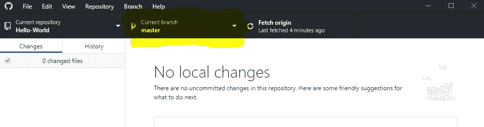****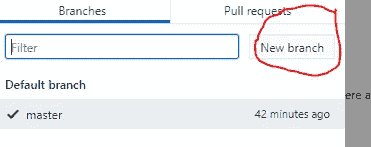****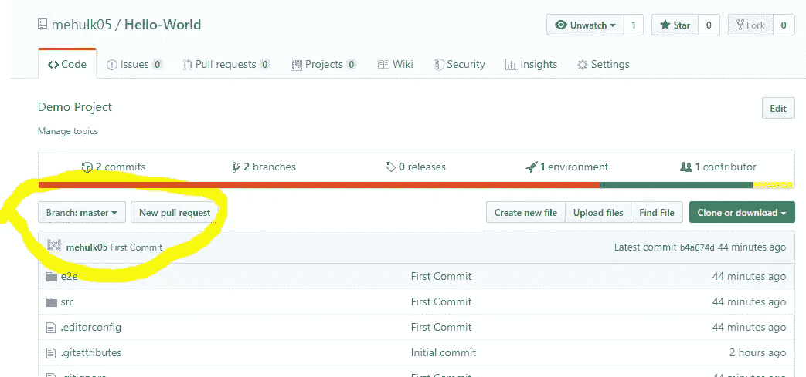****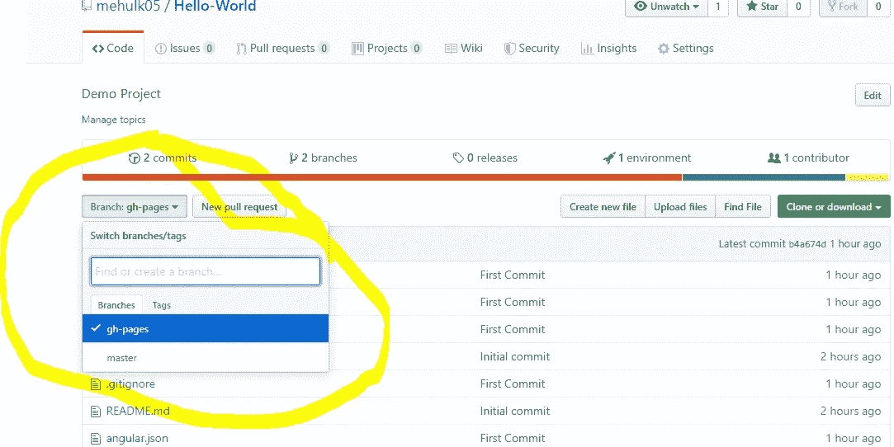**

*   **在 Github 页面选项卡下的设置中选择您的 gh 页面**

**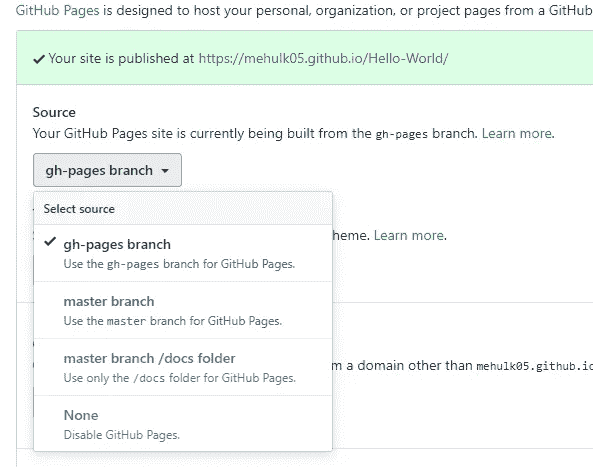**

**现在遵循方法 1 的所有步骤。即主支行**

# **输出**

**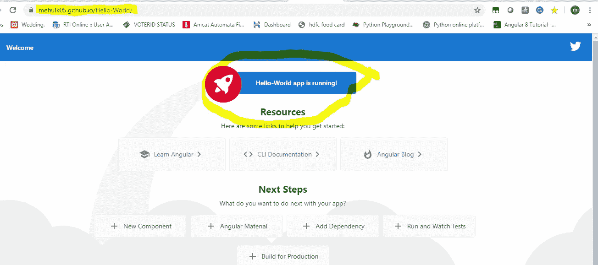**

**所以这都是关于 github 和 angular 的。将 Angular CLI 项目快速部署到 GitHub 页面**

********

**将 angular project 部署到 GitHub 页面既简单又容易。**

**我希望你会喜欢，如果有任何疑问，请随时联系。**