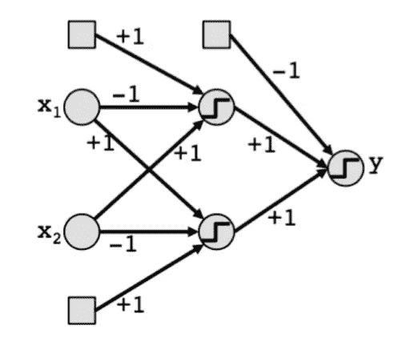
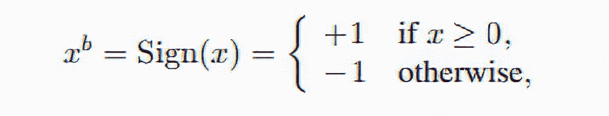

# 如何实现一个只有+1 和-1 的神经网络？

> 原文：<https://medium.com/analytics-vidhya/how-to-implement-a-neural-network-with-only-1-and-1-5170e80fd65?source=collection_archive---------20----------------------->

深度神经网络在过去十年中已经成为许多领域的一个伟大工具，从图像识别到语音识别，从机器翻译到 AlphaGo 这样的游戏。由于数百万个参数(神经元)和巨大的学习能力，它们非常强大。根据“通用逼近定理”，具有单个隐层和有限个神经元的神经网络可以逼近 R^n.意义的闭子集上的连续函数，它可以用充分和适当的参数表示各种各样的函数。因此，它们被称为“通用近似器”。


神经网络结构

尽管它们非常强大，并且通常被用来解决具有挑战性的问题，但是它们的成本非常高。在过去的十年中，为 ImageNet 分类挑战建立了许多模型。每个模型的目标都是在准确性得分方面超过之前的模型。如果我们将 AlexNet ( 2012)与 ResNet ( 2015)进行比较，我们将看到误差的巨大减少。16%的误差在 ResNet 中降至 3.5%。然而，当我们比较模型结构时，成本就开始起作用了。虽然 AlexNet 只有 8 层，但 ResNet 有 152 层！好的性能不是免费的，相反，它是相当昂贵的。

如上所述，由于深度神经网络的结构由多层和数百万个参数组成，因此出现了许多新的挑战:

## 1 速

随着参数数量的增加，DRAM 访问和加法/乘法操作花费的时间越多。例如，虽然 ResNet18 花了 2.5 天训练，但 ResNet152 花了 1.5 周。

## 2-存储空间

正如所料，使用数百万个参数会导致内存空间的极度使用。基于 ResNet152 中使用的 60M 参数，我们可以发现，假设每个参数都是 32 位浮点，整个模型的大小超过 200 兆。200 兆对台式电脑来说可能不成问题。但是对于像手机这样的小设备来说，这是一个大问题。通过使用这样的深度神经网络(DNN)模型实现的应用需要数百兆字节。这就是为什么通过互联网更新分发如此大的模型也具有挑战性。

## 3-能源使用

由于内存问题，很难在低功率设备上运行此类应用程序，因为它们会耗尽电池。代表参数的尺寸越大，消耗的能量就越多。下表显示了 8 位整数和 32 位浮点在能量方面的差异。

```
+-----------------------+----------------+----------+
| **Operation             | Multiplication | Addition** |
+-----------------------+----------------+----------+
| 8-bit integer         | 0.2pJ          | 0.03pJ   |
+-----------------------+----------------+----------+
| 32-bit Floating Point | 3.7pJ          | 0.9pJ    |
+-----------------------+----------------+----------+
```

正如我们可以观察到的，使用 32 位浮点而不是 8 位整数将所需的能量增加了几乎 30 倍！所以，如果我们能找到一种方法，用更小的词来表示我们的重量，我们就能大大减少这些运算的能量。

> 著名 AlphaGo 模型由 1920 个 CPU 和 280 个 GPU 训练，每局 3000 美元！

## 解决办法

为了解决这些与硬件相关的问题，人们开发了许多不同的方法。在这篇文章中，我们将讨论二值化神经网络(BNN)。它建议用约束到+1 和-1 的权重和激活函数来训练神经网络。不像传统的神经网络有数千甚至数百万个不同的权重，用 32 位浮点表示，BNN 的权重可以用一位表示。在传统的二进制化中，该值为 0 或 1。然而，在这种情况下，为了不丢失任何乘以 0 的信息，我们使用-1 和+1。有了这样的实现，内存消耗减少了 32 倍。



二值化神经网络

除了具有二进制权重之外，激活函数也被二进制化。实现二元激活函数有两种选择，确定的或随机的。我们可以使用符号(x)作为确定性激活函数:



```
#Implementation of a sgn(x) function on a vector
def sign(x): 
     x[x >= 0] = 1 
     x[x < 0] = -1 
     return x
```

确定性函数更容易实现，因为它只将数字与零进行比较。随机激活函数将需要生成一些随机位，这将增加硬件的必要性，这是我们已经在努力避免的。

此外，参数的二进制化允许我们执行逐位操作。在 BNNs 中，复杂的 32 位浮点乘法运算被简化为简单的移位运算。因此，BNNs 通过仅具有两个不需要数百万次 DRAM 访问的权重，显著降低了存储器和能量消耗，并提高了运行速度。

准确性呢？事实上，我们预计预测性能会显著下降。然而，根据建议在神经网络中仅使用+1 和-1 作为权重的论文[2]，在众所周知的数据集如 MNIST、CIFAR-10 和 SVHN 上获得了几乎最先进的结果。

简而言之，BNNs 为降低内存/能耗铺平了道路，并通过深度学习的新方法提高了运行速度。

> 本文由 [MERVE TURHAN](https://medium.com/u/beec6ddf56d8?source=post_page-----5170e80fd65--------------------------------) 共同撰写。

# 参考

[1]- Balázs Csanád Csáji (2001)用人工神经网络逼近；科学学院；匈牙利 etvs loránd 大学

[2]- [马蒂厄·库尔巴里奥、伊泰·胡巴拉、丹尼尔·苏德里、兰·埃尔-亚尼夫、约舒阿·本吉奥，“二值化神经网络:训练深度神经网络，其权重和激活被限制为+1 或-1”](https://arxiv.org/abs/1602.02830)