# 如何使用 Flask 实现端到端的机器学习项目:IPL 分数预测的分步方法🏆

> 原文：<https://medium.com/analytics-vidhya/how-to-implement-an-end-to-end-machine-learning-project-using-flask-ipl-score-prediction-9957795f1159?source=collection_archive---------2----------------------->

从零开始理解、构建和部署机器学习应用的初学者指南。

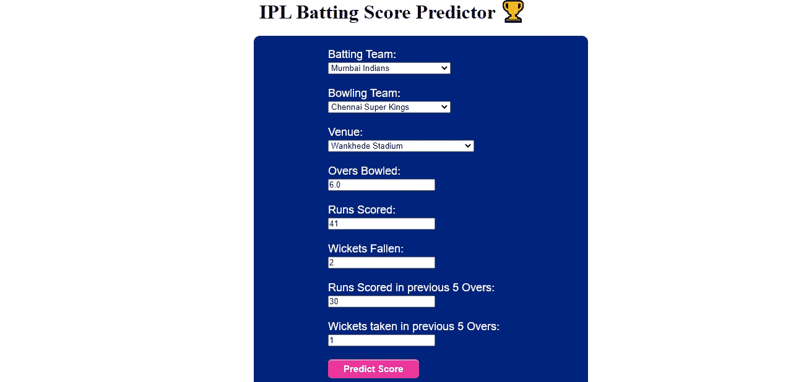

我的 IPL 分数预测 WebApp

# 介绍

在这个疫情中，IPL 让我们娱乐，并钩住我们的座位。我本人是锦标赛和这项运动的狂热爱好者，决定尝试在数据集上预测得分。

在本文中，我将尝试介绍该过程的所有细节和基础知识，以便即使是数据科学社区的新手也能够理解该项目。

# **循序渐进:**

1.  数据清理和格式化
2.  探索性数据分析
3.  特征工程和选择
4.  比较多种算法
5.  执行超参数调谐
6.  评估模型
7.  部署模型

我使用 python 进行探索性数据分析，使用 flask 框架在 Heroku 应用程序上部署我的项目。开始之前，请确保您的系统中安装了 flask。这是相同的代码:

```
sudo apt-get install python3-flask
pip install flask
```

**重要提示:**在开始一个新项目之前，总是在你的命令提示符下创建一个新环境。然后在该环境中安装必要的库。

# 了解数据集

数据集由 15 列组成:

1.  mid:唯一标识每个匹配的匹配 id。
2.  日期:比赛举行的日期。
3.  地点:体育场的名称。
4.  击球队名称。
5.  保龄球队的名字。
6.  击球手:击球手的名字。
7.  保龄球手:保龄球手的名字。
8.  得分:到目前为止的得分。
9.  三柱门:到目前为止的三柱门。
10.  投球次数:投球次数。
11.  runs_last_5:最近 5 轮得分的跑步次数。
12.  wickets_last_5:最后 5 局中的三柱门数。
13.  击球手:击球端击球手的名字。
14.  非击球手:保龄球场击球手的名字。
15.  total:比赛中得分的总次数。

# **项目开始**

在我们开始之前，让我们看看我们正在构建什么:

首先，我们将导入必要的库。

现在读取数据集(csv 文件)并显示前 5 条记录。

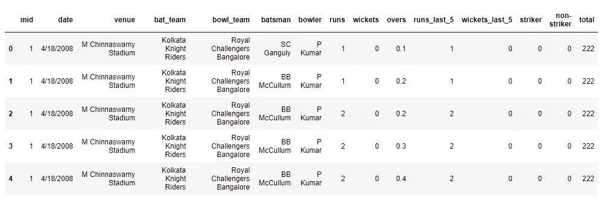

这是 Jupyter 笔记本电脑的输出结果

## **第一步:数据清理和格式化**

在这一步中，我们将删除所有不需要的列，并清除任何缺少值的行。这里我展示了如何删除不需要的列。

## 步骤 2:探索性数据分析

在这里，我们将研究这些数据，并决定我们要为特征工程保留哪些数据。

独特团队的产出:

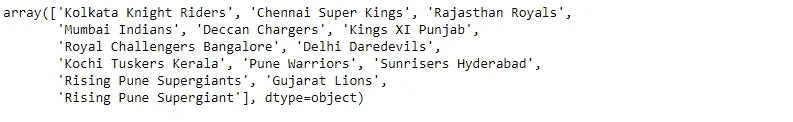

独特场馆的产出:

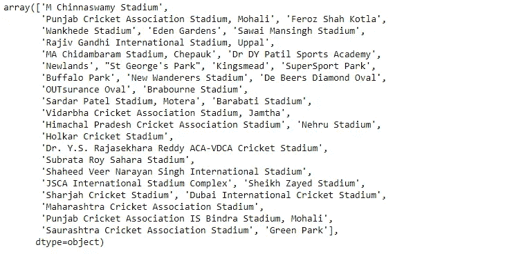

使用 groupby()函数输出体育场在数据中出现的次数:

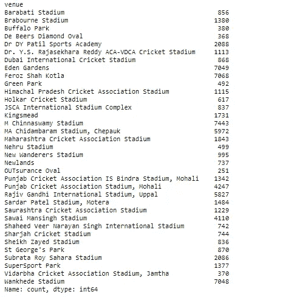

这向我们展示了每个体育场投球的数量

既然我们知道一个体育场被使用了多少次，我们可以只选择拥有最多数据的顶级体育场来进行模型预测。

## 步骤 3:特征工程和选择

在这一步，我们将决定保留哪些团队和场地来制作我们的模型。截至 2020 年 10 月，我们只使用了当前参赛球队及其各自的主场。

现在，我们将使用**数据预处理**来转换使用 **OneHotEncoding** 的特性，并将字符串日期转换为日期时间对象。

下面是使用 **OneHotEncoding** 并重新排列列后数据的样子。

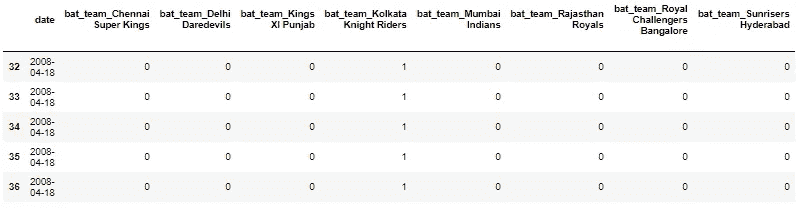

## 步骤 4，5:比较多个算法并执行超参数调整

我刚刚比较了两种算法，套索回归和随机森林回归。首先，在使用机器学习算法之前，我们必须将数据分为训练集和测试集。

*分为训练和测试数据:*

现在我们已经有了用于训练和测试的数据集，我们要研究的第一个算法是**套索回归**。我们已经使用 **GridSearchCV** 进行超参数调优。

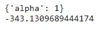

最佳参数和最佳分数

下面是随机森林回归的代码。我已经使用 **RandomizedSearchCV** 进行超参数调整。

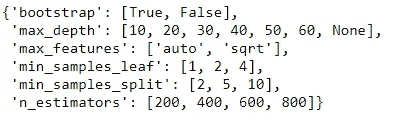

random_grid 值的输出

现在，我们将找到最佳参数，并拟合模型进行预测。这段代码需要一些时间来计算。

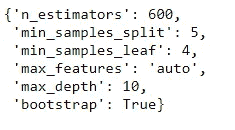

超参数调谐的最佳参数

## 步骤 6:评估模型

1.  **套索回归**

使用 **Distplot** 和 **Sklearn 度量评估 Lasso 回归模型:**

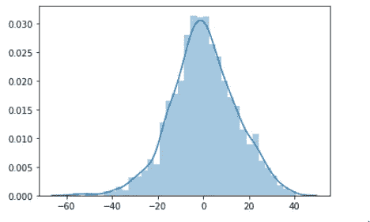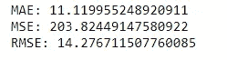

在这个图中，我们可以观察到我们的大多数值是 0 或接近 0。因此，我们可以说套索回归模型工作良好。

**2。随机森林模型**

使用 **Distplot** 和 **Sklearn 度量:**评估随机森林回归模型

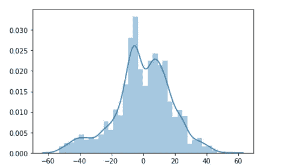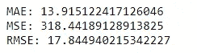

在该图中，我们可以观察到，与 Lasso 回归相比，我们的许多值都不是 0 或接近 0。误差值也高于 Lasso 回归。因此，我们可以说，套索回归模型比随机森林模型具有更好的准确性。

# 正在保存部署模型

通过分析上述模型，我们可以得出结论，Lasso 回归在我们的数据集上效果更好，因为它比随机森林回归器具有更低的误差度量值。现在我们将模型保存在一个 pickle 文件中。

## 步骤 7:部署模型

对于部署，我们将使用 flask 框架和 heroku 应用程序平台。我制作了一个名为“app.py”的 python 文件。这段代码的作用是，让我们访问“index.html”和“predict.html”文件。我们已经使用了 **POST** 方法来调用。

当使用 flask 框架时，我们需要创建两个文件夹:静态和模板。Html 文件应该存储在模板文件夹中，而图像和 css 文件应该存储在静态文件夹中。下面是我们主页:index.html 的 html 文件的代码

此外，我们还创建了一个预测网页来显示结果。下面是那个网页的 html 文件的代码:result.html

对于样式和设计，我们必须使用 CSS 文件，并将其存储在静态文件夹中。下面是代码:

现在我们准备在本地机器上运行我们的模型。打开命令 promt，首先将目录切换到保存项目的文件夹。然后运行 **python app.py.**

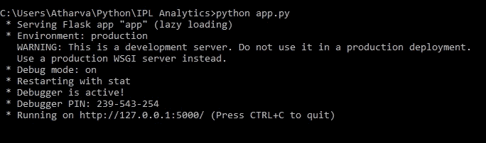

命令提示符视图

现在在你的浏览器上打开 [http://127.0.0.1:5000/](http://127.0.0.1:5000/) 并运行应用程序。下面是用户界面的图像。

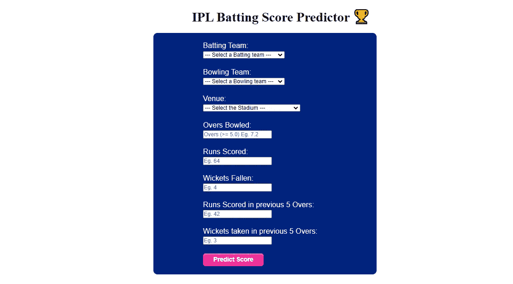

主页

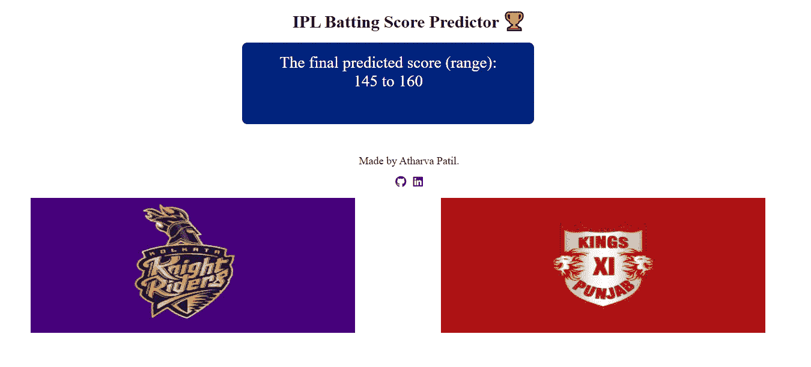

预测页面

您将需要一个 procfile 和需求文件。我在本文末尾的 github 链接中提供了这些内容。procfile 将包含: *web: gunicorn app:app*

要创建需求文件，请在虚拟环境中的 cmd 上键入以下代码:

```
$ **pip** freeze > **requirements**.**txt**
```

我们将在 heroku 平台上部署这个项目。

1.  在 heroku 上注册。
2.  在 GitHub 上上传项目。
3.  登录您的 Heroku 仪表板。
4.  点击新建/创建新应用。
5.  给一个应用程序名称，选择地区，然后点击创建。
6.  然后进入部署部分，将你的应用程序连接到 GitHub。
7.  单击部署项目。

现在，您已经成功部署了您的应用程序并完成了实现。您可以通过链接查看您的项目。

这是我已部署项目的链接:[https://ipl-batting-score-predict.herokuapp.com/](https://ipl-batting-score-predict.herokuapp.com/)

如果您遇到下图所示的 webapp，这只是因为 Heroku 提供的这个月的免费 dynos 已被完全使用。你可以在下个月 1 号访问这个网页。抱歉给您带来不便。

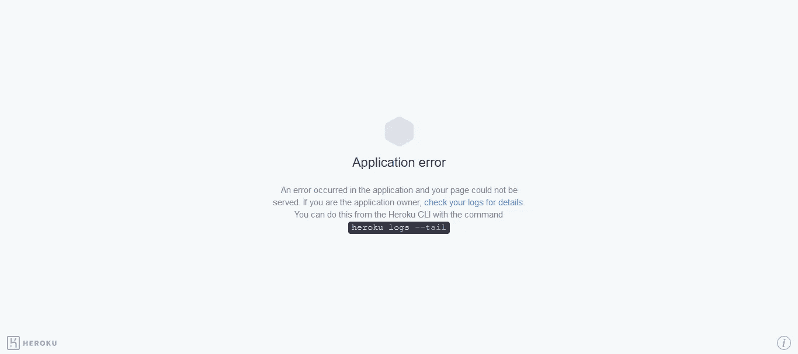

以下是 GitHub 上的代码链接:[https://github.com/Atharva1604/IPL-Score-Prediction](https://github.com/Atharva1604/IPL-Score-Prediction)

这里是我的 LinkedIn，随时联系我:[https://www.linkedin.com/in/atharva-patil-a79a84176/](https://www.linkedin.com/in/atharva-patil-a79a84176/)

**谢谢！！**