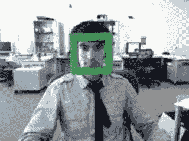
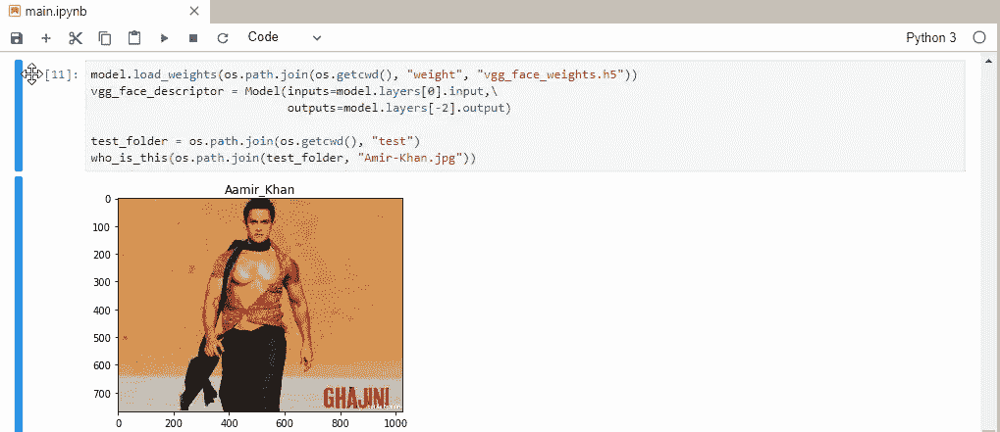

# 如何在 Python 3.7 和 Tensorflow 2.0 中使用 VGG 人脸实现人脸识别

> 原文：<https://medium.com/analytics-vidhya/how-to-implement-face-recognition-using-vgg-face-in-python-3-8-and-tensorflow-2-0-a0593f8c95c3?source=collection_archive---------5----------------------->

# **简介**

**面部识别系统**是一种能够从视频源或图像源的数字图像或视频帧中识别或验证一个人的技术。面部识别系统有多种工作方法，但一般来说，它们通过将从给定图像中选择的面部特征与数据集中的面部进行比较来工作。



人脸识别

你可以使用这个[链接](https://github.com/iamatulsingh/face-detection.git)从我的 Github 下载完整的源代码。

# 先决条件

这篇文章假设读者熟悉 Python、Opencv、Numpy、Tensorflow 和 Keras 等基本概念。

# 为什么我们需要面部识别？

由于面部是识别人的唯一方式，面部识别因提供安全可靠的安全性而受到关注并在世界范围内迅速发展。

从创建考勤系统作为基本需求，到使用人脸识别作为机场、刑事侦查、人脸跟踪、法医、公共场所等的安全措施。当然，仅仅通过监控摄像头，我们无法利用罪犯的指纹找到他。


因此，让我们开始，看看我们如何建立一个模型，可以帮助我们使用预先训练的 VGG 人脸 2 识别模型来识别人。

作者在这里提供了完整的源代码[和预训练的模型，可以通过标准的深度学习框架下载，如 Caffe 和 PyTorch，尽管没有 TensorFlow 或 Keras 的例子。](https://github.com/ox-vgg/vgg_face2)

我们可以将提供的模型转换为 TensorFlow 或 Keras 格式，并开发一个模型定义，以便加载和使用这些预训练的模型。令人欣慰的是，这项工作已经完成，可以被第三方项目和库直接使用。我们将使用 keras-vggface 和 MTCNN 来帮助我们创建 VGGFace2 的 keras 模型

这些库可以通过 pip 安装；例如:

```
***sudo pip install git+https://github.com/rcmalli/keras-vggface.git******sudo pip install mtcnn***
```

**创建 KERAS 模型**

我们将创建一个 **model.py** 文件，并将下面的代码添加到其中。

model.py

现在，我们将创建一个" **crop_face** "函数，该函数将裁剪面并将其发送给模型以进行下一个过程。假设输入照片包含一张人脸，我们的人脸裁剪方法将返回检测到的第一张人脸。

裁剪面

在“ **crop_face** ”函数中，我们将使用 MTCNN 检测人脸，然后在第 6 行使用 Numpy 图像切片来裁剪人脸。现在让我们看看我们的模型将如何表现。因此，让我们创建“main.py ”,并将下面的代码复制到其中。

main.py

让我们测试一下这个模型，看看它是否能运行良好。



结果

还好它能找到“完美主义者先生”😃。

感谢您耐心看完。如需任何帮助或建议，请联系。