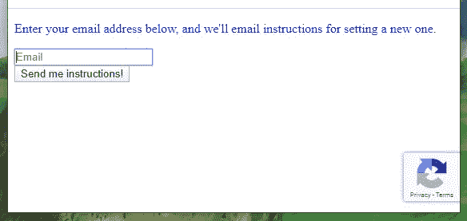

# 如何在 Django 类视图中实现 Google Recaptcha V3

> 原文：<https://medium.com/analytics-vidhya/how-to-implement-google-recaptcha-v3-in-django-class-view-44c4c5c53fbb?source=collection_archive---------5----------------------->

在过去 5 年多的时间里，我一直在做 Python/Django 开发，一个反复出现的“待办事项”就是在公共网站上实现“Google Captcha”。鉴于 Google Captcha 和 Python/Django 的流行，我很惊讶我不能找到如何实现它的直接答案。在与有类似问题和需求的人讨论之后，我可以总结出与实现这个特性相关的问题和挑战。

在本文中，我假设您熟悉 Django。因此，我将跳过从头开始构建 Django 项目的说明。如果你想知道我是如何创建 Django 项目的，请留下你的评论。我会整理出另一个教程。谢了。

# 目标:

1.  重用 Django 内置的类视图(保持代码干燥)
2.  根据我们的需求定制

# 依赖关系:

Python 3.7，Django 2.2

# 定制 Django 内置密码重置视图和密码重置表单

假设应用程序名为“landing ”,它接管所有密码重置请求。

*在 urls.py 中*

```
from landing import views 

urlpatterns = [
    # other urls
    path('password_reset/', views.PasswordResetGoogleRecaptchaView.as_view(), name='password_reset')
]
```

*在 views.py*

```
from django.contrib.auth.views import PasswordResetView
from landing.forms import PasswordResetGoogleRecaptchaFormclass PasswordResetGoogleRecaptchaView(PasswordResetView):
    form_class = PasswordResetGoogleRecaptchaForm
```

注意，我们继承了 Django 内置视图 PasswordResetView，并让它使用我们在 *forms.py* 中声明的自定义 PasswrodResetGoogleRecaptchaForm。

*在 forms.py 中*

```
from django.contrib.auth.forms import PasswordResetFormclass PasswordResetGoogleRecaptchaForm(PasswordResetForm): recaptcha = forms.CharField(
        widget=forms.HiddenInput(),
        max_length=1024,
        required=False
    ) def clean(self):
        cleaned_data = super(PasswordResetGoogleRecaptchaForm, self).clean()
        recaptcha_token = cleaned_data.get('recaptcha')
        recaptcha_data = {
            'secret': settings.GOOGLE_RECAPTCHA_SECRET_KEY,
            'response': recaptcha_token
        } r = requests.post('https://www.google.com/recaptcha/api/siteverify', data=recaptcha_data)
        result = r.json()
        if result.get('success') and result.get('score') > 0.5:
            # client is human
            print(result)
            pass else:
            raise forms.ValidationError('You are robot!')
```

我们的表单是通过继承 Django 内置的 PasswordResetForm 构建的。在表单中，我们添加了一个名为“recaptcha”的新字段，它负责将 Recaptcha 令牌传递给后端。请注意，在“recaptcha”字段中使用 HiddenInput 会使其在客户端浏览器中隐藏起来。

我们还添加了一个 [clean()](https://docs.djangoproject.com/en/2.2/ref/forms/api/#django.forms.Form.clean) 函数，所有神奇的事情都发生在这个函数中。它从 Google recaptcha api 返回结果，通过使用它我们可以建立我们的逻辑来确定它是否是一个机器人。

您可以在这里查看预期的结果。

[https://developers . Google . com/recaptcha/docs/v3 # site _ verify _ response](https://developers.google.com/recaptcha/docs/v3#site_verify_response)

# 自定义密码重置表单

默认情况下，我们的“PasswordResetGoogleRecaptchaView”将在 templates/registration/password _ reset _ from . html 中呈现内容。

```
<form id="reset-password-form" method="POST">
    
    {{ form.non_field_errors }}
    <div class="input-group mb-3">
        <input type="email" class="form-control" placeholder="Email" id="id_email" name="email" maxlength="254" required="" autofocus>
        <div class="input-group-append">
            <div class="input-group-text">
                <span class="fas fa-envelope"></span>
            </div>
        </div>
    </div>
    {{ form.recaptcha }}
    <div class="row">
        <input type="submit" class="btn btn-primary btn-block" value="Send me instructions!">
    </div>
</form><script src=""></script>
<script src="https://www.google.com/recaptcha/api.js?render=YOUR_GOOGLE_RECAPTCHA_SITE_KEY"></script>
<script>
  $('document').ready(function submitResetForm() {
    grecaptcha.ready(function () {
      grecaptcha.execute("YOUR_GOOGLE_RECAPTCHA_SITE_KEY", {action: 'homepage'}).then(function (token) {
          $('input#id_recaptcha').val(token);
      });
    });
  });
</script>
```

在 html 文件中，我们需要做的就是显示表单，集成 recaptcha javascript 并在 recaptcha 字段中填充标记。在幕后，$('input#id_recaptcha ')。val(token)是填充 recaptcha 字段中令牌的关键代码。如果您想在多个页面中启用 google Recaptcha 站点密钥，将它作为全局变量传递将是一个更好的解决方案。

你可以在这里查看关于前端集成的官方文档。



为了分享我如何在 Python/Django 项目中实现 Google Recaptcha，我在我的 GitHub 帐户上创建了一个教程项目。存储库名称是: [googleRecaptchaInDjango](https://github.com/slow999/googleRecaptchaInDjango) 。资源库的网址是:【https://github.com/slow999/googleRecaptchaInDjango 。为了帮助读者开始这个项目，我还包含了一个关于逐步说明的 PDF 文件。我最近相当忙。一旦我有时间，我也会发布一个 YouTube 视频教程。敬请关注。

*非常感谢* [*Amanda*](https://www.linkedin.com/in/amanda-cascadden-morra-85b5616a) *帮我校对这篇帖子。*