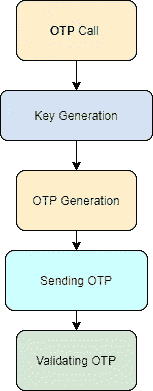

# 如何在 Django-rest-framework 上实现基于 OTP 的认证

> 原文：<https://medium.com/analytics-vidhya/how-to-implement-otp-based-authentication-on-django-rest-framework-185ae8032f07?source=collection_archive---------0----------------------->


安全是计算机科学中永远不会消亡的领域之一。随着事情的发展，安全问题也日益增加。

因此，您可能会关心它，并且可能希望在您的项目中有某种安全认证。

有不同种类的认证技术:

1.  **密码认证**
2.  **双因素认证(2FA)**
3.  **令牌认证**
4.  **生物认证**

等等。

> 参考:[https://www . solarwindsmsp . com/blog/network-authentic ation-methods](https://www.solarwindsmsp.com/blog/network-authentication-methods)

通过 OTP 功能，我们可以在项目中实现 **2FA** 。

## 那么我们为什么需要 2FA 呢？

在密码认证中，我们需要密码来获得访问受限制内容的授权。因为这是一种直接的方式，如果黑客以任何方式通过登录进入服务器，那么你的数据可能会毫不费力地被窃取。为此，我们可以有一个中间步骤，当且仅当一次性密码正确时，我们才能验证用户。一次性密码可以通过任何方式发送，如电子邮件、手机等。

让我们边做边学。


不，我会帮忙的

# OTP 是如何工作的？

该流程图描述了该过程的流程。



流程图

*   首先，客户通过提供的电话号码或电子邮件请求 OTP 代码。
*   则生成对该特定实例有效的密钥。
*   OTP 被创建并通过所提供的介质发送到客户端。
*   用户在我们提供的门户上输入 OTP 代码。
*   之后，OTP 由服务器验证。

# 在 Django 如何实现？

我们可以使用名为 **PyOTP 的 python 包/库通过 OTP 实现 **2FA** 。**

**PyOTP** 提供了 OTP 创建和验证的所有功能。

**Base64** 将用于密钥生成。

在 PyOTP 中，我们必须定义用例的类型:

1.  基于时间的 OTP
2.  基于计数器的 OTP

> 参考:[https://pypi.org/project/pyotp/](https://pypi.org/project/pyotp/)

这两种方法都不错，但是现在，我们将使用基于计数器的 OTP。在基于计数器的 OTP 中，每个新的计数器编号都会生成一个新的 6 位数代码。

```
hotp = pyotp.HOTP('base32secret3232')
hotp.at(0) # => '260182'
hotp.at(1) # => '055283'
hotp.at(1401) # => '316439'
```

> **整个项目参考**:[https://github.com/Akash16s/OTP-in-django](https://github.com/Akash16s/OTP-in-django)

你可以参考上面提供的 GitHub repo 的链接，因为在本教程中我不会教你 Django rest 框架。

> 【https://www.youtube.com/watch?v=ejJ-2oz4AgI】几分钟学会 Django-rest 框架:[](https://www.youtube.com/watch?v=ejJ-2oz4AgI)

## 文件结构

```
OTP
 ├── --init__.py
 ├── asgi.py
 ├── settings.py
 ├── urls.py
 └── wsgi.py
verification
 ├── --init__.py
 ├── admin.py
 ├── apps.py
 ├── migrations
 ├── models.py
 ├── tests.py
 ├── urls.py
 └── views.py
--manage.py
```

让我们从名为 **Verification 的应用程序开始。**

# 项目按以下方式配置。

## 得到

这是将手机号码注册到数据库中并生成 OTP。

`http://127.0.0.1:8000/verify/<phone>/`

## 邮政

这是使用 OTP 验证手机号码。

`http://127.0.0.1:8000/verify/<phone>/`

## JSON 数据:

```
{
    "otp":040301
}
```

我们希望存储每次新注册的数据。所以我们的 Django 模型中有如下模型。

## **型号:**

```
class phoneModel(models.Model):
    Mobile = models.IntegerField(blank=False)
    isVerified = models.BooleanField(blank=False, default=False)
    counter = models.IntegerField(default=0, blank=False)def __str__(self):
        return str(self.Mobile)
```

现在您已经准备好了服务器的框架，我们现在可以开始写下 OTP 的代码了。

在设计 OTP 功能时，我们必须确保上面提供的流程图应该满足。

# Get 请求:

我们不会深入到网络方面，我们只是将它用作与服务器通信的 API。用户通过这个特定的 GET 请求来请求 OTP。

**第一步:**如果数据库中没有数据，则添加到数据库中，并为用户创建一个特定的模型对象。也更新计数器。

**第二步:**使用 **base64** 库生成 **base32** 的密钥。

**第三步:**使用 Key 生成一个 **pyotp 类的对象。**

**步骤 4:** 现在使用用户模型的**计数器**和 **pyotp** 对象生成 otp 代码。

**步骤 5:** 使用邮件或消息服务将 OTP 代码发送给用户。

# 帖子请求

我们不会深入到 post request 的网络方面，我们只是将它用作与服务器通信的 API。用户尝试使用 POST 请求来验证 OTP。

**步骤 1:** 查找手机型号中存在电话号码。

**第二步:**使用 **base64** 库生成 **base32** 的密钥。

**第三步:**使用 Key 生成一个 **pyotp** 类的对象。

**第四步:**现在使用用户发送的用户模型和 OTP 码的计数器，验证用户的真实性。

**第 6 步:**现在发送用户授权令牌进行进一步授权。

## 这是代码

因此，您已经在 Django-rest-framework 项目中实现了 OTP 功能。

# 恭喜你完成了代码。

希望这个教程对你以后的项目有很大帮助。把这篇文章分享给你的同事和朋友。

**完整代码:**【https://github.com/Akash16s/OTP-in-django】T2

# 谢谢你陪我到最后。我目前正在开始写文章，所以，请在下面评论这篇文章，你的评论对我来说意义重大。

可以在[**Twitter**](https://twitter.com/Akash16s)**[**GitHub**](https://github.com/Akash16s?source=post_page---------------------------)**[**Medium**](/@akash16s?source=post_page---------------------------)**[**LinkedIn**](https://www.linkedin.com/in/akash-srivastava-8b4527159/?source=post_page---------------------------)**上关注我。********

****别忘了跟着[**露营用 python**](https://medium.com/camping-with-python?source=post_page---------------------------) **。******

****如果你对本教程有任何疑问，或者有任何其他问题，或者你想提出一些建议，你可以在下面的**评论**。****

****下一篇文章很快就会出来，请继续练习。****