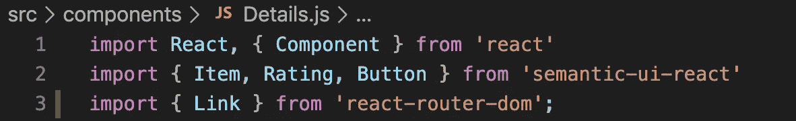

# 如何在 React 中实现语义 UI 项目视图

> 原文：<https://medium.com/analytics-vidhya/how-to-implement-semantic-ui-item-view-in-react-1f8e09e504b3?source=collection_archive---------14----------------------->

为了更好地理解 React-integrated user interface(UI)框架如何在 React 应用程序中实现，本周在 boot camp，我们将重点放在将一些语义 UI React 组件构建到我们的团队项目中。

在 React 应用中开始使用语义 UI 的最快方法是运行下面的命令:

`$ npm install --save semantic-ui-react`

接下来，安装语义 UI CSS 包，以便能够设计:

`$ npm install semantic-ui-css --save`

安装完成后，在 React 入口点文件中导入缩小的 CSS 文件:

`import ‘semantic-ui-css/semantic.min.css’`

最后，您可以通过向您的`index.html`文件添加一个 CDN 链接来轻松访问这个库:

```
<link rel=”stylesheet” href=”[//cdn.jsdelivr.net/npm/semantic-ui@2.4.2/dist/semantic.min.css](https://flatiron-school.slack.com//cdn.jsdelivr.net/npm/semantic-ui@2.4.2/dist/semantic.min.css)” />
```


安装完成后，您可以看到 package.json 文件中列出了新的依赖项。

现在，语义 UI 已经可以在我们的 React 应用程序中使用了。在下一节中，我将尝试总结我们如何从语义 UI React 导入和使用组件。

在我们的应用程序中，我们建立了一个页面，用户可以点击并查看列出的食谱的详细信息。*细节*组件包含几个不同的导入元素，如来自语义 UI React 的项目、评分和按钮:



项目视图提供了一种将不同类型的内容(如图像、标题、描述、评级和内部内容)组合在一起的方式。在我们的项目中使用*项目*来显示标题、图片、配料和所选食谱的描述，这很棒。我们在应用中使用了一组三个项目，您可以在下面看到*详细信息*页面的样子:


第一项包含标题(食谱的标题)，第二项包含图像、内部内容(食谱的成分)以及编辑和删除食谱的按钮:


如您所见，这里应用了一些内联样式来调整图像大小，并用填充来格式化项目。该页面的第三个也是最后一个项目包含描述(配方的准备步骤)、元数据(配方的区域、类别和评级)、评级操作图标以及将配方添加到收藏夹的按钮:


我希望你能在这里找到一些有用的技巧，这篇博文对那些不熟悉语义 UI React 的人有所帮助。请随意访问[语义 UI React](https://react.semantic-ui.com/) 文档来了解关于这个主题的更多信息。感谢您的阅读！