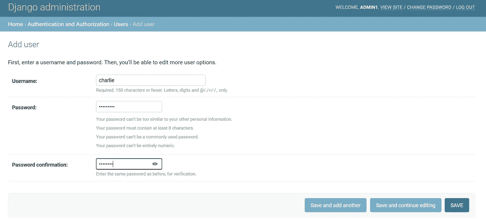

# 如何在 Python Django 中实现用户认证？

> 原文：<https://medium.com/analytics-vidhya/how-to-implement-user-authentication-in-python-django-cc909948075?source=collection_archive---------27----------------------->

什么是认证？在许多网站上，我们需要某种认证方法。一些用户能够登录和注销的能力。在这篇博客中，我们将介绍一个应用程序，它允许我们使用 Django 的内置身份验证方法与这种身份验证方法进行交互。

因为 Django 在框架中内置了一大堆我们可以利用的认证特性，所以我们不需要重写所有的逻辑，比如如何让用户登录，以及代表用户意味着什么。姜戈为我们做了很多。

因此，我们现在将创建一个应用程序来完成这项工作。

第一步:创建一个可以在任何应用程序中维护用户的应用程序。例如，**用户使用命令**

```
python [manage.py](http://manage.py/) startapp users
```

第二步:每当你创建一个新的应用程序时，进入 [settings.py](http://settings.py/) ，用新的应用程序名称更新已安装的应用程序。

*settings.py*

```
INSTALLED_APPS = [
    **'django.contrib.admin'**,
    **'django.contrib.auth'**,
    **'django.contrib.contenttypes'**,
    **'django.contrib.sessions'**,
    **'django.contrib.messages'**,
    **'django.contrib.staticfiles'**,
    **'users',**
]
```

步骤 3:转到项目 [urls.py](http://urls.py/) 并为新的应用程序 URL 设置路径:

*urls.py*

```
from django.contrib import admin
from django.urls import path, include
urlpatterns = [
    path(**'admin/'**, admin.site.urls),
    path(**''**,include(**'user.urls'**))
]
```

步骤 4:现在在用户应用程序中，所有与我的用户应用程序相关联的 URL。我需要导入路径，导入我的视图，然后定义一些 URL 模式。在这里，将 URL 设置为三个功能:索引、登录和注销。所以我们实际上有三条不同的路线。一个主要的索引路径将显示当前登录用户的信息。一个让某人登录的路径，一个显示他们可以输入用户名和密码登录的地方的表单。然后，一个路由允许用户也能够从该应用程序注销。

app- *urls.py*

```
from django.urls import path
from .import viewsapp_name=**'users'**urlpatterns = [
    path(**'index'**,views.index,name=**"index"**),
    path(**'user'**,views.login_page,name=**"login"**),
    path(**'logout'**,views.logout_page,name=**"logout"**),
]
```

步骤 5:现在让我们在应用程序中创建模板。我将创建一个模板文件夹。我们将在其中创建一个基本布局。这将是这个应用程序的页面的一般结构。这里称之为*layout.html*:

*layout.html*

```
<!DOCTYPE html>
<html lang="en">
<head>
    <meta charset="UTF-8">
    <title>Users</title>
</head>
<body>
    
    </body>
</html>
```

现在我有了这个 HTML 布局，我可以继续创建一个名为 login.html 的新文件，login.html 将在其中扩展 layout.html。在 body 块中，我可以用 HTML 格式显示。

login.html:

```


    <div>{{message}}</div>

<form action="" method="post">
    
    <input type="text" name="username" placeholder="Username">
    <input type="password" name="password" placeholder="Password">
    <input type="submit" value="Log in">
</form>
```

在这里，当我登录时，我正在提交一个表单。通常，当您这样做时，您希望通过 post 提交表单数据，尤其是在用户名和密码的情况下。因为如果你做这样的事情，你不希望用户名和密码作为 get 参数传入，因为它们会出现在 URL 中。

第 6 步:现在让我们登录到管理员，并添加一些用户名和密码字段。这些用户可以有其他相关信息，如名字、姓氏、电子邮件。



第 7 步:然后，让我们编写 [views.py](http://views.py/) 来完成认证。在 views.py 中，我们首先需要考虑如果有人试图访问这个页面但他们没有通过身份验证，会发生什么。我们如何发现这一点，在这种情况下我们该怎么做？好吧，比方说，如果没有*request . user . is _ authenticated，*作为请求的一部分传递给 Django 中每个用户的请求对象自动拥有一个与之相关联的用户属性。用户对象有一个 *is_authenticated* 属性，告诉我们用户是否登录。如果他们没有登录，我们将继续，HTTP 响应将他们重定向到 log in 视图。为了实现这个功能，我需要从 django.http 导入 HttpResponseRedirect。同样，*从 django.urls* 开始，*也导入反向*。因此，如果用户没有通过身份验证，那么我们将把他们重定向到 log in 视图，这是一种用户可以自己登录的形式。

然后在*登录*视图中，有两种方法可以调用登录视图功能。一种是通过 get 请求方法，这意味着只在表单中显示日志。一种是通过 post，也以日志的形式提交数据。因此，如果请求方法是 post，那么获取用户名，该用户名将包含在名为用户名的字段中的 post 数据中。让我获取密码，该密码将位于密码内 request.post 的一个字段中。

然后使用 Django 内置的*身份验证*方法对用户进行身份验证。如果返回一个用户，继续使用 Django 的内置*登录*方法登录，否则返回到显示消息*无效凭证的登录页面。*

现在使用 Django 内置的 logout 函数编写 logout 视图。不要忘记从 django.contrib.auth 导入 authenticate、login 和 logout。

*views.py*

```
from django.shortcuts import render
from django.http import HttpResponseRedirect
from django.urls import reverse
from django.contrib.auth import authenticate,login,logout
*# Create your views here.*def index(request):
    if not request.user.is_authenticated:
        return HttpResponseRedirect(reverse(**'login'**))
    return render(request, **"user.html"**)def login_page(request):
    if request.method == **"POST"**:
        username = request.POST[**'username'**]
        password=request.POST[**'password'**]
        user=authenticate(request,username=username,password=password)
        if user is not None:
            login(request,user)
            return HttpResponseRedirect(reverse(**"users:index"**))
        else:
            return render(request,**"userlogin.html"**,{
                **"message"**:**"Invalid Credentials"**
})
    return render(request,**"userlogin.html"**)def logout_page(request):
    logout(request)
    return render(request,**'userlogin.html'**,{
        **'message'**:**"Logged out"**
})
```

最后，如果用户通过了身份验证，他/她将转到 user.html，这里显示了一些用户信息。

*user.html*

```

<h2> Welcome {{request.user.firstname}}</h2>
<ul>
    <li>Username: {{request.user.username}}</li>
    <li>Email:{{request.user.email}}</li>
</ul><a href="">Log Out</a>

```

这是 Django 内置的用户认证系统。一个允许我们非常快速地让用户能够从我们的 web 应用程序登录和注销的系统。Django 为开发者提供了许多有趣的特性，可以有效地使用。希望这对你有帮助。感谢阅读。

*原载于 2020 年 10 月 10 日*[*https://www.numpyninja.com*](https://www.numpyninja.com/post/how-to-implement-user-authentication-in-python-django)*。*