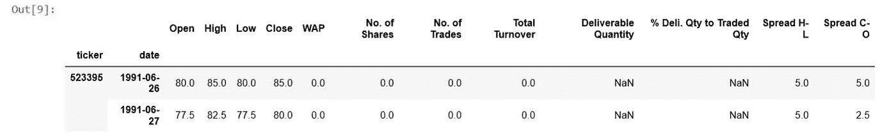

# 如何将印度股票数据导入本地机器上的 zipline？

> 原文：<https://medium.com/analytics-vidhya/how-to-import-indian-equities-data-to-zipline-on-your-local-machine-3b8587aaf112?source=collection_archive---------4----------------------->

*乘*[萨比尔贾纳 ](https://www.linkedin.com/in/sabirjana/)


zipline 可能是最成熟和最强大的回溯测试和实时交易引擎。它由 quanto pian Inc .[Quantopian](https://www.quantopian.com/home) 开发、维护并用于生产，quanto pian 是一家总部位于波士顿的众源技术和资产管理公司。任何人都可以在他们的网站上创建一个免费账户，用丰富的基本面和分钟级数据来开发和回测他们的策略。

zipline 是他们网站的回溯测试引擎。但是，它也可以下载并安装在本地。滑索的本地安装有点复杂，因此你需要参考[滑索文档](https://www.zipline.io/)来了解如何执行本地安装。使用他们的网站，免费获得丰富的历史数据，比在本地运行策略要容易得多。然而，在他们网站上做的一切都需要留在网站上。

当您有 zipline 的本地设置时，您需要提供自己的数据。这被称为摄取您自己的定制包。有一些关于如何建立单一资产数据的帮助，但是，没有多少关于多种股票的信息。 [Andreas F. Clenow](https://www.followingthetrend.com/) 在他的杰出著作《交易进化:任何人都可以用 Python 构建黑仔交易策略》中很好地解释了建立自己的定制捆绑包的过程[。然而，如果你想为印度股票做这件事，尤其是使用免费的 Quandl 数据，会面临许多挑战。](https://www.amazon.in/Trading-Evolved-Anyone-Killer-Strategies-ebook/dp/B07VDLX55H)

在本文中，我将一步一步地介绍如何为 S&P BSE 500 成份股创建自己的定制包，假设您已经创建了一个虚拟环境`env_zipline`，并在本地机器上安装了 zipline。

**以下是获取您自己的定制包并测试它的步骤:**

1.  从 Quandl 下载 500 只股票数据，作为个人存储。csv 文件。
2.  清理数据以匹配`'XBOM’`交易日历并创建自定义捆绑包。
3.  摄取 S&P BSE 500 指数 500 只股票过去 15 年的每日 OHLCV 数据。
4.  通过运行 Infosys Ltd .股票的移动平均交叉策略来测试您新创建的定制捆绑包。

**从 Quandl 下载 500 只股票数据，单独存储。csv 文件**

Quandl 提供免费的孟买证券交易所(BSE)数据馈送，包含来自 BSE 的每日收盘股票价格和指数。这个数据输入包含 4，566 个时间序列，每个序列对应一个股票或指数。您需要有一个免费的 Quandl 帐户来访问此数据馈送。你还需要一个包含标准普尔 BSE 500 指数 500 只成份股的股票代码。请到[https://www.bseindia.com/sensex/code/17](https://www.bseindia.com/sensex/code/17)下载‘BSE 500 index _ constituents . CSV’文件。我假设在您的本地机器上已经有了 Anaconda 设置。如果没有，请这样做。这部分我用的是 Jupyter 笔记本，你可以用任何你熟悉的 IDE。

如果没有 Quandl，请安装它。

`$pip install Quandl`

本节中的代码将执行以下任务:

1.  将“Index Constituents.csv”文件作为熊猫数据帧读取。
2.  创建一个 S&P BSE 500 成份股的所有 501 个报价机的列表。
3.  从 Quandl 下载这些 tickers 的每日定价数据。
4.  过滤所需的列以创建您自己的定制包，并将它们重命名为`[‘open’,’high’,’low’,’close’,’volume’]`。

```
# Do necessary Imports
import os
import numpy as np
import pandas as pd
from pathlib import Path
import quandl# Read BSE 500 Constituents csv filebse500_metadata = pd.read_csv('BSE 500index_Constituents.csv')bse500_metadata.head(2)
```


```
# Get all 500+ tickers
tickers = list(bse500_metadata[‘Scrip Code’])# Input your quandl key
quandl.ApiConfig.api_key = <"your quandl key goes here"># Start Bulk download in a loop and create a Dataframe 
def get(tickers): 
 def data(ticker):
  print(‘Processing…’, f’BSE/BOM{ticker}’)
  return (quandl.get(f’BSE/BOM{ticker}’))
  datas = map(data, tickers)
  return(pd.concat(datas, keys=tickers, names=[‘ticker’, ‘date’]))

df = get(tickers)
```

这将需要一些时间，因为这将下载 501 tickers 数据。进度将显示为:

加工… BSE/BOM523395
加工… BSE/BOM541988
…

```
# Verify the head of Dataframe
df.head(2)
```



```
# filter required columns from Dataframe
columns = [‘Open’,’High’,’Low’,’Close’,’No. of Trades’]# Rename the columns as per zipline requirement
prices.columns = ['open','high','low','close','volume']
prices.head(2)
```


```
# Write a csv file for each ticker
for ticker in tickers:
 df = prices.loc[ticker]
 df.to_csv(f’bse500/{ticker}.csv’, index=True)
```

这将生成 501。 `bse500`文件夹中的 csv 文件，如 500410.csv、500488.csv 等。的。csv 文件看起来会像这样:

```
date,open,high,low,close,volume
1991–01–02,1500.0,1500.0,1475.0,1475.0,0.0
1991–01–03,1475.0,1500.0,1350.0,1400.0,0.0
1991–01–07,1450.0,1475.0,1400.0,1450.0,0.0
1991–01–09,1475.0,1500.0,1450.0,1475.0,0.0
1991–01–11,1425.0,1500.0,1425.0,1500.0,0.0
```

**清理数据以匹配** `**'XBOM’**` **交易日历并创建自定义捆绑包**

我们需要为此编写一个 Python 脚本。为此，我将使用 Anaconda Spyder，但是，您可以自由选择任何 Python 编辑器。这是一个两步过程。首先，我们将编写一个包，然后，这个新包将被注册。

请打开您选择的 Python 编辑器来创建新的 Python 脚本。我们进行必要的导入并建立路径。csv 文件驻留在。

```
# necessary imports
import pandas as pd
from os import listdir
from trading_calendars import get_calendar# the path to where you have your data
path = 'C:\Users\sabirj\Desktop\P4Finance\bse500 bundle\bse500'
```

接下来，我们需要编写`ingest`函数。在我们的例子中，它将是`bse_data`。该函数负责将数据加载到内存中，并将其传递给 zipline 提供的一组 writer 对象，以将数据转换为 zipline 的内部格式。该功能执行以下任务:

1.  全部阅读。指定位置的 csv 文件。
2.  准备股息、拆分和元数据数据框架的结构。我们没有分红，也不会将信息拆分到我们的数据中，但这是为了以防万一。
3.  使用`start_session, end_session`检查我们交易日历的有效交易日历日期。我们将从捆绑包注册的第二部分中读取这些日期。我们将指定对 BSE 和 NSE 都有效的交易日历`‘XBOM’`。

```
# The ingest function needs to have this exact signature
def bse_data(environ,
                  asset_db_writer,
                  minute_bar_writer,
                  daily_bar_writer,
                  adjustment_writer,
                  calendar,
                  start_session,
                  end_session,
                  cache,
                  show_progress,
                  output_dir):

    # Get list of files from path
    # Slicing off the last part
    # 'example.csv'[:-4] = 'example'
    symbols = [f[:-4] for f in listdir(path)]

    if not symbols:
        raise ValueError("No symbols found in folder.")

    # Prepare an empty DataFrame for dividends
    divs = pd.DataFrame(columns=['sid', 
                                 'amount',
                                 'ex_date', 
                                 'record_date',
                                 'declared_date', 
                                 'pay_date']
    )

    # Prepare an empty DataFrame for splits
    splits = pd.DataFrame(columns=['sid',
                                   'ratio',
                                   'effective_date']
    )

    # Prepare an empty DataFrame for metadata
    metadata = pd.DataFrame(columns=('start_date',
                                              'end_date',
                                              'auto_close_date',
                                              'symbol',
                                              'exchange'
                                              )
                                     )# Check valid trading dates, according to the selected exchange    calendar
    sessions = calendar.sessions_in_range(start_session, end_session)# Get data for all stocks and write to Zipline
    daily_bar_writer.write(
            process_stocks(symbols, sessions, metadata, divs)
            )# Write the metadata
    asset_db_writer.write(equities=metadata)

    # Write splits and dividends
    adjustment_writer.write(splits=splits,
                            dividends=divs)
```

现在，我们将编写生成器函数`process_stocks`，它将执行以下任务:

1.  迭代我们的。csv 文件来加载历史数据和填充熊猫数据框架。
2.  对于每个股票，根据有效的交易日历日期过滤并仅获取行。这是非常重要的一步，因为交易日历不支持节假日、额外交易日和 Muhurat 交易。这种过滤发生在一行中；`df = df[df.index.isin(sessions)]`。
3.  返回日棒线编写器所需的历史数据，并填充元数据和红利(如果提供了数据)。
4.  指定`‘XBOM’`作为我们的交易日历。

```
# Generator function to iterate stocks, build historical data, 
# metadata and dividend data
def process_stocks(symbols, sessions, metadata, divs):
 # Loop the stocks, setting a unique Security ID (SID)
 for sid, symbol in enumerate(symbols):
   print(‘Loading {}…’.format(symbol))

   # Read the stock data from csv file.
   df = pd.read_csv(‘{}/{}.csv’.format(path, symbol), index_col=[0], parse_dates=[0])# filter data for valide trading calendar dates
   df = df[df.index.isin(sessions)]

   start_date = df.index[0]
   end_date = df.index[-1]# Synch to the official exchange calendar
   df = df.reindex(sessions.tz_localize(None))[start_date:end_date]# Forward fill missing data
   df.fillna(method=’ffill’, inplace=True)

   # Drop remaining NaN
   df.dropna(inplace=True) 

   # The auto_close date is the day after the last trade.
   ac_date = end_date + pd.Timedelta(days=1)

   # Add a row to the metadata DataFrame. Don’t forget to add an exchange field.
   metadata.loc[sid] = start_date, end_date, ac_date, symbol, ‘XBOM’

   # If there’s dividend data, add that to the dividend DataFrame
   if ‘dividend’ in df.columns:
    # Slice off the days with dividends
     tmp = df[df[‘dividend’] != 0.0][‘dividend’]
     div = pd.DataFrame(data=tmp.index.tolist(), columns=[‘ex_date’])

    # Provide empty columns as we don’t have this data for now
    div[‘record_date’] = pd.NaT
    div[‘declared_date’] = pd.NaT
    div[‘pay_date’] = pd.NaT 

    # Store the dividends and set the Security ID
    div[‘amount’] = tmp.tolist()
    div[‘sid’] = sid

    # Start numbering at where we left off last time
    ind = pd.Index(range(divs.shape[0], divs.shape[0] + div.shape[0]))
    div.set_index(ind, inplace=True)

    # Append this stock’s dividends to the list of all dividends
    divs = divs.append(div) 
 yield sid, df
```

您需要将文件保存为`india_stock_data.py`并将其移动到`..\ProgramData\Anaconda3\envs\env_zipline\Lib\site-packages\zipline\data\bundles`文件夹下。

接下来，我们将进入第二部分，即捆绑注册。这相当简单快捷。你需要在`Users\<user>\.zipline`文件夹下寻找`extension.py`。请在您选择的 Python 编辑器中打开此文件，并添加以下代码。这将执行以下任务:

1.  Resister `bse_data`作为一个新的定制捆绑包。
2.  指定在`start_session`和`end_session`之间的有效交易日历日期，我们在第一部分中使用这些日期来过滤我们的数据。

```
# necessary imports
import pandas as pd
from zipline.data.bundles import register, india_stock_datastart_session = pd.Timestamp(‘2005–01–03’, tz=’utc’)
end_session = pd.Timestamp(‘2020–05–20’, tz=’utc’)register(
 ‘bse_data’,
 india_stock_data.bse_data,
 calendar_name=’XBOM’,
 start_session=start_session,
 end_session=end_session)
```

**获取标准普尔 BSE 500&的 500 只股票过去 15 年的每日 OHLCV 数据**

我们已经完成了所有的艰苦工作，现在是加载数据的时候了！您需要进入命令提示符并运行下面给出的命令。

`$conda activate env_zipline`

`$zipline ingest -b bse_data`

这应该会开始将您的数据加载到 zipline，您应该会看到类似这样的内容:

```
(env_zipline) PS C:\Users\sabirj> zipline ingest -b bse_data Loading 500003…
Loading 500008…
Loading 500010…
Loading 500020…
Loading 500027…
Loading 500031…
Loading 500033…
```

一旦数据加载完成，您需要运行下面的命令来检查包。`bse_data`应该在名单上。

```
zipline bundles(env_zipline) PS C:\Users\sabirj> zipline bundles bse_data 2020–06–06 07:16:23.009573
bse_data 2020–06–03 08:02:21.869497
bse_data 2020–06–03 08:01:47.696447
bse_data 2020–06–03 07:57:22.557573
bse_data 2020–06–03 07:50:10.828655
bse_data 2020–06–03 07:44:21.626445
bse_data 2020–06–03 07:35:54.149334
bse_data 2020–06–03 07:21:41.360368
bse_data 2020–06–03 07:15:00.297208
bse_data 2020–06–03 07:12:33.342635
bse_data 2020–06–01 05:27:41.900309
bse_data 2020–06–01 04:25:14.641486
csvdir 2020–05–30 15:48:52.453535
csvdir 2020–05–30 15:47:38.997242
csvdir 2020–05–30 15:44:16.304702
quandl 2020–05–01 09:02:42.886594
quandl 2020–05–01 07:56:14.848811
quandl 2020–05–01 06:39:10.659670
quandl 2020–05–01 06:38:00.607966
quandl 2020–05–01 06:32:41.798931
quandl 2020–05–01 06:29:42.382986
quandl 2020–05–01 06:26:05.043059
quantopian-quandl 2020–05–06 16:02:58.453567
```

**通过运行 Infosys Ltd .股票的移动平均交叉策略，测试您新创建的定制捆绑包。**

我们快完成了！然而，测试我们新创建的包是非常重要的。很多时候可以看到，包创建成功，但是当您试图使用它进行回溯测试时，它会抛出一个意外的错误。因此，我想确保我们的定制捆绑包不会出现这种情况。

我们将为 Infosys Ltd .的股票测试一个非常简单的并购交叉策略。我们将 50 天作为短均线，100 天作为长均线。如果短期移动平均线大于长期移动平均线，那么我们就去买 10 只印孚瑟斯的股票。然而，如果短期均线小于长期均线，我们就平仓。我们将使用 2015 年 1 月 1 日至 2020 年 5 月 20 日的开始和结束日期。这只是为了测试新摄入的捆绑，所以，不要以此来判断策略。我不会解释这部分的代码，因此如果你不知道，你可能需要解决这个问题。

这是代码。

```
# necessary inports.
%matplotlib inline
from zipline import run_algorithm
from zipline.api import order_target_percent, order_target, symbol
from datetime import datetime
import pytz
import matplotlib.pyplot as plt# Set start and end date
start_date = datetime(2015, 1, 1, tzinfo=pytz.UTC)
end_date = datetime(2020, 5, 20, tzinfo=pytz.UTC)def initialize(context):
    # Infosys Ltd. as stock
    context.stock = symbol('500209')
    context.i = 0def handle_data(context, data):
    # Skip first 100 days to get full windows
    context.i += 1
    if context.i < 100:
        return # Compute averages
    # data.history() has to be called with the same params
    # from above and returns a pandas dataframe.
    short_mavg = data.history(context.stock, 'price', bar_count=50, frequency="1d").mean()
    long_mavg = data.history(context.stock, 'price', bar_count=100, frequency="1d").mean() # Trading logic
    if short_mavg > long_mavg:
        # order_target orders as many shares as needed to
        # achieve the desired number of shares.
        order_target(context.stock, 10)
    elif short_mavg < long_mavg:
        order_target(context.stock, 0)def analyze(context, perf):
    fig = plt.figure(figsize=(12, 8))

    # First chart
    ax = fig.add_subplot(311)
    ax.set_title('Strategy Results')
    ax.plot(perf['portfolio_value'], linestyle='-', 
                label='Equity Curve', linewidth=1.0)
    ax.legend()
    ax.grid(False)

    # Second chart
    ax = fig.add_subplot(312)
    ax.plot(perf['gross_leverage'], 
            label='Exposure', linestyle='-', linewidth=1.0)
    ax.legend()
    ax.grid(True) # Third chart
    ax = fig.add_subplot(313)
    ax.plot(perf['returns'], label='Returns', linestyle='-.', linewidth=1.0)
    ax.legend()
    ax.grid(True)
    plt.savefig('strategy',dpi=400)

# Fire off the backtest
results = run_algorithm(
    start=start_date, 
    end=end_date, 
    initialize=initialize, 
    analyze=analyze, 
    handle_data=handle_data, 
    capital_base=10000, 
    data_frequency = 'daily', 
    bundle='bse_data' 
)
```

如果新接收的包工作正常，您应该得到下面的输出。


现在就这样吧！我已经分享了所有需要的代码。只需复制并粘贴这篇文章中的代码，它应该可以工作。但是，如果需要，请随时与我联系。享受 zipline 的回溯测试吧！

请在我的 [**Github**](https://github.com/sabirjana/blog/tree/master/Custom_bundle_zipline) 页面找到与本文相关的代码。

参考资料:

1.  [Andreas f . cle now](https://www.followingthetrend.com/)—[‘交易进化了:任何人都可以用 Python 构建黑仔交易策略’](https://www.amazon.in/Trading-Evolved-Anyone-Killer-Strategies-ebook/dp/B07VDLX55H)。
2.  [滑索文件](https://www.zipline.io/)