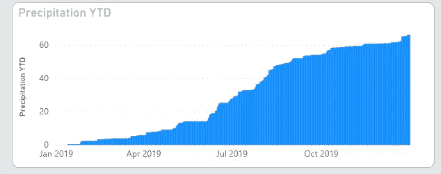
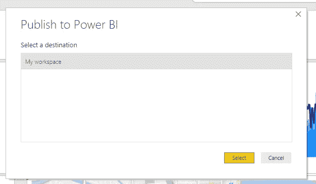

# 如何将天气数据加载到 Power BI 中

> 原文：<https://medium.com/analytics-vidhya/how-to-import-weather-data-into-power-bi-afccdd12c8f0?source=collection_archive---------0----------------------->

在本文中，我们将创建一个简单的包含天气历史数据的 Power BI 报告。重点是在 Power BI 中创建新的天气数据查询，然后为该查询创建参数。在这里，我们将创建一个简单的报告，并讨论一些用于显示天气数据的常见功能。


完成的电力 BI 报告，包括天气数据

# 创建天气数据查询

我们将从在 Power BI 中创建天气数据查询开始。这将提供一个日期范围内所选位置的每日历史天气记录。

为了设置查询，我们将使用 Power BI 桌面工具。我们的天气来源将是[视觉交叉天气数据](https://www.visualcrossing.com/weather-data)。这个天气数据提供商提供基于网络的查询，包括天气历史数据和 15 天的天气预报。

在我们的例子中，我们希望创建一个查询，检索指定数据范围内单个位置的每日历史天气记录。在后续步骤中，我们将在 Power BI 查询中添加参数，以设置位置、日期、测量单位等的值。

第一步是创建 web 查询请求 URL。使用[气象数据服务](https://www.visualcrossing.com/weather/weather-data-services)页面，Visual Crossing 提供了一个方便的创建工具，例如 web 查询。我们可以使用这个天气数据页面来创建历史天气数据定义请求，然后我们可以在浏览器中查看数据，以确保这就是我们所寻找的。一旦我们对浏览器中的数据感到满意，我们就可以创建一个基于 web 的 URL 版本的请求，使用 Power BI Web 查询来检索数据。

> 同样的技术可以用于将数据导入[微软 Excel](/@awigmore/how-to-load-weather-data-into-microsoft-excel-89d5d65567c0)

以下是在美国佛罗里达州迈阿密创建 2019 年历史天气数据请求的结果:


在网络浏览器中预览历史天气数据

在这种情况下，我们将数据限制为每日汇总(最高温度、总降雨量等)。如有必要，可提供每小时的数据。

我们可以看到浏览器中的数据正是我们希望集成到 Power BI 报告中的数据集，因此我们现在可以创建 URL 查询来检索相同的数据。我们点击工具中的“查询 API”来显示查询:


可以对查询进行格式化，以使用各种传输技术，包括 GET 或 POST 请求，甚至 ODATA 请求。所有这些都适用于 Power BI 数据查询，但是我们将重点关注简单的 GET 请求。

原始请求看起来像:

```
[https://weather.visualcrossing.com/VisualCrossingWebServices/rest/services/weatherdata/history?goal=history&aggregateHours=24&startDateTime=2019-01-01T00%3A00%3A00&endDateTime=2019-12-31T00%3A00%3A00&collectStationContributions=false&maxStations=-1&maxDistance=-1&includeNormals=false&shortColumnNames=false&sendAsDatasource=false&allowAsynch=false&contentType=csv&unitGroup=us&key=KPYNQ6AWUDJE9AFERDCHJHSXK&locations=Miami%2C%20FL](https://weather.visualcrossing.com/VisualCrossingWebServices/rest/services/weatherdata/history?goal=history&aggregateHours=24&startDateTime=2019-01-01T00%3A00%3A00&endDateTime=2019-12-31T00%3A00%3A00&collectStationContributions=false&maxStations=-1&maxDistance=-1&includeNormals=false&shortColumnNames=false&sendAsDatasource=false&allowAsynch=false&contentType=csv&unitGroup=us&key=KPYNQ6AWUDJE9AFERDCHJHSXK&locations=Miami%2C%20FL)
```

让我们来看看这个请求的细节。为了简单起见，让我们删除可选的参数，我们还解码一些非字母数字字符，如':'。最后，添加一些格式，使每个参数都在一行上，这样更容易阅读。

```
[https://weather.visualcrossing.com/VisualCrossingWebServices/rest/services/weatherdata/history?
&aggregateHours=24](https://weather.visualcrossing.com/VisualCrossingWebServices/rest/services/weatherdata/history?goal=history&aggregateHours=24)
&startDateTime=2019-01-01T00:00:00
&endDateTime=2019-12-31T00:00:00
&contentType=csv
&unitGroup=us
&key=YOUR_API_KEY
&locations=Miami,FL
```

这一要求的主要参数是:

**aggregatehours** 是每个历史时段的小时数，因此 aggregatehours=24 是历史记录的每日时间摘要。将此值设置为 1 将产生每小时的记录。

**开始日期时间和结束日期时间**是我们想要的数据的开始和结束时间。我们已经指定了 1 月 1 日到 12 月 31 日的开始时间。

**内容类型**是我们将接收的数据的格式。在这种情况下，我们保留了逗号分隔值(CSV)格式，非常适合导入到 Power BI(和 Excel 等)中。

**单位组**是我们希望接收的数据的测量单位。例如,“美国”将温度设定为华氏温度，将距离设定为英里，而“公制”则设定为英里；将温度设置为摄氏度，距离设置为千米。

**键**是 API 键，将在天气服务页面自动填充。

**位置**是您需要天气数据的位置列表。在本例中，我们指定了佛罗里达州的迈阿密。我们可以通过用“|”(竖线)字符分隔来指定多个位置。我们也可以使用纬度和经度值。

如果你想要可用参数的完整列表及其描述，请查阅 [Weather API](https://www.visualcrossing.com/weather-api) 文档。

# 添加 Power BI Desktop Web 查询

我们现在可以在 Power BI Desktop 中输入参数来检索天气数据。

要创建基本查询，请从主页功能区栏中选择“获取数据”，然后选择“Web”。


对于第一个查询，我们将直接从天气数据查询构建器页面将静态请求添加到文本定义中。然后，我们将在下一节中添加参数。


只要我们点击“确定”，Power BI 就会检索数据并显示预览:


Power BI 中天气历史数据的预览

我们可以看到 Power BI 在解释从天气数据服务中检索的 CSV 数据方面做得非常好。我们可以点击“加载”将数据加载到 Power BI 中。过了一会儿，历史天气数据记录中的字段已填充完毕，我们可以开始创建报告了。


Power BI 桌面中填充的历史天气数据字段

# 我们的第一张天气数据图表——每日气温

在我们继续向查询添加参数之前，让我们向报表添加第一个图表。


在功率 BI 图表中按天计算的最高和最低温度

下面是图表定义。


最高和最低温度图表的定义

我们选择了一个使用最大和最小温度场作为值(y 轴)的折线图。日期时间字段用于 x 轴。请注意，我们将温度值的默认聚合从总和更改为平均值:


我们这样做是因为如果我们将日水平数据更改为周、月、季度，则“温度总和”的意义很小。温度通常由平均值(即算术平均值)、最大值或最小值函数来概括。

例如，我可能对一月份的正常高温(平均值)、一月份的最高温度(最大值)或一月份的最低温度(最小值)感兴趣。我们不太可能想知道一月份的所有温度总和是 200 华氏度！

完成查询参数后，当我们返回到报告编辑时，我们将查看报告图表的更多功能。

# 向数据查询添加参数

在上一节中，我们创建了一个固定的天气数据查询，以检索 2019 年佛罗里达州迈阿密的历史天气数据。为了使这一点真正有用，我们需要向查询添加一些参数，以便我们可以更改位置、年份或查询的任何其他部分。

为此，我们从 Power BI Desktop 中打开 Power Query 中的现有查询:


电力查询中已有的气象数据查询

在新功能区中，选择“管理参数”并创建新参数:


创建新参数

我们的第一个参数将允许用户设置天气数据的位置。


创建位置查询参数

我们指定参数的名称(位置)，将类型设置为“text ”,并且该参数是一个自由格式的文本条目。最后，我们添加一个默认值“纽约州纽约市”。

当我们点击 OK 时，不会发生什么。我们必须在查询中使用这个参数，以便用参数值刷新数据。

为此，我们使用“数据源设置”功能区按钮编辑我们的查询。当我们打开当前查询时，我们会看到基本的硬编码 URL:


如果我们将类型从“基本”切换到“高级”，我们可以开始使用我们的参数:


高级查询格式允许我们使用我们的参数

我们现在可以看到，URL 将由一系列部分组成。我们从第一个 URL 中取出&locations=Miami，FL，并将其分成两个新的部分—硬编码的' &locations= '和参数值。

首先，我们添加一个新部件，将类型保留为文本。在值中，我们添加了' &locations= '


然后，我们添加另一个零件，将类型更改为参数，并选择现有的“位置”参数。

如果在按下“确定”后，我们再按下“刷新预览”，网络查询将使用参数默认值“纽约州纽约市”重新运行。

然后，我们可以使用参数来动态更新位置。因此，如果我们能进入“法国巴黎”


当我们按“确定”然后“刷新查询”时，我们会看到法国巴黎的天气历史。


总之，我们将原始 web 查询 URL 分成五个参数。位置、键、单位组和日期范围。这将允许用户更改他们感兴趣的数据的位置和日期范围。


天气数据网络查询的五个参数

我们现在有一套很好的历史天气数据。让我们创建一个基本报告来展示这一点。

# 创建电源 BI 报告

在我们简单的历史天气数据报告中，我们有几个元素:


位置(“佛罗里达州迈阿密”)显示为一张卡片。这允许我们显示来自天气数据的动态数据值。

然后，我们有一组四个 KPI 来突出显示所选时间段的一些有趣的天气事实——最高和最低温度、总降雨量以及经历降雨的天数。

KPI 的定义非常简单:


我们使用最高温度的最大值作为指标，然后日期时间年作为趋势。我们不增加目标。然后我们修改字体大小和颜色。

最低温度、降雨量和降雨天数 KPI 以类似的方式添加。

我们已经在上一节中查看了温度值图表。我们可以使用折线图和柱形图以类似的方式创建风压图表


在此图表中，线条显示压力，条形显示温度:


在最后一行中，我们有两个显示降雨量的元素和一个显示我们用于数据的位置的地图。

年初至今的降雨量图表，显示全年的总降雨量。这种方法清楚地显示了一年的总降雨量(在这种情况下为 60 英寸)，以及降雨量多的日子(图表急剧上升)和降雨量少的时候(图表保持平稳)。

在这种情况下，我们可以看到迈阿密在夏季的几个月里降雨量很大。



累积雨量图

累积降雨量是一个简单的单元素堆积柱形图。我们不想显示每天的降雨量，而是想显示从年初开始的累积量。为此，我们创建了一个定义年初至今值的新标准:


做到这一点最简单的方法是通过一个快速测量，它有助于引导我们找到年初至今测量的正确字段:


创建年初至今的降雨量测量

然后，我们在图表中使用新的衡量标准


我们报告的最后一个元素是显示所需天气数据位置的地图。

地图使用作为天气数据查询的一部分返回的经度和纬度值来显示地图上的点:


在 Power BI Desktop 中，我们有简单的历史天气数据报告。最后一步是将它发布到天气预报中，这样我们就可以在我们最喜欢的网络浏览器中欣赏这份报告了。

# 将报告发布到网上的 Power BI

要发布报告，请点击“发布”按钮:


点击发布，将报告共享到 web 上



在这种情况下，我们将把报告发布到我们自己的工作空间。


用于 web 的 Power BI 中的最终天气数据报告

# 更改 Power BI 中的参数值

最后一步是选择不同的位置。为此，我们必须修改我们在查询中指定的参数值。可以在“我的工作区”下的数据集中修改参数


修改数据集的设置会带来参数集:


我们可以在这里修改位置。我们把它改成英国伦敦吧

在应用新的查询参数值后，我们可以返回到中的数据集列表并点击刷新。然后，我们会在报告中看到新数据


具有新位置的报告

我们在本文中已经看到，我们可以轻松地将天气数据添加到 Power BI 报告和仪表板中。我们找到了一个很好的天气 API 源，可以通过 Power BI Web 查询访问它。从那以后，创建一个好看的历史天气数据报告就变得简单了。

天气预报怎么样？在我的下一篇文章中，我们将使用这里使用的技术来检索天气预报，并创建一个漂亮的天气图！